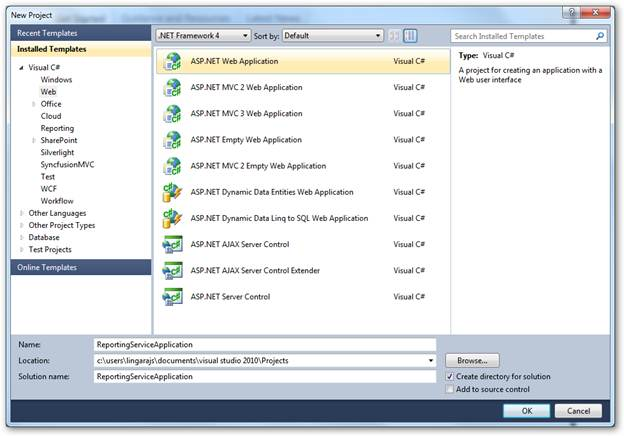
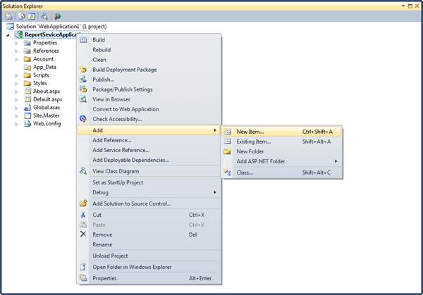
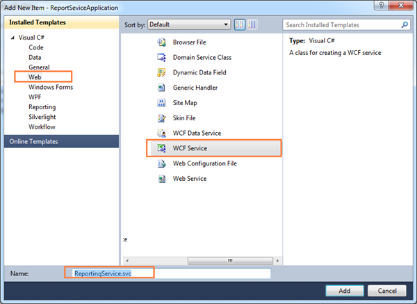
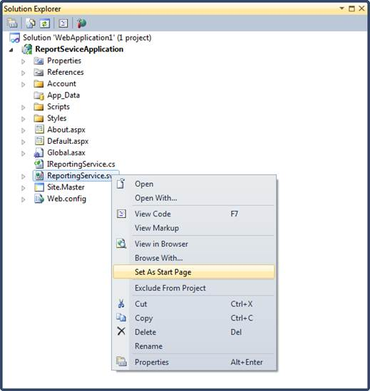
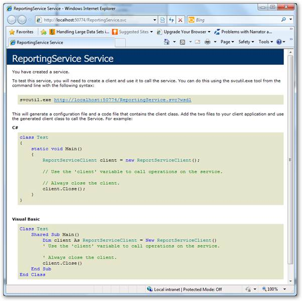
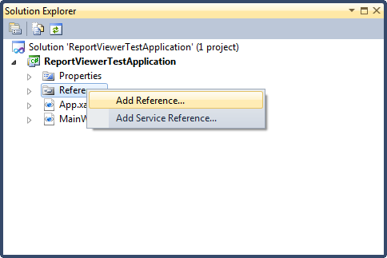
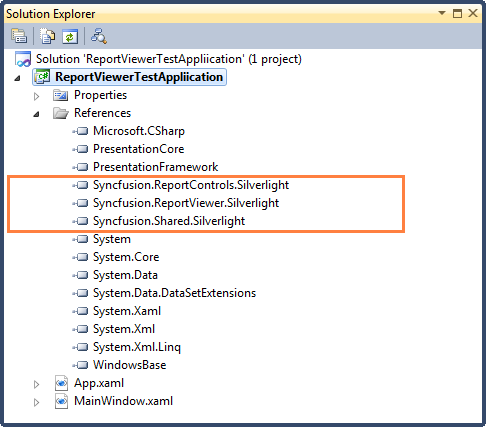
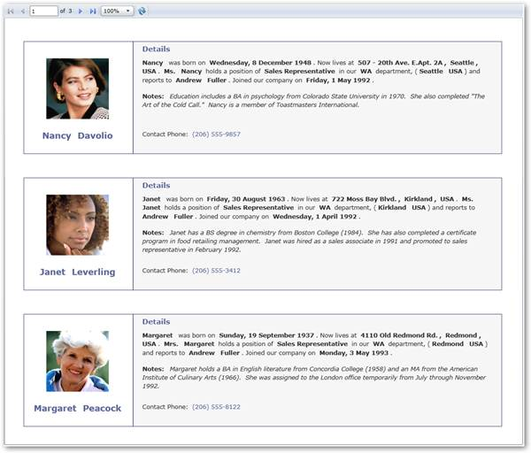

::: {style="DISPLAY: none"}
[](ms-xhelp:///?Id=d2h_url_template){#d2h_url_template}{#d2h_package_url style="WIDTH: 0px; DISPLAY: none; HEIGHT: 0px"}
:::

::::: {#nsbanner .d2h_main_nsbanner style="BORDER-BOTTOM: #999999 1px solid; POSITION: relative; PADDING-BOTTOM: 0px; BACKGROUND-COLOR: transparent; PADDING-LEFT: 0px; PADDING-RIGHT: 0px; DISPLAY: none; BORDER-TOP: #999999 1px solid; PADDING-TOP: 0px; LEFT: 0px"}
:::: {#TitleRow .d2h_main_titlerow style="PADDING-BOTTOM: 4px; BACKGROUND-COLOR: transparent; PADDING-LEFT: 22px; WIDTH: 100%; PADDING-RIGHT: 10px; DISPLAY: none; PADDING-TOP: 4px"}
::: {#ienav .d2h_main_ienav style="DISPLAY: none"}
[](ms-xhelp:///?Id=e1f4aeae-2289-4b26-b9dd-38e72df239b2){#D2HPrevious .D2HPreviousEnabled}  [](ms-xhelp:///?Id=b58768fe-6e35-4e1f-83e7-1f67d670f31c){#D2HNext .D2HNextEnabled}
:::
::::
:::::

::::::: {#nstext .d2h_main_nstext style="PADDING-BOTTOM: 10px; BACKGROUND-COLOR: transparent; PADDING-LEFT: 22px; PADDING-RIGHT: 10px; HEIGHT: 100%; OVERFLOW: auto; PADDING-TOP: 5px" hasuserbackground="true" valign="bottom"}
::: {#d2h_breadcrumbs .d2h_breadcrumbs}
[Essential Studio User Guide Documentation](ms-xhelp:///?Id=12457748-09e3-4d74-a240-8e049cedf030){.d2h_breadcrumbsNormal}[ \> ]{.d2h_breadcrumbsLinkSeparator}[Reporting Edition](ms-xhelp:///?Id=027aa5b6-6676-4f93-ad23-c20e8c45792e){.d2h_breadcrumbsNormal}[ \> ]{.d2h_breadcrumbsLinkSeparator}[Essential Report Viewer](ms-xhelp:///?Id=35081cc7-4b81-4ef5-97d2-894ad584b907){.d2h_breadcrumbsNormal}[ \> ]{.d2h_breadcrumbsLinkSeparator}[Report Viewer Silverlight]{.d2h_breadcrumbsContentsOnly}[ \> ]{.d2h_breadcrumbsLinkSeparator}[Concepts and Features](ms-xhelp:///?Id=e1f4aeae-2289-4b26-b9dd-38e72df239b2){.d2h_breadcrumbsNormal}
:::

## Showing RDL Report in Report Viewer through Coding {#showing-rdl-report-in-report-viewer-through-coding style="TEXT-ALIGN: justify; tab-stops: 0pt"}

 

Users can create a simple application through coding with Syncfusion Silverlight ReportViewer Control using the following steps.

 

1.   Create a new web application in VS2010.

 

{border="0"}

Figure 19: Create Application

 

2.   On the **Solution** Explorer, right-click on **References** folder, and then click **Add Reference**.

 

{border="0"}

Figure 20: Adding new References

 

::: {style="BORDER-BOTTOM: windowtext 1pt solid; BORDER-LEFT: medium none; PADDING-BOTTOM: 1pt; MARGIN-TOP: 9pt; PADDING-LEFT: 0pt; PADDING-RIGHT: 0pt; MARGIN-BOTTOM: 9pt; BORDER-TOP: windowtext 1pt solid; BORDER-RIGHT: medium none; PADDING-TOP: 1pt"}
{border="0"}Note: The added references will appear under References folder.

 
:::

{border="0"}

Figure 21: Added References

 

3.   To add a new WCF service file in the web application, right-click on the newly added web application under **Solution Explorer** dialog.

 

{border="0"}**[ ]{style="FONT-SIZE: 11pt"}**

Figure 22: Adding New Item

 

4.   Click **Add** and select **New Item**. The **Add New Item** dialog will open.

 

{border="0"}

Figure 23: Adding New WCF Service file

 

5.   Click **Web** under **Visual C#**.

6.   Click **WCF Service,** and then click **Add**.

7.   Update following changes in the auto generated WCF service file.

 

+---------------------------------------------------------------------------------+
|                                                                                 |
|                                                                                 |
|     using System;                                                               |
|                                                                                 |
|     using System.Collections.Generic;                                           |
|                                                                                 |
|     using System.Linq;                                                          |
|                                                                                 |
|     using System.Runtime.Serialization;                                         |
|                                                                                 |
|     using System.ServiceModel;                                                  |
|                                                                                 |
|     using System.Text;                                                          |
|                                                                                 |
|                                                                                 |
|                                                                                 |
|     namespace ReportingServiceApplication                                       |
|                                                                                 |
|     {                                                                           |
|                                                                                 |
|         public class ReportingService : Syncfusion.Reports.Server.ReportService |
|                                                                                 |
|         {                                                                       |
|                                                                                 |
|         }                                                                       |
|                                                                                 |
|     }                                                                           |
|                                                                                 |
|                                                                                 |
+---------------------------------------------------------------------------------+

 

::: {style="BORDER-BOTTOM: windowtext 1pt solid; BORDER-LEFT: medium none; PADDING-BOTTOM: 1pt; MARGIN-TOP: 9pt; PADDING-LEFT: 0pt; PADDING-RIGHT: 0pt; MARGIN-BOTTOM: 9pt; BORDER-TOP: windowtext 1pt solid; BORDER-RIGHT: medium none; PADDING-TOP: 1pt"}
{border="0"}Note: The added WCF service file will appear under the created web application.

 
:::

{border="0"}

Figure 24: Set As Start Page option in Solution Explorer

 

8.   Right-click on the newly added WCF service file and select **Set As Start Page**.

9.   Run the service application. The service information is displayed.

 

{border="0"}

\`   Figure 25: Created Service

 

10.  Create a new Silverlight application in VS2010.

11.  Add Report Viewer and related references to the newly created Silverlight application.

 

{border="0"}

Figure 26: Adding Reference

 

::: {style="BORDER-BOTTOM: windowtext 1pt solid; BORDER-LEFT: medium none; PADDING-BOTTOM: 1pt; MARGIN-TOP: 9pt; PADDING-LEFT: 0pt; PADDING-RIGHT: 0pt; MARGIN-BOTTOM: 9pt; BORDER-TOP: windowtext 1pt solid; BORDER-RIGHT: medium none; PADDING-TOP: 1pt"}
{border="0"}Note: The added reference will appear under References folder.
:::

 

{border="0"}

Figure 27:Added References

 

12.  Set the Grid control with auto generated XAML information of Main Window and name.

 

+--------------------------------------------------------------------------------------+
| ``` {style="BACKGROUND: #f0f0f0"}                                                    |
|                                                                                      |
| ```                                                                                  |
|                                                                                      |
| ``` {style="BACKGROUND: #f0f0f0"}                                                    |
| <UserControl x:Class="ReportViewerTestApplication.MainPage"                          |
| ```                                                                                  |
|                                                                                      |
| ``` {style="BACKGROUND: #f0f0f0"}                                                    |
|     xmlns="http://schemas.microsoft.com/winfx/2006/xaml/presentation"                |
| ```                                                                                  |
|                                                                                      |
| ``` {style="BACKGROUND: #f0f0f0"}                                                    |
|     xmlns:x="http://schemas.microsoft.com/winfx/2006/xaml"                           |
| ```                                                                                  |
|                                                                                      |
| ``` {style="BACKGROUND: #f0f0f0"}                                                    |
|     xmlns:d="http://schemas.microsoft.com/expression/blend/2008"                     |
| ```                                                                                  |
|                                                                                      |
| ``` {style="BACKGROUND: #f0f0f0"}                                                    |
|     xmlns:mc="http://schemas.openxmlformats.org/markup-compatibility/2006"           |
| ```                                                                                  |
|                                                                                      |
| ``` {style="BACKGROUND: #f0f0f0"}                                                    |
|     mc:Ignorable="d"                                                                 |
| ```                                                                                  |
|                                                                                      |
| ``` {style="BACKGROUND: #f0f0f0"}                                                    |
|     d:DesignHeight="400" d:DesignWidth="400" xmlns:my="clr-                          |
| ```                                                                                  |
|                                                                                      |
| ``` {style="BACKGROUND: #f0f0f0"}                                                    |
| namespace:Syncfusion.Windows.Reports.Viewer;assembly=Syncfusion.ReportViewer.Silverl |
| ```                                                                                  |
|                                                                                      |
| ``` {style="BACKGROUND: #f0f0f0"}                                                    |
| ight">                                                                               |
| ```                                                                                  |
|                                                                                      |
| ``` {style="BACKGROUND: #f0f0f0"}                                                    |
|                                                                                      |
| ```                                                                                  |
|                                                                                      |
| ``` {style="BACKGROUND: #f0f0f0"}                                                    |
|     <Grid x:Name="LayoutRoot" Background="White">                                    |
| ```                                                                                  |
|                                                                                      |
| ``` {style="BACKGROUND: #f0f0f0"}                                                    |
|     </Grid>                                                                          |
| ```                                                                                  |
|                                                                                      |
| ``` {style="BACKGROUND: #f0f0f0"}                                                    |
| </UserControl>                                                                       |
| ```                                                                                  |
|                                                                                      |
| ``` {style="BACKGROUND: #f0f0f0"}                                                    |
|                                                                                      |
| ```                                                                                  |
+--------------------------------------------------------------------------------------+

 

13.  Add Report Viewer in MainWindow grid.

 

+-----------------------------------------------------------------------------+
| ``` {style="BACKGROUND: #f0f0f0"}                                           |
| public partial class MainPage : UserControl                                 |
| ```                                                                         |
|                                                                             |
| ``` {style="BACKGROUND: #f0f0f0"}                                           |
|     {                                                                       |
| ```                                                                         |
|                                                                             |
| ``` {style="BACKGROUND: #f0f0f0"}                                           |
|         public MainPage()                                                   |
| ```                                                                         |
|                                                                             |
| ``` {style="BACKGROUND: #f0f0f0"}                                           |
|         {                                                                   |
| ```                                                                         |
|                                                                             |
| ``` {style="BACKGROUND: #f0f0f0"}                                           |
|             InitializeComponent();                                          |
| ```                                                                         |
|                                                                             |
| ``` {style="BACKGROUND: #f0f0f0"}                                           |
|                                                                             |
| ```                                                                         |
|                                                                             |
| ``` {style="BACKGROUND: #f0f0f0"}                                           |
|             // ReportViewer control initialization                          |
| ```                                                                         |
|                                                                             |
| ``` {style="BACKGROUND: #f0f0f0"}                                           |
|             Syncfusion.Windows.Reports.Viewer.ReportViewer reportViewer1 =  |
| ```                                                                         |
|                                                                             |
| ``` {style="BACKGROUND: #f0f0f0"}                                           |
| new Syncfusion.Windows.Reports.Viewer.ReportViewer();                       |
| ```                                                                         |
|                                                                             |
| ``` {style="BACKGROUND: #f0f0f0"}                                           |
|                                                                             |
| ```                                                                         |
|                                                                             |
| ``` {style="BACKGROUND: #f0f0f0"}                                           |
|             // Set ProcessingMode for ReportViewer. To load and process the |
| ```                                                                         |
|                                                                             |
| ``` {style="BACKGROUND: #f0f0f0"}                                           |
|  DataSource information from server                                         |
| ```                                                                         |
|                                                                             |
| ``` {style="BACKGROUND: #f0f0f0"}                                           |
|             reportViewer1.ProcessingMode = Syncfusion.Windows.Reports.Viewe |
| ```                                                                         |
|                                                                             |
| ``` {style="BACKGROUND: #f0f0f0"}                                           |
| r.ProcessingMode.Remote;                                                    |
| ```                                                                         |
|                                                                             |
| ``` {style="BACKGROUND: #f0f0f0"}                                           |
|                                                                             |
| ```                                                                         |
|                                                                             |
| ``` {style="BACKGROUND: #f0f0f0"}                                           |
|             // Set ReportPath to view the Report in ReportViewer. Local rep |
| ```                                                                         |
|                                                                             |
| ``` {style="BACKGROUND: #f0f0f0"}                                           |
| ortpath of hosted service environment                                       |
| ```                                                                         |
|                                                                             |
| ``` {style="BACKGROUND: #f0f0f0"}                                           |
|             reportViewer1.ReportPath = @"D:\MailMerge.Rdl";                 |
| ```                                                                         |
|                                                                             |
| ``` {style="BACKGROUND: #f0f0f0"}                                           |
|                                                                             |
| ```                                                                         |
|                                                                             |
| ``` {style="BACKGROUND: #f0f0f0"}                                           |
|             // Set ReportServiceUrl to retrive data from hosted service     |
| ```                                                                         |
|                                                                             |
| ``` {style="BACKGROUND: #f0f0f0"}                                           |
|             reportViewer1.ReportServiceURL = @"http://localhost:50774/Repor |
| ```                                                                         |
|                                                                             |
| ``` {style="BACKGROUND: #f0f0f0"}                                           |
| tingService.svc";                                                           |
| ```                                                                         |
|                                                                             |
| ``` {style="BACKGROUND: #f0f0f0"}                                           |
|                                                                             |
| ```                                                                         |
|                                                                             |
| ``` {style="BACKGROUND: #f0f0f0"}                                           |
|             // Add ReportViewer in MainWindow grid                          |
| ```                                                                         |
|                                                                             |
| ``` {style="BACKGROUND: #f0f0f0"}                                           |
|             this.LayoutRoot.Children.Add(reportViewer1);                    |
| ```                                                                         |
|                                                                             |
| ``` {style="BACKGROUND: #f0f0f0"}                                           |
|                                                                             |
| ```                                                                         |
|                                                                             |
| ``` {style="BACKGROUND: #f0f0f0"}                                           |
|             this.Loaded += (sender, arg) =>                                 |
| ```                                                                         |
|                                                                             |
| ``` {style="BACKGROUND: #f0f0f0"}                                           |
|             {                                                               |
| ```                                                                         |
|                                                                             |
| ``` {style="BACKGROUND: #f0f0f0"}                                           |
|                 // To Render the Report in ReportViewer.                    |
| ```                                                                         |
|                                                                             |
| ``` {style="BACKGROUND: #f0f0f0"}                                           |
|                 reportViewer1.RefreshReport();                              |
| ```                                                                         |
|                                                                             |
| ``` {style="BACKGROUND: #f0f0f0"}                                           |
|             };                                                              |
| ```                                                                         |
|                                                                             |
| ``` {style="BACKGROUND: #f0f0f0"}                                           |
|         }                                                                   |
| ```                                                                         |
|                                                                             |
| ``` {style="BACKGROUND: #f0f0f0"}                                           |
|     }                                                                       |
| ```                                                                         |
|                                                                             |
| ``` {style="BACKGROUND: #f0f0f0"}                                           |
|                                                                             |
| ```                                                                         |
+-----------------------------------------------------------------------------+

 

14.  Run the application. The following output displays.

 

{border="0"}

Figure 28:ReportViewer Sample

[]{#related-topics}
:::::::
