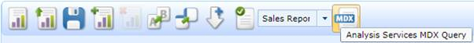
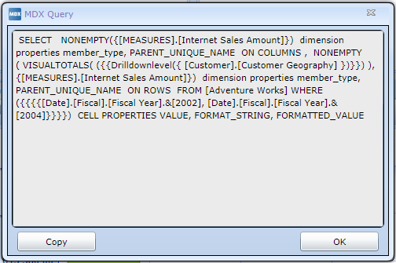

::: {style="DISPLAY: none"}
{#d2h_url_template}{#d2h_package_url style="WIDTH: 0px; DISPLAY: none; HEIGHT: 0px"}
:::

::::: {#nsbanner .d2h_main_nsbanner style="BORDER-BOTTOM: #999999 1px solid; POSITION: relative; PADDING-BOTTOM: 0px; BACKGROUND-COLOR: transparent; PADDING-LEFT: 0px; PADDING-RIGHT: 0px; DISPLAY: none; BORDER-TOP: #999999 1px solid; PADDING-TOP: 0px; LEFT: 0px"}
:::: {#TitleRow .d2h_main_titlerow style="PADDING-BOTTOM: 4px; BACKGROUND-COLOR: transparent; PADDING-LEFT: 22px; WIDTH: 100%; PADDING-RIGHT: 10px; DISPLAY: none; PADDING-TOP: 4px"}
::: {#ienav .d2h_main_ienav style="DISPLAY: none"}
{#D2HPrevious .D2HPreviousEnabled}  {#D2HNext .D2HNextEnabled}
:::
::::
:::::

:::: {#nstext .d2h_main_nstext style="PADDING-BOTTOM: 10px; BACKGROUND-COLOR: transparent; PADDING-LEFT: 22px; PADDING-RIGHT: 10px; HEIGHT: 100%; OVERFLOW: auto; PADDING-TOP: 5px" hasuserbackground="true" valign="bottom"}
::: {#d2h_breadcrumbs .d2h_breadcrumbs}
[Essential Studio User Guide Documentation](ms-xhelp:///?Id=12457748-09e3-4d74-a240-8e049cedf030){.d2h_breadcrumbsNormal}[ \> ]{.d2h_breadcrumbsLinkSeparator}[Business Intelligence Edition](ms-xhelp:///?Id=fdf33dd8-62b2-47b9-ad7b-fc50e590bca5){.d2h_breadcrumbsNormal}[ \> ]{.d2h_breadcrumbsLinkSeparator}[Essential BI Silverlight](ms-xhelp:///?Id=c006b39c-6aa2-4637-b7de-3e7b6cb3f9f9){.d2h_breadcrumbsNormal}[ \> ]{.d2h_breadcrumbsLinkSeparator}[Essential BI Client]{.d2h_breadcrumbsContentsOnly}[ \> ]{.d2h_breadcrumbsLinkSeparator}[Features](ms-xhelp:///?Id=4ae10797-e3a8-4270-b8ba-34441d2e1a3d){.d2h_breadcrumbsNormal}
:::

## Show MDX query {#show-mdx-query style="tab-stops: 0pt"}

 

The MDX query of a report, which is used by the UI for displaying data in Grid/Chart control, can be retrieved by the user through MDX button located in the OlapClient Toolbar.

This feature performs the following:

[·      ]{style="FONT-FAMILY: Symbol"}When the MDX (Analysis Service MDX Query) Query button that is available in the OlapClient Toolbar (as shown in the below image) is clicked, it will display the MDX (Multi-dimensional expression) query for the current report generated in the OlapGrid/OlapChart through a separate dialog box.

 

The following image shows the MDX Query button located in the OlapClient Toolbar:

{border="0"}

Figure 38OlapClient Toolbar with MDX Query button

The following screen shot shows the dialog box which displays the MDX Query:

{border="0"}

Figure 39MDX Query Dialog with Sample MDX Query

 

 

Use Case Scenarios

This feature is mainly used to view the current state of a report using the MDX query.

 

Tables for Properties, Methods, and Events

 

Methods

  Method    Description                                                        Parameters   Type    Return Type   Reference links
  --------- ------------------------------------------------------------------ ------------ ------- ------------- -----------------
  ShowMdx   Shows the MDX query based on the current report of an OlapClient   \-           **-**   Void          \-

 

More:

[ ]{#related-topics}

[{border="0" align="absMiddle"}Accessing the MDX Query](ms-xhelp:///?Id=441b2158-da5c-43b5-b68f-50f7a875de26){style="TEXT-DECORATION: none"}
::::
