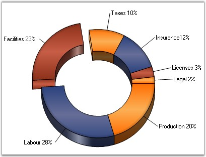
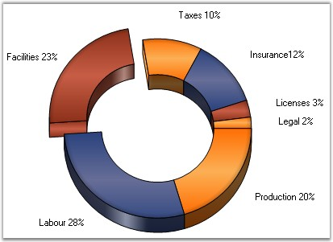

::: {style="DISPLAY: none"}
{#d2h_url_template}{#d2h_package_url style="WIDTH: 0px; DISPLAY: none; HEIGHT: 0px"}
:::

:::: {.d2h_secondary_topic style="PADDING-BOTTOM: 10pt; MARGIN: 0pt; PADDING-LEFT: 0pt; PADDING-RIGHT: 0pt; PADDING-TOP: 0pt"}
#### ShowTicks {#showticks style="tab-stops: 0pt"}

 

Indicates whether ticks should be shown or not.

 

::: {align="center"}
+-------------------------------------+-----------------------------------------------------------------+
| **Details**                                                                                           |
+-------------------------------------+-----------------------------------------------------------------+
| **Possible Values**                 | [·      ]{style="FONT-FAMILY: Symbol"}**True** - Displays ticks |
|                                     |                                                                 |
|                                     | [·      ]{style="FONT-FAMILY: Symbol"}**False** - Hides ticks   |
+-------------------------------------+-----------------------------------------------------------------+
| **Default Value    **               | **True**                                                        |
+-------------------------------------+-----------------------------------------------------------------+
| **2D / 3D Limitations**             | No                                                              |
+-------------------------------------+-----------------------------------------------------------------+
| **Applies to Chart Element**        | Any Series                                                      |
+-------------------------------------+-----------------------------------------------------------------+
| **Applies to Chart Types**          | Pie Chart                                                       |
+-------------------------------------+-----------------------------------------------------------------+
:::

 

Here is a sample code snippet using ShowTicks.

 

+----------------------------------------------------------------------------------------------------------------------------------------------------------------------------------------------------------------------------------------------------------------+
| **[\[C#\]]{style="FONT-FAMILY: 'Courier New'; COLOR: black"}**                                                                                                                                                                                                 |
|                                                                                                                                                                                                                                                                |
| **[]{style="FONT-FAMILY: 'Courier New'; COLOR: black"}**                                                                                                                                                                                                       |
|                                                                                                                                                                                                                                                                |
| [// Enables Ticks]{style="FONT-FAMILY: 'Courier New'; COLOR: green"}                                                                                                                                                                                           |
|                                                                                                                                                                                                                                                                |
| [this]{style="FONT-FAMILY: 'Courier New'; COLOR: blue"}[.chartControl1.Series\[0\].ShowTicks = ]{style="FONT-FAMILY: 'Courier New'; COLOR: black"}[true]{style="FONT-FAMILY: 'Courier New'; COLOR: blue"}[;]{style="FONT-FAMILY: 'Courier New'; COLOR: black"} |
+----------------------------------------------------------------------------------------------------------------------------------------------------------------------------------------------------------------------------------------------------------------+

 

+---------------------------------------------------------------------------------------------------------------------------------------------------------------------------------------------------------------+
| **[\[VB.NET\]]{style="FONT-FAMILY: 'Courier New'; COLOR: black"}**                                                                                                                                            |
|                                                                                                                                                                                                               |
| **[]{style="FONT-FAMILY: 'Courier New'; COLOR: black"}**                                                                                                                                                      |
|                                                                                                                                                                                                               |
| [\' Enables Ticks]{style="FONT-FAMILY: 'Courier New'; COLOR: green"}                                                                                                                                          |
|                                                                                                                                                                                                               |
| [Private Me]{style="FONT-FAMILY: 'Courier New'; COLOR: blue"}[.chartControl1.Series(0).ShowTicks = ]{style="FONT-FAMILY: 'Courier New'; COLOR: black"}[True]{style="FONT-FAMILY: 'Courier New'; COLOR: blue"} |
+---------------------------------------------------------------------------------------------------------------------------------------------------------------------------------------------------------------+

 

{border="0"}

 

Figure 202: ShowTicks = \"True\"

 

{border="0"}

 

Figure 203: ShowTicks = \"False\"

 

See Also

 

[Pie Chart]{.UGHyperlink}[]{.UGHyperlink}

 

[]{#p149} 

 

[]{#related-topics}
::::
