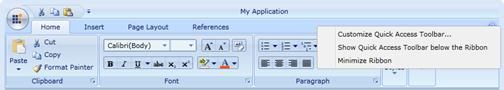
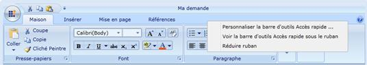
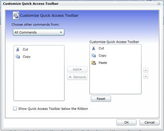
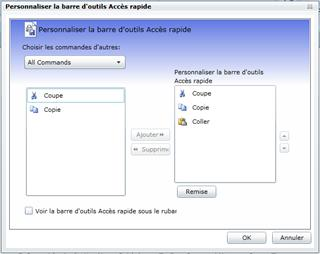

::: {style="DISPLAY: none"}
{#d2h_url_template}{#d2h_package_url style="WIDTH: 0px; DISPLAY: none; HEIGHT: 0px"}
:::

::::: {#nsbanner .d2h_main_nsbanner style="BORDER-BOTTOM: #999999 1px solid; POSITION: relative; PADDING-BOTTOM: 0px; BACKGROUND-COLOR: transparent; PADDING-LEFT: 0px; PADDING-RIGHT: 0px; DISPLAY: none; BORDER-TOP: #999999 1px solid; PADDING-TOP: 0px; LEFT: 0px"}
:::: {#TitleRow .d2h_main_titlerow style="PADDING-BOTTOM: 4px; BACKGROUND-COLOR: transparent; PADDING-LEFT: 22px; WIDTH: 100%; PADDING-RIGHT: 10px; DISPLAY: none; PADDING-TOP: 4px"}
::: {#ienav .d2h_main_ienav style="DISPLAY: none"}
{#D2HPrevious .D2HPreviousEnabled}  {#D2HNext .D2HNextEnabled}
:::
::::
:::::

:::: {#nstext .d2h_main_nstext style="PADDING-BOTTOM: 10px; BACKGROUND-COLOR: transparent; PADDING-LEFT: 22px; PADDING-RIGHT: 10px; HEIGHT: 100%; OVERFLOW: auto; PADDING-TOP: 5px" hasuserbackground="true" valign="bottom"}
::: {#d2h_breadcrumbs .d2h_breadcrumbs}
[Essential Studio User Guide Documentation](ms-xhelp:///?Id=12457748-09e3-4d74-a240-8e049cedf030){.d2h_breadcrumbsNormal}[ \> ]{.d2h_breadcrumbsLinkSeparator}[Essential Common](ms-xhelp:///?Id=2bfe10b6-fac1-4f91-a173-04db314f10c3){.d2h_breadcrumbsNormal}[ \> ]{.d2h_breadcrumbsLinkSeparator}[Frequently Asked Questions](ms-xhelp:///?Id=8c0b82fa-382a-437e-9ce1-9b9ffd3f2ead){.d2h_breadcrumbsNormal}[ \> ]{.d2h_breadcrumbsLinkSeparator}[How to Implement Localization Support](ms-xhelp:///?Id=7c104b30-cfaa-4a58-a14e-9015a1f96ad4){.d2h_breadcrumbsNormal}
:::

### Silverlight {#silverlight style="tab-stops: 0pt"}

In Silverlight, the easiest way to accomplish localization is to use Resource (.resx) file. For each local or culture you wish to target, you will need a separate set of resources that match that specific local or culture.

[]{style="FONT-FAMILY: 'Trebuchet MS','sans-serif'; COLOR: #15428b; FONT-SIZE: 9pt"} 

The following are the primary steps to do for Localizing Syncfusion Ribbon Control:

[]{style="FONT-FAMILY: 'Trebuchet MS','sans-serif'; COLOR: #15428b; FONT-SIZE: 9pt"} 

[·      ]{style="FONT-FAMILY: Symbol"}Add Resources for different cultures

[·      ]{style="FONT-FAMILY: Symbol"}Add Supported Cultures

[·      ]{style="FONT-FAMILY: Symbol"}Assign Current UI Culture to the Application

[]{style="FONT-FAMILY: 'Trebuchet MS','sans-serif'; COLOR: #15428b; FONT-SIZE: 9pt"} 

**[]{style="FONT-FAMILY: 'Trebuchet MS','sans-serif'; COLOR: #15428b; FONT-SIZE: 9pt"}** 

Add Resources

To localize Syncfusion Silverlight controls, you need to create resource files for each culture.

The following steps illustrates this:

1.   Add Resource (resx) files in the Resources folder for different cultures. (Here, resx files in different culture or invariant culture should be placed in the **Resources** Folder of your project).

2.   Resource files should be named as **AssemblyName.CultureName.resx** and **AssemblyName.resx** for invariant culture.

 

Where,

[·      ]{style="FONT-FAMILY: Symbol"}**AssemblyName** -- Syncfusion Silverlight Control Assembly Name.

[·      ]{style="FONT-FAMILY: Symbol"}**CultureName** -- Culture Code of the resource that you want to show in the UI.

If your conversion is only for the invariant culture, the .resx file does not need to contain a culture suffix.

Example:

[·      ]{style="FONT-FAMILY: Symbol"}Syncfusion.Ribbon.Silverlight.fr-FR.resx -- French resource for Syncfusion.Ribbon.Silverlight assembly.

[·      ]{style="FONT-FAMILY: Symbol"}Syncfusion.Ribbon.Silverlight.resx -- Invariant Culture resource for Syncfusion.Ribbon.Silverlight assembly.

**[]{style="FONT-FAMILY: 'Trebuchet MS','sans-serif'; COLOR: #15428b; FONT-SIZE: 9pt"}** 

Add Supported Cultures

Adding supported cultures for a project is very important in the sample application project before you run the application.

Follow the below steps to localize stings for your culture:

1.   In the *Solution Explorer*, right-click your sample application project and choose ***Unload Project*** Then the project will be unavailable.

2.   Right-click the project again, and select the *Edit SampleProjectName.csproj* option.

3.   In the *.csproj file*, find the *\<SupportedCultures\>\</SupportedCultures\>* tags. By default, the tags will be empty. So, add the cultures that you want to be supported separating each with a semicolon.

Example: \<SupportedCultures\>fr-FR \</SupportedCultures\>

4.   Save the project and reload it by right-clicking the *SampleProjectName.csproj* and choosing *Reload SampleProjectName.csproj.*

[]{style="FONT-FAMILY: 'Trebuchet MS','sans-serif'; COLOR: #15428b; FONT-SIZE: 9pt"} 

Assign Current UI Culture to the Application

By default, Current Culture will be *en-US*. You can change the CurrentUICulture. Here, CurentUICulture should be set before **the** *IntializeComponent* in your *StartUp* page (Here, MainPage.xaml.cs) or you can do it in App.xaml.cs in the Application_Startup event.

 

+-------------------------------------------------------------------------------------------------------------------------------------------------------------------------------------------------------------------------------------------------------------------------------------------------------------+
| **[C# (MainPage.xaml.cs)]{style="FONT-FAMILY: 'Courier New'"}[ ]{style="FONT-FAMILY: 'Courier New'; COLOR: blue; FONT-SIZE: 9pt"}**[]{style="FONT-FAMILY: 'Courier New'"}                                                                                                                                   |
|                                                                                                                                                                                                                                                                                                             |
| []{style="FONT-FAMILY: 'Courier New'; FONT-SIZE: 12pt"}                                                                                                                                                                                                                                                     |
|                                                                                                                                                                                                                                                                                                             |
| [public]{style="FONT-FAMILY: 'Courier New'; COLOR: blue"}[ MainPage()]{style="FONT-FAMILY: 'Courier New'"}[]{style="FONT-FAMILY: 'Courier New'; FONT-SIZE: 12pt"}                                                                                                                                           |
|                                                                                                                                                                                                                                                                                                             |
| [{]{style="FONT-FAMILY: 'Courier New'"}[]{style="FONT-FAMILY: 'Courier New'; FONT-SIZE: 12pt"}                                                                                                                                                                                                              |
|                                                                                                                                                                                                                                                                                                             |
| [System.Threading.[Thread]{style="COLOR: #2b91af"}.CurrentThread.CurrentUICulture = [new]{style="COLOR: blue"} System.Globalization.[CultureInfo]{style="COLOR: #2b91af"}([\"fr-FR\"]{style="COLOR: #a31515"});]{style="FONT-FAMILY: 'Courier New'"}[]{style="FONT-FAMILY: 'Courier New'; FONT-SIZE: 12pt"} |
|                                                                                                                                                                                                                                                                                                             |
| []{style="FONT-FAMILY: 'Courier New'; FONT-SIZE: 12pt"}                                                                                                                                                                                                                                                     |
|                                                                                                                                                                                                                                                                                                             |
| [InitializeComponent();]{style="FONT-FAMILY: 'Courier New'"}[]{style="FONT-FAMILY: 'Courier New'; FONT-SIZE: 12pt"}                                                                                                                                                                                         |
|                                                                                                                                                                                                                                                                                                             |
| [}]{style="FONT-FAMILY: 'Courier New'"}                                                                                                                                                                                                                                                                     |
+-------------------------------------------------------------------------------------------------------------------------------------------------------------------------------------------------------------------------------------------------------------------------------------------------------------+

 

 Or

 

+-------------------------------------------------------------------------------------------------------------------------------------------------------------------------------------------------------------------------------------------------------------------------------------------------------------+
| **[C# (App.xaml.cs)]{style="FONT-FAMILY: 'Courier New'"}[ ]{style="FONT-FAMILY: 'Courier New'; COLOR: blue; FONT-SIZE: 9pt"}[]{style="FONT-FAMILY: 'Courier New'; FONT-SIZE: 9pt"}**                                                                                                                        |
|                                                                                                                                                                                                                                                                                                             |
|                                                                                                                                                                                                                                                                                                             |
|                                                                                                                                                                                                                                                                                                             |
| [private]{style="FONT-FAMILY: 'Courier New'; COLOR: blue"}[ [void]{style="COLOR: blue"} Application_Startup([object]{style="COLOR: blue"} sender, [StartupEventArgs]{style="COLOR: #2b91af"} e)]{style="FONT-FAMILY: 'Courier New'"}[]{style="FONT-FAMILY: 'Courier New'; FONT-SIZE: 12pt"}                 |
|                                                                                                                                                                                                                                                                                                             |
| [{]{style="FONT-FAMILY: 'Courier New'"}[]{style="FONT-FAMILY: 'Courier New'; FONT-SIZE: 12pt"}                                                                                                                                                                                                              |
|                                                                                                                                                                                                                                                                                                             |
| [System.Threading.[Thread]{style="COLOR: #2b91af"}.CurrentThread.CurrentUICulture = [new]{style="COLOR: blue"} System.Globalization.[CultureInfo]{style="COLOR: #2b91af"}([\"fr-FR\"]{style="COLOR: #a31515"});]{style="FONT-FAMILY: 'Courier New'"}[]{style="FONT-FAMILY: 'Courier New'; FONT-SIZE: 12pt"} |
|                                                                                                                                                                                                                                                                                                             |
| [this]{style="FONT-FAMILY: 'Courier New'; COLOR: blue"}[.RootVisual = [new]{style="COLOR: blue"} [MainPage]{style="COLOR: #2b91af"}();]{style="FONT-FAMILY: 'Courier New'"}[]{style="FONT-FAMILY: 'Courier New'; FONT-SIZE: 12pt"}                                                                          |
|                                                                                                                                                                                                                                                                                                             |
| [}]{style="FONT-FAMILY: 'Courier New'"}                                                                                                                                                                                                                                                                     |
+-------------------------------------------------------------------------------------------------------------------------------------------------------------------------------------------------------------------------------------------------------------------------------------------------------------+

 

The following screenshots illustrates the Ribbon Control with various cultures:

 

{border="0"}

Figure 163: Ribbon Control for Invariant Culture

 

{border="0"}

Figure 164: French Culture assigned as Current UI Culture

 

{border="0"}

Figure 165:  Customization Dialog for Invariant Culture

 

{border="0"}

Figure 166:  French Culture assigned as Current UI Culture for Customization Dialog

 

[]{#related-topics}
::::
