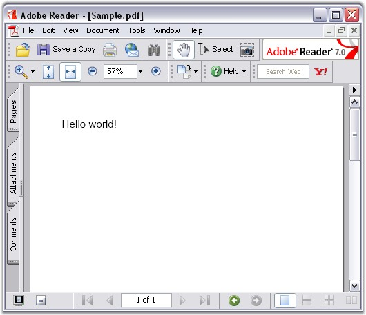

::: {style="DISPLAY: none"}
{#d2h_url_template}{#d2h_package_url style="WIDTH: 0px; DISPLAY: none; HEIGHT: 0px"}
:::

::::: {#nsbanner .d2h_main_nsbanner style="BORDER-BOTTOM: #999999 1px solid; POSITION: relative; PADDING-BOTTOM: 0px; BACKGROUND-COLOR: transparent; PADDING-LEFT: 0px; PADDING-RIGHT: 0px; DISPLAY: none; BORDER-TOP: #999999 1px solid; PADDING-TOP: 0px; LEFT: 0px"}
:::: {#TitleRow .d2h_main_titlerow style="PADDING-BOTTOM: 4px; BACKGROUND-COLOR: transparent; PADDING-LEFT: 22px; WIDTH: 100%; PADDING-RIGHT: 10px; DISPLAY: none; PADDING-TOP: 4px"}
::: {#ienav .d2h_main_ienav style="DISPLAY: none"}
{#D2HPrevious .D2HPreviousEnabled}  {#D2HNext .D2HNextEnabled}
:::
::::
:::::

:::: {#nstext .d2h_main_nstext style="PADDING-BOTTOM: 10px; BACKGROUND-COLOR: transparent; PADDING-LEFT: 22px; PADDING-RIGHT: 10px; HEIGHT: 100%; OVERFLOW: auto; PADDING-TOP: 5px" hasuserbackground="true" valign="bottom"}
::: {#d2h_breadcrumbs .d2h_breadcrumbs}
[Essential Studio User Guide Documentation](ms-xhelp:///?Id=12457748-09e3-4d74-a240-8e049cedf030){.d2h_breadcrumbsNormal}[ \> ]{.d2h_breadcrumbsLinkSeparator}[Reporting Edition](ms-xhelp:///?Id=027aa5b6-6676-4f93-ad23-c20e8c45792e){.d2h_breadcrumbsNormal}[ \> ]{.d2h_breadcrumbsLinkSeparator}[Essential Pdf](ms-xhelp:///?Id=22756092-3da5-4797-9514-dab0617c6902){.d2h_breadcrumbsNormal}[ \> ]{.d2h_breadcrumbsLinkSeparator}[Getting Started](ms-xhelp:///?Id=c0a3e418-fc0c-4115-9643-310912a817be){.d2h_breadcrumbsNormal}[ \> ]{.d2h_breadcrumbsLinkSeparator}[Deploying Essential PDF](ms-xhelp:///?Id=e00e115b-6c6b-4eb8-977a-aca39abdb560){.d2h_breadcrumbsNormal}
:::

### Silverlight {#silverlight style="tab-stops: 0pt"}

[]{style="FONT-FAMILY: 'Trebuchet MS','sans-serif'; COLOR: #15428b; FONT-SIZE: 9pt"} 

Now, you have created a Silverlight application (refer [[Creating Platform Application]{.UGHyperlink}](ms-xhelp:///?Id=9dd5909e-f26c-47d9-bff0-6a9bd32f5b6e)). This section covers the following:

[]{style="FONT-FAMILY: 'Trebuchet MS','sans-serif'; COLOR: #15428b; FONT-SIZE: 9pt"} 

[·      ]{style="FONT-FAMILY: Symbol"}Deploying Essential PDF in a Silverlight Application

[·      ]{style="FONT-FAMILY: Symbol"}Create and add a PDF document with pages to the application

[]{style="FONT-FAMILY: 'Trebuchet MS','sans-serif'; COLOR: #15428b; FONT-SIZE: 9pt"} 

Deploying Essential PDF in a Silverlight Application

 

The following steps will guide you to deploy Essential PDF:

1.   Open the MainPage.xaml of the application in the designer.

2.   Add the following assemblies as references in the application:

[·      ]{style="FONT-FAMILY: Symbol"}Syncfusion.Compression.Silverlight.dll

[·      ]{style="FONT-FAMILY: Symbol"}Syncfusion.Pdf.Silverlight.dll

 

Essential PDF is now deployed in your Silverlight application.

 

Create and add a PDF document with pages to the application

[]{style="FONT-FAMILY: 'Trebuchet MS','sans-serif'; COLOR: #15428b; FONT-SIZE: 9pt"} 

Following steps will guide you to create and add a PDF document to this application:

[]{style="FONT-FAMILY: 'Trebuchet MS','sans-serif'; COLOR: #15428b; FONT-SIZE: 9pt"} 

1.   Create a PDF document using the following code.

[]{style="FONT-FAMILY: 'Trebuchet MS','sans-serif'; COLOR: #15428b; FONT-SIZE: 9pt"} 

{border="0"} The PDF document represents the document that is created in the memory. It is only the memory representation of the PDF document that is written to the disk.

[]{style="FONT-FAMILY: 'Trebuchet MS','sans-serif'; COLOR: #15428b; FONT-SIZE: 9pt"} 

+--------------------------------------------------------------------------------------------------------------------------------------------------------------------------------+
| **[\[C#\]]{style="FONT-FAMILY: 'Courier New'; COLOR: black"}**                                                                                                                 |
|                                                                                                                                                                                |
| []{style="FONT-FAMILY: 'Courier New'; COLOR: black"}                                                                                                                           |
|                                                                                                                                                                                |
| [// Create a new PDF document. This object represents the PDF document.]{style="FONT-FAMILY: 'Courier New'; COLOR: green"}                                                     |
|                                                                                                                                                                                |
| [// This document has one page, by default. Additional pages have to be added.]{style="FONT-FAMILY: 'Courier New'; COLOR: green"}                                              |
|                                                                                                                                                                                |
| [PdfDocument]{style="FONT-FAMILY: 'Courier New'; COLOR: teal"}[ pdfDoc = [new]{style="COLOR: blue"} [PdfDocument]{style="COLOR: teal"}();]{style="FONT-FAMILY: 'Courier New'"} |
+--------------------------------------------------------------------------------------------------------------------------------------------------------------------------------+

[]{style="FONT-FAMILY: 'Trebuchet MS','sans-serif'; COLOR: #15428b"} 

+--------------------------------------------------------------------------------------------------------------------------------------------------------------------------------------------------------------------+
| **[\[VB.NET\]]{style="FONT-FAMILY: 'Courier New'; COLOR: black"}**                                                                                                                                                 |
|                                                                                                                                                                                                                    |
| []{style="FONT-FAMILY: 'Courier New'; COLOR: black"}                                                                                                                                                               |
|                                                                                                                                                                                                                    |
| [\' Create a new PDF document. This object represents the PDF document.]{style="FONT-FAMILY: 'Courier New'; COLOR: green"}                                                                                         |
|                                                                                                                                                                                                                    |
| [\' This document has one page, by default. Additional pages have to be added.]{style="FONT-FAMILY: 'Courier New'; COLOR: green"}                                                                                  |
|                                                                                                                                                                                                                    |
| [Dim]{style="FONT-FAMILY: 'Courier New'; COLOR: blue"}[ pdfDoc [As]{style="COLOR: blue"} Syncfusion.Pdf.PdfDocument = [New]{style="COLOR: blue"} Syncfusion.Pdf.PdfDocument()]{style="FONT-FAMILY: 'Courier New'"} |
+--------------------------------------------------------------------------------------------------------------------------------------------------------------------------------------------------------------------+

[]{style="FONT-FAMILY: 'Trebuchet MS','sans-serif'; COLOR: #15428b; FONT-SIZE: 9pt"} 

A new PDF document is created.

[]{style="FONT-FAMILY: 'Trebuchet MS','sans-serif'; COLOR: #15428b; FONT-SIZE: 9pt"} 

2.   Add a new page to the created document.

[]{style="FONT-FAMILY: 'Trebuchet MS','sans-serif'; COLOR: #15428b; FONT-SIZE: 9pt"} 

+--------------------------------------------------------------------------------------------------------------------------+
| **[\[C#\]]{style="FONT-FAMILY: 'Courier New'; COLOR: black"}**                                                           |
|                                                                                                                          |
| []{style="FONT-FAMILY: 'Courier New'; COLOR: black"}                                                                     |
|                                                                                                                          |
| [// Add a page to the document ]{style="FONT-FAMILY: 'Courier New'; COLOR: green"}                                       |
|                                                                                                                          |
| [PdfPage]{style="FONT-FAMILY: 'Courier New'; COLOR: teal"}[ page = doc.Pages.Add();]{style="FONT-FAMILY: 'Courier New'"} |
+--------------------------------------------------------------------------------------------------------------------------+

[]{style="FONT-FAMILY: 'Trebuchet MS','sans-serif'; COLOR: #15428b"} 

+---------------------------------------------------------------------------------------------------------------------------------------------------------------------------+
| **[\[VB.NET\]]{style="FONT-FAMILY: 'Courier New'; COLOR: black"}**                                                                                                        |
|                                                                                                                                                                           |
| []{style="FONT-FAMILY: 'Courier New'; COLOR: black"}                                                                                                                      |
|                                                                                                                                                                           |
| [\'Add a page to the document ]{style="FONT-FAMILY: 'Courier New'; COLOR: green"}                                                                                         |
|                                                                                                                                                                           |
| [Dim]{style="FONT-FAMILY: 'Courier New'; COLOR: blue"}[ firstPage [As]{style="COLOR: blue"} Syncfusion.Pdf.PdfPage = doc.Pages.Add()]{style="FONT-FAMILY: 'Courier New'"} |
+---------------------------------------------------------------------------------------------------------------------------------------------------------------------------+

[]{style="FONT-FAMILY: 'Trebuchet MS','sans-serif'; COLOR: #15428b; FONT-SIZE: 9pt"} 

A PDF page is added to the document (doc).

[]{style="FONT-FAMILY: 'Trebuchet MS','sans-serif'; COLOR: #15428b; FONT-SIZE: 9pt"} 

3.   Write the string \"Hello World\" on the first page in the PDF document. This task is further subdivided into the following tasks.

[]{style="FONT-FAMILY: 'Trebuchet MS','sans-serif'; COLOR: #15428b; FONT-SIZE: 9pt"} 

[·      ]{style="FONT-FAMILY: Symbol"}Create the font object to be used for writing the \"Hello World\" string. You can set the font size and style in the same statement.

[·      ]{style="FONT-FAMILY: Symbol"}Write the text using the **DrawString** method of the Graphics object.

[]{style="FONT-FAMILY: 'Trebuchet MS','sans-serif'; COLOR: #15428b; FONT-SIZE: 9pt"} 

+-------------------------------------------------------------------------------------------------------------------------------------------------------------------------------------------------------------------------------------------------+
| **[\[C#\]]{style="FONT-FAMILY: 'Courier New'; COLOR: black"}**                                                                                                                                                                                  |
|                                                                                                                                                                                                                                                 |
| []{style="FONT-FAMILY: 'Courier New'; COLOR: black"}                                                                                                                                                                                            |
|                                                                                                                                                                                                                                                 |
| [// Use the predefined fonts to draw the text. ]{style="FONT-FAMILY: 'Courier New'; COLOR: green"}                                                                                                                                              |
|                                                                                                                                                                                                                                                 |
| [PdfFont]{style="FONT-FAMILY: 'Courier New'; COLOR: teal"}[ font = [new]{style="COLOR: blue"} [PdfStandardFont]{style="COLOR: teal"}([PdfFontFamily]{style="COLOR: teal"}.Helvetica, fontSize, fontStyle);]{style="FONT-FAMILY: 'Courier New'"} |
|                                                                                                                                                                                                                                                 |
| []{style="FONT-FAMILY: 'Courier New'"}                                                                                                                                                                                                          |
|                                                                                                                                                                                                                                                 |
| [// Draw the string at the specified coordinates.]{style="FONT-FAMILY: 'Courier New'; COLOR: green"}                                                                                                                                            |
|                                                                                                                                                                                                                                                 |
| [firstPage.Graphics.DrawString([\"Hello World\"]{style="COLOR: maroon"}, pdfFont, [PdfBrushes]{style="COLOR: teal"}.Black, 0, 0);  ]{style="FONT-FAMILY: 'Courier New'"}                                                                        |
+-------------------------------------------------------------------------------------------------------------------------------------------------------------------------------------------------------------------------------------------------+

[]{style="FONT-FAMILY: 'Trebuchet MS','sans-serif'; COLOR: #15428b"} 

+--------------------------------------------------------------------------------------------------------------------------------------------------------------------------------------------------------------------------------------------------------------------------------+
| **[\[VB.NET\]]{style="FONT-FAMILY: 'Courier New'; COLOR: black"}**                                                                                                                                                                                                             |
|                                                                                                                                                                                                                                                                                |
| []{style="FONT-FAMILY: 'Courier New'; COLOR: black"}                                                                                                                                                                                                                           |
|                                                                                                                                                                                                                                                                                |
| [\' Use the predefined fonts to draw the text. ]{style="FONT-FAMILY: 'Courier New'; COLOR: green"}                                                                                                                                                                             |
|                                                                                                                                                                                                                                                                                |
| [Dim]{style="FONT-FAMILY: 'Courier New'; COLOR: blue"}[ font [As]{style="COLOR: blue"} Syncfusion.Pdf.Graphics.PdfFont = [New]{style="COLOR: blue"} Syncfusion.Pdf.Graphics.PdfStandardFont(PdfFontFamily.Helvetica, fontSize, FontStyle)]{style="FONT-FAMILY: 'Courier New'"} |
|                                                                                                                                                                                                                                                                                |
| []{style="FONT-FAMILY: 'Courier New'"}                                                                                                                                                                                                                                         |
|                                                                                                                                                                                                                                                                                |
| [\' Draw the string at the specified coordinates.]{style="FONT-FAMILY: 'Courier New'; COLOR: green"}                                                                                                                                                                           |
|                                                                                                                                                                                                                                                                                |
| [firstPage.Graphics.DrawString([\"Hello World\"]{style="COLOR: maroon"}, pdfFont, PdfBrushes.Black, 0,0)]{style="FONT-FAMILY: 'Courier New'"}                                                                                                                                  |
+--------------------------------------------------------------------------------------------------------------------------------------------------------------------------------------------------------------------------------------------------------------------------------+

[]{style="FONT-FAMILY: 'Trebuchet MS','sans-serif'; COLOR: #15428b; FONT-SIZE: 9pt"} 

The string \"Hello World\" is written to the document.

[]{style="FONT-FAMILY: 'Trebuchet MS','sans-serif'; COLOR: #15428b; FONT-SIZE: 9pt"} 

4.   User can save the generated PDF document to their specified locations with the help of the **SaveFileDialog** class by streaming the generated PDF document.

[]{style="FONT-FAMILY: 'Trebuchet MS','sans-serif'; COLOR: #15428b; FONT-SIZE: 9pt"} 

+-----------------------------------------------------------------------------------------------------------------------------------------------------------------------------------------+
| **[\[C#\]]{style="FONT-FAMILY: 'Courier New'; COLOR: black"}**                                                                                                                          |
|                                                                                                                                                                                         |
| []{style="FONT-FAMILY: 'Courier New'; COLOR: black"}                                                                                                                                    |
|                                                                                                                                                                                         |
| [// Create instance for SaveFileDialog]{style="FONT-FAMILY: 'Courier New'; COLOR: green"}                                                                                               |
|                                                                                                                                                                                         |
| [ SaveFileDialog]{style="FONT-FAMILY: 'Courier New'; COLOR: #2b91af"}[ sfd = [new]{style="COLOR: blue"} [SaveFileDialog]{style="COLOR: #2b91af"}()]{style="FONT-FAMILY: 'Courier New'"} |
|                                                                                                                                                                                         |
| [            {]{style="FONT-FAMILY: 'Courier New'"}                                                                                                                                     |
|                                                                                                                                                                                         |
| [                DefaultExt = [\"pdf\"]{style="COLOR: #a31515"},]{style="FONT-FAMILY: 'Courier New'"}                                                                                   |
|                                                                                                                                                                                         |
| [                Filter = [\"Text files (\*.pdf)\|\*.pdf\|All files (\*.\*)\|\*.\*\"]{style="COLOR: #a31515"},]{style="FONT-FAMILY: 'Courier New'"}                                     |
|                                                                                                                                                                                         |
| [                FilterIndex = 1]{style="FONT-FAMILY: 'Courier New'"}                                                                                                                   |
|                                                                                                                                                                                         |
| [            };]{style="FONT-FAMILY: 'Courier New'"}                                                                                                                                    |
|                                                                                                                                                                                         |
| [            ]{style="FONT-FAMILY: 'Courier New'"}                                                                                                                                      |
|                                                                                                                                                                                         |
| [            [if]{style="COLOR: blue"} (sfd.ShowDialog() == [true]{style="COLOR: blue"})]{style="FONT-FAMILY: 'Courier New'"}                                                           |
|                                                                                                                                                                                         |
| [            {]{style="FONT-FAMILY: 'Courier New'"}                                                                                                                                     |
|                                                                                                                                                                                         |
| [                [using]{style="COLOR: blue"} ([Stream]{style="COLOR: #2b91af"} stream = sfd.OpenFile())]{style="FONT-FAMILY: 'Courier New'"}                                           |
|                                                                                                                                                                                         |
| [                {]{style="FONT-FAMILY: 'Courier New'"}                                                                                                                                 |
|                                                                                                                                                                                         |
| [                    [// Save the PDF document in the user specific location]{style="COLOR: green"}]{style="FONT-FAMILY: 'Courier New'"}                                                |
|                                                                                                                                                                                         |
| [                    pdfDoc.Save(stream2);]{style="FONT-FAMILY: 'Courier New'"}                                                                                                         |
|                                                                                                                                                                                         |
| [                }]{style="FONT-FAMILY: 'Courier New'"}                                                                                                                                 |
|                                                                                                                                                                                         |
| [            }; ]{style="FONT-FAMILY: 'Courier New'"}                                                                                                                                   |
+-----------------------------------------------------------------------------------------------------------------------------------------------------------------------------------------+

[]{style="FONT-FAMILY: 'Trebuchet MS','sans-serif'; COLOR: #15428b; FONT-SIZE: 9pt"} 

+------------------------------------------------------------------------------------------------------------------------------------------------------------------------------------------+
| **[\[VB.NET\]]{style="FONT-FAMILY: 'Courier New'; COLOR: black"}**                                                                                                                       |
|                                                                                                                                                                                          |
| []{style="FONT-FAMILY: 'Courier New'; COLOR: green"}                                                                                                                                     |
|                                                                                                                                                                                          |
| [\'Create instance for SaveFileDialog]{style="FONT-FAMILY: 'Courier New'; COLOR: green"}                                                                                                 |
|                                                                                                                                                                                          |
| [Dim sfd As [SaveFileDialog]{style="COLOR: #2b91af"} = New [SaveFileDialog]{style="COLOR: #2b91af"}()]{style="FONT-FAMILY: 'Courier New'"}                                               |
|                                                                                                                                                                                          |
| [      [\"Text files (\*.pdf)\|\*.pdf\|All files (\*.\*)\|\*.\*\"]{style="COLOR: #a31515"}, FilterIndex = 1]{style="FONT-FAMILY: 'Courier New'"}                                         |
|                                                                                                                                                                                          |
| [      [\"pdf\"]{style="COLOR: #a31515"}, Filter = [\"Text files (\*.pdf)\|\*.pdf\|All files (\*.\*)\|\*.\*\"]{style="COLOR: #a31515"}, FilterIndex]{style="FONT-FAMILY: 'Courier New'"} |
|                                                                                                                                                                                          |
| [      DefaultExt = [\"pdf\"]{style="COLOR: #a31515"}, Filter]{style="FONT-FAMILY: 'Courier New'"}                                                                                       |
|                                                                                                                                                                                          |
| []{style="FONT-FAMILY: 'Courier New'"}                                                                                                                                                   |
|                                                                                                                                                                                          |
| [If]{style="FONT-FAMILY: 'Courier New'; COLOR: blue"}[ sfd.ShowDialog() = [True]{style="COLOR: blue"} [Then]{style="COLOR: blue"}]{style="FONT-FAMILY: 'Courier New'"}                   |
|                                                                                                                                                                                          |
| [      [Using]{style="COLOR: blue"} stream As [Stream]{style="COLOR: #2b91af"} = sfd.OpenFile()]{style="FONT-FAMILY: 'Courier New'"}                                                     |
|                                                                                                                                                                                          |
| [            [\' Save the PDF document in the user specific location]{style="COLOR: green"}]{style="FONT-FAMILY: 'Courier New'"}                                                         |
|                                                                                                                                                                                          |
| [            pdfDoc.Save(stream2)]{style="FONT-FAMILY: 'Courier New'"}                                                                                                                   |
|                                                                                                                                                                                          |
| [      [End]{style="COLOR: blue"} [Using]{style="COLOR: blue"}]{style="FONT-FAMILY: 'Courier New'"}                                                                                      |
|                                                                                                                                                                                          |
| [End If]{style="FONT-FAMILY: 'Courier New'; COLOR: blue"}                                                                                                                                |
+------------------------------------------------------------------------------------------------------------------------------------------------------------------------------------------+

[]{style="FONT-FAMILY: 'Trebuchet MS','sans-serif'; COLOR: #15428b; FONT-SIZE: 9pt"} 

The created pdf document is saved to the disk using the above code.

[]{style="FONT-FAMILY: 'Trebuchet MS','sans-serif'; COLOR: #15428b; FONT-SIZE: 9pt"} 

5.   Finally close the PDF Document using the following code, so that the objects are released.

[]{style="FONT-FAMILY: 'Trebuchet MS','sans-serif'; COLOR: #15428b; FONT-SIZE: 9pt"} 

+---------------------------------------------------------------------------------------------------------------+
| **[\[C#\]]{style="FONT-FAMILY: 'Courier New'; COLOR: black"}**                                                |
|                                                                                                               |
| []{style="FONT-FAMILY: 'Courier New'; COLOR: black"}                                                          |
|                                                                                                               |
| [// Release the common resources.        ]{style="FONT-FAMILY: 'Courier New'; COLOR: green"}                  |
|                                                                                                               |
| [pdfDoc.Close();]{style="FONT-FAMILY: 'Courier New'"}                                                         |
|                                                                                                               |
| []{style="FONT-FAMILY: 'Courier New'"}                                                                        |
|                                                                                                               |
| [//(or)]{style="FONT-FAMILY: 'Courier New'; COLOR: green"}                                                    |
|                                                                                                               |
| []{style="FONT-FAMILY: 'Courier New'; COLOR: green"}                                                          |
|                                                                                                               |
| [//Releases document stream. This releases entire document]{style="FONT-FAMILY: 'Courier New'; COLOR: green"} |
|                                                                                                               |
| [PdfDoc.Close(true);]{style="FONT-FAMILY: 'Courier New'"}                                                     |
+---------------------------------------------------------------------------------------------------------------+

[]{style="FONT-FAMILY: 'Trebuchet MS','sans-serif'; COLOR: #15428b"} 

+--------------------------------------------------------------------------------------------------------------------------------------------------+
| **[\[VB.NET\]]{style="FONT-FAMILY: 'Courier New'; COLOR: black"}**                                                                               |
|                                                                                                                                                  |
| **[]{style="FONT-FAMILY: 'Courier New'; COLOR: black"}**                                                                                         |
|                                                                                                                                                  |
| [\' Release the common resources.  ]{style="FONT-FAMILY: 'Courier New'; COLOR: green"}[      ]{style="FONT-FAMILY: 'Courier New'; COLOR: black"} |
|                                                                                                                                                  |
| [pdfDoc.Close()]{style="FONT-FAMILY: 'Courier New'; COLOR: black"}                                                                               |
|                                                                                                                                                  |
| []{style="FONT-FAMILY: 'Courier New'; COLOR: black"}                                                                                             |
|                                                                                                                                                  |
| [\'(or)]{style="FONT-FAMILY: 'Courier New'; COLOR: green"}                                                                                       |
|                                                                                                                                                  |
| []{style="FONT-FAMILY: 'Courier New'; COLOR: black"}                                                                                             |
|                                                                                                                                                  |
| [\'Releases document stream. This releases entire document]{style="FONT-FAMILY: 'Courier New'; COLOR: green"}                                    |
|                                                                                                                                                  |
| [PdfDoc.Close(True)]{style="FONT-FAMILY: 'Courier New'; COLOR: black"}                                                                           |
+--------------------------------------------------------------------------------------------------------------------------------------------------+

[]{style="FONT-FAMILY: 'Trebuchet MS','sans-serif'; COLOR: #15428b; FONT-SIZE: 9pt"} 

PDF document will be closed after saving.

 

The sample pdf document created through the above procedure is shown below.

[]{style="FONT-FAMILY: 'Trebuchet MS','sans-serif'; COLOR: #15428b; FONT-SIZE: 9pt"} 

{border="0"}

Figure 23: PDF Document with pages

***[]{style="FONT-FAMILY: 'Trebuchet MS','sans-serif'; COLOR: #15428b; FONT-SIZE: 9pt"}*** 

A PDF document is created in the Silverlight application.

 

[]{#related-topics}
::::
