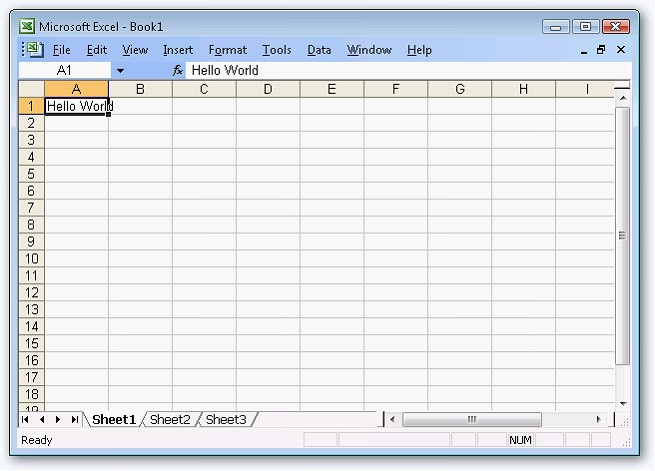

::: {style="DISPLAY: none"}
{#d2h_url_template}{#d2h_package_url style="WIDTH: 0px; DISPLAY: none; HEIGHT: 0px"}
:::

::::: {#nsbanner .d2h_main_nsbanner style="BORDER-BOTTOM: #999999 1px solid; POSITION: relative; PADDING-BOTTOM: 0px; BACKGROUND-COLOR: transparent; PADDING-LEFT: 0px; PADDING-RIGHT: 0px; DISPLAY: none; BORDER-TOP: #999999 1px solid; PADDING-TOP: 0px; LEFT: 0px"}
:::: {#TitleRow .d2h_main_titlerow style="PADDING-BOTTOM: 4px; BACKGROUND-COLOR: transparent; PADDING-LEFT: 22px; WIDTH: 100%; PADDING-RIGHT: 10px; DISPLAY: none; PADDING-TOP: 4px"}
::: {#ienav .d2h_main_ienav style="DISPLAY: none"}
{#D2HPrevious .D2HPreviousEnabled}  {#D2HNext .D2HNextEnabled}
:::
::::
:::::

::::::: {#nstext .d2h_main_nstext style="PADDING-BOTTOM: 10px; BACKGROUND-COLOR: transparent; PADDING-LEFT: 22px; PADDING-RIGHT: 10px; HEIGHT: 100%; OVERFLOW: auto; PADDING-TOP: 5px" hasuserbackground="true" valign="bottom"}
::: {#d2h_breadcrumbs .d2h_breadcrumbs}
[Essential Studio User Guide Documentation](ms-xhelp:///?Id=12457748-09e3-4d74-a240-8e049cedf030){.d2h_breadcrumbsNormal}[ \> ]{.d2h_breadcrumbsLinkSeparator}[Reporting Edition](ms-xhelp:///?Id=027aa5b6-6676-4f93-ad23-c20e8c45792e){.d2h_breadcrumbsNormal}[ \> ]{.d2h_breadcrumbsLinkSeparator}[Essential XlsIO](ms-xhelp:///?Id=b01a1b50-1d7d-40c0-bc83-af67e57c9005){.d2h_breadcrumbsNormal}[ \> ]{.d2h_breadcrumbsLinkSeparator}[Getting Started](ms-xhelp:///?Id=ad99231a-9920-49c5-b9a3-8c0224163396){.d2h_breadcrumbsNormal}[ \> ]{.d2h_breadcrumbsLinkSeparator}[Deploying Essential XlsIO](ms-xhelp:///?Id=12c8a00d-964d-4225-99ec-94a82d3c847c){.d2h_breadcrumbsNormal}
:::

### Silverlight {#silverlight style="tab-stops: 0pt"}

 

Now, you have created a Silverlight application (refer [[Creating a Platform Application]{.UGHyperlink}](ms-xhelp:///?Id=e1ba450f-74e6-4ce2-9100-821f1b29c9a2)). This section covers the following:

 

[·      ]{style="FONT-FAMILY: Symbol"}Deploying Essential XlsIO in a Silverlight Application

[·      ]{style="FONT-FAMILY: Symbol"}Creating and adding an Excel document (with worksheets) to the application

 

Deploying Essential XlsIO in a Silverlight Application

 

The following steps will guide you to deploy Essential XlsIO:

 

1.   Open the **MainPage.xaml** of the application in the designer.

2.   Add the **Syncfusion.Compression.Silverlight.dll** and **Syncfusion.XlsIO.Silverlight.dll** assemblies as references to the application.

 

Essential XlsIO is now deployed in your Silverlight application.

 

Creating and Adding an Excel Document (With Worksheets) to the Application

 

Essential XlsIO for Silverlight has support for creation and manipulation of richly formatted Excel \[97-2003\] format spreadsheets from scratch on the client side. Advanced features like Data Validation, Conditional Formatting and Charts can also be used in this approach.

 

Following steps will guide you to create a simple spreadsheet:

[]{style="FONT-FAMILY: 'Trebuchet MS','sans-serif'; COLOR: #15428b; FONT-SIZE: 9pt"} 

1.   Add references to the following assemblies.

[]{style="FONT-FAMILY: 'Trebuchet MS','sans-serif'; COLOR: #15428b; FONT-SIZE: 9pt"} 

[·      ]{style="FONT-FAMILY: Symbol"}Syncfusion.Compression.Silverlight.dll

[·      ]{style="FONT-FAMILY: Symbol"}Syncfusion.XlsIO.Silverlight.dll

[]{style="FONT-FAMILY: 'Trebuchet MS','sans-serif'; COLOR: #15428b; FONT-SIZE: 9pt"} 

2.   The next step is to add reference to the following namespace.

[]{style="FONT-FAMILY: 'Trebuchet MS','sans-serif'; COLOR: #15428b; FONT-SIZE: 9pt"} 

[·      ]{style="FONT-FAMILY: Symbol"}**Syncfusion.XlsIO** (using Syncfusion.XlsIO)

**[]{style="FONT-FAMILY: 'Trebuchet MS','sans-serif'; COLOR: #15428b; FONT-SIZE: 9pt"}** 

+------------------------------------------------------------------------------------------------------------------+
| **[\[C#\]]{style="FONT-FAMILY: 'Courier New'"}**                                                                 |
|                                                                                                                  |
| **[]{style="FONT-FAMILY: 'Courier New'; COLOR: red"}**                                                           |
|                                                                                                                  |
| [using]{style="FONT-FAMILY: 'Courier New'; COLOR: blue"}[ Syncfusion.XlsIO;]{style="FONT-FAMILY: 'Courier New'"} |
+------------------------------------------------------------------------------------------------------------------+

[]{style="FONT-FAMILY: 'Trebuchet MS','sans-serif'; COLOR: red; FONT-SIZE: 9pt"} 

3.   Instantiate the [Excel Engine]{style="COLOR: black"}.

[]{style="FONT-FAMILY: 'Calibri','sans-serif'; FONT-SIZE: 12pt"} 

+-------------------------------------------------------------------------------------------------------------------------------------------------------------------------------------------------------------------------------------------------------------------------------------------------------------------------------------------------------------------------+
| **[\[C#\]]{style="FONT-FAMILY: 'Courier New'"}**                                                                                                                                                                                                                                                                                                                        |
|                                                                                                                                                                                                                                                                                                                                                                         |
| **[]{style="FONT-FAMILY: 'Courier New'"}**                                                                                                                                                                                                                                                                                                                              |
|                                                                                                                                                                                                                                                                                                                                                                         |
| [// New instance of XlsIO is created.\[Equivalent to launching MS Excel with no workbooks open\].]{style="FONT-FAMILY: 'Courier New'; COLOR: green"}                                                                                                                                                                                                                    |
|                                                                                                                                                                                                                                                                                                                                                                         |
| [// The instantiation process consists of two steps.]{style="FONT-FAMILY: 'Courier New'; COLOR: green"}                                                                                                                                                                                                                                                                 |
|                                                                                                                                                                                                                                                                                                                                                                         |
| []{style="FONT-FAMILY: 'Courier New'; COLOR: green"}                                                                                                                                                                                                                                                                                                                    |
|                                                                                                                                                                                                                                                                                                                                                                         |
| [// Step 1: Instantiate the spreadsheet creation engine.]{style="FONT-FAMILY: 'Courier New'; COLOR: green"}                                                                                                                                                                                                                                                             |
|                                                                                                                                                                                                                                                                                                                                                                         |
| [ExcelEngine]{style="FONT-FAMILY: 'Courier New'; COLOR: #2b91af"}[ excelEngine = ]{style="FONT-FAMILY: 'Courier New'; COLOR: black"}[new]{style="FONT-FAMILY: 'Courier New'; COLOR: blue"}[ ]{style="FONT-FAMILY: 'Courier New'; COLOR: black"}[ExcelEngine]{style="FONT-FAMILY: 'Courier New'; COLOR: #2b91af"}[();]{style="FONT-FAMILY: 'Courier New'; COLOR: black"} |
+-------------------------------------------------------------------------------------------------------------------------------------------------------------------------------------------------------------------------------------------------------------------------------------------------------------------------------------------------------------------------+

[]{style="FONT-FAMILY: 'Calibri','sans-serif'; FONT-SIZE: 12pt"} 

+-------------------------------------------------------------------------------------------------------------------------------------------------------------------------------------------------------------------------------------------------------------------------------------------------------------------------------------------------------------------------+
| **[\[VB.NET\]]{style="FONT-FAMILY: 'Courier New'"}**                                                                                                                                                                                                                                                                                                                    |
|                                                                                                                                                                                                                                                                                                                                                                         |
| **[]{style="FONT-FAMILY: 'Courier New'"}**                                                                                                                                                                                                                                                                                                                              |
|                                                                                                                                                                                                                                                                                                                                                                         |
| [\' New instance of XlsIO is created.\[Equivalent to launching MS Excel with no workbooks open\].]{style="FONT-FAMILY: 'Courier New'; COLOR: green"}                                                                                                                                                                                                                    |
|                                                                                                                                                                                                                                                                                                                                                                         |
| [\' The instantiation process consists of two steps.]{style="FONT-FAMILY: 'Courier New'; COLOR: green"}                                                                                                                                                                                                                                                                 |
|                                                                                                                                                                                                                                                                                                                                                                         |
| []{style="FONT-FAMILY: 'Courier New'; COLOR: green"}                                                                                                                                                                                                                                                                                                                    |
|                                                                                                                                                                                                                                                                                                                                                                         |
| [\' Step 1: Instantiate the spreadsheet creation engine.]{style="FONT-FAMILY: 'Courier New'; COLOR: green"}                                                                                                                                                                                                                                                             |
|                                                                                                                                                                                                                                                                                                                                                                         |
| [Dim]{style="FONT-FAMILY: 'Courier New'; COLOR: blue"}[ excelEngine ]{style="FONT-FAMILY: 'Courier New'; COLOR: black"}[As]{style="FONT-FAMILY: 'Courier New'; COLOR: blue"}[ ExcelEngine = ]{style="FONT-FAMILY: 'Courier New'; COLOR: black"}[New]{style="FONT-FAMILY: 'Courier New'; COLOR: blue"}[ ExcelEngine()]{style="FONT-FAMILY: 'Courier New'; COLOR: black"} |
+-------------------------------------------------------------------------------------------------------------------------------------------------------------------------------------------------------------------------------------------------------------------------------------------------------------------------------------------------------------------------+

[]{style="FONT-FAMILY: 'Calibri','sans-serif'; FONT-SIZE: 12pt"} 

4.   Instantiate the Excel application through the **IApplication** interface which represents an Excel application.

[]{style="FONT-FAMILY: 'Calibri','sans-serif'; FONT-SIZE: 12pt"} 

+---------------------------------------------------------------------------------------------------------------------------------------------------------+
| **[\[C#\]]{style="FONT-FAMILY: 'Courier New'"}**                                                                                                        |
|                                                                                                                                                         |
| **[]{style="FONT-FAMILY: 'Courier New'"}**                                                                                                              |
|                                                                                                                                                         |
| [// Step 2: Instantiate the excel application object.]{style="FONT-FAMILY: 'Courier New'; COLOR: green"}                                                |
|                                                                                                                                                         |
| [IApplication]{style="FONT-FAMILY: 'Courier New'; COLOR: #2b91af"}[ application = excelEngine.Excel;]{style="FONT-FAMILY: 'Courier New'; COLOR: black"} |
+---------------------------------------------------------------------------------------------------------------------------------------------------------+

[]{style="FONT-FAMILY: 'Calibri','sans-serif'; FONT-SIZE: 12pt"} 

+-------------------------------------------------------------------------------------------------------------------------------------------------------------------------------------------------------------------------------------------------------------------+
| **[\[VB.NET\]]{style="FONT-FAMILY: 'Courier New'"}**                                                                                                                                                                                                              |
|                                                                                                                                                                                                                                                                   |
| **[]{style="FONT-FAMILY: 'Courier New'"}**                                                                                                                                                                                                                        |
|                                                                                                                                                                                                                                                                   |
| [\' Step 2: Instantiate the excel application object.]{style="FONT-FAMILY: 'Courier New'; COLOR: green"}                                                                                                                                                          |
|                                                                                                                                                                                                                                                                   |
| [Dim]{style="FONT-FAMILY: 'Courier New'; COLOR: blue"}[ application ]{style="FONT-FAMILY: 'Courier New'; COLOR: black"}[As]{style="FONT-FAMILY: 'Courier New'; COLOR: blue"}[ IApplication = excelEngine.Excel]{style="FONT-FAMILY: 'Courier New'; COLOR: black"} |
+-------------------------------------------------------------------------------------------------------------------------------------------------------------------------------------------------------------------------------------------------------------------+

[]{style="FONT-FAMILY: 'Calibri','sans-serif'; FONT-SIZE: 12pt"} 

An Excel document is created.

[]{style="FONT-FAMILY: 'Trebuchet MS','sans-serif'; COLOR: #15428b; FONT-SIZE: 9pt"} 

5.   Create a workbook. A newly created workbook has three worksheets by default. You can change the count of the worksheets by using the **Create** method of [[IWorkbook]{style="FONT-FAMILY: 'Trebuchet MS','sans-serif'; FONT-SIZE: 9pt"}](ms-xhelp:///?Id=0f13aa59-cfa3-4abe-962e-efdc48361811).

[]{style="FONT-FAMILY: 'Trebuchet MS','sans-serif'; COLOR: #15428b; FONT-SIZE: 9pt"} 

+-----------------------------------------------------------------------------------------------------------------------------------------------------------------+
| **[\[C#\]]{style="FONT-FAMILY: 'Courier New'"}**                                                                                                                |
|                                                                                                                                                                 |
| **[]{style="FONT-FAMILY: 'Courier New'"}**                                                                                                                      |
|                                                                                                                                                                 |
| [// A new workbook is created.\[Equivalent to creating a new workbook in MS Excel).]{style="FONT-FAMILY: 'Courier New'; COLOR: green"}                          |
|                                                                                                                                                                 |
| [// The new workbook will have 5 worksheets.]{style="FONT-FAMILY: 'Courier New'; COLOR: green"}                                                                 |
|                                                                                                                                                                 |
| [IWorkbook]{style="FONT-FAMILY: 'Courier New'; COLOR: #2b91af"}[ workbook = application.Workbooks.Create(5);]{style="FONT-FAMILY: 'Courier New'; COLOR: black"} |
+-----------------------------------------------------------------------------------------------------------------------------------------------------------------+

[]{style="FONT-FAMILY: 'Trebuchet MS','sans-serif'; COLOR: #15428b; FONT-SIZE: 9pt"} 

+---------------------------------------------------------------------------------------------------------------------------------------------------------------------------------------------------------------------------------------------------------------------------+
| **[\[VB.NET\]]{style="FONT-FAMILY: 'Courier New'"}**                                                                                                                                                                                                                      |
|                                                                                                                                                                                                                                                                           |
| **[]{style="FONT-FAMILY: 'Courier New'"}**                                                                                                                                                                                                                                |
|                                                                                                                                                                                                                                                                           |
| [\' A new workbook is created.\[Equivalent to creating a new workbook in MS Excel\].]{style="FONT-FAMILY: 'Courier New'; COLOR: green"}                                                                                                                                   |
|                                                                                                                                                                                                                                                                           |
| [\' The new workbook will have 5 worksheets.]{style="FONT-FAMILY: 'Courier New'; COLOR: green"}                                                                                                                                                                           |
|                                                                                                                                                                                                                                                                           |
| [Dim]{style="FONT-FAMILY: 'Courier New'; COLOR: blue"}[ workbook ]{style="FONT-FAMILY: 'Courier New'; COLOR: black"}[As]{style="FONT-FAMILY: 'Courier New'; COLOR: blue"}[ IWorkbook = application.Workbooks.Create(5)]{style="FONT-FAMILY: 'Courier New'; COLOR: black"} |
+---------------------------------------------------------------------------------------------------------------------------------------------------------------------------------------------------------------------------------------------------------------------------+

[]{style="FONT-FAMILY: 'Trebuchet MS','sans-serif'; COLOR: #15428b; FONT-SIZE: 9pt"} 

A workbook with the mentioned number of worksheets is created in the Excel document.

[]{style="FONT-FAMILY: 'Trebuchet MS','sans-serif'; COLOR: #15428b; FONT-SIZE: 9pt"} 

6.   Access the [[worksheet]{.UGHyperlink}](ms-xhelp:///?Id=4186fa23-4c0f-479b-951f-322305db255d) in the workbook and set the data for the given Range, say \"A1\".

[]{style="FONT-FAMILY: 'Trebuchet MS','sans-serif'; COLOR: #15428b; FONT-SIZE: 9pt"} 

+----------------------------------------------------------------------------------------------------------------------------------------------------------------------------------------------------------------------+
| **[\[C#\]]{style="FONT-FAMILY: 'Courier New'"}**                                                                                                                                                                     |
|                                                                                                                                                                                                                      |
| []{style="FONT-FAMILY: 'Courier New'; COLOR: green"}                                                                                                                                                                 |
|                                                                                                                                                                                                                      |
| [// The first worksheet object in the worksheets collection is accessed.]{style="FONT-FAMILY: 'Courier New'; COLOR: green"}                                                                                          |
|                                                                                                                                                                                                                      |
| [IWorksheet]{style="FONT-FAMILY: 'Courier New'; COLOR: #2b91af"}[ sheet = workbook.Worksheets\[0\];      ]{style="FONT-FAMILY: 'Courier New'; COLOR: black"}[                  ]{style="FONT-FAMILY: 'Courier New'"} |
|                                                                                                                                                                                                                      |
| [                        ]{style="FONT-FAMILY: 'Courier New'"}                                                                                                                                                       |
|                                                                                                                                                                                                                      |
| [// Inserting sample text into the first cell of the first worksheet.]{style="FONT-FAMILY: 'Courier New'; COLOR: green"}                                                                                             |
|                                                                                                                                                                                                                      |
| [sheet.Range\[\"A1\"\].Text = \"Hello World\";]{style="FONT-FAMILY: 'Courier New'; COLOR: black"}                                                                                                                    |
+----------------------------------------------------------------------------------------------------------------------------------------------------------------------------------------------------------------------+

[]{style="FONT-FAMILY: 'Trebuchet MS','sans-serif'; COLOR: #15428b; FONT-SIZE: 9pt"} 

+----------------------------------------------------------------------------------------------------------------------------------------------------------------------------------------------------------------------------------------------------------------+
| **[\[VB.NET\]]{style="FONT-FAMILY: 'Courier New'"}**                                                                                                                                                                                                           |
|                                                                                                                                                                                                                                                                |
| **[]{style="FONT-FAMILY: 'Courier New'"}**                                                                                                                                                                                                                     |
|                                                                                                                                                                                                                                                                |
| [\' The first worksheet object in the worksheets collection is accessed.]{style="FONT-FAMILY: 'Courier New'; COLOR: green"}                                                                                                                                    |
|                                                                                                                                                                                                                                                                |
| [Dim]{style="FONT-FAMILY: 'Courier New'; COLOR: blue"}[ sheet ]{style="FONT-FAMILY: 'Courier New'; COLOR: black"}[As]{style="FONT-FAMILY: 'Courier New'; COLOR: blue"}[ IWorksheet = workbook.Worksheets(0)]{style="FONT-FAMILY: 'Courier New'; COLOR: black"} |
|                                                                                                                                                                                                                                                                |
| []{style="FONT-FAMILY: 'Courier New'"}                                                                                                                                                                                                                         |
|                                                                                                                                                                                                                                                                |
| [\' Inserting sample text into the first cell of the first worksheet.]{style="FONT-FAMILY: 'Courier New'; COLOR: green"}                                                                                                                                       |
|                                                                                                                                                                                                                                                                |
| [sheet.Range(\"A1\").Text = \"Hello World\"]{style="FONT-FAMILY: 'Courier New'; COLOR: black"}                                                                                                                                                                 |
+----------------------------------------------------------------------------------------------------------------------------------------------------------------------------------------------------------------------------------------------------------------+

[]{style="FONT-FAMILY: 'Trebuchet MS','sans-serif'; COLOR: #15428b; FONT-SIZE: 9pt"} 

The string \"Hello World\" is written to the cell A1 of the document.

[]{style="FONT-FAMILY: 'Trebuchet MS','sans-serif'; COLOR: #15428b; FONT-SIZE: 9pt"} 

7.   Save to stream and close the workbook. Also, dispose the Excel engine.

[]{style="FONT-FAMILY: 'Trebuchet MS','sans-serif'; COLOR: #15428b; FONT-SIZE: 9pt"} 

::: {style="BORDER-BOTTOM: windowtext 1pt solid; BORDER-LEFT: medium none; PADDING-BOTTOM: 1pt; MARGIN-TOP: 9pt; PADDING-LEFT: 0pt; PADDING-RIGHT: 0pt; MARGIN-BOTTOM: 9pt; BORDER-TOP: windowtext 1pt solid; BORDER-RIGHT: medium none; PADDING-TOP: 1pt"}
{border="0"}Note: The engine should be disposed after completing workbook operations.
:::

[]{style="FONT-FAMILY: 'Trebuchet MS','sans-serif'; COLOR: #15428b; FONT-SIZE: 9pt"} 

+-----------------------------------------------------------------------------------------------------------------------------------------------------------------------------------------+
| **[\[C#\]]{style="FONT-FAMILY: 'Courier New'"}**                                                                                                                                        |
|                                                                                                                                                                                         |
| []{style="FONT-FAMILY: 'Courier New'; COLOR: green"}                                                                                                                                    |
|                                                                                                                                                                                         |
| [// Save the file on to disk.]{style="FONT-FAMILY: 'Courier New'; COLOR: green"}                                                                                                        |
|                                                                                                                                                                                         |
| [SaveFileDialog]{style="FONT-FAMILY: 'Courier New'; COLOR: #2b91af"}[ sfd = [new]{style="COLOR: blue"} [SaveFileDialog]{style="COLOR: #2b91af"}();]{style="FONT-FAMILY: 'Courier New'"} |
|                                                                                                                                                                                         |
| [sfd.DefaultExt = [\".xls\"]{style="COLOR: #a31515"};]{style="FONT-FAMILY: 'Courier New'"}                                                                                              |
|                                                                                                                                                                                         |
| [sfd.Filter = [\"Files(\*.xls)\|\*.xls\"]{style="COLOR: #a31515"};]{style="FONT-FAMILY: 'Courier New'"}                                                                                 |
|                                                                                                                                                                                         |
| [if]{style="FONT-FAMILY: 'Courier New'; COLOR: blue"}[ (sfd.ShowDialog() == [true]{style="COLOR: blue"})]{style="FONT-FAMILY: 'Courier New'"}                                           |
|                                                                                                                                                                                         |
| [{]{style="FONT-FAMILY: 'Courier New'"}                                                                                                                                                 |
|                                                                                                                                                                                         |
| [    using]{style="FONT-FAMILY: 'Courier New'; COLOR: blue"}[ ([Stream]{style="COLOR: #2b91af"} stream = sfd.OpenFile())]{style="FONT-FAMILY: 'Courier New'"}                           |
|                                                                                                                                                                                         |
| [    {]{style="FONT-FAMILY: 'Courier New'"}                                                                                                                                             |
|                                                                                                                                                                                         |
| [        workbook.SaveAs(stream);]{style="FONT-FAMILY: 'Courier New'"}                                                                                                                  |
|                                                                                                                                                                                         |
| []{style="FONT-FAMILY: 'Courier New'"}                                                                                                                                                  |
|                                                                                                                                                                                         |
| [      [// Closing the workbook.]{style="COLOR: green"}]{style="FONT-FAMILY: 'Courier New'"}                                                                                            |
|                                                                                                                                                                                         |
| [      workbook.Close();]{style="FONT-FAMILY: 'Courier New'"}                                                                                                                           |
|                                                                                                                                                                                         |
| []{style="FONT-FAMILY: 'Courier New'"}                                                                                                                                                  |
|                                                                                                                                                                                         |
| [      [// Dispose the Excel Engine.]{style="COLOR: green"}]{style="FONT-FAMILY: 'Courier New'"}                                                                                        |
|                                                                                                                                                                                         |
| [      excelEngine.Dispose();]{style="FONT-FAMILY: 'Courier New'"}                                                                                                                      |
|                                                                                                                                                                                         |
| [   }]{style="FONT-FAMILY: 'Courier New'"}                                                                                                                                              |
|                                                                                                                                                                                         |
| [}]{style="FONT-FAMILY: 'Courier New'"}                                                                                                                                                 |
+-----------------------------------------------------------------------------------------------------------------------------------------------------------------------------------------+

[]{style="FONT-FAMILY: 'Trebuchet MS','sans-serif'; COLOR: #15428b; FONT-SIZE: 9pt"} 

+-----------------------------------------------------------------------------------------------------------------------------------------------------------------------------------------+
| **[\[VB.NET\]]{style="FONT-FAMILY: 'Courier New'"}**                                                                                                                                    |
|                                                                                                                                                                                         |
| **[]{style="FONT-FAMILY: 'Courier New'"}**                                                                                                                                              |
|                                                                                                                                                                                         |
| [\' Save the file on to disk.]{style="FONT-FAMILY: 'Courier New'; COLOR: green"}                                                                                                        |
|                                                                                                                                                                                         |
| [Dim]{style="FONT-FAMILY: 'Courier New'; COLOR: blue"}[ sfd [As]{style="COLOR: blue"} SaveFileDialog = [New]{style="COLOR: blue"} SaveFileDialog()]{style="FONT-FAMILY: 'Courier New'"} |
|                                                                                                                                                                                         |
| [sfd.DefaultExt = \".xls\"]{style="FONT-FAMILY: 'Courier New'"}                                                                                                                         |
|                                                                                                                                                                                         |
| [sfd.Filter = \"Files(\*.xls)\|\*.xls\"]{style="FONT-FAMILY: 'Courier New'"}                                                                                                            |
|                                                                                                                                                                                         |
| [If]{style="FONT-FAMILY: 'Courier New'; COLOR: blue"}[ sfd.ShowDialog() = [True]{style="COLOR: blue"} [Then]{style="COLOR: blue"}]{style="FONT-FAMILY: 'Courier New'"}                  |
|                                                                                                                                                                                         |
| [      [Using]{style="COLOR: blue"} stream [As]{style="COLOR: blue"} Stream = sfd.OpenFile()]{style="FONT-FAMILY: 'Courier New'"}                                                       |
|                                                                                                                                                                                         |
| [            workbook.SaveAs(stream)]{style="FONT-FAMILY: 'Courier New'"}                                                                                                               |
|                                                                                                                                                                                         |
| []{style="FONT-FAMILY: 'Courier New'"}                                                                                                                                                  |
|                                                                                                                                                                                         |
| [            [\' Closing the workbook.]{style="COLOR: green"}]{style="FONT-FAMILY: 'Courier New'"}                                                                                      |
|                                                                                                                                                                                         |
| [            workbook.Close()]{style="FONT-FAMILY: 'Courier New'"}                                                                                                                      |
|                                                                                                                                                                                         |
| []{style="FONT-FAMILY: 'Courier New'"}                                                                                                                                                  |
|                                                                                                                                                                                         |
| [            [\' Dispose the Excel Engine.]{style="COLOR: green"}]{style="FONT-FAMILY: 'Courier New'"}                                                                                  |
|                                                                                                                                                                                         |
| [            excelEngine.Dispose()]{style="FONT-FAMILY: 'Courier New'"}                                                                                                                 |
|                                                                                                                                                                                         |
| [      [End]{style="COLOR: blue"} [Using]{style="COLOR: blue"}]{style="FONT-FAMILY: 'Courier New'"}                                                                                     |
|                                                                                                                                                                                         |
| [End]{style="FONT-FAMILY: 'Courier New'; COLOR: blue"}[ [If]{style="COLOR: blue"}]{style="FONT-FAMILY: 'Courier New'"}                                                                  |
+-----------------------------------------------------------------------------------------------------------------------------------------------------------------------------------------+

[  ]{style="FONT-FAMILY: 'Courier New'"}

The Workbook is saved and closed and the Excel engine is disposed.

[]{style="FONT-FAMILY: 'Trebuchet MS','sans-serif'; COLOR: #15428b; FONT-SIZE: 9pt"} 

::: {style="BORDER-BOTTOM: windowtext 1pt solid; BORDER-LEFT: medium none; PADDING-BOTTOM: 1pt; MARGIN-TOP: 9pt; PADDING-LEFT: 0pt; PADDING-RIGHT: 0pt; MARGIN-BOTTOM: 9pt; BORDER-TOP: windowtext 1pt solid; BORDER-RIGHT: medium none; PADDING-TOP: 1pt"}
{border="0"}Note:       This is a very basic usage scenario where \"Hello World\" is inserted into the cell \"A1\" of the spreadsheet. The more advanced usage scenarios of creating complex spreadsheets from scratch are explained in detail in this user guide.
:::

[]{style="FONT-FAMILY: 'Calibri','sans-serif'; FONT-SIZE: 12pt"} 

{border="0"}

Figure 23: Spreadsheet created in the Silverlight Application[]{style="FONT-SIZE: 12pt"}

[]{style="FONT-FAMILY: 'Calibri','sans-serif'; FONT-SIZE: 12pt"} 

 

A spreadsheet has been created in the Silverlight application.

 

Following are the list of supported elements in XlsIO for Silverlight.

 

::: {align="center"}
+-------------------------------------------------------------------------------------+-------------------+-------------------+-----------------+
| Element                                                                             | xls                                   | xlsx            |
|                                                                                     +-------------------+-------------------+-----------------+
|                                                                                     | Read              | Write             | Not Supported   |
+-------------------------------------------------------------------------------------+-------------------+-------------------+                 |
| Font settings                                                                       | Yes               | Yes               |                 |
+-------------------------------------------------------------------------------------+-------------------+-------------------+                 |
| Alignments                                                                          | Yes               | Yes               |                 |
+-------------------------------------------------------------------------------------+-------------------+-------------------+                 |
| Number formatting                                                                   | Yes               | Yes               |                 |
+-------------------------------------------------------------------------------------+-------------------+-------------------+                 |
| Border settings                                                                     | Yes               | Yes               |                 |
+-------------------------------------------------------------------------------------+-------------------+-------------------+                 |
| Fill settings                                                                       | Yes               | Yes               |                 |
+-------------------------------------------------------------------------------------+-------------------+-------------------+                 |
| Autofit                                                                             | No                | No                |                 |
+-------------------------------------------------------------------------------------+-------------------+-------------------+                 |
| Cell styles                                                                         | Yes               | Yes               |                 |
+-------------------------------------------------------------------------------------+-------------------+-------------------+                 |
| RGB Colors                                                                          | Yes (Indexed)     | Yes (Indexed)     |                 |
+-------------------------------------------------------------------------------------+-------------------+-------------------+                 |
| Conditional formatting                                                              | Yes               | Yes               |                 |
+-------------------------------------------------------------------------------------+-------------------+-------------------+                 |
| Hide/unhide rows/cols                                                               | Yes               | Yes               |                 |
+-------------------------------------------------------------------------------------+-------------------+-------------------+                 |
| Hide/Unhide worksheet                                                               | Yes               | Yes               |                 |
+-------------------------------------------------------------------------------------+-------------------+-------------------+                 |
| Copy/Move worksheet                                                                 | Yes               | Yes               |                 |
+-------------------------------------------------------------------------------------+-------------------+-------------------+                 |
| Sheet protection                                                                    | Yes               | Yes               |                 |
+-------------------------------------------------------------------------------------+-------------------+-------------------+                 |
| Workbook protection                                                                 | Yes               | Yes               |                 |
+-------------------------------------------------------------------------------------+-------------------+-------------------+                 |
| Sheet format\[sheet name, tab color\]                                               | Yes               | Yes               |                 |
+-------------------------------------------------------------------------------------+-------------------+-------------------+                 |
| Bitmap Images                                                                       | Yes               | Yes               |                 |
|                                                                                     |                   |                   |                 |
|                                                                                     |                   |                   |                 |
+-------------------------------------------------------------------------------------+-------------------+-------------------+                 |
| Vector Images                                                                       | Yes               | Yes               |                 |
+-------------------------------------------------------------------------------------+-------------------+-------------------+                 |
| Charts                                                                              | Yes               | Yes               |                 |
+-------------------------------------------------------------------------------------+-------------------+-------------------+                 |
| Hyperlinks                                                                          | Yes               | Yes               |                 |
+-------------------------------------------------------------------------------------+-------------------+-------------------+                 |
| Header/Footer                                                                       | Yes               | Yes               |                 |
+-------------------------------------------------------------------------------------+-------------------+-------------------+                 |
| Pivot tables                                                                        | No                | No                |                 |
+-------------------------------------------------------------------------------------+-------------------+-------------------+                 |
| Auto Shapes                                                                         | No                | No                |                 |
+-------------------------------------------------------------------------------------+-------------------+-------------------+                 |
| Text Box                                                                            | Yes               | Yes               |                 |
+-------------------------------------------------------------------------------------+-------------------+-------------------+                 |
| Check Box                                                                           | Yes               | Yes               |                 |
+-------------------------------------------------------------------------------------+-------------------+-------------------+                 |
| Combo Box                                                                           | Yes               | Yes               |                 |
+-------------------------------------------------------------------------------------+-------------------+-------------------+                 |
| Page setup                                                                          | Yes               | Yes               |                 |
|                                                                                     |                   |                   |                 |
| \[Margin,origin,page size\]                                                         |                   |                   |                 |
+-------------------------------------------------------------------------------------+-------------------+-------------------+                 |
| Page breaks                                                                         | Yes               | Yes               |                 |
+-------------------------------------------------------------------------------------+-------------------+-------------------+                 |
| Background image                                                                    | Yes               | Yes               |                 |
+-------------------------------------------------------------------------------------+-------------------+-------------------+                 |
| Print settings\[Print area,Print titles,page order\]                                | Yes               | Yes               |                 |
+-------------------------------------------------------------------------------------+-------------------+-------------------+                 |
| Formulas                                                                            | Yes               | Yes               |                 |
+-------------------------------------------------------------------------------------+-------------------+-------------------+                 |
| Calculation options                                                                 | Yes               | Yes               |                 |
+-------------------------------------------------------------------------------------+-------------------+-------------------+                 |
| Names                                                                               | Yes               | Yes               |                 |
+-------------------------------------------------------------------------------------+-------------------+-------------------+                 |
| Formula auditing \[ Ignore error \]                                                 | Yes               | Yes               |                 |
+-------------------------------------------------------------------------------------+-------------------+-------------------+                 |
| Autofilter                                                                          | Yes               | Yes               |                 |
+-------------------------------------------------------------------------------------+-------------------+-------------------+                 |
| Data validation                                                                     | Yes               | Yes               |                 |
+-------------------------------------------------------------------------------------+-------------------+-------------------+                 |
| Template marker                                                                     | Yes               | Yes               |                 |
+-------------------------------------------------------------------------------------+-------------------+-------------------+                 |
| Outlines\[group/ungroup, summary settings\]                                         | Yes               | Yes               |                 |
+-------------------------------------------------------------------------------------+-------------------+-------------------+                 |
| Comments                                                                            | Yes               | Yes               |                 |
+-------------------------------------------------------------------------------------+-------------------+-------------------+                 |
| Freeze pane, split pane                                                             | Yes               | Yes               |                 |
+-------------------------------------------------------------------------------------+-------------------+-------------------+                 |
| View\[Zoom,show/hide gridline,show/hide headings\], horizontal/vertical scroll bars | Yes               | Yes               |                 |
+-------------------------------------------------------------------------------------+-------------------+-------------------+                 |
| Macros                                                                              | No                | No                |                 |
+-------------------------------------------------------------------------------------+-------------------+-------------------+                 |
| Encryption                                                                          | Yes               | Yes               |                 |
+-------------------------------------------------------------------------------------+-------------------+-------------------+                 |
| Decryption                                                                          | No                | No                |                 |
+-------------------------------------------------------------------------------------+-------------------+-------------------+                 |
| Ole Objects                                                                         | No                | No                |                 |
|                                                                                     |                   |                   |                 |
|                                                                                     |                   |                   |                 |
+-------------------------------------------------------------------------------------+-------------------+-------------------+                 |
| Track changes                                                                       | No                | No                |                 |
+-------------------------------------------------------------------------------------+-------------------+-------------------+                 |
| Streams                                                                             | Yes               | Yes               |                 |
+-------------------------------------------------------------------------------------+-------------------+-------------------+                 |
| Tables                                                                              | No                | No                |                 |
+-------------------------------------------------------------------------------------+-------------------+-------------------+-----------------+
:::

 

[]{#p18}**[]{style="FONT-FAMILY: 'Segoe UI','sans-serif'; COLOR: black"}** 

[]{#related-topics}
:::::::
