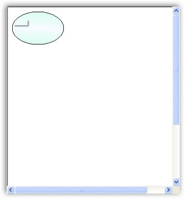
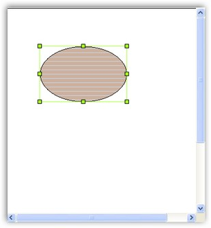
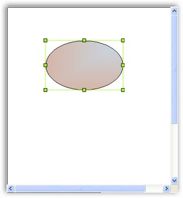

::: {style="DISPLAY: none"}
{#d2h_url_template}{#d2h_package_url style="WIDTH: 0px; DISPLAY: none; HEIGHT: 0px"}
:::

::::: {.d2h_secondary_topic style="PADDING-BOTTOM: 10pt; MARGIN: 0pt; PADDING-LEFT: 0pt; PADDING-RIGHT: 0pt; PADDING-TOP: 0pt"}
#### Size Events {#size-events style="tab-stops: 0pt"}

[]{style="FONT-FAMILY: 'Trebuchet MS','sans-serif'; FONT-SIZE: 9pt"} 

The following are the Size events of the DiagramWebControl.

[]{style="FONT-FAMILY: 'Trebuchet MS','sans-serif'; COLOR: #15428b; FONT-SIZE: 9pt"} 

::: {align="center"}
  ------------------- ----------------------------------------------------------
  DocumentEventSink   Description
  SizeChanged         Gets fired after the size of the node  has been changed.
  SizeChanging        Gets fired when the size of the node is changed.
  ------------------- ----------------------------------------------------------
:::

[]{style="FONT-FAMILY: 'Trebuchet MS','sans-serif'; COLOR: #15428b; FONT-SIZE: 9pt"} 

Data is retrieved or set by using the following members of the Size events.

[]{style="FONT-FAMILY: 'Trebuchet MS','sans-serif'; COLOR: #15428b; FONT-SIZE: 9pt"} 

::: {align="center"}
  ----------------------- ------------------------------------------------------------
  Size EventArgs Member   Description
  Cancel                  Cancels the Vertex Changed event from being fired.
  NodeAffected            Returns the node\'s name by which the node  was  affected.
  RotationOffset          Returns the angle by which the node was changed.
  ----------------------- ------------------------------------------------------------
:::

[]{style="FONT-FAMILY: 'Trebuchet MS','sans-serif'; COLOR: #15428b; FONT-SIZE: 9pt"} 

The following code example illustrates the usage of the Size events.

[]{style="FONT-FAMILY: 'Trebuchet MS','sans-serif'; COLOR: #15428b; FONT-SIZE: 9pt"} 

+------------------------------------------------------------------------------------------------------------------------------------------------------------------------------------------------------------------------------------+
| **[\[C#\]]{style="FONT-FAMILY: 'Courier New'"}**                                                                                                                                                                                   |
|                                                                                                                                                                                                                                    |
| []{style="FONT-FAMILY: 'Courier New'"}                                                                                                                                                                                             |
|                                                                                                                                                                                                                                    |
| [public]{style="FONT-FAMILY: 'Courier New'; COLOR: blue"}[ [void]{style="COLOR: blue"} Form1_Load([object]{style="COLOR: blue"} sender, [EventArgs]{style="COLOR: #2b91af"} e)]{style="FONT-FAMILY: 'Courier New'"}                |
|                                                                                                                                                                                                                                    |
| [{]{style="FONT-FAMILY: 'Courier New'"}                                                                                                                                                                                            |
|                                                                                                                                                                                                                                    |
| [DiagramWebControl1.Model.EventSink.SizeChanged += [new]{style="COLOR: blue"} SizeChangedEventHandler(EventSink_SizeChanged);]{style="FONT-FAMILY: 'Courier New'"}                                                                 |
|                                                                                                                                                                                                                                    |
| [DiagramWebControl1.Model.EventSink.SizeChanging += [new]{style="COLOR: blue"} SizeChangingEventHandler(EventSink_SizeChanging);]{style="FONT-FAMILY: 'Courier New'"}                                                              |
|                                                                                                                                                                                                                                    |
| [Syncfusion.Windows.Forms.Diagram.[Ellipse]{style="COLOR: #2b91af"} ellipse = [new]{style="COLOR: blue"} Syncfusion.Windows.Forms.Diagram.[Ellipse]{style="COLOR: #2b91af"}(10, 10, 110, 70);]{style="FONT-FAMILY: 'Courier New'"} |
|                                                                                                                                                                                                                                    |
| [DiagramWebControl1.Model.AppendChild(ellipse);]{style="FONT-FAMILY: 'Courier New'"}                                                                                                                                               |
|                                                                                                                                                                                                                                    |
| [}]{style="FONT-FAMILY: 'Courier New'"}                                                                                                                                                                                            |
|                                                                                                                                                                                                                                    |
| []{style="FONT-FAMILY: 'Courier New'"}                                                                                                                                                                                             |
|                                                                                                                                                                                                                                    |
| [void]{style="FONT-FAMILY: 'Courier New'; COLOR: blue"}[ EventSink_SizeChanged(SizeChangedEventArgs evtArgs)]{style="FONT-FAMILY: 'Courier New'"}                                                                                  |
|                                                                                                                                                                                                                                    |
| [{]{style="FONT-FAMILY: 'Courier New'"}                                                                                                                                                                                            |
|                                                                                                                                                                                                                                    |
| [ellipse.FillStyle.Color = System.Drawing.[Color]{style="COLOR: #2b91af"}.Sienna;]{style="FONT-FAMILY: 'Courier New'"}                                                                                                             |
|                                                                                                                                                                                                                                    |
| [ellipse.FillStyle.ColorAlphaFactor = 100;]{style="FONT-FAMILY: 'Courier New'"}                                                                                                                                                    |
|                                                                                                                                                                                                                                    |
| [ellipse.FillStyle.ForeColor = System.Drawing.[Color]{style="COLOR: #2b91af"}.SteelBlue;]{style="FONT-FAMILY: 'Courier New'"}                                                                                                      |
|                                                                                                                                                                                                                                    |
| [ellipse.FillStyle.ForeColorAlphaFactor = 70;]{style="FONT-FAMILY: 'Courier New'"}                                                                                                                                                 |
|                                                                                                                                                                                                                                    |
| [ellipse.FillStyle.Type = FillStyleType.PathGradient;]{style="FONT-FAMILY: 'Courier New'"}                                                                                                                                         |
|                                                                                                                                                                                                                                    |
| [ellipse.FillStyle.PathBrushStyle = PathGradientBrushStyle.RectangleRightTop;]{style="FONT-FAMILY: 'Courier New'"}                                                                                                                 |
|                                                                                                                                                                                                                                    |
| [ellipse.FillStyle.Type = FillStyleType.PathGradient;]{style="FONT-FAMILY: 'Courier New'"}                                                                                                                                         |
|                                                                                                                                                                                                                                    |
| [ellipse.FillStyle.GradientAngle = 95;]{style="FONT-FAMILY: 'Courier New'"}                                                                                                                                                        |
|                                                                                                                                                                                                                                    |
| [ellipse.FillStyle.GradientCenter = 0.5f;]{style="FONT-FAMILY: 'Courier New'"}                                                                                                                                                     |
|                                                                                                                                                                                                                                    |
| [}]{style="FONT-FAMILY: 'Courier New'"}                                                                                                                                                                                            |
|                                                                                                                                                                                                                                    |
| []{style="FONT-FAMILY: 'Courier New'"}                                                                                                                                                                                             |
|                                                                                                                                                                                                                                    |
| [void]{style="FONT-FAMILY: 'Courier New'; COLOR: blue"}[ EventSink_SizeChanging(SizeChangingEventArgs evtArgs)]{style="FONT-FAMILY: 'Courier New'"}                                                                                |
|                                                                                                                                                                                                                                    |
| [{]{style="FONT-FAMILY: 'Courier New'"}                                                                                                                                                                                            |
|                                                                                                                                                                                                                                    |
| [ellipse.FillStyle.Color = System.Drawing.[Color]{style="COLOR: #2b91af"}.SaddleBrown;]{style="FONT-FAMILY: 'Courier New'"}                                                                                                        |
|                                                                                                                                                                                                                                    |
| [ellipse.FillStyle.ColorAlphaFactor = 100;]{style="FONT-FAMILY: 'Courier New'"}                                                                                                                                                    |
|                                                                                                                                                                                                                                    |
| [ellipse.FillStyle.ForeColor = System.Drawing.[Color]{style="COLOR: #2b91af"}.SteelBlue;]{style="FONT-FAMILY: 'Courier New'"}                                                                                                      |
|                                                                                                                                                                                                                                    |
| [ellipse.FillStyle.ForeColorAlphaFactor = 70;]{style="FONT-FAMILY: 'Courier New'"}                                                                                                                                                 |
|                                                                                                                                                                                                                                    |
| [ellipse.FillStyle.Type = FillStyleType.PathGradient;]{style="FONT-FAMILY: 'Courier New'"}                                                                                                                                         |
|                                                                                                                                                                                                                                    |
| [ellipse.FillStyle.PathBrushStyle = PathGradientBrushStyle.RectangleLeftBottom;]{style="FONT-FAMILY: 'Courier New'"}                                                                                                               |
|                                                                                                                                                                                                                                    |
| [ellipse.FillStyle.Type = FillStyleType.Hatch;]{style="FONT-FAMILY: 'Courier New'"}                                                                                                                                                |
|                                                                                                                                                                                                                                    |
| [ellipse.FillStyle.GradientAngle = 95;]{style="FONT-FAMILY: 'Courier New'"}                                                                                                                                                        |
|                                                                                                                                                                                                                                    |
| [ellipse.FillStyle.GradientCenter = 0.5f;]{style="FONT-FAMILY: 'Courier New'"}                                                                                                                                                     |
|                                                                                                                                                                                                                                    |
| [}]{style="FONT-FAMILY: 'Courier New'"}                                                                                                                                                                                            |
+------------------------------------------------------------------------------------------------------------------------------------------------------------------------------------------------------------------------------------+

[]{style="FONT-FAMILY: 'Trebuchet MS','sans-serif'; COLOR: #15428b; FONT-SIZE: 9pt"} 

{border="0"}

[]{style="FONT-FAMILY: 'Trebuchet MS','sans-serif'; COLOR: #15428b; FONT-SIZE: 9pt"} 

Figure 68: Before Size Changing

**[]{style="FONT-FAMILY: 'Trebuchet MS','sans-serif'; COLOR: #15428b; FONT-SIZE: 9pt"}** 

{border="0"}

[]{style="FONT-FAMILY: 'Trebuchet MS','sans-serif'; COLOR: #15428b; FONT-SIZE: 9pt"} 

Figure 69: SizeChanging Event

{border="0"}

[]{style="FONT-FAMILY: 'Trebuchet MS','sans-serif'; COLOR: #15428b; FONT-SIZE: 9pt"} 

Figure 70: SizeChanged Event

[]{#related-topics}
:::::
