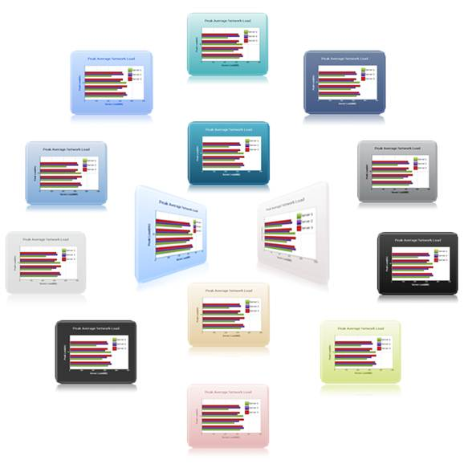

::: {style="DISPLAY: none"}
{#d2h_url_template}{#d2h_package_url style="WIDTH: 0px; DISPLAY: none; HEIGHT: 0px"}
:::

::::: {#nsbanner .d2h_main_nsbanner style="BORDER-BOTTOM: #999999 1px solid; POSITION: relative; PADDING-BOTTOM: 0px; BACKGROUND-COLOR: transparent; PADDING-LEFT: 0px; PADDING-RIGHT: 0px; DISPLAY: none; BORDER-TOP: #999999 1px solid; PADDING-TOP: 0px; LEFT: 0px"}
:::: {#TitleRow .d2h_main_titlerow style="PADDING-BOTTOM: 4px; BACKGROUND-COLOR: transparent; PADDING-LEFT: 22px; WIDTH: 100%; PADDING-RIGHT: 10px; DISPLAY: none; PADDING-TOP: 4px"}
::: {#ienav .d2h_main_ienav style="DISPLAY: none"}
{#D2HPrevious .D2HPreviousEnabled}  {#D2HNext .D2HNextEnabled}
:::
::::
:::::

:::::: {#nstext .d2h_main_nstext style="PADDING-BOTTOM: 10px; BACKGROUND-COLOR: transparent; PADDING-LEFT: 22px; PADDING-RIGHT: 10px; HEIGHT: 100%; OVERFLOW: auto; PADDING-TOP: 5px" hasuserbackground="true" valign="bottom"}
::: {#d2h_breadcrumbs .d2h_breadcrumbs}
[Essential Studio User Guide Documentation](ms-xhelp:///?Id=12457748-09e3-4d74-a240-8e049cedf030){.d2h_breadcrumbsNormal}[ \> ]{.d2h_breadcrumbsLinkSeparator}[User Interface Edition](ms-xhelp:///?Id=c29296b7-531c-413b-a0ec-488ca1f7f669){.d2h_breadcrumbsNormal}[ \> ]{.d2h_breadcrumbsLinkSeparator}[Essential ASP.NET MVC](ms-xhelp:///?Id=4b14e7d1-65c4-4f67-b1aa-2c37709905a5){.d2h_breadcrumbsNormal}[ \> ]{.d2h_breadcrumbsLinkSeparator}[Essential Chart]{.d2h_breadcrumbsContentsOnly}[ \> ]{.d2h_breadcrumbsLinkSeparator}[Concepts and Features](ms-xhelp:///?Id=696f5666-8b81-4685-9bd9-12198f06f3ad){.d2h_breadcrumbsNormal}[ \> ]{.d2h_breadcrumbsLinkSeparator}[Appearance](ms-xhelp:///?Id=201bbd07-95b2-469b-a2b4-b7ebc85043f2){.d2h_breadcrumbsNormal}
:::

### Skins {#skins style="tab-stops: 0pt"}

Essential Chart has several built-in skins that make styling extremely easy. It is also possible to easily format the data displayed in the chart. **[]{style="FONT-FAMILY: 'Cambria','serif'; COLOR: #4f81bd"}**

 

Essential Chart for ASP.NET MVC contains 14 built-in skins to easily customize the appearance. Essential Chart\'s AutoFormat property allows you to apply predefined skins to the control. Some of the available skins are illustrated in detail in the Built-in Skin Styles topic.

[]{style="FONT-FAMILY: 'Calibri','sans-serif'"} 

[]{style="FONT-FAMILY: 'Calibri','sans-serif'"} 

::: {align="center"}
+------------------------------+-----------------------------------+
| Details                                                          |
+------------------------------+-----------------------------------+
| Possible values              | ChartModelSkins Enumerable values |
+------------------------------+-----------------------------------+
| Default value                | None                              |
+------------------------------+-----------------------------------+
| 2D/3D limitations            | No                                |
+------------------------------+-----------------------------------+
| Application to chart element | All series                        |
+------------------------------+-----------------------------------+
| Application to chart types   | All chart types.                  |
+------------------------------+-----------------------------------+
:::

 

This property affects the ChartAreaInterior, ChartInterior, and BackInterior properties.

 

The following screenshot shows the 14 ChartModel skins:

[]{style="FONT-FAMILY: 'Calibri','sans-serif'"} 

{border="0"}

Figure 304: Chart Skins

[]{style="FONT-FAMILY: 'Calibri','sans-serif'"} 

**[]{style="FONT-FAMILY: 'Arial','sans-serif'"}** 

 

Properties

::: {align="center"}
+-------------+----------------------------+-----------------------------+-------------------------------------------------------------------------------------------------------------------------------------------------------------------+--------------------------------------------------+
| Property    | Description                | Property Type               | Value it Accepts                                                                                                                                                  | Any Other Dependencies/Sub-properties Associated |
+=============+============================+=============================+===================================================================================================================================================================+==================================================+
| Skins       | Sets the ChartModel Skins. | [enum]{style="COLOR: blue"} | [ChartModelSkins]{style="FONT-FAMILY: Consolas; COLOR: #2b91af; FONT-SIZE: 9.5pt"}[.Almond]{style="FONT-FAMILY: Consolas; FONT-SIZE: 9.5pt"}                      | [NA]{style="COLOR: #558ed5"}                     |
|             |                            |                             |                                                                                                                                                                   |                                                  |
|             |                            |                             | [ChartModelSkins]{style="FONT-FAMILY: Consolas; COLOR: #2b91af; FONT-SIZE: 9.5pt"}[.Blueberry]{style="FONT-FAMILY: Consolas; FONT-SIZE: 9.5pt"}                   |                                                  |
|             |                            |                             |                                                                                                                                                                   |                                                  |
|             |                            |                             | [ChartModelSkins]{style="FONT-FAMILY: Consolas; COLOR: #2b91af; FONT-SIZE: 9.5pt"}[.Monochrome]{style="FONT-FAMILY: Consolas; FONT-SIZE: 9.5pt"}                  |                                                  |
|             |                            |                             |                                                                                                                                                                   |                                                  |
|             |                            |                             | [ChartModelSkins]{style="FONT-FAMILY: Consolas; COLOR: #2b91af; FONT-SIZE: 9.5pt"}[.VS2010]{style="FONT-FAMILY: Consolas; FONT-SIZE: 9.5pt"}                      |                                                  |
|             |                            |                             |                                                                                                                                                                   |                                                  |
|             |                            |                             | [ChartModelSkins]{style="FONT-FAMILY: Consolas; COLOR: #2b91af; FONT-SIZE: 9.5pt"}[.Office2007Blue]{style="FONT-FAMILY: Consolas; FONT-SIZE: 9.5pt"}              |                                                  |
|             |                            |                             |                                                                                                                                                                   |                                                  |
|             |                            |                             | [ChartModelSkins]{style="FONT-FAMILY: Consolas; COLOR: #2b91af; FONT-SIZE: 9.5pt"}[.Office2007Black]{style="FONT-FAMILY: Consolas; FONT-SIZE: 9.5pt"}             |                                                  |
|             |                            |                             |                                                                                                                                                                   |                                                  |
|             |                            |                             | [ChartModelSkins]{style="FONT-FAMILY: Consolas; COLOR: #2b91af; FONT-SIZE: 9.5pt"}[.Blend]{style="FONT-FAMILY: Consolas; FONT-SIZE: 9.5pt"}                       |                                                  |
|             |                            |                             |                                                                                                                                                                   |                                                  |
|             |                            |                             | [ChartModelSkins]{style="FONT-FAMILY: Consolas; COLOR: #2b91af; FONT-SIZE: 9.5pt"}[.Midnight]{style="FONT-FAMILY: Consolas; FONT-SIZE: 9.5pt"}                    |                                                  |
|             |                            |                             |                                                                                                                                                                   |                                                  |
|             |                            |                             | [ChartModelSkins]{style="FONT-FAMILY: Consolas; COLOR: #2b91af; FONT-SIZE: 9.5pt"}[.Marble]{style="FONT-FAMILY: Consolas; FONT-SIZE: 9.5pt"}                      |                                                  |
|             |                            |                             |                                                                                                                                                                   |                                                  |
|             |                            |                             | [ChartModelSkins]{style="FONT-FAMILY: Consolas; COLOR: #2b91af; FONT-SIZE: 9.5pt"}[.Office2007Silver]{style="FONT-FAMILY: Consolas; FONT-SIZE: 9.5pt"}            |                                                  |
|             |                            |                             |                                                                                                                                                                   |                                                  |
|             |                            |                             | [ChartModelSkins]{style="FONT-FAMILY: Consolas; COLOR: #2b91af; FONT-SIZE: 9.5pt"}[.Sandune]{style="FONT-FAMILY: Consolas; FONT-SIZE: 9.5pt"}                     |                                                  |
|             |                            |                             |                                                                                                                                                                   |                                                  |
|             |                            |                             | [ChartModelSkins]{style="FONT-FAMILY: Consolas; COLOR: #2b91af; FONT-SIZE: 9.5pt"}[.Olive]{style="FONT-FAMILY: Consolas; FONT-SIZE: 9.5pt"}                       |                                                  |
|             |                            |                             |                                                                                                                                                                   |                                                  |
|             |                            |                             | [ChartModelSkins]{style="FONT-FAMILY: Consolas; COLOR: #2b91af; FONT-SIZE: 9.5pt"}[.Vista]{style="FONT-FAMILY: Consolas; FONT-SIZE: 9.5pt"}                       |                                                  |
|             |                            |                             |                                                                                                                                                                   |                                                  |
|             |                            |                             | [ChartModelSkins]{style="FONT-FAMILY: Consolas; COLOR: #2b91af; FONT-SIZE: 9.5pt"}[.Turquoise]{style="FONT-FAMILY: Consolas; FONT-SIZE: 9.5pt"}                   |                                                  |
|             |                            |                             |                                                                                                                                                                   |                                                  |
|             |                            |                             | [ChartModelSkins]{style="FONT-FAMILY: Consolas; COLOR: #2b91af; FONT-SIZE: 9.5pt"}[.None]{style="FONT-FAMILY: Consolas; FONT-SIZE: 9.5pt"}[]{style="COLOR: blue"} |                                                  |
+-------------+----------------------------+-----------------------------+-------------------------------------------------------------------------------------------------------------------------------------------------------------------+--------------------------------------------------+
:::

Applying skins in any chart can be created through two ways:

[·      ]{style="FONT-FAMILY: Symbol"}Builder

[·      ]{style="FONT-FAMILY: Symbol"}ChartModel

More:

[ ]{#related-topics}

[{border="0" align="absMiddle"}Builder](ms-xhelp:///?Id=a118f468-8e84-4776-b105-9df4ec59d4d5){style="TEXT-DECORATION: none"}

[{border="0" align="absMiddle"}ChartModel](ms-xhelp:///?Id=d4268651-fdc1-420d-8a97-1b4039246d28){style="TEXT-DECORATION: none"}
::::::
