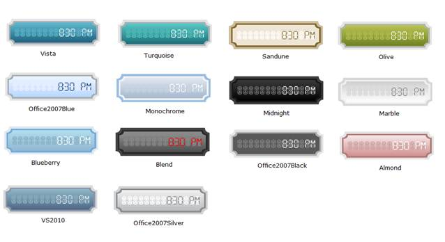

::: {style="DISPLAY: none"}
{#d2h_url_template}{#d2h_package_url style="WIDTH: 0px; DISPLAY: none; HEIGHT: 0px"}
:::

:::: {.d2h_secondary_topic style="PADDING-BOTTOM: 10pt; MARGIN: 0pt; PADDING-LEFT: 0pt; PADDING-RIGHT: 0pt; PADDING-TOP: 0pt"}
##### Skins {#skins style="tab-stops: 0pt"}

[]{style="FONT-FAMILY: 'Calibri','sans-serif'"} 

Gauge MVC now comes with fourteen stunning skins for better and professional representation of gauges. You can now easily modify the look and feel of the gauge component by using the built-in visual styles color schemes.

[]{style="FONT-FAMILY: 'Calibri','sans-serif'"} 

Properties

 

::: {align="center"}
+-------------+-------------------------------+-----------------------------+-------------------------------------------------------+--------------------------------------------------+
| Property    | Description                   | Type of Property            | Value It Accepts                                      | Any other dependencies/Sub properties associated |
+-------------+-------------------------------+-----------------------------+-------------------------------------------------------+--------------------------------------------------+
| GaugeSkins  | Sets the Skins for the Gauge. | [enum]{style="COLOR: blue"} | [GaugeSkins]{style="COLOR: #2b91af"}.Almond           | NA                                               |
|             |                               |                             |                                                       |                                                  |
|             |                               |                             |                                                       |                                                  |
|             |                               |                             |                                                       |                                                  |
|             |                               |                             | [GaugeSkins]{style="COLOR: #2b91af"}.Blueberry        |                                                  |
|             |                               |                             |                                                       |                                                  |
|             |                               |                             |                                                       |                                                  |
|             |                               |                             |                                                       |                                                  |
|             |                               |                             | [GaugeSkins]{style="COLOR: #2b91af"}.Monochrome       |                                                  |
|             |                               |                             |                                                       |                                                  |
|             |                               |                             |                                                       |                                                  |
|             |                               |                             |                                                       |                                                  |
|             |                               |                             | [GaugeSkins]{style="COLOR: #2b91af"}.VS2010           |                                                  |
|             |                               |                             |                                                       |                                                  |
|             |                               |                             |                                                       |                                                  |
|             |                               |                             |                                                       |                                                  |
|             |                               |                             | [GaugeSkins]{style="COLOR: #2b91af"}.Office2007Blue   |                                                  |
|             |                               |                             |                                                       |                                                  |
|             |                               |                             |                                                       |                                                  |
|             |                               |                             |                                                       |                                                  |
|             |                               |                             | [GaugeSkins]{style="COLOR: #2b91af"}.Office2007Black  |                                                  |
|             |                               |                             |                                                       |                                                  |
|             |                               |                             |                                                       |                                                  |
|             |                               |                             |                                                       |                                                  |
|             |                               |                             | [GaugeSkins]{style="COLOR: #2b91af"}.Blend            |                                                  |
|             |                               |                             |                                                       |                                                  |
|             |                               |                             |                                                       |                                                  |
|             |                               |                             |                                                       |                                                  |
|             |                               |                             | [GaugeSkins]{style="COLOR: #2b91af"}.Midnight         |                                                  |
|             |                               |                             |                                                       |                                                  |
|             |                               |                             |                                                       |                                                  |
|             |                               |                             |                                                       |                                                  |
|             |                               |                             | [GaugeSkins]{style="COLOR: #2b91af"}.Marble           |                                                  |
|             |                               |                             |                                                       |                                                  |
|             |                               |                             |                                                       |                                                  |
|             |                               |                             |                                                       |                                                  |
|             |                               |                             | [GaugeSkins]{style="COLOR: #2b91af"}.Office2007Silver |                                                  |
|             |                               |                             |                                                       |                                                  |
|             |                               |                             |                                                       |                                                  |
|             |                               |                             |                                                       |                                                  |
|             |                               |                             | [GaugeSkins]{style="COLOR: #2b91af"}.Sandune          |                                                  |
|             |                               |                             |                                                       |                                                  |
|             |                               |                             |                                                       |                                                  |
|             |                               |                             |                                                       |                                                  |
|             |                               |                             | [GaugeSkins]{style="COLOR: #2b91af"}.Olive            |                                                  |
|             |                               |                             |                                                       |                                                  |
|             |                               |                             |                                                       |                                                  |
|             |                               |                             |                                                       |                                                  |
|             |                               |                             | [GaugeSkins]{style="COLOR: #2b91af"}.Vista            |                                                  |
|             |                               |                             |                                                       |                                                  |
|             |                               |                             |                                                       |                                                  |
|             |                               |                             |                                                       |                                                  |
|             |                               |                             | [GaugeSkins]{style="COLOR: #2b91af"}.Turquoise        |                                                  |
|             |                               |                             |                                                       |                                                  |
|             |                               |                             |                                                       |                                                  |
|             |                               |                             |                                                       |                                                  |
|             |                               |                             | [GaugeSkins]{style="COLOR: #2b91af"}.Default          |                                                  |
+-------------+-------------------------------+-----------------------------+-------------------------------------------------------+--------------------------------------------------+
:::

[]{style="FONT-FAMILY: 'Calibri','sans-serif'"} 

###### 5.3.3.1.1.1 Through View Customization {#through-view-customization style="tab-stops: 0pt"}

[]{style="FONT-FAMILY: 'Calibri','sans-serif'"} 

Step 1:

View:

Using the **GaugeSkins** property of Digital Gauge, we can set the skins.

Add the below code in your aspx file.

 

+-------------------------------------------------------------------------------------------------------------------------------------------------------------------------------------------------------------------------------------+
| [View\[ASPX\]]{style="FONT-FAMILY: 'Courier New'"}                                                                                                                                                                                  |
|                                                                                                                                                                                                                                     |
| [\<%]{style="FONT-FAMILY: 'Courier New'; BACKGROUND: yellow"}[=]{style="FONT-FAMILY: 'Courier New'; COLOR: blue"}[Html.Syncfusion().DigitalGauge([\"Gauge\"]{style="COLOR: #a31515"}, gauge=\>]{style="FONT-FAMILY: 'Courier New'"} |
|                                                                                                                                                                                                                                     |
| [    {]{style="FONT-FAMILY: 'Courier New'"}                                                                                                                                                                                         |
|                                                                                                                                                                                                                                     |
| [        gauge]{style="FONT-FAMILY: 'Courier New'"}                                                                                                                                                                                 |
|                                                                                                                                                                                                                                     |
| [            .FrameType([DigitalGaugeFrameType]{style="COLOR: #2b91af"}.CroppedRectangle)]{style="FONT-FAMILY: 'Courier New'"}                                                                                                      |
|                                                                                                                                                                                                                                     |
| [            ]{style="FONT-FAMILY: 'Courier New'"}                                                                                                                                                                                  |
|                                                                                                                                                                                                                                     |
| [            [//Setting Skins for the Digital Gauge.]{style="COLOR: green"}]{style="FONT-FAMILY: 'Courier New'"}                                                                                                                    |
|                                                                                                                                                                                                                                     |
| [             .GaugeSkins([GaugeSkins]{style="COLOR: #2b91af"}.Midnight);]{style="FONT-FAMILY: 'Courier New'"}                                                                                                                      |
|                                                                                                                                                                                                                                     |
| [                  })]{style="FONT-FAMILY: 'Courier New'"}                                                                                                                                                                          |
|                                                                                                                                                                                                                                     |
| []{style="FONT-FAMILY: 'Courier New'"}                                                                                                                                                                                              |
|                                                                                                                                                                                                                                     |
| [                 [%\>]{style="BACKGROUND: yellow"}]{style="FONT-FAMILY: 'Courier New'"}                                                                                                                                            |
+-------------------------------------------------------------------------------------------------------------------------------------------------------------------------------------------------------------------------------------+

 

+------------------------------------------------------------------------------------------------------------------------------------------------------------------------------------------------+
| [View\[cshtml\]]{style="FONT-FAMILY: 'Courier New'"}                                                                                                                                           |
|                                                                                                                                                                                                |
| []{style="FONT-FAMILY: Consolas; FONT-SIZE: 9.5pt"}                                                                                                                                            |
|                                                                                                                                                                                                |
| [@]{style="FONT-FAMILY: Consolas; BACKGROUND: yellow; FONT-SIZE: 9.5pt"}[Html.Syncfusion().DigitalGauge([\"Gauge\"]{style="COLOR: #a31515"},]{style="FONT-FAMILY: Consolas; FONT-SIZE: 9.5pt"} |
|                                                                                                                                                                                                |
| [       gauge=\>]{style="FONT-FAMILY: Consolas; FONT-SIZE: 9.5pt"}                                                                                                                             |
|                                                                                                                                                                                                |
| [    {]{style="FONT-FAMILY: Consolas; FONT-SIZE: 9.5pt"}                                                                                                                                       |
|                                                                                                                                                                                                |
| [        gauge]{style="FONT-FAMILY: Consolas; FONT-SIZE: 9.5pt"}                                                                                                                               |
|                                                                                                                                                                                                |
| [            .FrameType([DigitalGaugeFrameType]{style="COLOR: #2b91af"}.CroppedRectangle)]{style="FONT-FAMILY: Consolas; FONT-SIZE: 9.5pt"}                                                    |
|                                                                                                                                                                                                |
| [            ]{style="FONT-FAMILY: Consolas; FONT-SIZE: 9.5pt"}                                                                                                                                |
|                                                                                                                                                                                                |
| [            [//Setting Skins for the Digital Gauge.]{style="COLOR: green"}]{style="FONT-FAMILY: Consolas; FONT-SIZE: 9.5pt"}                                                                  |
|                                                                                                                                                                                                |
| [             .GaugeSkins([GaugeSkins]{style="COLOR: #2b91af"}.Midnight);]{style="FONT-FAMILY: Consolas; FONT-SIZE: 9.5pt"}                                                                    |
|                                                                                                                                                                                                |
| [                  })]{style="FONT-FAMILY: Consolas; FONT-SIZE: 9.5pt"}                                                                                                                        |
|                                                                                                                                                                                                |
| [              ]{style="FONT-FAMILY: Consolas; FONT-SIZE: 9.5pt"}                                                                                                                              |
|                                                                                                                                                                                                |
| [                  ]{style="FONT-FAMILY: Consolas; FONT-SIZE: 9.5pt"}                                                                                                                          |
|                                                                                                                                                                                                |
| [                  []{style="BACKGROUND: yellow"}]{style="FONT-FAMILY: Consolas; FONT-SIZE: 9.5pt"}                                                                                            |
|                                                                                                                                                                                                |
| []{style="FONT-FAMILY: 'Courier New'"}                                                                                                                                                         |
+------------------------------------------------------------------------------------------------------------------------------------------------------------------------------------------------+

**[]{style="FONT-FAMILY: 'Calibri','sans-serif'"}** 

Step 2:

Controller:

**[]{style="FONT-FAMILY: 'Calibri','sans-serif'"}** 

Add the below code in your controller.

[]{style="FONT-FAMILY: 'Calibri','sans-serif'"} 

+-------------------------------------------------------------------------------------------------------------------------------------+
| []{style="FONT-FAMILY: 'Calibri','sans-serif'"}                                                                                     |
|                                                                                                                                     |
| [        [public]{style="COLOR: blue"} [ActionResult]{style="COLOR: #2b91af"} Index()]{style="FONT-FAMILY: 'Calibri','sans-serif'"} |
|                                                                                                                                     |
| [        {]{style="FONT-FAMILY: 'Calibri','sans-serif'"}                                                                            |
|                                                                                                                                     |
| [            [return]{style="COLOR: blue"} View();]{style="FONT-FAMILY: 'Calibri','sans-serif'"}                                    |
|                                                                                                                                     |
| [        }]{style="FONT-FAMILY: 'Calibri','sans-serif'"}                                                                            |
|                                                                                                                                     |
| [}]{style="FONT-FAMILY: 'Calibri','sans-serif'"}                                                                                    |
+-------------------------------------------------------------------------------------------------------------------------------------+

[]{style="FONT-FAMILY: 'Calibri','sans-serif'"} 

Step 3:

Run the code. You will get the below output.

 

{border="0"}

Figure 124: Digital Gauge with Midnight skin**[]{style="FONT-FAMILY: 'Calibri','sans-serif'"}**

[                                       ]{style="FONT-FAMILY: 'Calibri','sans-serif'"}

###### 5.3.3.1.1.2 Through DigitalGaugeModel {#through-digitalgaugemodel style="tab-stops: 0pt"}

 

Step 1:

View:

Add the following code in your aspx file.

+-----------------------------------------------------------------------------------------------------------------------------------------------------------------------------------------------------------------------------------------------------------+
| [View\[ASPX\]]{style="FONT-FAMILY: 'Courier New'"}                                                                                                                                                                                                        |
|                                                                                                                                                                                                                                                           |
| [\<%]{style="FONT-FAMILY: 'Courier New'; BACKGROUND: yellow"}[\--Rendering the Digital Gauge\--]{style="FONT-FAMILY: 'Courier New'; COLOR: darkgreen"}[%\>]{style="FONT-FAMILY: 'Courier New'; BACKGROUND: yellow"}[]{style="FONT-FAMILY: 'Courier New'"} |
|                                                                                                                                                                                                                                                           |
| [     [\<%]{style="BACKGROUND: yellow"}[=]{style="COLOR: blue"}Html.Syncfusion().DigitalGauge([\"Gauge\"]{style="COLOR: #a31515"}, [\"GaugeModel\"]{style="COLOR: #a31515"})[%\>]{style="BACKGROUND: yellow"}]{style="FONT-FAMILY: 'Courier New'"}        |
+-----------------------------------------------------------------------------------------------------------------------------------------------------------------------------------------------------------------------------------------------------------+

[]{style="FONT-FAMILY: 'Calibri','sans-serif'"} 

 

+------------------------------------------------------------------------------------------------------------------------------------------------------------------------------------------------------------------------------------------------------------------------+
| [View\[cshtml\][]{style="BACKGROUND: yellow"}]{style="FONT-FAMILY: 'Courier New'"}                                                                                                                                                                                     |
|                                                                                                                                                                                                                                                                        |
| [@\*]{style="FONT-FAMILY: 'Courier New'; BACKGROUND: yellow"}[\--Rendering the Digital Gauge\--]{style="FONT-FAMILY: 'Courier New'; COLOR: darkgreen"}[\*@]{style="FONT-FAMILY: 'Courier New'; BACKGROUND: yellow"}[]{style="FONT-FAMILY: 'Courier New'"}              |
|                                                                                                                                                                                                                                                                        |
| [@]{style="FONT-FAMILY: Consolas; BACKGROUND: yellow; FONT-SIZE: 9.5pt"}[Html.Syncfusion().DigitalGauge([\"Gauge\"]{style="COLOR: #a31515"}, [\"GaugeModel\"]{style="COLOR: #a31515"})[]{style="BACKGROUND: yellow"}]{style="FONT-FAMILY: Consolas; FONT-SIZE: 9.5pt"} |
|                                                                                                                                                                                                                                                                        |
| []{style="FONT-FAMILY: 'Courier New'"}                                                                                                                                                                                                                                 |
+------------------------------------------------------------------------------------------------------------------------------------------------------------------------------------------------------------------------------------------------------------------------+

[]{style="FONT-FAMILY: 'Calibri','sans-serif'"} 

[]{style="FONT-FAMILY: 'Calibri','sans-serif'"} 

Step 2:

Controller:

**[]{style="FONT-FAMILY: 'Calibri','sans-serif'"}** 

Add the following code in your controller. Using the **GaugeSkins** property of Digital Gauge, you can set the skins.

 

+--------------------------------------------------------------------------------------------------------------------------------------------------------------------------------------------+
| []{style="FONT-FAMILY: 'Calibri','sans-serif'"}                                                                                                                                            |
|                                                                                                                                                                                            |
| []{style="FONT-FAMILY: 'Calibri','sans-serif'"}                                                                                                                                            |
|                                                                                                                                                                                            |
| [        [public]{style="COLOR: blue"} [ActionResult]{style="COLOR: #2b91af"} Index()]{style="FONT-FAMILY: 'Calibri','sans-serif'"}                                                        |
|                                                                                                                                                                                            |
| [        {]{style="FONT-FAMILY: 'Calibri','sans-serif'"}                                                                                                                                   |
|                                                                                                                                                                                            |
| [            [DigitalGaugeModel]{style="COLOR: #2b91af"} d_Gauge = [new]{style="COLOR: blue"} [DigitalGaugeModel]{style="COLOR: #2b91af"}();]{style="FONT-FAMILY: 'Calibri','sans-serif'"} |
|                                                                                                                                                                                            |
| []{style="FONT-FAMILY: 'Calibri','sans-serif'"}                                                                                                                                            |
|                                                                                                                                                                                            |
| [            [//Setting Skins for the Digital Gauge.]{style="COLOR: green"}]{style="FONT-FAMILY: 'Calibri','sans-serif'"}                                                                  |
|                                                                                                                                                                                            |
| [            d_Gauge.GaugeSkins = [GaugeSkins]{style="COLOR: #2b91af"}.Midnight;]{style="FONT-FAMILY: 'Calibri','sans-serif'"}                                                             |
|                                                                                                                                                                                            |
| [            d_Gauge.FrameType = [DigitalGaugeFrameType]{style="COLOR: #2b91af"}.CroppedRectangle;]{style="FONT-FAMILY: 'Calibri','sans-serif'"}                                           |
|                                                                                                                                                                                            |
| [            ViewData\[[\"GaugeModel\"]{style="COLOR: #a31515"}\] = d_Gauge;]{style="FONT-FAMILY: 'Calibri','sans-serif'"}                                                                 |
|                                                                                                                                                                                            |
| [            [return]{style="COLOR: blue"} View();]{style="FONT-FAMILY: 'Calibri','sans-serif'"}                                                                                           |
|                                                                                                                                                                                            |
| [        }]{style="FONT-FAMILY: 'Calibri','sans-serif'"}                                                                                                                                   |
+--------------------------------------------------------------------------------------------------------------------------------------------------------------------------------------------+

[]{style="FONT-FAMILY: 'Calibri','sans-serif'"} 

Step 3:

Run the code. You will get the following output.

 

{border="0"}

Figure 125: Digital Gauge with Midnight skin**[]{style="FONT-FAMILY: 'Calibri','sans-serif'"}**

[]{style="FONT-FAMILY: 'Calibri','sans-serif'"} 

[                                  ]{style="FONT-FAMILY: 'Calibri','sans-serif'"}

The following are the skins available:

**[                                                ]{style="FONT-FAMILY: 'Calibri','sans-serif'"}**

{border="0"}

Figure 126: DigitalGauge Skins

**[]{style="FONT-FAMILY: 'Calibri','sans-serif'"}** 

[]{#related-topics}
::::
