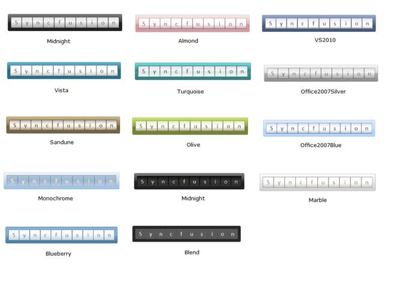

::: {style="DISPLAY: none"}
{#d2h_url_template}{#d2h_package_url style="WIDTH: 0px; DISPLAY: none; HEIGHT: 0px"}
:::

:::: {.d2h_secondary_topic style="PADDING-BOTTOM: 10pt; MARGIN: 0pt; PADDING-LEFT: 0pt; PADDING-RIGHT: 0pt; PADDING-TOP: 0pt"}
##### Skins {#skins style="tab-stops: 0pt"}

 

Gauge MVC now comes with fourteen stunning skins for better and professional representation of gauges. You can now easily modify the look and feel of the gauge component by using the built-in visual styles color schemes.

[]{style="FONT-FAMILY: 'Calibri','sans-serif'"} 

 

::: {align="center"}
+-------------+-------------------------------+-----------------------------+-------------------------------------------------------+--------------------------------------------------+
| Property    | Description                   | Type of Property            | Value It Accepts                                      | Any other dependencies/Sub properties associated |
+-------------+-------------------------------+-----------------------------+-------------------------------------------------------+--------------------------------------------------+
| GaugeSkins  | Sets the Skins for the Gauge. | [enum]{style="COLOR: blue"} | [GaugeSkins]{style="COLOR: #2b91af"}.Almond           | NA                                               |
|             |                               |                             |                                                       |                                                  |
|             |                               |                             |                                                       |                                                  |
|             |                               |                             |                                                       |                                                  |
|             |                               |                             | [GaugeSkins]{style="COLOR: #2b91af"}.Blueberry        |                                                  |
|             |                               |                             |                                                       |                                                  |
|             |                               |                             |                                                       |                                                  |
|             |                               |                             |                                                       |                                                  |
|             |                               |                             | [GaugeSkins]{style="COLOR: #2b91af"}.Monochrome       |                                                  |
|             |                               |                             |                                                       |                                                  |
|             |                               |                             |                                                       |                                                  |
|             |                               |                             |                                                       |                                                  |
|             |                               |                             | [GaugeSkins]{style="COLOR: #2b91af"}.VS2010           |                                                  |
|             |                               |                             |                                                       |                                                  |
|             |                               |                             |                                                       |                                                  |
|             |                               |                             |                                                       |                                                  |
|             |                               |                             | [GaugeSkins]{style="COLOR: #2b91af"}.Office2007Blue   |                                                  |
|             |                               |                             |                                                       |                                                  |
|             |                               |                             |                                                       |                                                  |
|             |                               |                             |                                                       |                                                  |
|             |                               |                             | [GaugeSkins]{style="COLOR: #2b91af"}.Office2007Black  |                                                  |
|             |                               |                             |                                                       |                                                  |
|             |                               |                             |                                                       |                                                  |
|             |                               |                             |                                                       |                                                  |
|             |                               |                             | [GaugeSkins]{style="COLOR: #2b91af"}.Blend            |                                                  |
|             |                               |                             |                                                       |                                                  |
|             |                               |                             |                                                       |                                                  |
|             |                               |                             |                                                       |                                                  |
|             |                               |                             | [GaugeSkins]{style="COLOR: #2b91af"}.Midnight         |                                                  |
|             |                               |                             |                                                       |                                                  |
|             |                               |                             |                                                       |                                                  |
|             |                               |                             |                                                       |                                                  |
|             |                               |                             | [GaugeSkins]{style="COLOR: #2b91af"}.Marble           |                                                  |
|             |                               |                             |                                                       |                                                  |
|             |                               |                             |                                                       |                                                  |
|             |                               |                             |                                                       |                                                  |
|             |                               |                             | [GaugeSkins]{style="COLOR: #2b91af"}.Office2007Silver |                                                  |
|             |                               |                             |                                                       |                                                  |
|             |                               |                             |                                                       |                                                  |
|             |                               |                             |                                                       |                                                  |
|             |                               |                             | [GaugeSkins]{style="COLOR: #2b91af"}.Sandune          |                                                  |
|             |                               |                             |                                                       |                                                  |
|             |                               |                             |                                                       |                                                  |
|             |                               |                             |                                                       |                                                  |
|             |                               |                             | [GaugeSkins]{style="COLOR: #2b91af"}.Olive            |                                                  |
|             |                               |                             |                                                       |                                                  |
|             |                               |                             |                                                       |                                                  |
|             |                               |                             |                                                       |                                                  |
|             |                               |                             | [GaugeSkins]{style="COLOR: #2b91af"}.Vista            |                                                  |
|             |                               |                             |                                                       |                                                  |
|             |                               |                             |                                                       |                                                  |
|             |                               |                             |                                                       |                                                  |
|             |                               |                             | [GaugeSkins]{style="COLOR: #2b91af"}.Turquoise        |                                                  |
|             |                               |                             |                                                       |                                                  |
|             |                               |                             |                                                       |                                                  |
|             |                               |                             |                                                       |                                                  |
|             |                               |                             | [GaugeSkins]{style="COLOR: #2b91af"}.Default          |                                                  |
+-------------+-------------------------------+-----------------------------+-------------------------------------------------------+--------------------------------------------------+
:::

[]{style="FONT-FAMILY: 'Calibri','sans-serif'"} 

###### 5.4.3.1.1.1 Through View Customization {#through-view-customization style="tab-stops: 0pt"}

**[]{style="FONT-FAMILY: 'Calibri','sans-serif'"}** 

Step 1:

View:

Add the below code in your aspx file.

The skins for the Rolling Gauge can be set by using its **GaugeSkins** property.

 

+----------------------------------------------------------------------------------------------------------------------------------------------------------------------------------------------------------------------------+
| [View\[ASPX\]]{style="FONT-FAMILY: 'Courier New'"}                                                                                                                                                                         |
|                                                                                                                                                                                                                            |
| [\<%]{style="FONT-FAMILY: 'Courier New'; BACKGROUND: yellow"}[=]{style="FONT-FAMILY: 'Courier New'; COLOR: blue"}[Html.Syncfusion().RollingGauge([\"Gauge\"]{style="COLOR: #a31515"})]{style="FONT-FAMILY: 'Courier New'"} |
|                                                                                                                                                                                                                            |
| [         .Height(65)]{style="FONT-FAMILY: 'Courier New'"}                                                                                                                                                                 |
|                                                                                                                                                                                                                            |
| [         .Width(460)]{style="FONT-FAMILY: 'Courier New'"}                                                                                                                                                                 |
|                                                                                                                                                                                                                            |
| [         .SegmentCount(5)]{style="FONT-FAMILY: 'Courier New'"}                                                                                                                                                            |
|                                                                                                                                                                                                                            |
| [         .Value([\"Gauge\"]{style="COLOR: #a31515"})]{style="FONT-FAMILY: 'Courier New'"}                                                                                                                                 |
|                                                                                                                                                                                                                            |
| [         .FontSize(30)]{style="FONT-FAMILY: 'Courier New'"}                                                                                                                                                               |
|                                                                                                                                                                                                                            |
| [         .SpaceBetWeenSegment(2)]{style="FONT-FAMILY: 'Courier New'"}                                                                                                                                                     |
|                                                                                                                                                                                                                            |
| []{style="FONT-FAMILY: 'Courier New'"}                                                                                                                                                                                     |
|                                                                                                                                                                                                                            |
| [         //Setting skins for the Rolling Gauge.]{style="FONT-FAMILY: 'Courier New'; COLOR: green"}[]{style="FONT-FAMILY: 'Courier New'"}                                                                                  |
|                                                                                                                                                                                                                            |
| [         **.GaugeSkins([GaugeSkins]{style="COLOR: #2b91af"}. Midnight)**]{style="FONT-FAMILY: 'Courier New'"}                                                                                                             |
|                                                                                                                                                                                                                            |
| [    [%\>]{style="BACKGROUND: yellow"}]{style="FONT-FAMILY: 'Courier New'"}                                                                                                                                                |
+----------------------------------------------------------------------------------------------------------------------------------------------------------------------------------------------------------------------------+

[]{style="FONT-FAMILY: 'Calibri','sans-serif'"} 

 

+-------------------------------------------------------------------------------------------------------------------------------------------------------------------------+
| [View\[cshtml\]]{style="FONT-FAMILY: 'Courier New'"}                                                                                                                    |
|                                                                                                                                                                         |
| [\@{]{style="FONT-FAMILY: 'Courier New'; BACKGROUND: yellow"}[ Html.Syncfusion().RollingGauge([\"Gauge\"]{style="COLOR: #a31515"})]{style="FONT-FAMILY: 'Courier New'"} |
|                                                                                                                                                                         |
| [         .Height(65)]{style="FONT-FAMILY: 'Courier New'"}                                                                                                              |
|                                                                                                                                                                         |
| [         .Width(460)]{style="FONT-FAMILY: 'Courier New'"}                                                                                                              |
|                                                                                                                                                                         |
| [         .SegmentCount(5)]{style="FONT-FAMILY: 'Courier New'"}                                                                                                         |
|                                                                                                                                                                         |
| [         .Value([\"Gauge\"]{style="COLOR: #a31515"})]{style="FONT-FAMILY: 'Courier New'"}                                                                              |
|                                                                                                                                                                         |
| [         .FontSize(30)]{style="FONT-FAMILY: 'Courier New'"}                                                                                                            |
|                                                                                                                                                                         |
| [         .SpaceBetWeenSegment(2)]{style="FONT-FAMILY: 'Courier New'"}                                                                                                  |
|                                                                                                                                                                         |
| []{style="FONT-FAMILY: 'Courier New'"}                                                                                                                                  |
|                                                                                                                                                                         |
| [         //Setting skins for the Rolling Gauge.]{style="FONT-FAMILY: 'Courier New'; COLOR: green"}[]{style="FONT-FAMILY: 'Courier New'"}                               |
|                                                                                                                                                                         |
| [         **.GaugeSkins([GaugeSkins]{style="COLOR: #2b91af"}. Midnight).**Render();]{style="FONT-FAMILY: 'Courier New'"}                                                |
|                                                                                                                                                                         |
| [    [}]{style="BACKGROUND: yellow"}]{style="FONT-FAMILY: 'Courier New'"}                                                                                               |
+-------------------------------------------------------------------------------------------------------------------------------------------------------------------------+

[]{style="FONT-FAMILY: 'Calibri','sans-serif'"} 

Step 2:

Controller:

Add the below code in your controller.

 

+----------------------------------------------------------------------------------------------------------------------------+
| []{style="FONT-FAMILY: 'Courier New'"}                                                                                     |
|                                                                                                                            |
| [        [public]{style="COLOR: blue"} [ActionResult]{style="COLOR: #2b91af"} Index()]{style="FONT-FAMILY: 'Courier New'"} |
|                                                                                                                            |
| [        {]{style="FONT-FAMILY: 'Courier New'"}                                                                            |
|                                                                                                                            |
| [            [return]{style="COLOR: blue"} View();]{style="FONT-FAMILY: 'Courier New'"}                                    |
|                                                                                                                            |
| [        }]{style="FONT-FAMILY: 'Courier New'"}                                                                            |
+----------------------------------------------------------------------------------------------------------------------------+

[]{style="FONT-FAMILY: 'Calibri','sans-serif'"} 

Step 3:

Run the Code. You will get the below output.

 

{border="0"}

Figure 142: Rolling Gauge with Midnight Skin**[]{style="FONT-FAMILY: 'Calibri','sans-serif'"}**

[                               ]{style="FONT-FAMILY: 'Calibri','sans-serif'"}

###### 5.4.3.1.1.2 Through RollingGaugeModel {#through-rollinggaugemodel style="tab-stops: 0pt"}

**[]{style="FONT-FAMILY: 'Calibri','sans-serif'"}** 

View:

Step 1:

Add the below code in your aspx file.

 

+-------------------------------------------------------------------------------------------------------------------------------------------------------------------------------------------------------------------------------------------------------------------------------------------------------+
| [View\[ASPX\]  ]{style="FONT-FAMILY: 'Courier New'"}                                                                                                                                                                                                                                                  |
|                                                                                                                                                                                                                                                                                                       |
| [\<%]{style="FONT-FAMILY: 'Courier New'; BACKGROUND: yellow"}[=]{style="FONT-FAMILY: 'Courier New'; COLOR: blue"}[Html.Syncfusion().RollingGauge([\"Gauge\"]{style="COLOR: #a31515"}, [\"GaugeModel\"]{style="COLOR: #a31515"})[%\>]{style="BACKGROUND: yellow"}]{style="FONT-FAMILY: 'Courier New'"} |
+-------------------------------------------------------------------------------------------------------------------------------------------------------------------------------------------------------------------------------------------------------------------------------------------------------+

 

+----------------------------------------------------------------------------------------------------------------------------------------------------------------------------------------------------------------------------------------------------------------------------------------------------+
| [View\[cshtml\]  ]{style="FONT-FAMILY: 'Courier New'"}                                                                                                                                                                                                                                             |
|                                                                                                                                                                                                                                                                                                    |
| [@]{style="FONT-FAMILY: Consolas; BACKGROUND: yellow; FONT-SIZE: 9.5pt"}[Html.Syncfusion().RollingGauge([\"Gauge\"]{style="COLOR: #a31515"}, [\"GaugeModel\"]{style="COLOR: #a31515"})]{style="FONT-FAMILY: 'Courier New'"}[]{style="FONT-FAMILY: Consolas; BACKGROUND: yellow; FONT-SIZE: 9.5pt"} |
|                                                                                                                                                                                                                                                                                                    |
| []{style="FONT-FAMILY: 'Courier New'"}                                                                                                                                                                                                                                                             |
+----------------------------------------------------------------------------------------------------------------------------------------------------------------------------------------------------------------------------------------------------------------------------------------------------+

**[]{style="FONT-FAMILY: 'Calibri','sans-serif'"}** 

Step 2:

Controller:

Add the below code in the controller. The skins for the Rolling Gauge can be set by using its **GaugeSkins** property.

 

+-----------------------------------------------------------------------------------------------------------------------------------------------------------------------------------+
| []{style="FONT-FAMILY: 'Courier New'"}                                                                                                                                            |
|                                                                                                                                                                                   |
| [public]{style="FONT-FAMILY: 'Courier New'; COLOR: blue"}[ [ActionResult]{style="COLOR: #2b91af"} Index()]{style="FONT-FAMILY: 'Courier New'"}                                    |
|                                                                                                                                                                                   |
| [        {]{style="FONT-FAMILY: 'Courier New'"}                                                                                                                                   |
|                                                                                                                                                                                   |
| [            [RollingGaugeModel]{style="COLOR: #2b91af"} r_Gauge = [new]{style="COLOR: blue"} [RollingGaugeModel]{style="COLOR: #2b91af"}();]{style="FONT-FAMILY: 'Courier New'"} |
|                                                                                                                                                                                   |
| [            r_Gauge.Height = 65;]{style="FONT-FAMILY: 'Courier New'"}                                                                                                            |
|                                                                                                                                                                                   |
| [            r_Gauge.Width = 460;]{style="FONT-FAMILY: 'Courier New'"}                                                                                                            |
|                                                                                                                                                                                   |
| [            r_Gauge.SegmentCount = 5;]{style="FONT-FAMILY: 'Courier New'"}                                                                                                       |
|                                                                                                                                                                                   |
| [            r_Gauge.Value = [\"Gauge\"]{style="COLOR: #a31515"};]{style="FONT-FAMILY: 'Courier New'"}                                                                            |
|                                                                                                                                                                                   |
| [            r_Gauge.FontSize = 30;]{style="FONT-FAMILY: 'Courier New'"}                                                                                                          |
|                                                                                                                                                                                   |
| [            r_Gauge.SpaceBetWeenSegment = 2;]{style="FONT-FAMILY: 'Courier New'"}                                                                                                |
|                                                                                                                                                                                   |
| []{style="FONT-FAMILY: 'Courier New'"}                                                                                                                                            |
|                                                                                                                                                                                   |
| [    //Setting skins for the Rolling Gauge.]{style="FONT-FAMILY: 'Courier New'; COLOR: green"}[]{style="FONT-FAMILY: 'Courier New'"}                                              |
|                                                                                                                                                                                   |
| [            **r_Gauge.GaugeSkins = [GaugeSkins]{style="COLOR: #2b91af"}.Midnight;**]{style="FONT-FAMILY: 'Courier New'"}                                                         |
|                                                                                                                                                                                   |
| []{style="FONT-FAMILY: 'Courier New'"}                                                                                                                                            |
|                                                                                                                                                                                   |
| [            ViewData\[[\"GaugeModel\"]{style="COLOR: #a31515"}\] = r_Gauge;]{style="FONT-FAMILY: 'Courier New'"}                                                                 |
|                                                                                                                                                                                   |
| [            [return]{style="COLOR: blue"} View();]{style="FONT-FAMILY: 'Courier New'"}                                                                                           |
|                                                                                                                                                                                   |
| [        }]{style="FONT-FAMILY: 'Courier New'"}                                                                                                                                   |
|                                                                                                                                                                                   |
| []{style="FONT-FAMILY: 'Courier New'"}                                                                                                                                            |
|                                                                                                                                                                                   |
| [    }]{style="FONT-FAMILY: 'Courier New'"}                                                                                                                                       |
|                                                                                                                                                                                   |
| [}]{style="FONT-FAMILY: 'Courier New'"}                                                                                                                                           |
+-----------------------------------------------------------------------------------------------------------------------------------------------------------------------------------+

[]{style="FONT-FAMILY: 'Calibri','sans-serif'"} 

Step 3:

Run the Code. You will get the following output.

 

{border="0"}

Figure 143: Rolling Gauge with Midnight Skin**[]{style="FONT-FAMILY: 'Calibri','sans-serif'"}**

[                                 ]{style="FONT-FAMILY: 'Calibri','sans-serif'"}

The following are the skins available:

**[]{style="FONT-FAMILY: 'Calibri','sans-serif'"}** 

{border="0"}

Figure 144:Rolling Gauge-Skins

[]{style="FONT-FAMILY: 'Calibri','sans-serif'"} 

[]{#related-topics}
::::
