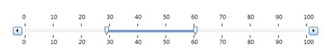
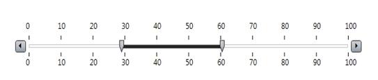
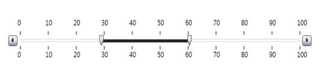
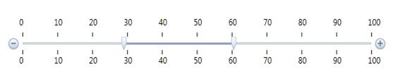
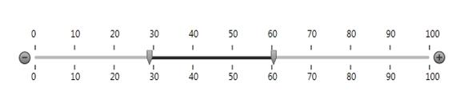
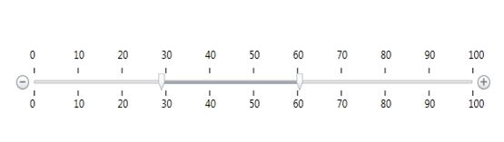
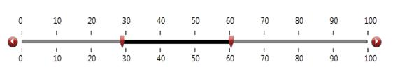
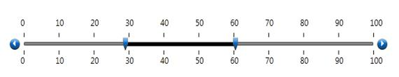
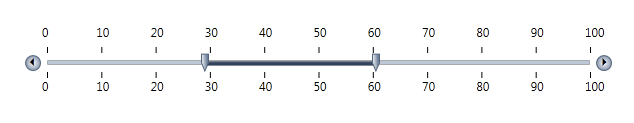
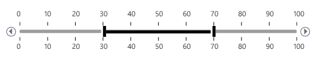

::: {style="DISPLAY: none"}
{#d2h_url_template}{#d2h_package_url style="WIDTH: 0px; DISPLAY: none; HEIGHT: 0px"}
:::

::::: {#nsbanner .d2h_main_nsbanner style="BORDER-BOTTOM: #999999 1px solid; POSITION: relative; PADDING-BOTTOM: 0px; BACKGROUND-COLOR: transparent; PADDING-LEFT: 0px; PADDING-RIGHT: 0px; DISPLAY: none; BORDER-TOP: #999999 1px solid; PADDING-TOP: 0px; LEFT: 0px"}
:::: {#TitleRow .d2h_main_titlerow style="PADDING-BOTTOM: 4px; BACKGROUND-COLOR: transparent; PADDING-LEFT: 22px; WIDTH: 100%; PADDING-RIGHT: 10px; DISPLAY: none; PADDING-TOP: 4px"}
::: {#ienav .d2h_main_ienav style="DISPLAY: none"}
{#D2HPrevious .D2HPreviousEnabled}  {#D2HNext .D2HNextEnabled}
:::
::::
:::::

:::: {#nstext .d2h_main_nstext style="PADDING-BOTTOM: 10px; BACKGROUND-COLOR: transparent; PADDING-LEFT: 22px; PADDING-RIGHT: 10px; HEIGHT: 100%; OVERFLOW: auto; PADDING-TOP: 5px" hasuserbackground="true" valign="bottom"}
::: {#d2h_breadcrumbs .d2h_breadcrumbs}
[Essential Studio User Guide Documentation](ms-xhelp:///?Id=12457748-09e3-4d74-a240-8e049cedf030){.d2h_breadcrumbsNormal}[ \> ]{.d2h_breadcrumbsLinkSeparator}[User Interface Edition](ms-xhelp:///?Id=c29296b7-531c-413b-a0ec-488ca1f7f669){.d2h_breadcrumbsNormal}[ \> ]{.d2h_breadcrumbsLinkSeparator}[Essential WPF](ms-xhelp:///?Id=7f4f82c5-151c-4262-94d0-75c4626c77bc){.d2h_breadcrumbsNormal}[ \> ]{.d2h_breadcrumbsLinkSeparator}[Essential Tools]{.d2h_breadcrumbsContentsOnly}[ \> ]{.d2h_breadcrumbsLinkSeparator}[Tools WPF Controls](ms-xhelp:///?Id=2ea58a12-9426-4a63-96b4-89eb80232c2c){.d2h_breadcrumbsNormal}[ \> ]{.d2h_breadcrumbsLinkSeparator}[Range Slider](ms-xhelp:///?Id=b3879d21-4558-4069-bd3c-9889882ea26a){.d2h_breadcrumbsNormal}
:::

### Skins Supported {#skins-supported style="tab-stops: 0pt"}

The Range Slider Control supports the following Skins.

[]{style="FONT-FAMILY: 'Trebuchet MS','sans-serif'; COLOR: #15428b"} 

[·      ]{style="FONT-FAMILY: Symbol"}Office2007Blue

[·      ]{style="FONT-FAMILY: Symbol"}Office2007Black

[·      ]{style="FONT-FAMILY: Symbol"}Office2007Silver

[·      ]{style="FONT-FAMILY: Symbol"}Office2010Blue

[·      ]{style="FONT-FAMILY: Symbol"}Office2010Black

[·      ]{style="FONT-FAMILY: Symbol"}Office2010Silver

[·      ]{style="FONT-FAMILY: Symbol"}Blend

[·      ]{style="FONT-FAMILY: Symbol"}Shiny Red

[·      ]{style="FONT-FAMILY: Symbol"}Shiny Blue

[·      ]{style="FONT-FAMILY: Symbol"}VS2010

[·      ]{style="FONT-FAMILY: Symbol"}Metro

**[]{style="FONT-FAMILY: 'Trebuchet MS','sans-serif'; COLOR: #15428b"}** 

Use Case Scenario

This feature helps users to apply skins for the Range Slider Control. The Supported Skins are listed in

Section 1.1

[]{style="FONT-FAMILY: 'Trebuchet MS','sans-serif'; COLOR: #15428b"} 

Samples Link

  To run the Range Slider sample:

[]{style="FONT-FAMILY: 'Trebuchet MS','sans-serif'; COLOR: #15428b"} 

[·      ]{style="FONT-FAMILY: Symbol"}Open Essential Studio Dashboard.

[·      ]{style="FONT-FAMILY: Symbol"}Click Run locally installed samples from the WPF drop-down list.

[·      ]{style="FONT-FAMILY: Symbol"}Select Tools on the sample browser.

[·      ]{style="FONT-FAMILY: Symbol"}Select Range Slider -\> Range Slider Demo and click the Run Sample button.

**[]{style="FONT-FAMILY: 'Trebuchet MS','sans-serif'; COLOR: #15428b"}** 

How to Apply the Skin

You can apply the skin for the Range Slider control in code behind using the below code snippet.

For more details refer, to [[SkinManager]{style="COLOR: windowtext; TEXT-DECORATION: none; text-underline: none"}](http://help.syncfusion.com/ug_84/User%20Interface/WPF/Tools/default.htm?turl=builtinskins1.htm) .

[]{style="FONT-FAMILY: 'Trebuchet MS','sans-serif'; COLOR: #15428b"} 

+--------------------------------------------------------------------------------------------------------------------------------------------------------------------------------------------------------------------------------------------------------------------------------+
| **[\[C#\]]{style="FONT-FAMILY: 'Courier New'"}**                                                                                                                                                                                                                               |
|                                                                                                                                                                                                                                                                                |
| [RangeSliderControl]{style="FONT-FAMILY: 'Courier New'; COLOR: #2b91af"}[ RangeSlider = [new]{style="COLOR: blue"} [RangeSliderControl]{style="COLOR: #2b91af"}();]{style="FONT-FAMILY: 'Courier New'"}                                                                        |
|                                                                                                                                                                                                                                                                                |
| [RangeSlider.Name = [\"rangeSlider\"]{style="COLOR: #a31515"};]{style="FONT-FAMILY: 'Courier New'"}                                                                                                                                                                            |
|                                                                                                                                                                                                                                                                                |
| [SkinStorage]{style="FONT-FAMILY: 'Courier New'; COLOR: #2b91af"}[.SetVisualStyle([rangeSlider]{style="COLOR: #a31515"}, ]{style="FONT-FAMILY: 'Courier New'"}[\"Office2007Blue\"]{style="FONT-FAMILY: 'Courier New'; COLOR: #a31515"}[);]{style="FONT-FAMILY: 'Courier New'"} |
+--------------------------------------------------------------------------------------------------------------------------------------------------------------------------------------------------------------------------------------------------------------------------------+

 

 You can apply the skin in XAML using the code snippet shown below.

 

+---------------------------------------------------------------------------------------------------------------------------------------------------------------------------------------------------------------------------------------------------------------------------------------------------------------------------------------------------------------------------------------------------------------------------------------------------------------------------------------------------------------------------------------------------------------------------------------------------------------------------------------------------------------------------------------------------------------------------------------------------------------------------------------------------------------------------------------------------------------------------------------------------------------------------------------------------------------------------------------------------------------------------------------------------------------------------------------------------+
| **[\[XAML\]]{style="FONT-FAMILY: 'Courier New'; COLOR: black"}**[]{style="FONT-FAMILY: 'Courier New'"}                                                                                                                                                                                                                                                                                                                                                                                                                                                                                                                                                                                                                                                                                                                                                                                                                                                                                                                                                                                            |
|                                                                                                                                                                                                                                                                                                                                                                                                                                                                                                                                                                                                                                                                                                                                                                                                                                                                                                                                                                                                                                                                                                   |
| [ ]{style="FONT-FAMILY: 'Courier New'; COLOR: #2b91af"}[\<]{style="FONT-FAMILY: 'Courier New'; COLOR: blue"}[Syncfusion]{style="FONT-FAMILY: 'Courier New'; COLOR: #a31515"}[:]{style="FONT-FAMILY: 'Courier New'; COLOR: blue"}[RangeSliderControl]{style="FONT-FAMILY: 'Courier New'; COLOR: #a31515"}[ x]{style="FONT-FAMILY: 'Courier New'; COLOR: red"}[:]{style="FONT-FAMILY: 'Courier New'; COLOR: blue"}[Name]{style="FONT-FAMILY: 'Courier New'; COLOR: red"}[=\"rangeSlider\" ]{style="FONT-FAMILY: 'Courier New'; COLOR: blue"}[Range]{style="FONT-FAMILY: 'Courier New'; COLOR: red"}[=\"10,50\" ]{style="FONT-FAMILY: 'Courier New'; COLOR: blue"}[TickFrequency]{style="FONT-FAMILY: 'Courier New'; COLOR: red"}[=\"10\" ]{style="FONT-FAMILY: 'Courier New'; COLOR: blue"}[Syncfusion]{style="FONT-FAMILY: 'Courier New'; COLOR: red"}[:]{style="FONT-FAMILY: 'Courier New'; COLOR: blue"}[SkinStorage.VisualStyle]{style="FONT-FAMILY: 'Courier New'; COLOR: red"}[=\"Office2007Blue\"/\>]{style="FONT-FAMILY: 'Courier New'; COLOR: blue"}[]{style="FONT-FAMILY: 'Courier New'"} |
+---------------------------------------------------------------------------------------------------------------------------------------------------------------------------------------------------------------------------------------------------------------------------------------------------------------------------------------------------------------------------------------------------------------------------------------------------------------------------------------------------------------------------------------------------------------------------------------------------------------------------------------------------------------------------------------------------------------------------------------------------------------------------------------------------------------------------------------------------------------------------------------------------------------------------------------------------------------------------------------------------------------------------------------------------------------------------------------------------+

 

Output for the above code snippet is shown below.

 

{border="0"}

*[]{style="FONT-SIZE: 9pt"}* 

*[Figure ]{style="FONT-SIZE: 9pt"}[939]{style="FONT-SIZE: 9pt"}[: Office 2007Blue Theme for RangeSlidercontrol]{style="FONT-SIZE: 9pt"}*

 

Various Themes for RangeSlider control are shown below.

 

{border="0"}*[]{style="FONT-SIZE: 9pt"}*

*[]{style="FONT-SIZE: 9pt"}* 

*[Figure ]{style="FONT-SIZE: 9pt"}[940]{style="FONT-SIZE: 9pt"}[: Office2007Black Theme for RangeSlider Control]{style="FONT-SIZE: 9pt"}*

*[]{style="FONT-SIZE: 9pt"}* 

*[]{style="FONT-SIZE: 9pt"}* 

{border="0"}

 

*[Figure ]{style="FONT-SIZE: 9pt"}[941]{style="FONT-SIZE: 9pt"}[: Office2007Silver Theme for RangeSlider Control]{style="FONT-SIZE: 9pt"}*

 

 

{border="0"}

 

*[Figure ]{style="FONT-SIZE: 9pt"}[942]{style="FONT-SIZE: 9pt"}[: Office2010Blue Theme for RangeSlider Control]{style="FONT-SIZE: 9pt"}*

[]{style="FONT-SIZE: 9pt"} 

[]{style="FONT-SIZE: 9pt"} 

 

{border="0"}

*[]{style="FONT-SIZE: 9pt"}* 

*[Figure ]{style="FONT-SIZE: 9pt"}[943]{style="FONT-SIZE: 9pt"}[: Office2010Black Theme for RangeSlider Control]{style="FONT-SIZE: 9pt"}*

*[]{style="FONT-SIZE: 9pt"}* 

*[]{style="FONT-SIZE: 9pt"}* 

{border="0"}

*[]{style="FONT-SIZE: 9pt"}* 

*[Figure ]{style="FONT-SIZE: 9pt"}[944]{style="FONT-SIZE: 9pt"}[: Office2010Silver Theme for RangeSlider Control]{style="FONT-SIZE: 9pt"}*

[]{style="FONT-SIZE: 9pt"} 

[]{style="FONT-SIZE: 9pt"} 

      {border="0"}

 

*[Figure ]{style="FONT-SIZE: 9pt"}[945]{style="FONT-SIZE: 9pt"}[: Blend Theme for RangeSlider Control]{style="FONT-SIZE: 9pt"}*

[]{style="FONT-SIZE: 9pt"} 

[]{style="FONT-SIZE: 9pt"} 

{border="0"}

*[Figure ]{style="FONT-SIZE: 9pt"}[946]{style="FONT-SIZE: 9pt"}[: ShinyRed Theme for RangeSlider Control]{style="FONT-SIZE: 9pt"}*

[]{style="FONT-SIZE: 9pt"} 

{border="0"}

*[Figure ]{style="FONT-SIZE: 9pt"}[947]{style="FONT-SIZE: 9pt"}[: ShinyBlue Theme for RangeSlider Control]{style="FONT-SIZE: 9pt"}*

 

{border="0"}*[]{style="FONT-SIZE: 9pt"}*

*[Figure ]{style="FONT-SIZE: 9pt"}[948]{style="FONT-SIZE: 9pt"}[: VS2010 Theme for RangeSlider Control]{style="FONT-SIZE: 9pt"}*

*[]{style="FONT-SIZE: 9pt"}* 

{hspace="12" align="left"}*[]{style="FONT-SIZE: 9pt"}*

 

 

 

*[Figure ]{style="FONT-SIZE: 9pt"}[949]{style="FONT-SIZE: 9pt"}[: Metro Theme for RangeSlider Control]{style="FONT-SIZE: 9pt"}*

 

[]{#related-topics}
::::
