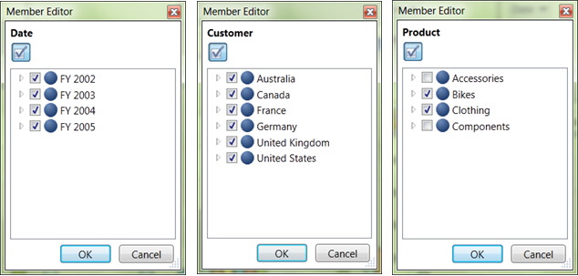

::: {style="DISPLAY: none"}
{#d2h_url_template} {#d2h_package_url style="WIDTH: 0px; DISPLAY: none; HEIGHT: 0px"}
:::

::: {.d2h_secondary_topic style="PADDING-BOTTOM: 10pt; MARGIN: 0pt; PADDING-LEFT: 0pt; PADDING-RIGHT: 0pt; PADDING-TOP: 0pt"}
##### Slice {#slice style="tab-stops: 0pt"}

 

You can use a dimension for slicing when it isn't being displayed on the columns or rows. You can slice on any member from any level of the dimension. If you slice on the member January in the Month level of the Time dimension, you will only see data from January.

The following sample will illustrate how we can perform slice and dice operation using member editor.

The sample report is having three dimensions namely Date, Customer and Product. Date was placed in Column, Customer Dimension was in Row and Product was placed in Slicer axis.

 

[·      ]{style="FONT-FAMILY: Symbol"}All the nodes of Date (FY2002, FY2003, FY2004, FY2005) are checked.

[·      ]{style="FONT-FAMILY: Symbol"}All the nodes of Customer Region (Australia, Canada, France, Germany, United Kingdom, United States) are checked

[·      ]{style="FONT-FAMILY: Symbol"}Product Dimension was placed in Slice in axis and it was sliced by unchecking the nodes Accessories and Components.

 

Volume of sales of products like Bikes and Clothing in all regions for four years will be reflect in the result.

 

{border="0"} []{style="FONT-FAMILY: 'Calibri','sans-serif'"}

Figure 39: Slicing dimension Using Member Editor

[]{style="FONT-FAMILY: 'Calibri','sans-serif'"} 

[]{#related-topics}
:::
