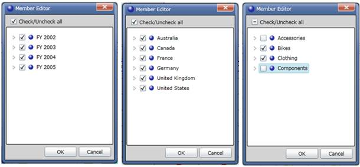
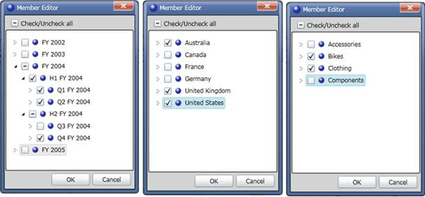

::: {style="DISPLAY: none"}
{#d2h_url_template}{#d2h_package_url style="WIDTH: 0px; DISPLAY: none; HEIGHT: 0px"}
:::

::::: {#nsbanner .d2h_main_nsbanner style="BORDER-BOTTOM: #999999 1px solid; POSITION: relative; PADDING-BOTTOM: 0px; BACKGROUND-COLOR: transparent; PADDING-LEFT: 0px; PADDING-RIGHT: 0px; DISPLAY: none; BORDER-TOP: #999999 1px solid; PADDING-TOP: 0px; LEFT: 0px"}
:::: {#TitleRow .d2h_main_titlerow style="PADDING-BOTTOM: 4px; BACKGROUND-COLOR: transparent; PADDING-LEFT: 22px; WIDTH: 100%; PADDING-RIGHT: 10px; DISPLAY: none; PADDING-TOP: 4px"}
::: {#ienav .d2h_main_ienav style="DISPLAY: none"}
{#D2HPrevious .D2HPreviousEnabled}  {#D2HNext .D2HNextEnabled}
:::
::::
:::::

:::: {#nstext .d2h_main_nstext style="PADDING-BOTTOM: 10px; BACKGROUND-COLOR: transparent; PADDING-LEFT: 22px; PADDING-RIGHT: 10px; HEIGHT: 100%; OVERFLOW: auto; PADDING-TOP: 5px" hasuserbackground="true" valign="bottom"}
::: {#d2h_breadcrumbs .d2h_breadcrumbs}
[Essential Studio User Guide Documentation](ms-xhelp:///?Id=12457748-09e3-4d74-a240-8e049cedf030){.d2h_breadcrumbsNormal}[ \> ]{.d2h_breadcrumbsLinkSeparator}[Business Intelligence Edition](ms-xhelp:///?Id=fdf33dd8-62b2-47b9-ad7b-fc50e590bca5){.d2h_breadcrumbsNormal}[ \> ]{.d2h_breadcrumbsLinkSeparator}[Essential BI Silverlight](ms-xhelp:///?Id=c006b39c-6aa2-4637-b7de-3e7b6cb3f9f9){.d2h_breadcrumbsNormal}[ \> ]{.d2h_breadcrumbsLinkSeparator}[Essential BI Client]{.d2h_breadcrumbsContentsOnly}[ \> ]{.d2h_breadcrumbsLinkSeparator}[Features](ms-xhelp:///?Id=4ae10797-e3a8-4270-b8ba-34441d2e1a3d){.d2h_breadcrumbsNormal}
:::

## Slice and Dice {#slice-and-dice style="tab-stops: 0pt"}

(When you cut the data with one member it is called slicing. When you cut data with sets of members from two or more dimensions, it's called dicing.) A systematic reduction in the body of the data into smaller parts or views would yield more information.

Slice

If you place a dimension element in the Slicing field, then it will not display on Column or Row. You can slice any member from any level of the dimension. If you slice the member January in the Month level of the Time dimension, you will only see data from January.

The following sample will illustrate how to perform slice and dice operation using Member Editor.

The sample report has three dimensions namely Date, Customer and Product. Date was placed in Column, Customer Dimension was in Row and Product was placed in Slicer axis.

All the nodes of Date (FY2002, FY2003, FY2004, FY2005) are checked.

All the nodes of Customer Region (Australia, Canada, France, Germany, United Kingdom, United States) are checked.

Product Dimension was placed in Slice in axis and it was sliced by unchecking the nodes accessories and components.

Volume of sales of products such as bikes and clothing in all regions for four years will be reflected in the result.

 

{border="0"}

 

Figure 30: Slicing Dimension Using Member Editor

 

Dice

 You can put more than one dimension on the rows or on the columns. You will see one row for every combination of the members from each of the dimensions.

By unchecking and checking the selective nodes in a dimension and by placing the dimension in Slicer axis you can perform the slice operation.

By adding more than one dimension to a Column or Row axis and select a particular member by checking and unchecking the node in Member Editor, it becomes dice.

Consider the same report that was used in slice example. You can perform the dice operation in the following way:

 

Nodes Q1 FY2004, Q2 FY2004 and Q4 FY2004 are checked in Date dimension.

Nodes Australia, United Kingdom and United States are checked in Customer Dimension.

Nodes Bikes and Clothing are checked in Product.

Here, by selecting the particular member of the dimensions in the Column and Row axis, the dice operation was achieved.

Volume of sales of products such as bikes and clothing in Australia, United Kingdom and United States for the three Quarterlies of the year 2004 will be shown in the result.

 

{border="0"}

 

Figure 31: Dicing Dimensions using Memer Editor

 

Use Case Scenarios

The Slice and Dice feature helps users to view data by cutting it based on certain constraints from more than one dimension.

 

[]{#related-topics}
::::
