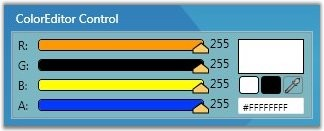

::: {style="DISPLAY: none"}
{#d2h_url_template}{#d2h_package_url style="WIDTH: 0px; DISPLAY: none; HEIGHT: 0px"}
:::

::: {.d2h_secondary_topic style="PADDING-BOTTOM: 10pt; MARGIN: 0pt; PADDING-LEFT: 0pt; PADDING-RIGHT: 0pt; PADDING-TOP: 0pt"}
#### Slider Background Color {#slider-background-color style="tab-stops: 0pt"}

The sliders available for the ColorEdit control are Alpha, Blue, Green and Red. The control provides options to customize the background of these sliders by using the respective background properties, i.e., BackgroundA, BackgroundB, BackgroundG, BackgroundR. These properties can be used to set the background for the Alpha, Blue, Green and Red sliders respectively.

 

+-------------------------------------------------------------------------------------------------------------------------------------------------------------------------------------------------------------------------------------------------------------------------------------------------------------------------------------------------------------------------------------------------------------------------------------------------------------------------------------------------------------------------------------------------------------------------------------------------------------------------------------------------------------------------------------------------------------------+
| **[\[XAML\]]{style="FONT-FAMILY: 'Courier New'; COLOR: black; FONT-SIZE: 9pt"}**                                                                                                                                                                                                                                                                                                                                                                                                                                                                                                                                                                                                                                  |
|                                                                                                                                                                                                                                                                                                                                                                                                                                                                                                                                                                                                                                                                                                                   |
| []{style="FONT-FAMILY: 'Courier New'; COLOR: blue; FONT-SIZE: 9pt"}                                                                                                                                                                                                                                                                                                                                                                                                                                                                                                                                                                                                                                               |
|                                                                                                                                                                                                                                                                                                                                                                                                                                                                                                                                                                                                                                                                                                                   |
| [\<]{style="FONT-FAMILY: 'Courier New'; COLOR: blue; FONT-SIZE: 9pt"}[Tools]{style="FONT-FAMILY: 'Courier New'; COLOR: #a31515; FONT-SIZE: 9pt"}[:]{style="FONT-FAMILY: 'Courier New'; COLOR: blue; FONT-SIZE: 9pt"}[ColorEdit]{style="FONT-FAMILY: 'Courier New'; COLOR: #a31515; FONT-SIZE: 9pt"}[ [Name]{style="COLOR: red"}[=\"myColorEditor\"]{style="COLOR: blue"} [BackgroundA]{style="COLOR: red"}[=\"DarkBlue\"]{style="COLOR: blue"} [BackgroundB]{style="COLOR: red"}[=\"Yellow\"]{style="COLOR: blue"} [BackgroundG]{style="COLOR: red"}[=\"Black\"]{style="COLOR: blue"} [BackgroundR]{style="COLOR: red"}[=\"Orange\"/\>]{style="COLOR: blue"}]{style="FONT-FAMILY: 'Courier New'; FONT-SIZE: 9pt"} |
+-------------------------------------------------------------------------------------------------------------------------------------------------------------------------------------------------------------------------------------------------------------------------------------------------------------------------------------------------------------------------------------------------------------------------------------------------------------------------------------------------------------------------------------------------------------------------------------------------------------------------------------------------------------------------------------------------------------------+

**[]{style="FONT-FAMILY: 'Trebuchet MS','sans-serif'; COLOR: #15428b; FONT-SIZE: 9pt"}** 

+-------------------------------------------------------------------------------------------------------------------------------+
| **[\[C#\]]{style="FONT-FAMILY: 'Courier New'; COLOR: black; FONT-SIZE: 9pt"}**                                                |
|                                                                                                                               |
| **[]{style="FONT-FAMILY: 'Courier New'; COLOR: black; FONT-SIZE: 9pt"}**                                                      |
|                                                                                                                               |
| [myColorEditor.BackgroundA = [Brushes]{style="COLOR: #2b91af"}.DarkBlue;]{style="FONT-FAMILY: 'Courier New'; FONT-SIZE: 9pt"} |
|                                                                                                                               |
| [myColorEditor.BackgroundB = [Brushes]{style="COLOR: #2b91af"}.Yellow;]{style="FONT-FAMILY: 'Courier New'; FONT-SIZE: 9pt"}   |
|                                                                                                                               |
| [myColorEditor.BackgroundG = [Brushes]{style="COLOR: #2b91af"}.Black;]{style="FONT-FAMILY: 'Courier New'; FONT-SIZE: 9pt"}    |
|                                                                                                                               |
| [myColorEditor.BackgroundR = [Brushes]{style="COLOR: #2b91af"}.Orange;]{style="FONT-FAMILY: 'Courier New'; FONT-SIZE: 9pt"}   |
+-------------------------------------------------------------------------------------------------------------------------------+

[]{style="FONT-FAMILY: 'Trebuchet MS','sans-serif'; COLOR: #15428b; FONT-SIZE: 9pt"} 

{border="0"}

Figure 175: BackgroundA = \"Blue\"; BackgroundB = \"Yellow\"; BackgroundG = \"Black\"; BackgroundR = \"Orange\"

 

[]{#p88} 

[]{#related-topics}
:::
