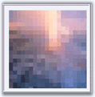
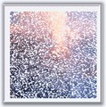

::: {style="DISPLAY: none"}
{#d2h_url_template}{#d2h_package_url style="WIDTH: 0px; DISPLAY: none; HEIGHT: 0px"}
:::

:::::: {.d2h_secondary_topic style="PADDING-BOTTOM: 10pt; MARGIN: 0pt; PADDING-LEFT: 0pt; PADDING-RIGHT: 0pt; PADDING-TOP: 0pt"}
##### Slideshow Effects {#slideshow-effects style="tab-stops: 0pt"}

[]{style="FONT-FAMILY: 'Trebuchet MS','sans-serif'; COLOR: #15428b; FONT-SIZE: 9pt"} 

The slide show can be created by setting **RotationType** to **SlideShow**. For the slide shows, transition effects can be applied when an item is shown or hidden by setting the **HideEffect** and **ShowEffect** properties to the style transition options.

[]{style="FONT-FAMILY: 'Trebuchet MS','sans-serif'; COLOR: #15428b; FONT-SIZE: 9pt"} 

::: {align="center"}
+-----------------------------------+-----------------------------------------------------------------------------------------------------------------------------------------------+
|                                   |                                                                                                                                               |
|                                   |                                                                                                                                               |
| Property                          | Description                                                                                                                                   |
+-----------------------------------+-----------------------------------------------------------------------------------------------------------------------------------------------+
| HideEffect                        | Specifies the transition slide effect to be used while hiding the slides. Default value is \'None\'. The options included are as follows:     |
|                                   |                                                                                                                                               |
|                                   | [·      ]{style="FONT-FAMILY: Symbol"}Fade                                                                                                    |
|                                   |                                                                                                                                               |
|                                   | [·      ]{style="FONT-FAMILY: Symbol"}Dissolve                                                                                                |
|                                   |                                                                                                                                               |
|                                   | [·      ]{style="FONT-FAMILY: Symbol"}GradientWipe                                                                                            |
|                                   |                                                                                                                                               |
|                                   | [·      ]{style="FONT-FAMILY: Symbol"}Pixelate                                                                                                |
+-----------------------------------+-----------------------------------------------------------------------------------------------------------------------------------------------+
| ShowEffect                        | Specifies the transition slide effect to be used while displaying the slides. Default value is \'None\'. The options included are as follows: |
|                                   |                                                                                                                                               |
|                                   | [·      ]{style="FONT-FAMILY: Symbol"}Fade                                                                                                    |
|                                   |                                                                                                                                               |
|                                   | [·      ]{style="FONT-FAMILY: Symbol"}Dissolve                                                                                                |
|                                   |                                                                                                                                               |
|                                   | [·      ]{style="FONT-FAMILY: Symbol"}GradientWipe                                                                                            |
|                                   |                                                                                                                                               |
|                                   | [·      ]{style="FONT-FAMILY: Symbol"}Pixelate                                                                                                |
+-----------------------------------+-----------------------------------------------------------------------------------------------------------------------------------------------+
:::

[]{style="FONT-FAMILY: 'Trebuchet MS','sans-serif'; COLOR: #15428b; FONT-SIZE: 9pt"} 

If we specify both **HideEffect** and **ShowEffect** properties as **None**, then the slides will be displayed one by one without any style transitions.

The time interval of hide effect and show effect can be specified using the **HideEffectDuration** and **ShowEffectDuration** properties. These two properties will accept the time interval as milliseconds. By default the duration will be set to **1000** **milliseconds**.

[]{style="FONT-FAMILY: 'Trebuchet MS','sans-serif'; COLOR: #15428b; FONT-SIZE: 9pt"} 

::: {align="center"}
  -------------------- ----------------------------------------
  Property             Description
  HideEffectDuration   Specifies the duration of hide effect.
  ShowEffectDuration   Specifies the duration of show effect.
  -------------------- ----------------------------------------
:::

[]{style="FONT-FAMILY: 'Trebuchet MS','sans-serif'; COLOR: #15428b; FONT-SIZE: 9pt"} 

The below screenshot displays the Pixelate and Dissolve slide effects when the image is shown and hidden respectively.

[]{style="FONT-FAMILY: 'Trebuchet MS','sans-serif'; COLOR: #15428b; FONT-SIZE: 9pt"} 

{border="0"}{border="0"}

**[]{style="COLOR: black; FONT-SIZE: 8pt"}** 

Figure 347: Pixelate             Figure 348: Dissolve

**[]{style="COLOR: black; FONT-SIZE: 8pt"}** 

These effects can be set programmatically as follows.

[]{style="FONT-FAMILY: 'Trebuchet MS','sans-serif'; COLOR: #15428b; FONT-SIZE: 9pt"} 

+------------------------------------------------------------------------------------------------------------------------------------------+
| **[\[C#\] ]{style="FONT-FAMILY: 'Courier New'; COLOR: black; FONT-SIZE: 9pt"}**                                                          |
|                                                                                                                                          |
| []{style="FONT-FAMILY: 'Courier New'; COLOR: blue; FONT-SIZE: 9pt"}                                                                      |
|                                                                                                                                          |
| [Rotator1.HideEffect=Syncfusion.Web.UI.WebControls.Tools.SlideShowEffects.Dissolve;]{style="FONT-FAMILY: 'Courier New'; FONT-SIZE: 9pt"} |
|                                                                                                                                          |
| [Rotator1.ShowEffect=Syncfusion.Web.UI.WebControls.Tools.SlideShowEffects.Pixelate;]{style="FONT-FAMILY: 'Courier New'; FONT-SIZE: 9pt"} |
+------------------------------------------------------------------------------------------------------------------------------------------+

[]{style="FONT-FAMILY: 'Courier New'; COLOR: blue"} 

+----------------------------------------------------------------------------------------------------------------------------------------------------------------------------------------------------------------------+
| **[\[VB\] ]{style="FONT-FAMILY: 'Courier New'; COLOR: black; FONT-SIZE: 9pt"}**                                                                                                                                      |
|                                                                                                                                                                                                                      |
| []{style="FONT-FAMILY: 'Courier New'; COLOR: blue; FONT-SIZE: 9pt"}                                                                                                                                                  |
|                                                                                                                                                                                                                      |
| [Private]{style="FONT-FAMILY: 'Courier New'; COLOR: blue; FONT-SIZE: 9pt"}[ Rotator1.HideEffect = Syncfusion.Web.UI.WebControls.Tools.SlideShowEffects.Dissolve]{style="FONT-FAMILY: 'Courier New'; FONT-SIZE: 9pt"} |
|                                                                                                                                                                                                                      |
| [Private]{style="FONT-FAMILY: 'Courier New'; COLOR: blue; FONT-SIZE: 9pt"}[ Rotator1.ShowEffect = Syncfusion.Web.UI.WebControls.Tools.SlideShowEffects.Pixelate]{style="FONT-FAMILY: 'Courier New'; FONT-SIZE: 9pt"} |
+----------------------------------------------------------------------------------------------------------------------------------------------------------------------------------------------------------------------+

[]{style="FONT-FAMILY: 'Courier New'; COLOR: blue"} 

::: {style="BORDER-BOTTOM: windowtext 1pt solid; BORDER-LEFT: medium none; PADDING-BOTTOM: 1pt; MARGIN-TOP: 9pt; PADDING-LEFT: 0pt; PADDING-RIGHT: 0pt; MARGIN-BOTTOM: 9pt; BORDER-TOP: windowtext 1pt solid; BORDER-RIGHT: medium none; PADDING-TOP: 1pt"}
[{border="0"}]{style="FONT-FAMILY: 'Courier New'; COLOR: blue"}Note: This slideshow feature requires Microsoft® Internet Explorer 5.5 or later.
:::

 

[]{#related-topics}
::::::
