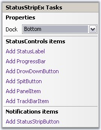

::: {style="DISPLAY: none"}
{#d2h_url_template}{#d2h_package_url style="WIDTH: 0px; DISPLAY: none; HEIGHT: 0px"}
:::

::: {.d2h_secondary_topic style="PADDING-BOTTOM: 10pt; MARGIN: 0pt; PADDING-LEFT: 0pt; PADDING-RIGHT: 0pt; PADDING-TOP: 0pt"}
##### Smart Tag Options {#smart-tag-options style="tab-stops: 0pt"}

[]{style="COLOR: #15428b"} 

Clicking the Smart Tag of the StatusStripEx, displays the below Tasks window. This window lets you add ToolStripStatus Items.

[]{style="COLOR: #15428b"} 

{border="0"}

[]{style="COLOR: #15428b"} 

Figure 1406: Tasks Windows of StatusStripEx

**[]{style="COLOR: #15428b"}** 

The options are,

[]{style="COLOR: #15428b"} 

[·      ]{style="FONT-FAMILY: Symbol"}Dock - Provides docking options for StatusStripEx control.

[]{style="COLOR: #15428b"} 

StatusControl Items

[]{style="COLOR: #15428b"} 

[·      ]{style="FONT-FAMILY: Symbol"}Add StatusLabel - Adds a status label item.

[·      ]{style="FONT-FAMILY: Symbol"}Add ProgressBar - Adds a ProgressBar item.

[·      ]{style="FONT-FAMILY: Symbol"}Add DropDownButton - Adds a dropdownbutton item.

[·      ]{style="FONT-FAMILY: Symbol"}Add SplitButton - Adds a split button item.

[·      ]{style="FONT-FAMILY: Symbol"}Add PanelItem - Adds a Panel item.

[·      ]{style="FONT-FAMILY: Symbol"}Add TrackBar Item - Adds a TrackBar item.

[]{style="COLOR: #15428b"} 

Notifications Items

[]{style="COLOR: #15428b"} 

[·      ]{style="FONT-FAMILY: Symbol"}Add StatusStripButton - Adds a Button item.

[]{style="COLOR: #15428b"} 

See Also

[]{style="COLOR: #15428b"} 

[[Creating a StatusStripEx]{.UGHyperlink}](../../../../../../../../Documents%20and%20Settings/sylviap/Desktop/Tools%20-%20Part%202.docx#_Creating_a_StatusStripEx)[, ]{.UGHyperlink}[[ColorSchemes for StatusStripEx]{.UGHyperlink}](../../../../../../../../Documents%20and%20Settings/sylviap/Desktop/Tools%20-%20Part%202.docx#_ColorSchemes_for_StatusStripEx)[]{.UGHyperlink}

 

 

[]{#related-topics}
:::
