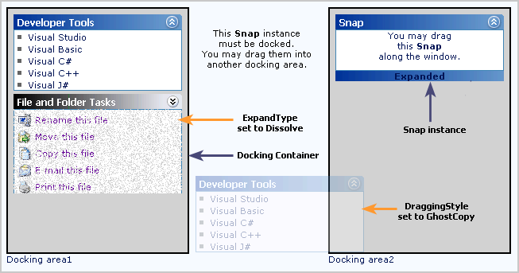

::: {style="DISPLAY: none"}
{#d2h_url_template}{#d2h_package_url style="WIDTH: 0px; DISPLAY: none; HEIGHT: 0px"}
:::

::::: {#nsbanner .d2h_main_nsbanner style="BORDER-BOTTOM: #999999 1px solid; POSITION: relative; PADDING-BOTTOM: 0px; BACKGROUND-COLOR: transparent; PADDING-LEFT: 0px; PADDING-RIGHT: 0px; DISPLAY: none; BORDER-TOP: #999999 1px solid; PADDING-TOP: 0px; LEFT: 0px"}
:::: {#TitleRow .d2h_main_titlerow style="PADDING-BOTTOM: 4px; BACKGROUND-COLOR: transparent; PADDING-LEFT: 22px; WIDTH: 100%; PADDING-RIGHT: 10px; DISPLAY: none; PADDING-TOP: 4px"}
::: {#ienav .d2h_main_ienav style="DISPLAY: none"}
{#D2HPrevious .D2HPreviousEnabled}  {#D2HNext .D2HNextEnabled}
:::
::::
:::::

:::: {#nstext .d2h_main_nstext style="PADDING-BOTTOM: 10px; BACKGROUND-COLOR: transparent; PADDING-LEFT: 22px; PADDING-RIGHT: 10px; HEIGHT: 100%; OVERFLOW: auto; PADDING-TOP: 5px" hasuserbackground="true" valign="bottom"}
::: {#d2h_breadcrumbs .d2h_breadcrumbs}
[Essential Studio User Guide Documentation](ms-xhelp:///?Id=12457748-09e3-4d74-a240-8e049cedf030){.d2h_breadcrumbsNormal}[ \> ]{.d2h_breadcrumbsLinkSeparator}[User Interface Edition](ms-xhelp:///?Id=c29296b7-531c-413b-a0ec-488ca1f7f669){.d2h_breadcrumbsNormal}[ \> ]{.d2h_breadcrumbsLinkSeparator}[Essential ASP.NET](ms-xhelp:///?Id=25c35330-c127-4dad-9a92-ed79dc7261a6){.d2h_breadcrumbsNormal}[ \> ]{.d2h_breadcrumbsLinkSeparator}[Essential Tools]{.d2h_breadcrumbsContentsOnly}[ \> ]{.d2h_breadcrumbsLinkSeparator}[Controls and Components](ms-xhelp:///?Id=99dc3762-3a6c-4306-b62b-5aa347ed3105){.d2h_breadcrumbsNormal}[ \> ]{.d2h_breadcrumbsLinkSeparator}[Docking Package](ms-xhelp:///?Id=234d5418-f218-4472-b37a-18a3036468ab){.d2h_breadcrumbsNormal}
:::

### []{#p496}Snap {#snap style="tab-stops: 0pt"}

 

The Snap control provides a framework for your web pages to implement features that will facilitate users to move, dock/float, expand/collapse elements in the web pages. Containing controls within Snap will automatically enable them to be moved, docked, etc. This lets you convert your static pages into dynamic, customizable pages and provide the users a rich user experience. Changes are persisted across postback and sessions too.

[]{style="FONT-FAMILY: 'Trebuchet MS','sans-serif'; COLOR: #15428b; FONT-SIZE: 9pt"} 

{border="0"}

*[Figure ]{style="FONT-SIZE: 9pt"}[376]{style="FONT-SIZE: 9pt"}[: Snap control]{style="FONT-SIZE: 9pt"}*

[]{style="FONT-FAMILY: 'Trebuchet MS','sans-serif'; COLOR: #15428b; FONT-SIZE: 9pt"} 

The core features of Snap control are given below.

[]{style="FONT-FAMILY: 'Trebuchet MS','sans-serif'; COLOR: #15428b; FONT-SIZE: 9pt"} 

[·      ]{style="FONT-FAMILY: Symbol"}Any number of Snap instances can be docked onto a single container.

[·      ]{style="FONT-FAMILY: Symbol"}The size of each of the Snap control can be customized by defining the Height and Width properties.

[·      ]{style="FONT-FAMILY: Symbol"}The controls can be dragged and dropped from one container to another.

[·      ]{style="FONT-FAMILY: Symbol"}The dragging/docking style of a Snap control can be customized.

[·      ]{style="FONT-FAMILY: Symbol"}The Snap control is optimized to host any custom control within it.

[·      ]{style="FONT-FAMILY: Symbol"}The Snap control can also be aligned relative to the browser borders, irrespective of the browser\'s scroll position.

[·      ]{style="FONT-FAMILY: Symbol"}Snap control can be minimized and maximized with plenty of minimize and maximize effects.

[·      ]{style="FONT-FAMILY: Symbol"}Snap control can be hosted in **Safari** browser too.

 

More:

[ ]{#related-topics}

[{border="0" align="absMiddle"}Overview of Snap templates](ms-xhelp:///?Id=36afd1f9-8e6b-4bfc-b65f-c439aab7e0ca){style="TEXT-DECORATION: none"}

[{border="0" align="absMiddle"}Creating Snap Control](ms-xhelp:///?Id=8515867b-5982-4f3e-b461-856d3dd55191){style="TEXT-DECORATION: none"}

[{border="0" align="absMiddle"}Concepts and Features](ms-xhelp:///?Id=5af6b3ad-20e8-4d77-b302-d9b55e91deac){style="TEXT-DECORATION: none"}

[{border="0" align="absMiddle"}Events](ms-xhelp:///?Id=58525622-41ea-4411-81af-edda8e8060a7){style="TEXT-DECORATION: none"}
::::
