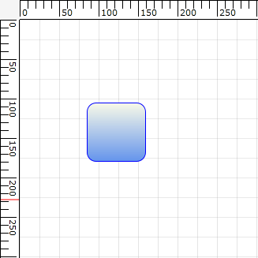

::: {style="DISPLAY: none"}
{#d2h_url_template}{#d2h_package_url style="WIDTH: 0px; DISPLAY: none; HEIGHT: 0px"}
:::

::::: {#nsbanner .d2h_main_nsbanner style="BORDER-BOTTOM: #999999 1px solid; POSITION: relative; PADDING-BOTTOM: 0px; BACKGROUND-COLOR: transparent; PADDING-LEFT: 0px; PADDING-RIGHT: 0px; DISPLAY: none; BORDER-TOP: #999999 1px solid; PADDING-TOP: 0px; LEFT: 0px"}
:::: {#TitleRow .d2h_main_titlerow style="PADDING-BOTTOM: 4px; BACKGROUND-COLOR: transparent; PADDING-LEFT: 22px; WIDTH: 100%; PADDING-RIGHT: 10px; DISPLAY: none; PADDING-TOP: 4px"}
::: {#ienav .d2h_main_ienav style="DISPLAY: none"}
{#D2HPrevious .D2HPreviousEnabled}  {#D2HNext .D2HNextEnabled}
:::
::::
:::::

:::::: {#nstext .d2h_main_nstext style="PADDING-BOTTOM: 10px; BACKGROUND-COLOR: transparent; PADDING-LEFT: 22px; PADDING-RIGHT: 10px; HEIGHT: 100%; OVERFLOW: auto; PADDING-TOP: 5px" hasuserbackground="true" valign="bottom"}
::: {#d2h_breadcrumbs .d2h_breadcrumbs}
[Essential Studio User Guide Documentation](ms-xhelp:///?Id=12457748-09e3-4d74-a240-8e049cedf030){.d2h_breadcrumbsNormal}[ \> ]{.d2h_breadcrumbsLinkSeparator}[User Interface Edition](ms-xhelp:///?Id=c29296b7-531c-413b-a0ec-488ca1f7f669){.d2h_breadcrumbsNormal}[ \> ]{.d2h_breadcrumbsLinkSeparator}[Essential WPF](ms-xhelp:///?Id=7f4f82c5-151c-4262-94d0-75c4626c77bc){.d2h_breadcrumbsNormal}[ \> ]{.d2h_breadcrumbsLinkSeparator}[Essential Diagram]{.d2h_breadcrumbsContentsOnly}[ \> ]{.d2h_breadcrumbsLinkSeparator}[Concepts and Features](ms-xhelp:///?Id=8625d466-6e21-495a-b811-4ecee754da81){.d2h_breadcrumbsNormal}[ \> ]{.d2h_breadcrumbsLinkSeparator}[Diagram View](ms-xhelp:///?Id=5fbfa644-6dd8-4969-8866-3f1b867be204){.d2h_breadcrumbsNormal}
:::

### Snap to Grid {#snap-to-grid style="tab-stops: 0pt"}

The Snap to Grid feature enables dragging nodes and connectors in multiples of offset values, which is specified by using DiagramView's SnapOffsetX and SnapOffsetY properties. For example, if a node is dragged when SnapOffsetX is set to 25, then the nodes OffsetX value will change in multiples of 25.

**[]{style="FONT-FAMILY: 'Trebuchet MS','sans-serif'; COLOR: #1f497d"}** 

Use Case Scenarios

Users can snap objects with respect to grid lines in the Design environment by using Snap to Grid instead of smooth dragging.

 {border="0"}

Figure 145: Node Before Snapping

 

{border="0"}

Figure 146: Node After Snapping

 

Enabling Snap to Grid

The Snap to Grid feature for nodes and connectors can be enabled by setting DiagramView's SnapToHorizontalGrid and SnapToVerticalGrid properties to "True", as shown in the following code snippets.

In the following code snippets, diagramView is an instance of DiagramView.

[]{style="FONT-FAMILY: 'Trebuchet MS','sans-serif'; COLOR: #15428b; FONT-SIZE: 9pt"} 

+-----------------------------------------------------------------------------------------------------------------------------------------------------------------------------------------------------------------------------------------------------------------------------------------------------------------------------------------------------------------------------------------------------------------------------------------------------------------------------------------------------------------------------------------------------------+
| **[\[XAML\]]{style="FONT-FAMILY: 'Courier New'; COLOR: black"}**                                                                                                                                                                                                                                                                                                                                                                                                                                                                                          |
|                                                                                                                                                                                                                                                                                                                                                                                                                                                                                                                                                           |
| [\<]{style="FONT-FAMILY: 'Courier New'; COLOR: blue"}[syncfusion]{style="FONT-FAMILY: 'Courier New'; COLOR: #a31515"}[:]{style="FONT-FAMILY: 'Courier New'; COLOR: blue"}[DiagramView]{style="FONT-FAMILY: 'Courier New'; COLOR: #a31515"}[ [ x]{style="COLOR: red"}[:]{style="COLOR: blue"}[Name]{style="COLOR: red"}[=\"diagramView\"]{style="COLOR: blue"}[ SnapToHorizontalGrid]{style="COLOR: red"}[=\"True\"]{style="COLOR: blue"}[ SnapToVerticalGrid]{style="COLOR: red"}[=\"True\" \>]{style="COLOR: blue"}]{style="FONT-FAMILY: 'Courier New'"} |
|                                                                                                                                                                                                                                                                                                                                                                                                                                                                                                                                                           |
| [\</]{style="FONT-FAMILY: 'Courier New'; COLOR: blue"}[syncfusion]{style="FONT-FAMILY: 'Courier New'; COLOR: #a31515"}[:]{style="FONT-FAMILY: 'Courier New'; COLOR: blue"}[DiagramView]{style="FONT-FAMILY: 'Courier New'; COLOR: #a31515"}[\>]{style="FONT-FAMILY: 'Courier New'; COLOR: blue"}[]{style="FONT-FAMILY: 'Courier New'"}                                                                                                                                                                                                                    |
+-----------------------------------------------------------------------------------------------------------------------------------------------------------------------------------------------------------------------------------------------------------------------------------------------------------------------------------------------------------------------------------------------------------------------------------------------------------------------------------------------------------------------------------------------------------+

[]{style="FONT-FAMILY: 'Trebuchet MS','sans-serif'; COLOR: #15428b; FONT-SIZE: 9pt"} 

[]{style="FONT-FAMILY: 'Trebuchet MS','sans-serif'; COLOR: #15428b; FONT-SIZE: 9pt"} 

+---------------------------------------------------------------------------------------------------------------------------------------------+
| **[\[C#\]]{style="FONT-FAMILY: 'Courier New'; COLOR: black"}**                                                                              |
|                                                                                                                                             |
| [// Enable snap to vertical grid.]{style="FONT-FAMILY: 'Courier New'; COLOR: green"}[]{style="FONT-FAMILY: 'Courier New'"}                  |
|                                                                                                                                             |
| [diagramView.SnapToVerticalGrid = [True;]{style="COLOR: blue"}]{style="FONT-FAMILY: 'Courier New'"}                                         |
|                                                                                                                                             |
| []{style="FONT-FAMILY: 'Courier New'; COLOR: green"}                                                                                        |
|                                                                                                                                             |
| [// Enable snap to horizontal grid.]{style="FONT-FAMILY: 'Courier New'; COLOR: green"}                                                      |
|                                                                                                                                             |
| [diagramView.SnapToHorizontalGrid = [True;]{style="COLOR: blue"}]{style="FONT-FAMILY: 'Courier New'"}[]{style="FONT-FAMILY: 'Courier New'"} |
+---------------------------------------------------------------------------------------------------------------------------------------------+

 

+--------------------------------------------------------------------------------------------------------------------------------------------+
| **[\[VB\]]{style="FONT-FAMILY: 'Courier New'; COLOR: black"}**                                                                             |
|                                                                                                                                            |
| [\'Enable snap to vertical grid.]{style="FONT-FAMILY: 'Courier New'; COLOR: green"}[]{style="FONT-FAMILY: 'Courier New'"}                  |
|                                                                                                                                            |
| [diagramView.SnapToVerticalGrid = [True]{style="COLOR: blue"}]{style="FONT-FAMILY: 'Courier New'"}                                         |
|                                                                                                                                            |
| []{style="FONT-FAMILY: 'Courier New'; COLOR: green"}                                                                                       |
|                                                                                                                                            |
| [\'Enable snap to horizontal grid.]{style="FONT-FAMILY: 'Courier New'; COLOR: green"}[]{style="FONT-FAMILY: 'Courier New'"}                |
|                                                                                                                                            |
| [diagramView.SnapToHorizontalGrid = [True]{style="COLOR: blue"}]{style="FONT-FAMILY: 'Courier New'"}[]{style="FONT-FAMILY: 'Courier New'"} |
+--------------------------------------------------------------------------------------------------------------------------------------------+

 

{border="0"}

Figure 147:  Snap to Grid Enabled

**[]{style="FONT-FAMILY: 'Trebuchet MS','sans-serif'; COLOR: #1f497d; FONT-SIZE: 12pt"}** 

Customizing Snap to Grid Offset Values

By default, the SnapOffsetX and SnapOffsetY values are set to 25 pixels. However, these values can be changed so that objects will snap to the horizontal grid by using SnapOffsetX and snap to the vertical grid by using SnapOffsetY, as shown in the following code snippets.

 

In the following code snippets, diagramView is an instance of DiagramView.

[]{style="FONT-FAMILY: 'Trebuchet MS','sans-serif'; COLOR: #15428b; FONT-SIZE: 9pt"} 

+----------------------------------------------------------------------------------------------------------------------------------------------------------------------------------------------------------------------------------------------------------------------------------------------------------------------------------------------------------------------------------------------------------------------------------------------------------------------------------------------------------------------------------------+
| **[\[XAML\]]{style="FONT-FAMILY: 'Courier New'; COLOR: black"}**                                                                                                                                                                                                                                                                                                                                                                                                                                                                       |
|                                                                                                                                                                                                                                                                                                                                                                                                                                                                                                                                        |
| [\<]{style="FONT-FAMILY: 'Courier New'; COLOR: blue"}[syncfusion]{style="FONT-FAMILY: 'Courier New'; COLOR: #a31515"}[:]{style="FONT-FAMILY: 'Courier New'; COLOR: blue"}[DiagramView]{style="FONT-FAMILY: 'Courier New'; COLOR: #a31515"}[ [ x]{style="COLOR: red"}[:]{style="COLOR: blue"}[Name]{style="COLOR: red"}[=\"diagramView\"]{style="COLOR: blue"}[ SnapOffsetX ]{style="COLOR: red"}[=\"50\"]{style="COLOR: blue"}[ SnapOffsetY ]{style="COLOR: red"}[=\"50\"\>]{style="COLOR: blue"}]{style="FONT-FAMILY: 'Courier New'"} |
|                                                                                                                                                                                                                                                                                                                                                                                                                                                                                                                                        |
| [\</]{style="FONT-FAMILY: 'Courier New'; COLOR: blue"}[syncfusion]{style="FONT-FAMILY: 'Courier New'; COLOR: #a31515"}[:]{style="FONT-FAMILY: 'Courier New'; COLOR: blue"}[DiagramView]{style="FONT-FAMILY: 'Courier New'; COLOR: #a31515"}[\>]{style="FONT-FAMILY: 'Courier New'; COLOR: blue"}[]{style="FONT-FAMILY: 'Courier New'"}                                                                                                                                                                                                 |
+----------------------------------------------------------------------------------------------------------------------------------------------------------------------------------------------------------------------------------------------------------------------------------------------------------------------------------------------------------------------------------------------------------------------------------------------------------------------------------------------------------------------------------------+

[]{style="FONT-FAMILY: 'Trebuchet MS','sans-serif'; COLOR: #15428b; FONT-SIZE: 9pt"} 

+-----------------------------------------------------------------------------------------------------------+
| **[\[C#\]]{style="FONT-FAMILY: 'Courier New'; COLOR: black"}**                                            |
|                                                                                                           |
| [diagramView.SnapOffsetX = 50;]{style="FONT-FAMILY: 'Courier New'"}                                       |
|                                                                                                           |
| [diagramView.SnapOffsetY = 50;]{style="FONT-FAMILY: 'Courier New'"}[]{style="FONT-FAMILY: 'Courier New'"} |
+-----------------------------------------------------------------------------------------------------------+

[]{style="FONT-FAMILY: 'Trebuchet MS','sans-serif'; COLOR: #15428b; FONT-SIZE: 9pt"} 

+----------------------------------------------------------------------------------------------------------+
| **[\[VB\]]{style="FONT-FAMILY: 'Courier New'; COLOR: black"}**                                           |
|                                                                                                          |
| [diagramView.SnapOffsetX = 50]{style="FONT-FAMILY: 'Courier New'"}                                       |
|                                                                                                          |
| [diagramView.SnapOffsetY = 50]{style="FONT-FAMILY: 'Courier New'"}[]{style="FONT-FAMILY: 'Courier New'"} |
+----------------------------------------------------------------------------------------------------------+

 

::: {style="BORDER-BOTTOM: windowtext 1pt solid; BORDER-LEFT: medium none; PADDING-BOTTOM: 1pt; MARGIN-TOP: 9pt; PADDING-LEFT: 0pt; PADDING-RIGHT: 0pt; MARGIN-BOTTOM: 9pt; BORDER-TOP: windowtext 1pt solid; BORDER-RIGHT: medium none; PADDING-TOP: 1pt"}
{border="0"}Note: SnapToGrid will snap objects based on the offset values specified in DiagramView's SnapOffsetX and SnapOffsetY values and it works independently from grid lines. However, to snap objects along with the grid lines, specify the same offset values for grid lines and snap offset.
:::

[]{style="FONT-FAMILY: 'Trebuchet MS','sans-serif'; COLOR: #1f497d; FONT-SIZE: 9pt"} 

Also, snapping of objects will occur only when the objects are dragged during runtime. Even after snapping is enabled, users can specify their own offset values in code behind.

***[]{style="FONT-FAMILY: 'Trebuchet MS','sans-serif'; COLOR: #1f497d"}*** 

The properties of the Snap to Grid feature are described in the following tabulation:

 

Table 70: Properties Table

::: {align="center"}
+----------------------+----------------------------------------------+---------------------+------------------+-----------------+
| Property             | Description                                  | Type                | Data Type        | Reference links |
+----------------------+----------------------------------------------+---------------------+------------------+-----------------+
| SnapOffsetX          | Snaps to the horizontal offset value.        | Dependency property | double           | Not applicable  |
+----------------------+----------------------------------------------+---------------------+------------------+-----------------+
| SnapOffsetY          | Snaps to the vertical offset value.          | Dependency property | double           | Not applicable  |
+----------------------+----------------------------------------------+---------------------+------------------+-----------------+
| SnapToHorizontalGrid | Enables or disables snap to horizontal grid. | Dependency property | bool, true/false |  Not applicable |
|                      |                                              |                     |                  |                 |
|                      |                                              |                     |                  |                 |
+----------------------+----------------------------------------------+---------------------+------------------+-----------------+
| SnapToVerticalGrid   | Enables or disables snap to vertical grid.   | Dependency property | bool, true/false |  Not applicable |
|                      |                                              |                     |                  |                 |
|                      |                                              |                     |                  |                 |
+======================+==============================================+=====================+==================+=================+
:::

 

Sample Link

To view a sample:

Open the Diagram Sample Browser from the dashboard. (Refer to the [[Samples and Location]{style="COLOR: windowtext"}](ms-xhelp:///?Id=9eef4133-7da3-4c17-a048-f5288af76744) chapter.)

Navigate to **Editable Diagram** \> **SnapToGrid Demo**.

[]{style="FONT-FAMILY: 'Trebuchet MS','sans-serif'; COLOR: #15428b; FONT-SIZE: 9pt"} 

[]{#related-topics}
::::::
