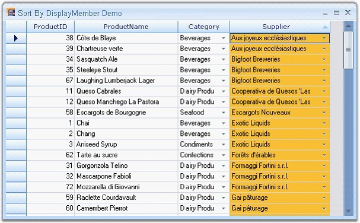

::: {style="DISPLAY: none"}
{#d2h_url_template}{#d2h_package_url style="WIDTH: 0px; DISPLAY: none; HEIGHT: 0px"}
:::

::::: {.d2h_secondary_topic style="PADDING-BOTTOM: 10pt; MARGIN: 0pt; PADDING-LEFT: 0pt; PADDING-RIGHT: 0pt; PADDING-TOP: 0pt"}
#### Sort by DisplayMember {#sort-by-displaymember style="tab-stops: 0pt"}

[]{style="FONT-FAMILY: 'Trebuchet MS','sans-serif'; COLOR: #15428b; FONT-SIZE: 9pt"} 

By default, sorting is done in a Grid Data Bound Grid through the **IBindingList**.

[]{style="FONT-FAMILY: 'Trebuchet MS','sans-serif'; COLOR: #15428b; FONT-SIZE: 9pt"} 

::: {style="BORDER-BOTTOM: windowtext 1pt solid; BORDER-LEFT: medium none; PADDING-BOTTOM: 1pt; MARGIN-TOP: 9pt; PADDING-LEFT: 0pt; PADDING-RIGHT: 0pt; MARGIN-BOTTOM: 9pt; BORDER-TOP: windowtext 1pt solid; BORDER-RIGHT: medium none; PADDING-TOP: 1pt"}
{border="0"}Note: IBindingList interface provides the features required to support both complex and simple scenarios when binding to a data source.
:::

[]{style="FONT-FAMILY: 'Trebuchet MS','sans-serif'; COLOR: #15428b; FONT-SIZE: 9pt"} 

**Sort** method relies on the data source for the grid and by default, sorting is done based on the value members present in the data source and not based on the display member. We can implement Sort By DisplayMember feature in Grid Data Bound Grid. The code for foreign key column can be added to the View of the data table so that the sort behavior can be redirected to use the foreign key column linked to the combo box column, when the user sorts the combo box column.

[]{style="FONT-FAMILY: 'Trebuchet MS','sans-serif'; COLOR: #15428b; FONT-SIZE: 9pt"} 

Example:

[]{style="FONT-FAMILY: 'Trebuchet MS','sans-serif'; COLOR: #15428b; FONT-SIZE: 9pt"} 

The following code example implements a solution for sorting a column by its display member instead of its value member. Here the foreign key column is added to the View of the data to redirect the sort behavior to use the foreign key column.

 

To accomplish this, two handlers-the **CellClick** event and the **QueryCellInfo** event have been used. In the CellClick event, the display member is set to the existing mapping name in the sortName (which will be the value member) so that the sorting is done by display member.

[]{style="FONT-FAMILY: 'Trebuchet MS','sans-serif'; COLOR: #15428b; FONT-SIZE: 9pt"} 

+------------------------------------------------------------------------------------------------------------------------------------------------------------------------------------------+
| **[\[C#\]]{style="FONT-FAMILY: 'Courier New'; COLOR: black"}**                                                                                                                           |
|                                                                                                                                                                                          |
| []{style="COLOR: black"}                                                                                                                                                                 |
|                                                                                                                                                                                          |
| [string]{style="FONT-FAMILY: 'Courier New'; COLOR: blue"}[ sortName = column.MappingName;]{style="FONT-FAMILY: 'Courier New'"}                                                           |
|                                                                                                                                                                                          |
| [if]{style="FONT-FAMILY: 'Courier New'; COLOR: blue"}[ (column.MappingName == [\"SupplierID\"]{style="COLOR: #a31515"})]{style="FONT-FAMILY: 'Courier New'"}                             |
|                                                                                                                                                                                          |
| [    sortName = [\"CompanyName\"]{style="COLOR: #a31515"};]{style="FONT-FAMILY: 'Courier New'"}                                                                                          |
|                                                                                                                                                                                          |
| [else]{style="FONT-FAMILY: 'Courier New'; COLOR: blue"}[ [if]{style="COLOR: blue"} (column.MappingName == [\"CategoryID\"]{style="COLOR: #a31515"})]{style="FONT-FAMILY: 'Courier New'"} |
|                                                                                                                                                                                          |
| [    sortName = [\"CategoryName\"]{style="COLOR: #a31515"};]{style="FONT-FAMILY: 'Courier New'"}                                                                                         |
+------------------------------------------------------------------------------------------------------------------------------------------------------------------------------------------+

[]{style="FONT-FAMILY: 'Trebuchet MS','sans-serif'; COLOR: #15428b; FONT-SIZE: 9pt"} 

+-------------------------------------------------------------------------------------------------------------------------------------------------------------------------------------------+
| **[\[VB.NET\]]{style="FONT-FAMILY: 'Courier New'; COLOR: black"}**                                                                                                                        |
|                                                                                                                                                                                           |
| []{style="FONT-FAMILY: 'Courier New'; COLOR: black"}                                                                                                                                      |
|                                                                                                                                                                                           |
| [Dim]{style="FONT-FAMILY: 'Courier New'; COLOR: blue"}[ sortName [As]{style="COLOR: blue"} [String]{style="COLOR: blue"} = column.MappingName]{style="FONT-FAMILY: 'Courier New'"}        |
|                                                                                                                                                                                           |
| [If]{style="FONT-FAMILY: 'Courier New'; COLOR: blue"}[ column.MappingName = [\"SupplierID\"]{style="COLOR: #a31515"} [Then]{style="COLOR: blue"}]{style="FONT-FAMILY: 'Courier New'"}     |
|                                                                                                                                                                                           |
| [sortName = [\"CompanyName\"]{style="COLOR: #a31515"}]{style="FONT-FAMILY: 'Courier New'"}                                                                                                |
|                                                                                                                                                                                           |
| [ElseIf]{style="FONT-FAMILY: 'Courier New'; COLOR: blue"}[ column.MappingName = [\"CategoryID\"]{style="COLOR: #a31515"} [Then]{style="COLOR: blue"}]{style="FONT-FAMILY: 'Courier New'"} |
|                                                                                                                                                                                           |
| [sortName = [\"CategoryName\"]{style="COLOR: #a31515"}]{style="FONT-FAMILY: 'Courier New'"}                                                                                               |
|                                                                                                                                                                                           |
| [End]{style="FONT-FAMILY: 'Courier New'; COLOR: blue"}[ [If]{style="COLOR: blue"}]{style="FONT-FAMILY: 'Courier New'"}                                                                    |
+-------------------------------------------------------------------------------------------------------------------------------------------------------------------------------------------+

[]{style="FONT-FAMILY: 'Trebuchet MS','sans-serif'; COLOR: #15428b; FONT-SIZE: 9pt"} 

A DataView is created by using the **List** property under the **CurrencyManager** class.

[]{style="FONT-FAMILY: 'Trebuchet MS','sans-serif'; COLOR: #15428b; FONT-SIZE: 9pt"} 

+------------------------------------------------------------------------------------------------------------------------------------------------------------------------------------------------------------------------------------------+
| **[\[C#\]]{style="FONT-FAMILY: 'Courier New'; COLOR: black"}**                                                                                                                                                                           |
|                                                                                                                                                                                                                                          |
| []{style="FONT-FAMILY: 'Courier New'; COLOR: black"}                                                                                                                                                                                     |
|                                                                                                                                                                                                                                          |
| [CurrencyManager]{style="FONT-FAMILY: 'Courier New'; COLOR: #2b91af"}[ cm = BindingContext\[grid.DataSource, grid.DataMember\] [as]{style="COLOR: blue"} [CurrencyManager]{style="COLOR: #2b91af"};]{style="FONT-FAMILY: 'Courier New'"} |
|                                                                                                                                                                                                                                          |
| [DataView]{style="FONT-FAMILY: 'Courier New'; COLOR: #2b91af"}[ dv = cm.List [as]{style="COLOR: blue"} [DataView]{style="COLOR: #2b91af"};]{style="FONT-FAMILY: 'Courier New'"}                                                          |
+------------------------------------------------------------------------------------------------------------------------------------------------------------------------------------------------------------------------------------------+

[]{style="FONT-FAMILY: 'Trebuchet MS','sans-serif'; COLOR: #15428b; FONT-SIZE: 9pt"} 

+-----------------------------------------------------------------------------------------------------------------------------------------------------------------------------------------------------------------------------------------------+
| **[\[VB.NET\]]{style="FONT-FAMILY: 'Courier New'; COLOR: black"}**                                                                                                                                                                            |
|                                                                                                                                                                                                                                               |
| []{style="FONT-FAMILY: 'Courier New'; COLOR: black"}                                                                                                                                                                                          |
|                                                                                                                                                                                                                                               |
| [Dim]{style="FONT-FAMILY: 'Courier New'; COLOR: blue"}[ cm [As]{style="COLOR: blue"} CurrencyManager = [TryCast]{style="COLOR: blue"}(BindingContext(Grid.DataSource, Grid.DataMember), CurrencyManager)]{style="FONT-FAMILY: 'Courier New'"} |
|                                                                                                                                                                                                                                               |
| [Dim]{style="FONT-FAMILY: 'Courier New'; COLOR: blue"}[ dv [As]{style="COLOR: blue"} DataView = [TryCast]{style="COLOR: blue"}(cm.List, DataView)]{style="FONT-FAMILY: 'Courier New'"}                                                        |
+-----------------------------------------------------------------------------------------------------------------------------------------------------------------------------------------------------------------------------------------------+

[]{style="FONT-FAMILY: 'Trebuchet MS','sans-serif'; COLOR: #15428b; FONT-SIZE: 9pt"} 

The DataView sort is applied to this with the sortName.

[]{style="FONT-FAMILY: 'Trebuchet MS','sans-serif'; COLOR: #15428b; FONT-SIZE: 9pt"} 

+-------------------------------------------------------------------------------------------------------------------+
| **[\[C#\]]{style="FONT-FAMILY: 'Courier New'; COLOR: black"}**                                                    |
|                                                                                                                   |
| []{style="FONT-FAMILY: 'Courier New'; COLOR: black"}                                                              |
|                                                                                                                   |
| [if]{style="FONT-FAMILY: 'Courier New'; COLOR: blue"}[ (dv.Sort == sortName)]{style="FONT-FAMILY: 'Courier New'"} |
|                                                                                                                   |
| [{]{style="FONT-FAMILY: 'Courier New'"}                                                                           |
|                                                                                                                   |
| [    dv.Sort = sortName + [\" DESC\"]{style="COLOR: #a31515"};]{style="FONT-FAMILY: 'Courier New'"}               |
|                                                                                                                   |
| [}]{style="FONT-FAMILY: 'Courier New'"}                                                                           |
|                                                                                                                   |
| [else]{style="FONT-FAMILY: 'Courier New'; COLOR: blue"}                                                           |
|                                                                                                                   |
| [    dv.Sort = sortName;]{style="FONT-FAMILY: 'Courier New'"}                                                     |
+-------------------------------------------------------------------------------------------------------------------+

[]{style="FONT-FAMILY: 'Trebuchet MS','sans-serif'; COLOR: #15428b; FONT-SIZE: 9pt"} 

+--------------------------------------------------------------------------------------------------------------------------------------------+
| **[\[VB.NET\]]{style="FONT-FAMILY: 'Courier New'; COLOR: black"}**                                                                         |
|                                                                                                                                            |
| []{style="FONT-FAMILY: 'Courier New'; COLOR: black"}                                                                                       |
|                                                                                                                                            |
| [If]{style="FONT-FAMILY: 'Courier New'; COLOR: blue"}[ dv.Sort = sortName [Then]{style="COLOR: blue"}]{style="FONT-FAMILY: 'Courier New'"} |
|                                                                                                                                            |
| [dv.Sort = sortName & [\" DESC\"]{style="COLOR: #a31515"}]{style="FONT-FAMILY: 'Courier New'"}                                             |
|                                                                                                                                            |
| [Else]{style="FONT-FAMILY: 'Courier New'; COLOR: blue"}                                                                                    |
|                                                                                                                                            |
| [dv.Sort = sortName]{style="FONT-FAMILY: 'Courier New'"}                                                                                   |
|                                                                                                                                            |
| [End]{style="FONT-FAMILY: 'Courier New'; COLOR: blue"}[ [If]{style="COLOR: blue"}]{style="FONT-FAMILY: 'Courier New'"}                     |
+--------------------------------------------------------------------------------------------------------------------------------------------+

[]{style="FONT-FAMILY: 'Trebuchet MS','sans-serif'; COLOR: #15428b; FONT-SIZE: 9pt"} 

::: {style="BORDER-BOTTOM: windowtext 1pt solid; BORDER-LEFT: medium none; PADDING-BOTTOM: 1pt; MARGIN-TOP: 9pt; PADDING-LEFT: 0pt; PADDING-RIGHT: 0pt; MARGIN-BOTTOM: 9pt; BORDER-TOP: windowtext 1pt solid; BORDER-RIGHT: medium none; PADDING-TOP: 1pt"}
{border="0"}Note: CurrencyManager manages a list of binding objects when the data source uses the IBindingList interface.
:::

[]{style="FONT-FAMILY: 'Trebuchet MS','sans-serif'; COLOR: #15428b; FONT-SIZE: 9pt"} 

In the QueryCellInfo handler, the sorting icon is drawn with respect to sorting

[]{style="FONT-FAMILY: 'Trebuchet MS','sans-serif'; COLOR: #15428b; FONT-SIZE: 9pt"} 

+-------------------------------------------------------------------------------------------------------------------------------------------------------------------------------------+
| **[\[C#\]]{style="FONT-FAMILY: 'Courier New'; COLOR: black"}**                                                                                                                      |
|                                                                                                                                                                                     |
| []{style="FONT-FAMILY: 'Courier New'; COLOR: black"}                                                                                                                                |
|                                                                                                                                                                                     |
| [if]{style="FONT-FAMILY: 'Courier New'; COLOR: blue"}[ (dv.Sort == sortName)]{style="FONT-FAMILY: 'Courier New'"}                                                                   |
|                                                                                                                                                                                     |
| [    e.Style.Tag = [ListSortDirection]{style="COLOR: #2b91af"}.Ascending;]{style="FONT-FAMILY: 'Courier New'"}                                                                      |
|                                                                                                                                                                                     |
| [else]{style="FONT-FAMILY: 'Courier New'; COLOR: blue"}[ [if]{style="COLOR: blue"} (dv.Sort == sortName + [\" DESC\"]{style="COLOR: #a31515"})]{style="FONT-FAMILY: 'Courier New'"} |
|                                                                                                                                                                                     |
| [    e.Style.Tag = [ListSortDirection]{style="COLOR: #2b91af"}.Descending;]{style="FONT-FAMILY: 'Courier New'"}                                                                     |
+-------------------------------------------------------------------------------------------------------------------------------------------------------------------------------------+

[]{style="FONT-FAMILY: 'Trebuchet MS','sans-serif'; COLOR: #15428b; FONT-SIZE: 9pt"} 

+----------------------------------------------------------------------------------------------------------------------------------------------------------------------------------------------------------------------+
| **[\[VB.NET\]]{style="FONT-FAMILY: 'Courier New'; COLOR: black"}**                                                                                                                                                   |
|                                                                                                                                                                                                                      |
| []{style="FONT-FAMILY: 'Courier New'; COLOR: black; FONT-SIZE: 9pt"}                                                                                                                                                 |
|                                                                                                                                                                                                                      |
| [If]{style="FONT-FAMILY: 'Courier New'; COLOR: blue; FONT-SIZE: 9pt"}[ dv.Sort = sortName [Then]{style="COLOR: blue"}]{style="FONT-FAMILY: 'Courier New'; FONT-SIZE: 9pt"}                                           |
|                                                                                                                                                                                                                      |
| [e.Style.Tag = ListSortDirection.Ascending]{style="FONT-FAMILY: 'Courier New'; FONT-SIZE: 9pt"}                                                                                                                      |
|                                                                                                                                                                                                                      |
| [ElseIf]{style="FONT-FAMILY: 'Courier New'; COLOR: blue; FONT-SIZE: 9pt"}[ dv.Sort = sortName & [\" DESC\"]{style="COLOR: #a31515"} [Then]{style="COLOR: blue"}]{style="FONT-FAMILY: 'Courier New'; FONT-SIZE: 9pt"} |
|                                                                                                                                                                                                                      |
| [e.Style.Tag = ListSortDirection.Descending]{style="FONT-FAMILY: 'Courier New'; FONT-SIZE: 9pt"}                                                                                                                     |
|                                                                                                                                                                                                                      |
| [End]{style="FONT-FAMILY: 'Courier New'; COLOR: blue; FONT-SIZE: 9pt"}[ [If]{style="COLOR: blue"}]{style="FONT-FAMILY: 'Courier New'; FONT-SIZE: 9pt"}                                                               |
+----------------------------------------------------------------------------------------------------------------------------------------------------------------------------------------------------------------------+

[]{style="FONT-FAMILY: 'Trebuchet MS','sans-serif'; COLOR: #15428b; FONT-SIZE: 9pt"} 

{border="0"}

[]{style="FONT-FAMILY: 'Trebuchet MS','sans-serif'; COLOR: #15428b; FONT-SIZE: 9pt"} 

*[Figure ]{style="FONT-SIZE: 9pt"}[214]{style="FONT-SIZE: 9pt"}[: Sort by Display Member]{style="FONT-SIZE: 9pt"}*

[]{style="FONT-FAMILY: 'Trebuchet MS','sans-serif'; COLOR: #15428b; FONT-SIZE: 9pt"} 

A sample demonstrating this feature is available under the following sample installation path.

 

***\<Install Location\>\\Syncfusion\\EssentialStudio\\\[Version Number\]\\Windows\\Grid.Windows\\Samples\\2.0\\Data Bound\\Sort By DisplayMember Demo***

 

[]{#p377} 

 

[]{#related-topics}
:::::
