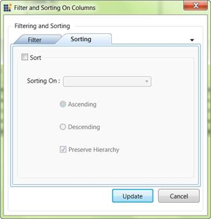

::: {style="DISPLAY: none"}
{#d2h_url_template} {#d2h_package_url style="WIDTH: 0px; DISPLAY: none; HEIGHT: 0px"}
:::

::::: {#nsbanner .d2h_main_nsbanner style="BORDER-BOTTOM: #999999 1px solid; POSITION: relative; PADDING-BOTTOM: 0px; BACKGROUND-COLOR: transparent; PADDING-LEFT: 0px; PADDING-RIGHT: 0px; DISPLAY: none; BORDER-TOP: #999999 1px solid; PADDING-TOP: 0px; LEFT: 0px"}
:::: {#TitleRow .d2h_main_titlerow style="PADDING-BOTTOM: 4px; BACKGROUND-COLOR: transparent; PADDING-LEFT: 22px; WIDTH: 100%; PADDING-RIGHT: 10px; DISPLAY: none; PADDING-TOP: 4px"}
::: {#ienav .d2h_main_ienav style="DISPLAY: none"}
{#D2HPrevious .D2HPreviousEnabled}  {#D2HNext .D2HNextEnabled}
:::
::::
:::::

:::: {#nstext .d2h_main_nstext style="PADDING-BOTTOM: 10px; BACKGROUND-COLOR: transparent; PADDING-LEFT: 22px; PADDING-RIGHT: 10px; HEIGHT: 100%; OVERFLOW: auto; PADDING-TOP: 5px" hasuserbackground="true" valign="bottom"}
::: {#d2h_breadcrumbs .d2h_breadcrumbs}
[Essential Studio User Guide Documentation](ms-xhelp:///?Id=12457748-09e3-4d74-a240-8e049cedf030){.d2h_breadcrumbsNormal} [ \> ]{.d2h_breadcrumbsLinkSeparator} [Business Intelligence Edition](ms-xhelp:///?Id=fdf33dd8-62b2-47b9-ad7b-fc50e590bca5){.d2h_breadcrumbsNormal} [ \> ]{.d2h_breadcrumbsLinkSeparator} [Essential BI WPF](ms-xhelp:///?Id=41e3d586-d922-4a01-8272-679fe4ae7343){.d2h_breadcrumbsNormal} [ \> ]{.d2h_breadcrumbsLinkSeparator} [Essential BI Client]{.d2h_breadcrumbsContentsOnly} [ \> ]{.d2h_breadcrumbsLinkSeparator} [Concepts and Features](ms-xhelp:///?Id=ac4d4da8-25e2-4317-98b8-e507a1eb5062){.d2h_breadcrumbsNormal} [ \> ]{.d2h_breadcrumbsLinkSeparator} [Filtering and Sorting](ms-xhelp:///?Id=90268294-d61e-4e6b-a5af-d5bcc73d122d){.d2h_breadcrumbsNormal}
:::

### Sorting {#sorting style="tab-stops: 0pt"}

The **Sorting** tab in the **Filter and Sorting** dialog box of OLAP Client provides options to sort the results by columns (series) or rows (categories). This dialog is invoked through the **Sorting** toolbar item.

**Column Sorting**

Column sorting will sort the columns in the result set, based on the column total of each column.

**Row Sorting**

Row sorting will sort the rows in the result set, based on the row total of each row.

 

[]{style="FONT-FAMILY: 'Calibri','sans-serif'"} 

{border="0"}

Figure 56: Sorting Dialog

More:

[ ]{#related-topics}

[{border="0" align="absMiddle"}Options in Sorting Dialog](ms-xhelp:///?Id=5e62bd22-1587-4e7d-934f-dc448ea32fcf){style="TEXT-DECORATION: none"}

[{border="0" align="absMiddle"}Steps to apply sorting](ms-xhelp:///?Id=13f17a74-f75e-4db3-ab96-ced60ad00015){style="TEXT-DECORATION: none"}

[{border="0" align="absMiddle"}ShowColumnSortDialog](ms-xhelp:///?Id=a03436c9-4d1c-47e4-b9f8-61037120c937){style="TEXT-DECORATION: none"}

[{border="0" align="absMiddle"}ShowRowSortDialog](ms-xhelp:///?Id=bc1bfc57-10a0-448a-be7b-9d519415426f){style="TEXT-DECORATION: none"}
::::
