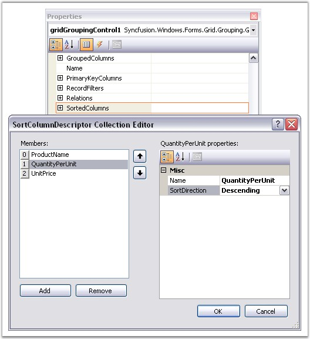
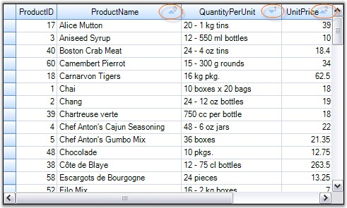
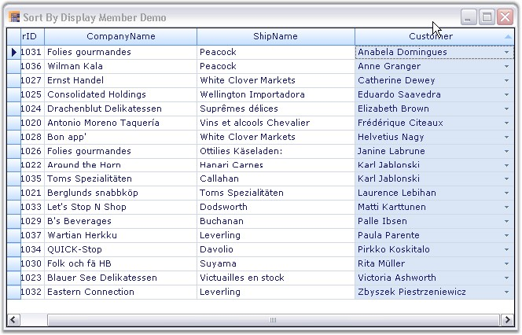
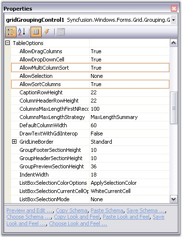

::: {style="DISPLAY: none"}
{#d2h_url_template}{#d2h_package_url style="WIDTH: 0px; DISPLAY: none; HEIGHT: 0px"}
:::

:::::: {.d2h_secondary_topic style="PADDING-BOTTOM: 10pt; MARGIN: 0pt; PADDING-LEFT: 0pt; PADDING-RIGHT: 0pt; PADDING-TOP: 0pt"}
##### Sorting {#sorting style="tab-stops: 0pt"}

[]{style="FONT-FAMILY: 'Trebuchet MS','sans-serif'; COLOR: #15428b; FONT-SIZE: 9pt"} 

Grid Grouping control allows you to sort the table data against one or more columns. The number of columns by which the data can be sorted is unlimited. When sorting is applied, the grid will rearrange the data to match with the current sort criteria.

 

**SortedColumns Collection**

**[]{style="FONT-FAMILY: 'Verdana','sans-serif'; COLOR: navy; FONT-SIZE: 8pt"}** 

The **SortedColumns** collection defines the sort order for records within groups. Multiple entries can be added with the first entry having the highest precedence when sorting records. The properties and methods in this collection lets you manage the elements in the collection. The collection can be viewed as a set of SortColumnDescriptors one for every column against which the data is sorted. The SortColumnDescriptor of a field contains the details like the name of a field, sort direction and optionally a custom comparer and categorization object. The custom comparer and categorizer will allow you to customize the sorting.

[]{style="FONT-FAMILY: 'Verdana','sans-serif'; FONT-SIZE: 8pt"} 

**Sorting Methods**

**[]{style="FONT-FAMILY: 'Verdana','sans-serif'; COLOR: #4a5c8c; FONT-SIZE: 8pt"}** 

There are multiple ways through which you can apply sorting on table data. A simple one is just clicking the desired column headers by which the grouping grid needs to be sorted. Once the sorting is applied, the grid will display a sort icon in the respective column headers showing the sort direction. The sorting can also be done against multiple columns by holding the Ctrl key and doing a click on the desired column headers.

 

**Through Designer**

**[]{style="FONT-FAMILY: 'Segoe UI','sans-serif'"}** 

At design time, the data can be sorted by accessing **SortedColumns** property under the TableDescriptor section in the property grid of the Grid Grouping control. This will open the SortColumnDescriptorCollection Editor. In that Editor, clicking the Add button will add the existing columns into the collection. The **Name** and **SortDirection** in the property window of the editor will let you specify your desired field name to sort and the sort order. The image given below illustrates this process.

[]{style="FONT-SIZE: 8pt"} 

{border="0"}

[]{style="FONT-FAMILY: 'Trebuchet MS','sans-serif'; COLOR: #15428b; FONT-SIZE: 9pt"} 

*[Figure ]{style="FONT-SIZE: 9pt"}[284]{style="FONT-SIZE: 9pt"}[: SortColumnDescriptor Collection Editor]{style="FONT-SIZE: 9pt"}*

[]{style="FONT-SIZE: 8pt"} 

Programmatically

[]{style="FONT-FAMILY: 'Verdana','sans-serif'; COLOR: #4a5c8c; FONT-SIZE: 8pt"} 

Sorting can be applied to the grid data by specifying the desired field name to the TableDescriptor.SortedColumns.Add() method.

[]{style="FONT-SIZE: 8pt"} 

+--------------------------------------------------------------------------------------------------------------------------------------------------------------------------------------------------+
| **[\[C#\]]{style="FONT-FAMILY: 'Courier New'; COLOR: black"}**                                                                                                                                   |
|                                                                                                                                                                                                  |
| []{style="FONT-FAMILY: 'Courier New'; COLOR: #15428b"}                                                                                                                                           |
|                                                                                                                                                                                                  |
| [this]{style="FONT-FAMILY: 'Courier New'; COLOR: blue"}[.gridGroupingControl1.TableDescriptor.SortedColumns.Add([\"ProductName\"]{style="COLOR: #a31515"});]{style="FONT-FAMILY: 'Courier New'"} |
+--------------------------------------------------------------------------------------------------------------------------------------------------------------------------------------------------+

[]{style="FONT-FAMILY: 'Trebuchet MS','sans-serif'; COLOR: #15428b; FONT-SIZE: 9pt"} 

+-----------------------------------------------------------------------------------------------------------------------------------------------------------------------------------------------+
| **[\[VB.NET\]]{style="FONT-FAMILY: 'Courier New'; COLOR: black"}**                                                                                                                            |
|                                                                                                                                                                                               |
| []{style="FONT-FAMILY: 'Courier New'; COLOR: #15428b"}                                                                                                                                        |
|                                                                                                                                                                                               |
| [Me]{style="FONT-FAMILY: 'Courier New'; COLOR: blue"}[.gridGroupingControl1.TableDescriptor.SortedColumns.Add([\"ProductName\"]{style="COLOR: #a31515"})]{style="FONT-FAMILY: 'Courier New'"} |
+-----------------------------------------------------------------------------------------------------------------------------------------------------------------------------------------------+

[]{style="FONT-FAMILY: 'Trebuchet MS','sans-serif'; COLOR: #15428b; FONT-SIZE: 9pt"} 

**Multicolumn Sorting** can be achieved by adding the field names into the **SortedColumns** property and optionally specifying the sort direction. The following code example sorts the data by the ProductName and UnitPrice in ascending Order and by the column Quantity in descending Order.

[]{style="FONT-FAMILY: 'Trebuchet MS','sans-serif'; COLOR: #15428b; FONT-SIZE: 9pt"} 

+--------------------------------------------------------------------------------------------------------------------------------------------------------------------------------------------------------------------------------------------------------------+
| **[\[C#\]]{style="FONT-FAMILY: 'Courier New'; COLOR: black"}**                                                                                                                                                                                               |
|                                                                                                                                                                                                                                                              |
| []{style="FONT-FAMILY: 'Courier New'; COLOR: #15428b"}                                                                                                                                                                                                       |
|                                                                                                                                                                                                                                                              |
| [this]{style="FONT-FAMILY: 'Courier New'; COLOR: blue"}[.gridGroupingControl1.TableDescriptor.SortedColumns.Add([\"ProductName\"]{style="COLOR: #a31515"}, [ListSortDirection]{style="COLOR: #2b91af"}.Ascending);]{style="FONT-FAMILY: 'Courier New'"}      |
|                                                                                                                                                                                                                                                              |
| [this]{style="FONT-FAMILY: 'Courier New'; COLOR: blue"}[.gridGroupingControl1.TableDescriptor.SortedColumns.Add([\"QuantityPerUnit\"]{style="COLOR: #a31515"}, [ListSortDirection]{style="COLOR: #2b91af"}.Descending);]{style="FONT-FAMILY: 'Courier New'"} |
|                                                                                                                                                                                                                                                              |
| [this]{style="FONT-FAMILY: 'Courier New'; COLOR: blue"}[.gridGroupingControl1.TableDescriptor.SortedColumns.Add([\"UnitPrice\"]{style="COLOR: #a31515"}, [ListSortDirection]{style="COLOR: #2b91af"}.Ascending);]{style="FONT-FAMILY: 'Courier New'"}        |
+--------------------------------------------------------------------------------------------------------------------------------------------------------------------------------------------------------------------------------------------------------------+

[]{style="FONT-FAMILY: 'Trebuchet MS','sans-serif'; COLOR: #15428b; FONT-SIZE: 9pt"} 

+---------------------------------------------------------------------------------------------------------------------------------------------------------------------------------------------------------------------------------+
| **[\[VB.NET\]]{style="FONT-FAMILY: 'Courier New'; COLOR: black"}**                                                                                                                                                              |
|                                                                                                                                                                                                                                 |
| []{style="FONT-FAMILY: 'Courier New'; COLOR: black"}                                                                                                                                                                            |
|                                                                                                                                                                                                                                 |
| [Me]{style="FONT-FAMILY: 'Courier New'; COLOR: blue"}[.gridGroupingControl1.TableDescriptor.SortedColumns.Add([\"ProductName\"]{style="COLOR: #a31515"}, ListSortDirection.Ascending)]{style="FONT-FAMILY: 'Courier New'"}      |
|                                                                                                                                                                                                                                 |
| [Me]{style="FONT-FAMILY: 'Courier New'; COLOR: blue"}[.gridGroupingControl1.TableDescriptor.SortedColumns.Add([\"QuantityPerUnit\"]{style="COLOR: #a31515"}, ListSortDirection.Descending)]{style="FONT-FAMILY: 'Courier New'"} |
|                                                                                                                                                                                                                                 |
| [Me]{style="FONT-FAMILY: 'Courier New'; COLOR: blue"}[.gridGroupingControl1.TableDescriptor.SortedColumns.Add([\"UnitPrice\"]{style="COLOR: #a31515"}, ListSortDirection.Ascending)]{style="FONT-FAMILY: 'Courier New'"}        |
+---------------------------------------------------------------------------------------------------------------------------------------------------------------------------------------------------------------------------------+

[]{style="FONT-FAMILY: 'Trebuchet MS','sans-serif'; COLOR: #15428b; FONT-SIZE: 9pt"} 

Here is a sample output. To indicate the sort direction, a sort icon will be displayed in the column headers. When multicolumn sorting is applied, an index number will be displayed in the column headers along with the sort icon that facilitates the sort order. In the below example, the order of the sorting would be **ProductName(0)**, **Quantity(1)** and then **UnitPrice(2)**.

[]{style="FONT-FAMILY: 'Trebuchet MS','sans-serif'; COLOR: #15428b; FONT-SIZE: 9pt"} 

{border="0"}

***[]{style="FONT-FAMILY: 'Trebuchet MS','sans-serif'; COLOR: #15428b; FONT-SIZE: 9pt"}*** 

*[Figure ]{style="FONT-SIZE: 9pt"}[285]{style="FONT-SIZE: 9pt"}[: Multi Column Sorting]{style="FONT-SIZE: 9pt"}*

[]{style="FONT-FAMILY: 'Trebuchet MS','sans-serif'; COLOR: #15428b; FONT-SIZE: 9pt"} 

::: {style="BORDER-BOTTOM: windowtext 1pt solid; BORDER-LEFT: medium none; PADDING-BOTTOM: 1pt; MARGIN-TOP: 9pt; PADDING-LEFT: 0pt; PADDING-RIGHT: 0pt; MARGIN-BOTTOM: 9pt; BORDER-TOP: windowtext 1pt solid; BORDER-RIGHT: medium none; PADDING-TOP: 1pt"}
{border="0"}Note: For more details, refer the following browser sample:

 

\<Install Location\>\\Syncfusion\\EssentialStudio\\\[Version Number\]\\Windows\\Grid.Grouping.Windows\\Samples\\2.0\\Sort\\Multi Column Sort Demo
:::

[]{style="FONT-FAMILY: 'Trebuchet MS','sans-serif'; COLOR: #15428b; FONT-SIZE: 9pt"} 

Sorting By Display Member

[]{style="FONT-SIZE: 9pt"} 

Grid Grouping control sorts the grid based on the Value member of the grid data, by default. The user can also sort the grid data by Display members of the foreign-key combo boxes by setting up a foriegn-key reference relation between the related tables.

[]{style="FONT-FAMILY: 'Trebuchet MS','sans-serif'; COLOR: #15428b; FONT-SIZE: 9pt"} 

::: {style="BORDER-BOTTOM: windowtext 1pt solid; BORDER-LEFT: medium none; PADDING-BOTTOM: 1pt; MARGIN-TOP: 9pt; PADDING-LEFT: 0pt; PADDING-RIGHT: 0pt; MARGIN-BOTTOM: 9pt; BORDER-TOP: windowtext 1pt solid; BORDER-RIGHT: medium none; PADDING-TOP: 1pt"}
{border="0"}Note: A foreign-key reference relation allows the user to look up values in a related table using an id column in the main table.
:::

[]{style="FONT-FAMILY: 'Trebuchet MS','sans-serif'; COLOR: #15428b; FONT-SIZE: 9pt"} 

The following code example illustrates the usage of foreign key relation:

[]{style="FONT-FAMILY: 'Trebuchet MS','sans-serif'; COLOR: #15428b; FONT-SIZE: 9pt"} 

1.   Save the location of the mainTable.Customer column, so that it can be swapped after the foreign table reference has been set.

[]{style="FONT-FAMILY: 'Trebuchet MS','sans-serif'; COLOR: #15428b; FONT-SIZE: 9pt"} 

+-------------------------------------------------------------------------------------------------------------------------------------------------------------------------------------------------------------------------+
| **[\[C#\]]{style="FONT-FAMILY: 'Courier New'; COLOR: black"}**                                                                                                                                                          |
|                                                                                                                                                                                                                         |
| []{style="FONT-FAMILY: 'Courier New'; COLOR: black"}                                                                                                                                                                    |
|                                                                                                                                                                                                                         |
| [GridTableDescriptor]{style="FONT-FAMILY: 'Courier New'; COLOR: #2b91af"}[ td = [this]{style="COLOR: blue"}.gridGroupingControl1.TableDescriptor; td.VisibleColumns.LoadDefault();]{style="FONT-FAMILY: 'Courier New'"} |
|                                                                                                                                                                                                                         |
| [int]{style="FONT-FAMILY: 'Courier New'; COLOR: blue"}[ lookUpIndex = td.VisibleColumns.IndexOf([\"Customer\"]{style="COLOR: #a31515"});]{style="FONT-FAMILY: 'Courier New'"}                                           |
+-------------------------------------------------------------------------------------------------------------------------------------------------------------------------------------------------------------------------+

[]{style="FONT-FAMILY: 'Trebuchet MS','sans-serif'; COLOR: #15428b; FONT-SIZE: 9pt"} 

+---------------------------------------------------------------------------------------------------------------------------------------------------------------------------------------------------------------------------------------+
| **[\[VB.NET\]]{style="FONT-FAMILY: 'Courier New'; COLOR: black"}**                                                                                                                                                                    |
|                                                                                                                                                                                                                                       |
| []{style="FONT-FAMILY: 'Courier New'"}                                                                                                                                                                                                |
|                                                                                                                                                                                                                                       |
| [Dim]{style="FONT-FAMILY: 'Courier New'; COLOR: blue"}[ td [As]{style="COLOR: blue"} GridTableDescriptor = [Me]{style="COLOR: blue"}.gridGroupingControl1.TableDescriptor]{style="FONT-FAMILY: 'Courier New'"}                        |
|                                                                                                                                                                                                                                       |
| [td.VisibleColumns.LoadDefault()]{style="FONT-FAMILY: 'Courier New'"}                                                                                                                                                                 |
|                                                                                                                                                                                                                                       |
| [Dim]{style="FONT-FAMILY: 'Courier New'; COLOR: blue"}[ lookUpIndex [As]{style="COLOR: blue"} [Integer]{style="COLOR: blue"} = td.VisibleColumns.IndexOf([\"Customer\"]{style="COLOR: #a31515"})]{style="FONT-FAMILY: 'Courier New'"} |
+---------------------------------------------------------------------------------------------------------------------------------------------------------------------------------------------------------------------------------------+

[]{style="FONT-FAMILY: 'Trebuchet MS','sans-serif'; COLOR: #15428b; FONT-SIZE: 9pt"} 

2.   Add the foreign table to the Engine\'s source list.

[]{style="FONT-FAMILY: 'Trebuchet MS','sans-serif'; COLOR: #15428b; FONT-SIZE: 9pt"} 

+------------------------------------------------------------------------------------------------------------------------------------------------------------------------------------------+
| **[\[C#\]]{style="FONT-FAMILY: 'Courier New'; COLOR: black"}**                                                                                                                           |
|                                                                                                                                                                                          |
| []{style="FONT-FAMILY: 'Courier New'; COLOR: black"}                                                                                                                                     |
|                                                                                                                                                                                          |
| [this]{style="FONT-FAMILY: 'Courier New'; COLOR: blue"}[.gridGroupingControl1.Engine.SourceListSet.Add(ForeignTableName, ForeignTable.DefaultView);]{style="FONT-FAMILY: 'Courier New'"} |
+------------------------------------------------------------------------------------------------------------------------------------------------------------------------------------------+

[]{style="FONT-FAMILY: 'Trebuchet MS','sans-serif'; COLOR: #15428b; FONT-SIZE: 9pt"} 

+---------------------------------------------------------------------------------------------------------------------------------------------------------------------------------------+
| **[\[VB.NET\]]{style="FONT-FAMILY: 'Courier New'; COLOR: black"}**                                                                                                                    |
|                                                                                                                                                                                       |
| []{style="FONT-FAMILY: 'Courier New'; COLOR: #15428b"}                                                                                                                                |
|                                                                                                                                                                                       |
| [Me]{style="FONT-FAMILY: 'Courier New'; COLOR: blue"}[.gridGroupingControl1.Engine.SourceListSet.Add(ForeignTableName, ForeignTable.DefaultView)]{style="FONT-FAMILY: 'Courier New'"} |
+---------------------------------------------------------------------------------------------------------------------------------------------------------------------------------------+

[]{style="FONT-FAMILY: 'Trebuchet MS','sans-serif'; COLOR: #15428b; FONT-SIZE: 9pt"} 

3.   Create and setup a RelationKind.ForeignKeyReference relation.

[]{style="FONT-FAMILY: 'Trebuchet MS','sans-serif'; COLOR: #15428b; FONT-SIZE: 9pt"} 

+--------------------------------------------------------------------------------------------------------------------------------------------------------------------------------------------------------+
| **[\[C#\]]{style="FONT-FAMILY: 'Courier New'; COLOR: black"}**                                                                                                                                         |
|                                                                                                                                                                                                        |
| []{style="FONT-FAMILY: 'Courier New'; COLOR: black"}                                                                                                                                                   |
|                                                                                                                                                                                                        |
| [GridRelationDescriptor]{style="FONT-FAMILY: 'Courier New'; COLOR: #2b91af"}[ rd = [new]{style="COLOR: blue"} [GridRelationDescriptor]{style="COLOR: #2b91af"}();]{style="FONT-FAMILY: 'Courier New'"} |
|                                                                                                                                                                                                        |
| [rd.Name = [\"CustomerColDisplay\"]{style="COLOR: #a31515"};]{style="FONT-FAMILY: 'Courier New'"}                                                                                                      |
|                                                                                                                                                                                                        |
| [rd.RelationKind = [RelationKind]{style="COLOR: #2b91af"}.ForeignKeyReference;]{style="FONT-FAMILY: 'Courier New'"}                                                                                    |
|                                                                                                                                                                                                        |
| [rd.ChildTableName = ForeignTableName;]{style="FONT-FAMILY: 'Courier New'"}                                                                                                                            |
+--------------------------------------------------------------------------------------------------------------------------------------------------------------------------------------------------------+

[]{style="FONT-FAMILY: 'Trebuchet MS','sans-serif'; COLOR: #15428b; FONT-SIZE: 9pt"} 

+--------------------------------------------------------------------------------------------------------------------------------------------------------------------------------------------------------+
| **[\[VB.NET\]]{style="FONT-FAMILY: 'Courier New'; COLOR: black"}**                                                                                                                                     |
|                                                                                                                                                                                                        |
| []{style="FONT-FAMILY: 'Courier New'"}                                                                                                                                                                 |
|                                                                                                                                                                                                        |
| [Dim]{style="FONT-FAMILY: 'Courier New'; COLOR: blue"}[ rd [As]{style="COLOR: blue"} GridRelationDescriptor = [New]{style="COLOR: blue"} GridRelationDescriptor()]{style="FONT-FAMILY: 'Courier New'"} |
|                                                                                                                                                                                                        |
| [rd.Name = [\"CustomerColDisplay\"]{style="COLOR: #a31515"}]{style="FONT-FAMILY: 'Courier New'"}                                                                                                       |
|                                                                                                                                                                                                        |
| [rd.RelationKind = RelationKind.ForeignKeyReference]{style="FONT-FAMILY: 'Courier New'"}                                                                                                               |
|                                                                                                                                                                                                        |
| [rd.ChildTableName = ForeignTableName]{style="FONT-FAMILY: 'Courier New'"}                                                                                                                             |
+--------------------------------------------------------------------------------------------------------------------------------------------------------------------------------------------------------+

[]{style="FONT-FAMILY: 'Trebuchet MS','sans-serif'; COLOR: #15428b; FONT-SIZE: 9pt"} 

4.   Set any optional properties on the relation.

[]{style="FONT-FAMILY: 'Trebuchet MS','sans-serif'; COLOR: #15428b; FONT-SIZE: 9pt"} 

+-------------------------------------------------------------------------------------------------------------------------------+
| **[\[C#\]]{style="FONT-FAMILY: 'Courier New'; COLOR: black"}**                                                                |
|                                                                                                                               |
| []{style="FONT-FAMILY: 'Courier New'; COLOR: black"}                                                                          |
|                                                                                                                               |
| [// Display column.     ]{style="FONT-FAMILY: 'Courier New'; COLOR: green"}                                                   |
|                                                                                                                               |
| [rd.ChildTableDescriptor.VisibleColumns.Add([\"CustomerName\"]{style="COLOR: #a31515"});]{style="FONT-FAMILY: 'Courier New'"} |
|                                                                                                                               |
| []{style="FONT-FAMILY: 'Courier New'; COLOR: green"}                                                                          |
|                                                                                                                               |
| [// Sort it for dropdown display.]{style="FONT-FAMILY: 'Courier New'; COLOR: green"}                                          |
|                                                                                                                               |
| [rd.ChildTableDescriptor.SortedColumns.Add([\"CustomerName\"]{style="COLOR: #a31515"});]{style="FONT-FAMILY: 'Courier New'"}  |
+-------------------------------------------------------------------------------------------------------------------------------+

[]{style="FONT-FAMILY: 'Trebuchet MS','sans-serif'; COLOR: #15428b; FONT-SIZE: 9pt"} 

+------------------------------------------------------------------------------------------------------------------------------+
| **[\[VB.NET\]]{style="FONT-FAMILY: 'Courier New'; COLOR: black"}**                                                           |
|                                                                                                                              |
| []{style="FONT-FAMILY: 'Courier New'"}                                                                                       |
|                                                                                                                              |
| [\' Display column.    ]{style="FONT-FAMILY: 'Courier New'; COLOR: green"}                                                   |
|                                                                                                                              |
| [rd.ChildTableDescriptor.VisibleColumns.Add([\"CustomerName\"]{style="COLOR: #a31515"})]{style="FONT-FAMILY: 'Courier New'"} |
|                                                                                                                              |
| []{style="FONT-FAMILY: 'Courier New'"}                                                                                       |
|                                                                                                                              |
| [\' Sort it for dropdown display. ]{style="FONT-FAMILY: 'Courier New'; COLOR: green"}                                        |
|                                                                                                                              |
| [rd.ChildTableDescriptor.SortedColumns.Add([\"CustomerName\"]{style="COLOR: #a31515"})]{style="FONT-FAMILY: 'Courier New'"}  |
+------------------------------------------------------------------------------------------------------------------------------+

[]{style="FONT-FAMILY: 'Trebuchet MS','sans-serif'; COLOR: #15428b; FONT-SIZE: 9pt"} 

5.   Add relation descriptor to MainTableDescriptor.

[]{style="FONT-FAMILY: 'Trebuchet MS','sans-serif'; COLOR: #15428b; FONT-SIZE: 9pt"} 

+-----------------------------------------------------------------------+
| **[\[C#\]]{style="FONT-FAMILY: 'Courier New'; COLOR: black"}**        |
|                                                                       |
| []{style="FONT-FAMILY: 'Courier New'; COLOR: black"}                  |
|                                                                       |
| [td.Relations.Add(rd); ]{style="FONT-FAMILY: 'Courier New'"}          |
+-----------------------------------------------------------------------+

[]{style="FONT-FAMILY: 'Trebuchet MS','sans-serif'; COLOR: #15428b; FONT-SIZE: 9pt"} 

+-----------------------------------------------------------------------+
| **[\[VB.NET\]]{style="FONT-FAMILY: 'Courier New'; COLOR: black"}**    |
|                                                                       |
| []{style="FONT-FAMILY: 'Courier New'"}                                |
|                                                                       |
| [td.Relations.Add(rd)]{style="FONT-FAMILY: 'Courier New'"}            |
+-----------------------------------------------------------------------+

[]{style="FONT-FAMILY: 'Trebuchet MS','sans-serif'; COLOR: #15428b; FONT-SIZE: 9pt"} 

6.   Replace mainTable.Customer with foreignTable.CustomerName.   

[]{style="FONT-FAMILY: 'Trebuchet MS','sans-serif'; COLOR: #15428b; FONT-SIZE: 9pt"} 

+---------------------------------------------------------------------------------------------------------------------------------------------------------------------------------------------------------------------------+
| **[\[C#\]]{style="FONT-FAMILY: 'Courier New'; COLOR: black"}**                                                                                                                                                            |
|                                                                                                                                                                                                                           |
| []{style="FONT-FAMILY: 'Courier New'; COLOR: black"}                                                                                                                                                                      |
|                                                                                                                                                                                                                           |
| [string]{style="FONT-FAMILY: 'Courier New'; COLOR: blue"}[ foreignCustomerColInMainTable = rd.Name + [\"\_\"]{style="COLOR: #a31515"} + [\"CustomerName\"]{style="COLOR: #a31515"}; ]{style="FONT-FAMILY: 'Courier New'"} |
|                                                                                                                                                                                                                           |
| [td.VisibleColumns.Insert(CustomerColIndex, foreignCustomerColInMainTable);]{style="FONT-FAMILY: 'Courier New'"}                                                                                                          |
+---------------------------------------------------------------------------------------------------------------------------------------------------------------------------------------------------------------------------+

[]{style="FONT-FAMILY: 'Trebuchet MS','sans-serif'; COLOR: #15428b; FONT-SIZE: 9pt"} 

+------------------------------------------------------------------------------------------------------------------------------------------------------------------------------------------------------------------------------------------------------------------------------+
| **[\[VB.NET\]]{style="FONT-FAMILY: 'Courier New'; COLOR: black"}**                                                                                                                                                                                                           |
|                                                                                                                                                                                                                                                                              |
| []{style="FONT-FAMILY: 'Courier New'"}                                                                                                                                                                                                                                       |
|                                                                                                                                                                                                                                                                              |
| [Dim]{style="FONT-FAMILY: 'Courier New'; COLOR: blue"}[ foreignCustomerColInMainTable [As]{style="COLOR: blue"} [String]{style="COLOR: blue"} = rd.Name & [\"\_\"]{style="COLOR: #a31515"} & [\"CustomerName\"]{style="COLOR: #a31515"}]{style="FONT-FAMILY: 'Courier New'"} |
|                                                                                                                                                                                                                                                                              |
| [td.VisibleColumns.Insert(CustomerColIndex, foreignCustomerColInMainTable)]{style="FONT-FAMILY: 'Courier New'"}                                                                                                                                                              |
+------------------------------------------------------------------------------------------------------------------------------------------------------------------------------------------------------------------------------------------------------------------------------+

[]{style="FONT-FAMILY: 'Trebuchet MS','sans-serif'; COLOR: #15428b; FONT-SIZE: 9pt"} 

Run the application. The following output is generated.

[]{style="FONT-FAMILY: 'Trebuchet MS','sans-serif'; COLOR: #15428b; FONT-SIZE: 9pt"} 

{border="0"}

[]{style="FONT-FAMILY: 'Trebuchet MS','sans-serif'; COLOR: #15428b; FONT-SIZE: 9pt"} 

*[Figure ]{style="FONT-SIZE: 9pt"}[286]{style="FONT-SIZE: 9pt"}[: Foreign-Key Relation]{style="FONT-SIZE: 9pt"}*

[]{style="FONT-FAMILY: 'Trebuchet MS','sans-serif'; COLOR: #15428b; FONT-SIZE: 9pt"} 

In the figure above, the CustomerName column is displayed in the Foreign Table where as a column named Customer is located in the Main Table. Customer column holds key values that match the values in a column named CustomerID in the Foreign Table.

 

Refer following sample in our sample browser:

[]{style="FONT-FAMILY: 'Trebuchet MS','sans-serif'; COLOR: #15428b; FONT-SIZE: 9pt"} 

***\<Install Location\>\\Syncfusion\\EssentialStudio\\\[Version Number\]\\Windows\\Grid.Grouping.Windows\\Samples\\2.0\\Sort\\Sort By Display Member Demo***

 

[]{#p424} 

 

###### 4.3.4.3.2.1 Enable or Disable Sorting {#enable-or-disable-sorting style="tab-stops: 0pt"}

 

By default, the Grouping Grid supports automatic sorting. When you want to disable this automatic sorting, you can use the following methods to prevent sorting on specific columns.

 

**Properties used to control Sorting**

**[]{style="FONT-FAMILY: 'Verdana','sans-serif'; COLOR: navy"}** 

Sorting on the grid data can be controlled by two boolean properties under TableOptions: **AllowSortColumns** and **AllowMultiColumnSort**. These properties are used to enable and disable the sorting action. They are set to True by default. To prevent sorting against multiple columns, you should set AllowMultiColumnSort to False whereas the AllowSortColumns property should be set to True to allow single column sorting. The screenshot given below highlights these properties in the property window.

[]{style="FONT-FAMILY: 'Trebuchet MS','sans-serif'; COLOR: #15428b; FONT-SIZE: 9pt"} 

{border="0"}

[]{style="FONT-FAMILY: 'Trebuchet MS','sans-serif'; COLOR: #15428b; FONT-SIZE: 9pt"} 

*[Figure ]{style="FONT-SIZE: 9pt"}[287]{style="FONT-SIZE: 9pt"}[: Sorting Properties]{style="FONT-SIZE: 9pt"}*

[]{style="FONT-FAMILY: 'Trebuchet MS','sans-serif'; COLOR: #15428b; FONT-SIZE: 9pt"} 

Event used to Prevent Sorting

[]{style="FONT-FAMILY: 'Verdana','sans-serif'; FONT-SIZE: 8pt"} 

Sorting on specified columns can also be controlled by handling the TableControlQueryAllowSortColumn event. The event accepts an instance of GridQueryAllowSortColumnEventArgs as a parameter that contains the details of the column being affected. Using this instance, you can check for a particular column and cancel the sorting behavior.

 

The following code example prevents sorting on the CompanyName field.

[]{style="FONT-SIZE: 8pt"} 

+--------------------------------------------------------------------------------------------------------------------------------------------------------------------------------------------------------------------------------------------------------------------------------------------------------+
| **[\[C#\]]{style="FONT-FAMILY: 'Courier New'; COLOR: black"}**                                                                                                                                                                                                                                         |
|                                                                                                                                                                                                                                                                                                        |
| []{style="FONT-FAMILY: 'Courier New'; COLOR: #15428b"}                                                                                                                                                                                                                                                 |
|                                                                                                                                                                                                                                                                                                        |
| [this]{style="FONT-FAMILY: 'Courier New'; COLOR: blue"}[.gridGroupingControl1.TableControlQueryAllowSortColumn+=[new]{style="COLOR: blue"} [GridQueryAllowSortColumnEventHandler]{style="COLOR: #2b91af"}(gridGroupingControl1_TableControlQueryAllowSortColumn);]{style="FONT-FAMILY: 'Courier New'"} |
|                                                                                                                                                                                                                                                                                                        |
| []{style="FONT-FAMILY: 'Courier New'"}                                                                                                                                                                                                                                                                 |
|                                                                                                                                                                                                                                                                                                        |
| [private]{style="FONT-FAMILY: 'Courier New'; COLOR: blue"}[ [void]{style="COLOR: blue"} gridGroupingControl1_TableControlQueryAllowSortColumn([object]{style="COLOR: blue"} sender, [GridQueryAllowSortColumnEventArgs]{style="COLOR: #2b91af"} e)]{style="FONT-FAMILY: 'Courier New'"}                |
|                                                                                                                                                                                                                                                                                                        |
| [{]{style="FONT-FAMILY: 'Courier New'"}                                                                                                                                                                                                                                                                |
|                                                                                                                                                                                                                                                                                                        |
| [    [if]{style="COLOR: blue"}(e.Column.GetName() == [\"CompanyName\"]{style="COLOR: #a31515"})]{style="FONT-FAMILY: 'Courier New'"}                                                                                                                                                                   |
|                                                                                                                                                                                                                                                                                                        |
| [    {]{style="FONT-FAMILY: 'Courier New'"}                                                                                                                                                                                                                                                            |
|                                                                                                                                                                                                                                                                                                        |
| [        e.AllowSort=[false]{style="COLOR: blue"};]{style="FONT-FAMILY: 'Courier New'"}                                                                                                                                                                                                                |
|                                                                                                                                                                                                                                                                                                        |
| [    }]{style="FONT-FAMILY: 'Courier New'"}                                                                                                                                                                                                                                                            |
|                                                                                                                                                                                                                                                                                                        |
| [}]{style="FONT-FAMILY: 'Courier New'"}                                                                                                                                                                                                                                                                |
+--------------------------------------------------------------------------------------------------------------------------------------------------------------------------------------------------------------------------------------------------------------------------------------------------------+

[]{style="FONT-FAMILY: 'Trebuchet MS','sans-serif'; COLOR: #15428b; FONT-SIZE: 9pt"} 

+----------------------------------------------------------------------------------------------------------------------------------------------------------------------------------------------------------------------------------------------------------------------------------------------------------------------------------------------------------------------------+
| **[\[VB.NET\]]{style="FONT-FAMILY: 'Courier New'; COLOR: black"}**                                                                                                                                                                                                                                                                                                         |
|                                                                                                                                                                                                                                                                                                                                                                            |
| []{style="FONT-FAMILY: 'Courier New'; COLOR: blue"}                                                                                                                                                                                                                                                                                                                        |
|                                                                                                                                                                                                                                                                                                                                                                            |
| [AddHandler]{style="FONT-FAMILY: 'Courier New'; COLOR: blue"}[ gridGroupingControl1.TableControlQueryAllowSortColumn, [AddressOf]{style="COLOR: blue"} gridGroupingControl1_TableControlQueryAllowSortColumn]{style="FONT-FAMILY: 'Courier New'"}                                                                                                                          |
|                                                                                                                                                                                                                                                                                                                                                                            |
| [Private]{style="FONT-FAMILY: 'Courier New'; COLOR: blue"}[ [Sub]{style="COLOR: blue"} gridGroupingControl1_TableControlQueryAllowSortColumn([ByVal]{style="COLOR: blue"} sender [As]{style="COLOR: blue"} [Object]{style="COLOR: blue"}, [ByVal]{style="COLOR: blue"} e [As]{style="COLOR: blue"} GridQueryAllowSortColumnEventArgs)]{style="FONT-FAMILY: 'Courier New'"} |
|                                                                                                                                                                                                                                                                                                                                                                            |
| [If]{style="FONT-FAMILY: 'Courier New'; COLOR: blue"}[ e.Column.GetName() = [\"CompanyName\"]{style="COLOR: #a31515"} [Then]{style="COLOR: blue"}]{style="FONT-FAMILY: 'Courier New'"}                                                                                                                                                                                     |
|                                                                                                                                                                                                                                                                                                                                                                            |
| [e.AllowSort=[False]{style="COLOR: blue"}]{style="FONT-FAMILY: 'Courier New'"}                                                                                                                                                                                                                                                                                             |
|                                                                                                                                                                                                                                                                                                                                                                            |
| [End]{style="FONT-FAMILY: 'Courier New'; COLOR: blue"}[ [If]{style="COLOR: blue"}]{style="FONT-FAMILY: 'Courier New'"}                                                                                                                                                                                                                                                     |
|                                                                                                                                                                                                                                                                                                                                                                            |
| [End]{style="FONT-FAMILY: 'Courier New'; COLOR: blue"}[ [Sub]{style="COLOR: blue"}]{style="FONT-FAMILY: 'Courier New'"}                                                                                                                                                                                                                                                    |
+----------------------------------------------------------------------------------------------------------------------------------------------------------------------------------------------------------------------------------------------------------------------------------------------------------------------------------------------------------------------------+

[]{style="FONT-FAMILY: 'Trebuchet MS','sans-serif'; COLOR: #15428b; FONT-SIZE: 9pt"} 

::: {style="BORDER-BOTTOM: windowtext 1pt solid; BORDER-LEFT: medium none; PADDING-BOTTOM: 1pt; MARGIN-TOP: 9pt; PADDING-LEFT: 0pt; PADDING-RIGHT: 0pt; MARGIN-BOTTOM: 9pt; BORDER-TOP: windowtext 1pt solid; BORDER-RIGHT: medium none; PADDING-TOP: 1pt"}
{border="0"}Note: For more details, refer the following browser sample:

\<Install Location\>\\Syncfusion\\EssentialStudio\\\[Version Number\]\\Windows\\Grid.Grouping.Windows\\Samples\\2.0\\Sort\\Sort Method Demo
:::

 

[]{#p425} 

 

[]{#related-topics}
::::::
