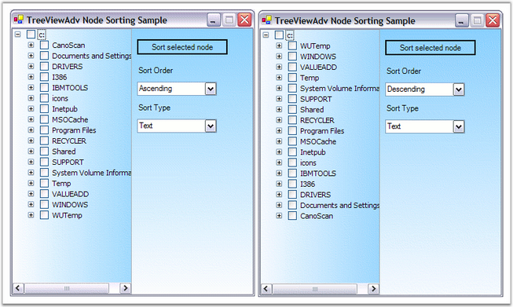

::: {style="DISPLAY: none"}
{#d2h_url_template}{#d2h_package_url style="WIDTH: 0px; DISPLAY: none; HEIGHT: 0px"}
:::

::::: {.d2h_secondary_topic style="PADDING-BOTTOM: 10pt; MARGIN: 0pt; PADDING-LEFT: 0pt; PADDING-RIGHT: 0pt; PADDING-TOP: 0pt"}
#### Sorting {#sorting style="MARGIN-LEFT: 18pt; tab-stops: 18.0pt"}

[]{style="COLOR: #15428b"} 

Sorting can be performed on the tree nodes using the **Sort** function and specifying the function to be performed on either the checkbox or tag or text values in ascending or descending order.

 

The Sort operation sorts only the level 1 nodes. To perform the function on the other levels of nodes, the **SortWithChildNode** property should be set to true. The sort function can be done based on the value type which can be specified using **SortType** to either the option of Checkbox or Tag or Text. The order in which the sort function has to be performed can be specified using the **SortOrder** that holds the values of Ascending or Descending.

[]{style="COLOR: #15428b"} 

::: {align="center"}
+-----------------------------------+-----------------------------------------------------------------------------------------------+
| TreeNodeAdv Properties            | Description                                                                                   |
+-----------------------------------+-----------------------------------------------------------------------------------------------+
| SortOrder                         | The TSortOrder property indicates the order of the sorting:                                   |
|                                   |                                                                                               |
|                                   |                                                                                               |
|                                   |                                                                                               |
|                                   | [·      ]{style="FONT-FAMILY: Symbol"}Ascending,                                              |
|                                   |                                                                                               |
|                                   | [·      ]{style="FONT-FAMILY: Symbol"}Descending,                                             |
|                                   |                                                                                               |
|                                   | [·      ]{style="FONT-FAMILY: Symbol"}None.                                                   |
+-----------------------------------+-----------------------------------------------------------------------------------------------+
| SortType                          | The SortType property indicates the field. Nodes will be sorted based on the type of sorting. |
+-----------------------------------+-----------------------------------------------------------------------------------------------+
:::

**[]{style="COLOR: #15428b"}** 

+----------------------------------------------------------------------------------------------------------------------------+
| **[\[C#\]]{style="FONT-FAMILY: 'Courier New'; COLOR: black"}**                                                             |
|                                                                                                                            |
| []{style="COLOR: #15428b"}                                                                                                 |
|                                                                                                                            |
| [treeNodeAdv9.SortOrder = System.Windows.Forms.SortOrder.Ascending;]{style="FONT-FAMILY: 'Courier New'"}                   |
|                                                                                                                            |
| [treeNodeAdv9.SortType = Syncfusion.Windows.Forms.Tools.TreeNodeAdvSortType.CheckBox;]{style="FONT-FAMILY: 'Courier New'"} |
+----------------------------------------------------------------------------------------------------------------------------+

[]{style="COLOR: #15428b"} 

+-----------------------------------------------------------------------------------------------------------------------------------------------------------------+
| **[\[VB.NET\]]{style="FONT-FAMILY: 'Courier New'; COLOR: black"}**                                                                                              |
|                                                                                                                                                                 |
| []{style="COLOR: #15428b"}                                                                                                                                      |
|                                                                                                                                                                 |
| [TreeNodeAdv9.SortOrder = System.Windows.Forms.SortOrder.Ascending]{style="FONT-FAMILY: 'Courier New'"}                                                         |
|                                                                                                                                                                 |
| [TreeNodeAdv9.SortType = Syncfusion.Windows.Forms.Tools.TreeNodeAdvSortType.CheckBox]{style="FONT-FAMILY: 'Courier New'"}[]{style="FONT-FAMILY: 'Courier New'"} |
+-----------------------------------------------------------------------------------------------------------------------------------------------------------------+

**[]{style="COLOR: #15428b"}** 

Comparing Options for Sorting

**[]{style="COLOR: #15428b"}** 

[·      ]{style="FONT-FAMILY: Symbol"}The **CompareOptions** property gives additional options of comparing the texts of the nodes.

[·      ]{style="FONT-FAMILY: Symbol"}The **Comparer** property is an object that implements the **IComparer** interface. If you need to compare the nodes by some other field, create an object of this type, set it to the node and that node will use the object in comparing the subnodes.

 

::: {align="center"}
+-----------------------------------+--------------------------------------------------------------------------------------------+
| TreeNodeAdv Properties            | Description                                                                                |
+-----------------------------------+--------------------------------------------------------------------------------------------+
| CompareOptions                    | Indicates the compare options used in the sorting of the nodes. The below are the options. |
|                                   |                                                                                            |
|                                   |                                                                                            |
|                                   |                                                                                            |
|                                   | [·      ]{style="FONT-FAMILY: Symbol"}IgnoreCase,                                          |
|                                   |                                                                                            |
|                                   | [·      ]{style="FONT-FAMILY: Symbol"}IgnoreNonSpace,                                      |
|                                   |                                                                                            |
|                                   | [·      ]{style="FONT-FAMILY: Symbol"}IgnoreSymbols,                                       |
|                                   |                                                                                            |
|                                   | [·      ]{style="FONT-FAMILY: Symbol"}IgnoreKanaType,                                      |
|                                   |                                                                                            |
|                                   | [·      ]{style="FONT-FAMILY: Symbol"}IgnoreWidth,                                         |
|                                   |                                                                                            |
|                                   | [·      ]{style="FONT-FAMILY: Symbol"}OrdinalIgnoreCase,                                   |
|                                   |                                                                                            |
|                                   | [·      ]{style="FONT-FAMILY: Symbol"}StringSort and                                       |
|                                   |                                                                                            |
|                                   | [·      ]{style="FONT-FAMILY: Symbol"}Ordinal.                                             |
+-----------------------------------+--------------------------------------------------------------------------------------------+
| Comparer                          | Indicates the  object which compares two nodes.                                            |
+-----------------------------------+--------------------------------------------------------------------------------------------+
:::

[]{style="COLOR: #15428b"} 

+---------------------------------------------------------------------------------------------------------------------+
| **[\[C#\]]{style="FONT-FAMILY: 'Courier New'; COLOR: black"}**                                                      |
|                                                                                                                     |
| []{style="COLOR: #15428b"}                                                                                          |
|                                                                                                                     |
| [treeNodeAdv9.CompareOptions = System.Globalization.CompareOptions.IgnoreCase;]{style="FONT-FAMILY: 'Courier New'"} |
|                                                                                                                     |
| [treeNodeAdv9.Comparer = [null]{style="COLOR: blue"};]{style="FONT-FAMILY: 'Courier New'"}                          |
+---------------------------------------------------------------------------------------------------------------------+

[]{style="COLOR: #15428b"} 

+----------------------------------------------------------------------------------------------------------------------------------------------+
| **[\[VB.NET\]]{style="FONT-FAMILY: 'Courier New'; COLOR: black"}**                                                                           |
|                                                                                                                                              |
| []{style="COLOR: #15428b"}                                                                                                                   |
|                                                                                                                                              |
| [TreeNodeAdv9.CompareOptions = System.Globalization.CompareOptions.IgnoreCase;]{style="FONT-FAMILY: 'Courier New'"}                          |
|                                                                                                                                              |
| [TreeNodeAdv9.Comparer = [Null]{style="COLOR: blue"}]{style="FONT-FAMILY: 'Courier New'"}[]{style="FONT-FAMILY: 'Courier New'; COLOR: blue"} |
+----------------------------------------------------------------------------------------------------------------------------------------------+

**[]{style="COLOR: #15428b"}** 

{border="0"}

[]{style="COLOR: #15428b"} 

Figure 1167: TreeViewAdv Node Sorting based on its Text

**[]{style="COLOR: #15428b"}** 

See Also

[]{style="COLOR: #15428b"} 

[[How to Sort all the nodes in the TreeViewAdv control?]{style="COLOR: windowtext; TEXT-DECORATION: none; text-underline: none"}](../../../../../../../../Documents%20and%20Settings/sylviap/Desktop/Tools%20-%20Part%202.docx#_How_to_Sort)[]{style="COLOR: black"}

 

 

 

 

[]{#related-topics}
:::::
