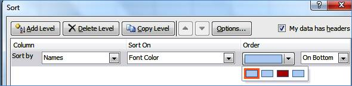

::: {style="DISPLAY: none"}
{#d2h_url_template}{#d2h_package_url style="WIDTH: 0px; DISPLAY: none; HEIGHT: 0px"}
:::

::: {.d2h_secondary_topic style="PADDING-BOTTOM: 10pt; MARGIN: 0pt; PADDING-LEFT: 0pt; PADDING-RIGHT: 0pt; PADDING-TOP: 0pt"}
#### Sorting by Font Color {#sorting-by-font-color style="tab-stops: 0pt"}

With this feature, MS Excel moves the text that is applied with the selected color to the specified location (bottom or top) of the sorting range.

 

{border="0"}

Sorting by Font Color

 

This is explained in the following code snippets:

+-------------------------------------------------------------------------------------------------------------------------------------------------------------------------------------------------------------------------------------------------------------+
| **C#**                                                                                                                                                                                                                                                      |
|                                                                                                                                                                                                                                                             |
| []{style="FONT-FAMILY: Consolas; COLOR: green; FONT-SIZE: 9.5pt"}                                                                                                                                                                                           |
|                                                                                                                                                                                                                                                             |
| [//Creates the data sorter]{style="FONT-FAMILY: Consolas; COLOR: green; FONT-SIZE: 9.5pt"}[]{style="FONT-FAMILY: Consolas; FONT-SIZE: 9.5pt"}                                                                                                               |
|                                                                                                                                                                                                                                                             |
| [IDataSort]{style="FONT-FAMILY: Consolas; COLOR: #2b91af; FONT-SIZE: 9.5pt"}[ sorter = book.CreateDataSorter();]{style="FONT-FAMILY: Consolas; FONT-SIZE: 9.5pt"}                                                                                           |
|                                                                                                                                                                                                                                                             |
| [//Range to sort]{style="FONT-FAMILY: Consolas; COLOR: green; FONT-SIZE: 9.5pt"}[]{style="FONT-FAMILY: Consolas; FONT-SIZE: 9.5pt"}                                                                                                                         |
|                                                                                                                                                                                                                                                             |
| [sorter.SortRange = range;]{style="FONT-FAMILY: Consolas; FONT-SIZE: 9.5pt"}                                                                                                                                                                                |
|                                                                                                                                                                                                                                                             |
| [//Creates the sort field with the column index, sort based on and order by attribute]{style="FONT-FAMILY: Consolas; COLOR: green; FONT-SIZE: 9.5pt"}[]{style="FONT-FAMILY: Consolas; FONT-SIZE: 9.5pt"}                                                    |
|                                                                                                                                                                                                                                                             |
| [ISortField]{style="FONT-FAMILY: Consolas; COLOR: #2b91af; FONT-SIZE: 9.5pt"}[ sortField = sorter.SortFields.Add(2, [SortOn]{style="COLOR: #2b91af"}.FontColor, [OrderBy]{style="COLOR: #2b91af"}.OnTop);]{style="FONT-FAMILY: Consolas; FONT-SIZE: 9.5pt"} |
|                                                                                                                                                                                                                                                             |
| [//Specifies the color to sort the data]{style="FONT-FAMILY: Consolas; COLOR: green; FONT-SIZE: 9.5pt"}[]{style="FONT-FAMILY: Consolas; FONT-SIZE: 9.5pt"}                                                                                                  |
|                                                                                                                                                                                                                                                             |
| [sortField.Color = [Color]{style="COLOR: #2b91af"}.Red;]{style="FONT-FAMILY: Consolas; FONT-SIZE: 9.5pt"}                                                                                                                                                   |
|                                                                                                                                                                                                                                                             |
| [//Sort based on the sort Field attribute]{style="FONT-FAMILY: Consolas; COLOR: green; FONT-SIZE: 9.5pt"}[]{style="FONT-FAMILY: Consolas; FONT-SIZE: 9.5pt"}                                                                                                |
|                                                                                                                                                                                                                                                             |
| [sorter.Sort();]{style="FONT-FAMILY: Consolas; FONT-SIZE: 9.5pt"}                                                                                                                                                                                           |
|                                                                                                                                                                                                                                                             |
|                                                                                                                                                                                                                                                             |
+-------------------------------------------------------------------------------------------------------------------------------------------------------------------------------------------------------------------------------------------------------------+

 

+-----------------------------------------------------------------------------------------------------------------------------------------------------------------------------------------------------------------------+
| **VB**                                                                                                                                                                                                                |
|                                                                                                                                                                                                                       |
|                                                                                                                                                                                                                       |
|                                                                                                                                                                                                                       |
| [\'\'Creates the Data sorter]{style="FONT-FAMILY: Consolas; COLOR: green; FONT-SIZE: 9.5pt"}[]{style="FONT-FAMILY: Consolas; FONT-SIZE: 9.5pt"}                                                                       |
|                                                                                                                                                                                                                       |
| [Dim]{style="FONT-FAMILY: Consolas; COLOR: blue; FONT-SIZE: 9.5pt"}[ sorter [As]{style="COLOR: blue"} [IDataSort]{style="COLOR: #2b91af"} = book.CreateDataSorter()]{style="FONT-FAMILY: Consolas; FONT-SIZE: 9.5pt"} |
|                                                                                                                                                                                                                       |
| [\'\'Specifies the sort range]{style="FONT-FAMILY: Consolas; COLOR: green; FONT-SIZE: 9.5pt"}[]{style="FONT-FAMILY: Consolas; FONT-SIZE: 9.5pt"}                                                                      |
|                                                                                                                                                                                                                       |
| [sorter.SortRange = range]{style="FONT-FAMILY: Consolas; FONT-SIZE: 9.5pt"}                                                                                                                                           |
|                                                                                                                                                                                                                       |
| []{style="FONT-FAMILY: Consolas; FONT-SIZE: 9.5pt"}                                                                                                                                                                   |
|                                                                                                                                                                                                                       |
| [Dim]{style="FONT-FAMILY: Consolas; COLOR: blue; FONT-SIZE: 9.5pt"}[ field [As]{style="COLOR: blue"} [ISortField]{style="COLOR: #2b91af"}]{style="FONT-FAMILY: Consolas; FONT-SIZE: 9.5pt"}                           |
|                                                                                                                                                                                                                       |
| [\'\' Adds the sort field with column index, sort based on and order by attribute]{style="FONT-FAMILY: Consolas; COLOR: green; FONT-SIZE: 9.5pt"}[]{style="FONT-FAMILY: Consolas; FONT-SIZE: 9.5pt"}                  |
|                                                                                                                                                                                                                       |
| [field = sorter.SortFields.Add(2, [SortOn]{style="COLOR: #2b91af"}.FontColor,[OrderBy]{style="COLOR: #2b91af"}.OnTop)]{style="FONT-FAMILY: Consolas; FONT-SIZE: 9.5pt"}                                               |
|                                                                                                                                                                                                                       |
| [\'\'Sorts the data based on this color]{style="FONT-FAMILY: Consolas; COLOR: green; FONT-SIZE: 9.5pt"}[]{style="FONT-FAMILY: Consolas; FONT-SIZE: 9.5pt"}                                                            |
|                                                                                                                                                                                                                       |
| [field.Color = [Color]{style="COLOR: #2b91af"}.Red]{style="FONT-FAMILY: Consolas; FONT-SIZE: 9.5pt"}                                                                                                                  |
|                                                                                                                                                                                                                       |
| [\'\' Sorts the data with the sort field attribute.]{style="FONT-FAMILY: Consolas; COLOR: green; FONT-SIZE: 9.5pt"}[]{style="FONT-FAMILY: Consolas; FONT-SIZE: 9.5pt"}                                                |
|                                                                                                                                                                                                                       |
| [sorter.Sort()]{style="FONT-FAMILY: Consolas; FONT-SIZE: 9.5pt"}                                                                                                                                                      |
|                                                                                                                                                                                                                       |
|                                                                                                                                                                                                                       |
+-----------------------------------------------------------------------------------------------------------------------------------------------------------------------------------------------------------------------+

 

[]{#related-topics}
:::
