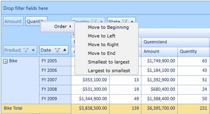

::: {style="DISPLAY: none"}
{#d2h_url_template}{#d2h_package_url style="WIDTH: 0px; DISPLAY: none; HEIGHT: 0px"}
:::

::::: {#nsbanner .d2h_main_nsbanner style="BORDER-BOTTOM: #999999 1px solid; POSITION: relative; PADDING-BOTTOM: 0px; BACKGROUND-COLOR: transparent; PADDING-LEFT: 0px; PADDING-RIGHT: 0px; DISPLAY: none; BORDER-TOP: #999999 1px solid; PADDING-TOP: 0px; LEFT: 0px"}
:::: {#TitleRow .d2h_main_titlerow style="PADDING-BOTTOM: 4px; BACKGROUND-COLOR: transparent; PADDING-LEFT: 22px; WIDTH: 100%; PADDING-RIGHT: 10px; DISPLAY: none; PADDING-TOP: 4px"}
::: {#ienav .d2h_main_ienav style="DISPLAY: none"}
{#D2HPrevious .D2HPreviousEnabled}  {#D2HNext .D2HNextEnabled}
:::
::::
:::::

:::: {#nstext .d2h_main_nstext style="PADDING-BOTTOM: 10px; BACKGROUND-COLOR: transparent; PADDING-LEFT: 22px; PADDING-RIGHT: 10px; HEIGHT: 100%; OVERFLOW: auto; PADDING-TOP: 5px" hasuserbackground="true" valign="bottom"}
::: {#d2h_breadcrumbs .d2h_breadcrumbs}
[Essential Studio User Guide Documentation](ms-xhelp:///?Id=12457748-09e3-4d74-a240-8e049cedf030){.d2h_breadcrumbsNormal}[ \> ]{.d2h_breadcrumbsLinkSeparator}[Business Intelligence Edition](ms-xhelp:///?Id=fdf33dd8-62b2-47b9-ad7b-fc50e590bca5){.d2h_breadcrumbsNormal}[ \> ]{.d2h_breadcrumbsLinkSeparator}[Essential BI Silverlight](ms-xhelp:///?Id=c006b39c-6aa2-4637-b7de-3e7b6cb3f9f9){.d2h_breadcrumbsNormal}[ \> ]{.d2h_breadcrumbsLinkSeparator}[Essential Pivot Grid]{.d2h_breadcrumbsContentsOnly}[ \> ]{.d2h_breadcrumbsLinkSeparator}[Features](ms-xhelp:///?Id=9d7968f1-d52c-4e79-a6ae-fb01305e9f98){.d2h_breadcrumbsNormal}
:::

## Sorting Pivot Fields {#sorting-pivot-fields style="tab-stops: 0pt"}

The pivot row fields, pivot column fields, and PivotComputationInfo fields can be arranged individually in any desired order. The following sorting options are available in the context menu that appears in the grouping bar:

[·      ]{style="FONT-FAMILY: Symbol"}Move to Beginning---Moves the selected item to the beginning position.

[·      ]{style="FONT-FAMILY: Symbol"}Move to Left---Moves the selected item to the immediate left position.

[·      ]{style="FONT-FAMILY: Symbol"}Move to Right---Moves the selected item to the immediate right position.

[·      ]{style="FONT-FAMILY: Symbol"}Move to End---Moves the selected item to the end position.

[·      ]{style="FONT-FAMILY: Symbol"}Smallest to Largest---Arranges the pivot fields based on the field header from first letter to the last.

[·      ]{style="FONT-FAMILY: Symbol"}Largest to Smallest---Arranges the pivot fields based on the field header from last letter to the first.

The above mentioned options will rearrange the fields in the respective pivot item area.

{border="0"}

Sample Link

A demo of this feature is available in the following location:

**C:\\Users\\\<UserName\>\\AppData\\Local\\Syncfusion\\EssentialStudio\\x.x.x.x\\ BI\\Silverlight\\PivotGrid.SL\\ProductShowcase\\GroupingBarDemo**

 

[]{#related-topics}
::::
