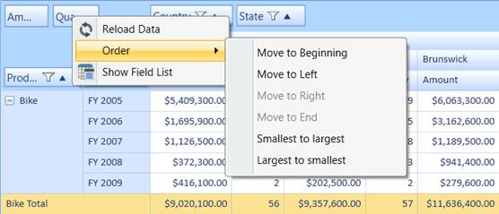

::: {style="DISPLAY: none"}
{#d2h_url_template} {#d2h_package_url style="WIDTH: 0px; DISPLAY: none; HEIGHT: 0px"}
:::

::: {.d2h_secondary_topic style="PADDING-BOTTOM: 10pt; MARGIN: 0pt; PADDING-LEFT: 0pt; PADDING-RIGHT: 0pt; PADDING-TOP: 0pt"}
#### Sorting Pivot Fields {#sorting-pivot-fields style="tab-stops: 0pt"}

The pivot row fields, pivot column fields, and PivotComputationInfo fields can be arranged individually either in ascending or descending order. The following options to handle this arrangement are available in the context menu that appears in the grouping bar:

[·      ]{style="FONT-FAMILY: Symbol"}Smallest to Largest---Arranges the pivot fields based on the field header from first letter to the last.

[·      ]{style="FONT-FAMILY: Symbol"}Largest to Smallest---Arranges the pivot fields based on the field header from last letter to the first.

The above mentioned options will rearrange the fields in the respective pivot item area.

{border="0"}

Figure 38: Sort Options

Sample Link                                                                    

A demo of this feature is available in the following location:

**C:\\Users\\\<UserName\>\\AppData\\Local\\Syncfusion\\EssentialStudio\\x.x.x.x\\ BI\\WPF\\PivotAnalysis.WPF\\Samples\\Grouping Bar\\Context Menu Demo\\**

 

[]{#related-topics}
:::
