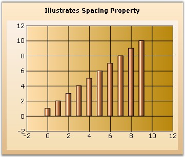

::: {style="DISPLAY: none"}
{#d2h_url_template}{#d2h_package_url style="WIDTH: 0px; DISPLAY: none; HEIGHT: 0px"}
:::

:::: {.d2h_secondary_topic style="PADDING-BOTTOM: 10pt; MARGIN: 0pt; PADDING-LEFT: 0pt; PADDING-RIGHT: 0pt; PADDING-TOP: 0pt"}
#### Spacing {#spacing style="tab-stops: 0pt"}

 

Spacing between data points

 

This specifies the space/width between data points in the x axis. This value is specified in percentage (%) of interval width. So, for example, if the value of the property is 20%, then only 80% of the interval width is used for rendering the data point(s). If there are multiple series then the available width is divided between the data points in the different series. This of course is used only for appropriate chart types like the column chart which has a width component.

 

This property will not be used when **ChartColumnWidth** is set to **FixedWidthMode**.

 

::: {align="center"}
+-------------------------------------+------------------------------------------------------------------------------------------------------------------------------+
|                                                                                                                                                                    |
|                                                                                                                                                                    |
| **Details**                                                                                                                                                        |
+-------------------------------------+------------------------------------------------------------------------------------------------------------------------------+
| **Possible Values**                 | A double value (10 to 99)                                                                                                    |
+-------------------------------------+------------------------------------------------------------------------------------------------------------------------------+
| **Default Value    **               | **30**                                                                                                                       |
+-------------------------------------+------------------------------------------------------------------------------------------------------------------------------+
| **2D / 3D Limitations**             | No                                                                                                                           |
+-------------------------------------+------------------------------------------------------------------------------------------------------------------------------+
| **Applies to Chart Element**        | Any Series and points                                                                                                        |
+-------------------------------------+------------------------------------------------------------------------------------------------------------------------------+
| **Applies to Chart Types**          | Column Charts, BarCharts, Box and Whisker Chart, Gantt Chart, Tornado Chart, Candle Chart, Hilo Chart, Hilo Open Close Chart |
+-------------------------------------+------------------------------------------------------------------------------------------------------------------------------+
:::

 

+-------------------------------------------------------------------------------------------------------------------------------------------------------------------+
| **[\[C#\]]{style="FONT-FAMILY: 'Courier New'; COLOR: black"}**                                                                                                    |
|                                                                                                                                                                   |
| **[]{style="FONT-FAMILY: 'Courier New'; COLOR: black"}**                                                                                                          |
|                                                                                                                                                                   |
| [//Indicates the spacing width in percentage that is to be applied between the datapoints of the column chart.]{style="FONT-FAMILY: 'Courier New'; COLOR: green"} |
|                                                                                                                                                                   |
| [this]{style="FONT-FAMILY: 'Courier New'; COLOR: blue"}[.chartControl1.Spacing = 50;]{style="FONT-FAMILY: 'Courier New'"}                                         |
+-------------------------------------------------------------------------------------------------------------------------------------------------------------------+

 

+--------------------------------------------------------------------------------------------------------------------------------------------------------------------+
| **[\[VB.NET\]]{style="FONT-FAMILY: 'Courier New'; COLOR: black"}**                                                                                                 |
|                                                                                                                                                                    |
| []{style="FONT-FAMILY: 'Courier New'; COLOR: green"}                                                                                                               |
|                                                                                                                                                                    |
| [\'Indicates the spacing width in percentage that is to be applied between the data points of the column chart.]{style="FONT-FAMILY: 'Courier New'; COLOR: green"} |
|                                                                                                                                                                    |
| [Me]{style="FONT-FAMILY: 'Courier New'; COLOR: blue"}[.chartControl1.Spacing = 50]{style="FONT-FAMILY: 'Courier New'"}                                             |
+--------------------------------------------------------------------------------------------------------------------------------------------------------------------+

 

{border="0"}

 

Figure 206: Series rendered with 50 percent Spacing

 

See Also

 

[Column Charts]{.UGHyperlink}, [BarCharts]{.UGHyperlink}, [Box and Whisker Chart]{.UGHyperlink}, [Gantt Chart]{.UGHyperlink}, [Tornado Chart]{.UGHyperlink}, [Candle Chart]{.UGHyperlink}, [Hilo Chart]{.UGHyperlink}, [Hilo Open Close Chart]{.UGHyperlink}[]{.UGHyperlink}

 

[]{#p151} 

 

[]{#related-topics}
::::
