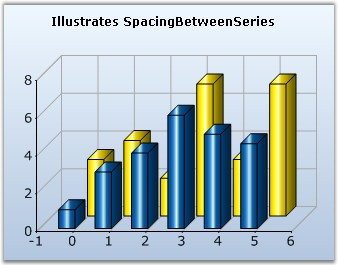

::: {style="DISPLAY: none"}
{#d2h_url_template}{#d2h_package_url style="WIDTH: 0px; DISPLAY: none; HEIGHT: 0px"}
:::

:::: {.d2h_secondary_topic style="PADDING-BOTTOM: 10pt; MARGIN: 0pt; PADDING-LEFT: 0pt; PADDING-RIGHT: 0pt; PADDING-TOP: 0pt"}
#### SpacingBetweenSeries {#spacingbetweenseries style="tab-stops: 0pt"}

[]{style="FONT-FAMILY: 'Trebuchet MS','sans-serif'; FONT-SIZE: 9pt"} 

Essential Chart provides support to control the spacing between series using **SpacingBetweenSeries** property.

[]{style="FONT-FAMILY: 'Trebuchet MS','sans-serif'; FONT-SIZE: 9pt"} 

::: {align="center"}
+--------------------------+------------------------------------------------------------------------------------------------------------------------------------------------------------+
| Details                                                                                                                                                                               |
+--------------------------+------------------------------------------------------------------------------------------------------------------------------------------------------------+
| Possible Values          | A double value (10 to 100)                                                                                                                                 |
+--------------------------+------------------------------------------------------------------------------------------------------------------------------------------------------------+
| Default Value            | 10                                                                                                                                                         |
+--------------------------+------------------------------------------------------------------------------------------------------------------------------------------------------------+
| 2D / 3D Limitations      | No                                                                                                                                                         |
+--------------------------+------------------------------------------------------------------------------------------------------------------------------------------------------------+
| Applies to Chart Element | Any Series                                                                                                                                                 |
+--------------------------+------------------------------------------------------------------------------------------------------------------------------------------------------------+
| Applies to Chart Types   | Area Charts, BarCharts, Line Charts, Bubble Chart, Financial Charts, Gantt Chart, Histogram chart, Tornado Chart, Combination Chart, Box and Whisker Chart |
+--------------------------+------------------------------------------------------------------------------------------------------------------------------------------------------------+
:::

[]{style="FONT-FAMILY: 'Trebuchet MS','sans-serif'; FONT-SIZE: 9pt"} 

+---------------------------------------------------------------------------------------------------------------------------------------------------------+
| **[\[C#\]]{style="FONT-FAMILY: 'Courier New'; COLOR: black"}**                                                                                          |
|                                                                                                                                                         |
| []{style="FONT-FAMILY: 'Courier New'; COLOR: green"}                                                                                                    |
|                                                                                                                                                         |
| [//Specifies the spacing between individual series.]{style="FONT-FAMILY: 'Courier New'; COLOR: green"}                                                  |
|                                                                                                                                                         |
| [this]{style="FONT-FAMILY: 'Courier New'; COLOR: blue"}[.ChartWebControl1.SpacingBetweenSeries = 20;]{style="FONT-FAMILY: 'Courier New'; COLOR: black"} |
+---------------------------------------------------------------------------------------------------------------------------------------------------------+

[]{style="FONT-FAMILY: 'Trebuchet MS','sans-serif'; FONT-SIZE: 9pt"} 

+------------------------------------------------------------------------------------------------------------------------------------------------------+
| **[\[VB.NET\]]{style="FONT-FAMILY: 'Courier New'; COLOR: black"}**                                                                                   |
|                                                                                                                                                      |
| **[]{style="FONT-FAMILY: 'Courier New'; COLOR: black"}**                                                                                             |
|                                                                                                                                                      |
| [\'Specifies the spacing between individual series.]{style="FONT-FAMILY: 'Courier New'; COLOR: green"}                                               |
|                                                                                                                                                      |
| [Me]{style="FONT-FAMILY: 'Courier New'; COLOR: blue"}[.ChartWebControl1.SpacingBetweenSeries = 20]{style="FONT-FAMILY: 'Courier New'; COLOR: black"} |
+------------------------------------------------------------------------------------------------------------------------------------------------------+

[]{style="FONT-FAMILY: 'Trebuchet MS','sans-serif'; FONT-SIZE: 9pt"} 

{border="0"}

[]{style="FONT-FAMILY: 'Trebuchet MS','sans-serif'; FONT-SIZE: 9pt"} 

Figure 201: Chart with default Spacing between Series

**[]{style="FONT-FAMILY: 'Trebuchet MS','sans-serif'; FONT-SIZE: 9pt"}** 

{border="0"}

[]{style="FONT-FAMILY: 'Trebuchet MS','sans-serif'; FONT-SIZE: 9pt"} 

Figure 202: Chart with SpacingBetweenSeries set to \"80\"

 

See Also

[]{style="FONT-FAMILY: 'Trebuchet MS','sans-serif'; FONT-SIZE: 9pt"} 

[Pyramid Chart]{.UGHyperlink}[, ]{.UGHyperlink}[Funnel Chart]{.UGHyperlink}[, ]{.UGHyperlink}[Area Charts]{.UGHyperlink}[, ]{.UGHyperlink}[Bar Charts]{.UGHyperlink}[, ]{.UGHyperlink}[Bubble Chart]{.UGHyperlink}[, ]{.UGHyperlink}[Column Charts]{.UGHyperlink}[, ]{.UGHyperlink}[Candle Chart]{.UGHyperlink}[, ]{.UGHyperlink}[Renko chart]{.UGHyperlink}[, ]{.UGHyperlink}[Three Line Break Chart]{.UGHyperlink}[, ]{.UGHyperlink}[Box and Whisker Chart]{.UGHyperlink}[, ]{.UGHyperlink}[Gantt Chart]{.UGHyperlink}[, ]{.UGHyperlink}[Histogram Chart]{.UGHyperlink}[, ]{.UGHyperlink}[Tornado Chart]{.UGHyperlink}[, ]{.UGHyperlink}[Polar and Radar Chart]{.UGHyperlink}[, ]{.UGHyperlink}[Pie Chart]{.UGHyperlink}[]{.UGHyperlink}

[]{#p153} 

[]{#related-topics}
::::
