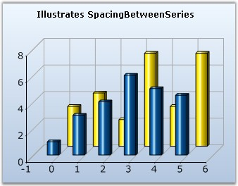

::: {style="DISPLAY: none"}
{#d2h_url_template}{#d2h_package_url style="WIDTH: 0px; DISPLAY: none; HEIGHT: 0px"}
:::

:::: {.d2h_secondary_topic style="PADDING-BOTTOM: 10pt; MARGIN: 0pt; PADDING-LEFT: 0pt; PADDING-RIGHT: 0pt; PADDING-TOP: 0pt"}
#### SpacingBetweenSeries {#spacingbetweenseries style="tab-stops: 0pt"}

 

Essential Chart provides support to control the spacing between series using **SpacingBetweenSeries** property.

 

::: {align="center"}
+------------------------------+------------------------------------------------------------------------------------------------------------------------------------------------------------+
| Details                                                                                                                                                                                   |
+------------------------------+------------------------------------------------------------------------------------------------------------------------------------------------------------+
| **Possible Values**          | A double value (10 to 100)                                                                                                                                 |
+------------------------------+------------------------------------------------------------------------------------------------------------------------------------------------------------+
| **Default Value    **        | 10                                                                                                                                                         |
+------------------------------+------------------------------------------------------------------------------------------------------------------------------------------------------------+
| **2D / 3D Limitations**      | No                                                                                                                                                         |
+------------------------------+------------------------------------------------------------------------------------------------------------------------------------------------------------+
| **Applies to Chart Element** | Any Series                                                                                                                                                 |
+------------------------------+------------------------------------------------------------------------------------------------------------------------------------------------------------+
| **Applies to Chart Types**   | Area Charts, BarCharts, Line Charts, Bubble Chart, Financial Charts, Gantt Chart, Histogram chart, Tornado Chart, Combination Chart, Box and Whisker Chart |
+------------------------------+------------------------------------------------------------------------------------------------------------------------------------------------------------+
:::

 

+------------------------------------------------------------------------------------------------------------------------------------------------------+
| **[\[C#\]]{style="FONT-FAMILY: 'Courier New'; COLOR: black"}**                                                                                       |
|                                                                                                                                                      |
| []{style="FONT-FAMILY: 'Courier New'; COLOR: green"}                                                                                                 |
|                                                                                                                                                      |
| [//Specifies the spacing between individual series.]{style="FONT-FAMILY: 'Courier New'; COLOR: green"}                                               |
|                                                                                                                                                      |
| [this]{style="FONT-FAMILY: 'Courier New'; COLOR: blue"}[.chartControl1.SpacingBetweenSeries = 20;]{style="FONT-FAMILY: 'Courier New'; COLOR: black"} |
+------------------------------------------------------------------------------------------------------------------------------------------------------+

 

+---------------------------------------------------------------------------------------------------------------------------------------------------+
| **[\[VB.NET\]]{style="FONT-FAMILY: 'Courier New'; COLOR: black"}**                                                                                |
|                                                                                                                                                   |
| **[]{style="FONT-FAMILY: 'Courier New'; COLOR: black"}**                                                                                          |
|                                                                                                                                                   |
| [\'Specifies the spacing between individual series.]{style="FONT-FAMILY: 'Courier New'; COLOR: green"}                                            |
|                                                                                                                                                   |
| [Me]{style="FONT-FAMILY: 'Courier New'; COLOR: blue"}[.chartControl1.SpacingBetweenSeries = 20]{style="FONT-FAMILY: 'Courier New'; COLOR: black"} |
+---------------------------------------------------------------------------------------------------------------------------------------------------+

 

{border="0"}

 

Figure 207: Chart with default Spacing between Series

 

{border="0"}

 

Figure 208: Chart with SpacingBetweenSeries = \"80\"

 

**See Also**

 

[Area Charts]{.UGHyperlink}, [BarCharts]{.UGHyperlink}, [Line Charts]{.UGHyperlink}, [Column Charts]{.UGHyperlink}, [Bubble Chart]{.UGHyperlink}, [Financial Charts]{.UGHyperlink}, [Gantt Chart]{.UGHyperlink}, [Histogram chart]{.UGHyperlink}, [Tornado Chart]{.UGHyperlink}, [Combination Chart]{.UGHyperlink}, [Box and Whisker Chart]{.UGHyperlink}[]{style="COLOR: black"}

 

[]{#p152} 

 

[]{#related-topics}
::::
