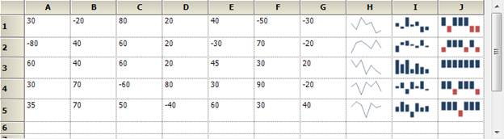
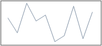
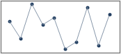

::: {style="DISPLAY: none"}
{#d2h_url_template}{#d2h_package_url style="WIDTH: 0px; DISPLAY: none; HEIGHT: 0px"}
:::

::::: {#nsbanner .d2h_main_nsbanner style="BORDER-BOTTOM: #999999 1px solid; POSITION: relative; PADDING-BOTTOM: 0px; BACKGROUND-COLOR: transparent; PADDING-LEFT: 0px; PADDING-RIGHT: 0px; DISPLAY: none; BORDER-TOP: #999999 1px solid; PADDING-TOP: 0px; LEFT: 0px"}
:::: {#TitleRow .d2h_main_titlerow style="PADDING-BOTTOM: 4px; BACKGROUND-COLOR: transparent; PADDING-LEFT: 22px; WIDTH: 100%; PADDING-RIGHT: 10px; DISPLAY: none; PADDING-TOP: 4px"}
::: {#ienav .d2h_main_ienav style="DISPLAY: none"}
{#D2HPrevious .D2HPreviousEnabled}  {#D2HNext .D2HNextEnabled}
:::
::::
:::::

:::: {#nstext .d2h_main_nstext style="PADDING-BOTTOM: 10px; BACKGROUND-COLOR: transparent; PADDING-LEFT: 22px; PADDING-RIGHT: 10px; HEIGHT: 100%; OVERFLOW: auto; PADDING-TOP: 5px" hasuserbackground="true" valign="bottom"}
::: {#d2h_breadcrumbs .d2h_breadcrumbs}
[Essential Studio User Guide Documentation](ms-xhelp:///?Id=12457748-09e3-4d74-a240-8e049cedf030){.d2h_breadcrumbsNormal}[ \> ]{.d2h_breadcrumbsLinkSeparator}[User Interface Edition](ms-xhelp:///?Id=c29296b7-531c-413b-a0ec-488ca1f7f669){.d2h_breadcrumbsNormal}[ \> ]{.d2h_breadcrumbsLinkSeparator}[Essential Windows](ms-xhelp:///?Id=e60759d8-47a4-4570-9d7a-16a68d63f2ea){.d2h_breadcrumbsNormal}[ \> ]{.d2h_breadcrumbsLinkSeparator}[Essential Chart]{.d2h_breadcrumbsContentsOnly}[ \> ]{.d2h_breadcrumbsLinkSeparator}[Concepts and Features](ms-xhelp:///?Id=71321e9c-336c-4c1c-a127-be9f135ad4bb){.d2h_breadcrumbsNormal}[ \> ]{.d2h_breadcrumbsLinkSeparator}[Chart Types](ms-xhelp:///?Id=cf461556-638d-4482-bf48-b839cfdbac14){.d2h_breadcrumbsNormal}
:::

### Sparkline {#sparkline style="tab-stops: 0pt"}

 

Sparkline Overview

 

A Sparkline control is a type of information graphic characterized by its small size, high data density and lightweight. It presents trends and [variations in a very condensed fashion. The Sparkline does not contain an axis scale and is intended to give a high level overview of what happened to the data over time.]{style="COLOR: black"}

[]{style="COLOR: black"} 

Use Case Scenarios

 

A sparkline can display a trend based on adjacent data in a clear and compact graphical representation. The purpose of sparkline is to quickly see the data range difference with high density data and it is represented in lightweight graphical representation. You can use it as per your requirement.

The following screenshot shows three  types of sparklines, which are  drawn inside the grid control cell, based on row values.

 

 {border="0"}

Figure 88: Sparkline control in RealTime

[]{style="LINE-HEIGHT: 115%; FONT-FAMILY: 'Segoe UI','sans-serif'; COLOR: #666666; FONT-SIZE: 7.5pt"} 

Tables for Properties, Methods, and Events

 

Properties

 

+--------------------------------------------------------+--------------------------------------------------------------------------------------------------------+-------------+---------------+---------------------+
| **Property**                                           | **Description**                                                                                        | **Type**    | **Data Type** | **Reference links** |
+========================================================+========================================================================================================+=============+===============+=====================+
| Type[ ]{style="COLOR: #c00000"}                        | Specifies the types of spark lines.                                                                    | NA          | NA            | NA                  |
|                                                        |                                                                                                        |             |               |                     |
|                                                        | [·      ]{style="FONT-FAMILY: Symbol"}Line                                                             |             |               |                     |
|                                                        |                                                                                                        |             |               |                     |
|                                                        | [·      ]{style="FONT-FAMILY: Symbol"}Column                                                           |             |               |                     |
|                                                        |                                                                                                        |             |               |                     |
|                                                        | [·      ]{style="FONT-FAMILY: Symbol"}WinLoss                                                          |             |               |                     |
|                                                        |                                                                                                        |             |               |                     |
|                                                        | By default, it is set to **Line** type.[]{style="COLOR: #c00000"}                                      |             |               |                     |
+--------------------------------------------------------+--------------------------------------------------------------------------------------------------------+-------------+---------------+---------------------+
| Source[]{style="FONT-FAMILY: 'Segoe UI','sans-serif'"} | Gets or sets the data source for sparkline data points[]{style="FONT-FAMILY: 'Segoe UI','sans-serif'"} | NA          | NA            | NA                  |
+--------------------------------------------------------+--------------------------------------------------------------------------------------------------------+-------------+---------------+---------------------+
| LineStyle                                              | Customizes the styles of Line sparkline                                                                | NA          | NA            | NA                  |
+--------------------------------------------------------+--------------------------------------------------------------------------------------------------------+-------------+---------------+---------------------+
| ColumnStyle                                            | Customizes the styles of Column and Winloss sparklines                                                 | NA          | NA            | NA                  |
+--------------------------------------------------------+--------------------------------------------------------------------------------------------------------+-------------+---------------+---------------------+
| Markers                                                | Enables the markers support to sparkline                                                               | NA          | NA            | NA                  |
+--------------------------------------------------------+--------------------------------------------------------------------------------------------------------+-------------+---------------+---------------------+
| BackInterior                                           | Customizes the background color of the control. By default, it is set to White color                   | NA          | NA            | NA                  |
+--------------------------------------------------------+--------------------------------------------------------------------------------------------------------+-------------+---------------+---------------------+

 

Methods

 

  Method          Description                                       Parameters   Type   Return Type   Reference links
  --------------- ------------------------------------------------- ------------ ------ ------------- -----------------
  GetHighPoint    Gets the highest point value from the sparkline   NA           NA     Void          NA
  GetLowPoint     Gets the lowest point value from the sparkline    NA           NA     Void          NA
  GetStartPoint   Gets the start point value from the sparkline     NA           NA     Void          NA
  GetEndPoint     Gets the end point value from the sparkline       NA           NA     Void          NA

***[]{style="COLOR: black"}*** 

Events

NA

 

Sample Link

 

To access a Sparkline sample Demo:

1.   Open the Syncfusion Dashboard.

2.   Select User Interface.

3.   Click the **Windows Forms** drop-down list and select **Explore Samples**.

4.   Navigate to **Chart.Windows** -\> **Samples** -\> **2.0** -\> **SparklineChart**.

 

 

Types of Sparklines

 

Presently, Syncfusion SparkLine control supports three types of Sparklines and the sparkline control must be bound to a data source. It supports a variety of datasource such as DataTable and any component that implements the interface IEumerable, ICollection, IList.

 

[·      ]{style="FONT-FAMILY: Symbol"}Line

[·      ]{style="FONT-FAMILY: Symbol"}Column

[·      ]{style="FONT-FAMILY: Symbol"}WinLoss

 

 

Drawing Line Sparkline in an Application\
\

The line type of spark line represents a set of data points, connected by a line.

Refer to the following code snippets to draw  the line sparkline.

 

+----------------------------------------------------------------------------------------------------------------------------------------------------------------------------------------------------------------------------------+
| **[\[C#.NET\]]{style="FONT-FAMILY: 'Courier New'"}**                                                                                                                                                                             |
|                                                                                                                                                                                                                                  |
| [//Set Sparkline points to source property]{style="FONT-FAMILY: 'Courier New'; COLOR: green"}**[]{style="FONT-FAMILY: 'Courier New'"}**                                                                                          |
|                                                                                                                                                                                                                                  |
| [this]{style="FONT-FAMILY: 'Courier New'; COLOR: blue"}[.sparkLine1.Source =[new]{style="COLOR: blue"} [double]{style="COLOR: blue"}\[\] { 30, -20, 80, 20, 40, -50, -30, 70,    -40, 50 };]{style="FONT-FAMILY: 'Courier New'"} |
|                                                                                                                                                                                                                                  |
| [//Set line type sparkline]{style="FONT-FAMILY: 'Courier New'; COLOR: green"}**[]{style="FONT-FAMILY: 'Courier New'"}**                                                                                                          |
|                                                                                                                                                                                                                                  |
| [this]{style="FONT-FAMILY: 'Courier New'; COLOR: blue"}[.sparkLine1.Type = [SparkLine]{style="COLOR: #2b91af"}.[SparkLineType]{style="COLOR: #2b91af"}.Line;]{style="FONT-FAMILY: 'Courier New'"}                                |
+----------------------------------------------------------------------------------------------------------------------------------------------------------------------------------------------------------------------------------+

 

 

+------------------------------------------------------------------------------------------------------------------------------------------------------------------------------------------------------------------------+
| **[\[VB.NET\]]{style="FONT-FAMILY: 'Courier New'"}**                                                                                                                                                                   |
|                                                                                                                                                                                                                        |
| [\'Set Sparkline points to source property]{style="FONT-FAMILY: 'Courier New'; COLOR: green"}                                                                                                                          |
|                                                                                                                                                                                                                        |
| [Me]{style="FONT-FAMILY: 'Courier New'; COLOR: blue"}[.sparkLine1.Source = [New]{style="COLOR: blue"} [Double]{style="COLOR: blue"}() {30, -20, 80, 20, 40, -50,-30, 70, -40, 50}]{style="FONT-FAMILY: 'Courier New'"} |
|                                                                                                                                                                                                                        |
| []{style="FONT-FAMILY: 'Courier New'"}                                                                                                                                                                                 |
|                                                                                                                                                                                                                        |
| [\'Set line type sparkline]{style="FONT-FAMILY: 'Courier New'; COLOR: green"}                                                                                                                                          |
|                                                                                                                                                                                                                        |
| [Me]{style="FONT-FAMILY: 'Courier New'; COLOR: blue"}[.sparkLine1.Type = [SparkLine]{style="COLOR: #2b91af"}.[SparkLineType]{style="COLOR: #2b91af"}.Line[]{style="COLOR: green"}]{style="FONT-FAMILY: 'Courier New'"} |
+------------------------------------------------------------------------------------------------------------------------------------------------------------------------------------------------------------------------+

 

 

{border="0"}

Figure 89: Line SparkLine

 

 

Drawing Column Sparkline in an Application\
\

The column type of spark line represents each data point by a column. The vertical column direction represents the  negative or positive value.\
\

Refer to the following code snippets to draw  the  column sparkline:

 

+----------------------------------------------------------------------------------------------------------------------------------------------------------------------------------------------------------------------------------+
| **[\[C#.NET\]]{style="FONT-FAMILY: 'Courier New'"}**                                                                                                                                                                             |
|                                                                                                                                                                                                                                  |
| [//Set Sparkline points to source property]{style="FONT-FAMILY: 'Courier New'; COLOR: green"}**[]{style="FONT-FAMILY: 'Courier New'"}**                                                                                          |
|                                                                                                                                                                                                                                  |
| [this]{style="FONT-FAMILY: 'Courier New'; COLOR: blue"}[.sparkLine1.Source =[new]{style="COLOR: blue"} [double]{style="COLOR: blue"}\[\] { 30, -20, 80, 20, 40, -50, -30, 70,    -40, 50 };]{style="FONT-FAMILY: 'Courier New'"} |
|                                                                                                                                                                                                                                  |
| [//Set line type sparkline]{style="FONT-FAMILY: 'Courier New'; COLOR: green"}**[]{style="FONT-FAMILY: 'Courier New'"}**                                                                                                          |
|                                                                                                                                                                                                                                  |
| [this]{style="FONT-FAMILY: 'Courier New'; COLOR: blue"}[.sparkLine1.Type = [SparkLine]{style="COLOR: #2b91af"}.[SparkLineType]{style="COLOR: #2b91af"}.Column;]{style="FONT-FAMILY: 'Courier New'"}                              |
+----------------------------------------------------------------------------------------------------------------------------------------------------------------------------------------------------------------------------------+

 

 

+---------------------------------------------------------------------------------------------------------------------------------------------------------------------------------------------------------------------------+
| **[\[VB.NET\]]{style="FONT-FAMILY: 'Courier New'"}**                                                                                                                                                                      |
|                                                                                                                                                                                                                           |
| [\'Set Sparkline points to source property]{style="FONT-FAMILY: 'Courier New'; COLOR: green"}                                                                                                                             |
|                                                                                                                                                                                                                           |
| [Me]{style="FONT-FAMILY: 'Courier New'; COLOR: blue"}[.sparkLine1.Source = [New]{style="COLOR: blue"} [Double]{style="COLOR: blue"}() {30, -20, 80, 20, 40, -50,-30, 70, -40, 50}]{style="FONT-FAMILY: 'Courier New'"}    |
|                                                                                                                                                                                                                           |
| []{style="FONT-FAMILY: 'Courier New'"}                                                                                                                                                                                    |
|                                                                                                                                                                                                                           |
| [\'Set line type sparkline]{style="FONT-FAMILY: 'Courier New'; COLOR: green"}                                                                                                                                             |
|                                                                                                                                                                                                                           |
| [Me]{style="FONT-FAMILY: 'Courier New'; COLOR: blue"}[.sparkLine1.Type = [SparkLine]{style="COLOR: #2b91af"}.[SparkLineType]{style="COLOR: #2b91af"}. Column[]{style="COLOR: green"}]{style="FONT-FAMILY: 'Courier New'"} |
+---------------------------------------------------------------------------------------------------------------------------------------------------------------------------------------------------------------------------+

 

{border="0"}

Figure 90: Column SparkLine

 

 

Drawing WinLoss Sparkline in an Application

 

The Winloss type of spark line is similar to column type but all columns have equal length for data points.   The vertical column direction represents the negative or positive value.\
\

Refer to the following code snippets to draw the WinLoss sparkline:

 

+----------------------------------------------------------------------------------------------------------------------------------------------------------------------------------------------------------------------------------+
| **[\[C#.NET\]]{style="FONT-FAMILY: 'Courier New'"}**                                                                                                                                                                             |
|                                                                                                                                                                                                                                  |
| [//Set Sparkline points to source property]{style="FONT-FAMILY: 'Courier New'; COLOR: green"}**[]{style="FONT-FAMILY: 'Courier New'"}**                                                                                          |
|                                                                                                                                                                                                                                  |
| [this]{style="FONT-FAMILY: 'Courier New'; COLOR: blue"}[.sparkLine1.Source =[new]{style="COLOR: blue"} [double]{style="COLOR: blue"}\[\] { 30, -20, 80, 20, 40, -50, -30, 70,    -40, 50 };]{style="FONT-FAMILY: 'Courier New'"} |
|                                                                                                                                                                                                                                  |
| [//Set line type sparkline]{style="FONT-FAMILY: 'Courier New'; COLOR: green"}**[]{style="FONT-FAMILY: 'Courier New'"}**                                                                                                          |
|                                                                                                                                                                                                                                  |
| [this]{style="FONT-FAMILY: 'Courier New'; COLOR: blue"}[.sparkLine1.Type = [SparkLine]{style="COLOR: #2b91af"}.[SparkLineType]{style="COLOR: #2b91af"}.WinLoss;]{style="FONT-FAMILY: 'Courier New'"}                             |
+----------------------------------------------------------------------------------------------------------------------------------------------------------------------------------------------------------------------------------+

 

 

+----------------------------------------------------------------------------------------------------------------------------------------------------------------------------------------------------------------------------+
| **[\[VB.NET\]]{style="FONT-FAMILY: 'Courier New'"}**                                                                                                                                                                       |
|                                                                                                                                                                                                                            |
| [\'Set Sparkline points to source property]{style="FONT-FAMILY: 'Courier New'; COLOR: green"}                                                                                                                              |
|                                                                                                                                                                                                                            |
| [Me]{style="FONT-FAMILY: 'Courier New'; COLOR: blue"}[.sparkLine1.Source = [New]{style="COLOR: blue"} [Double]{style="COLOR: blue"}() {30, -20, 80, 20, 40, -50,-30, 70, -40, 50}]{style="FONT-FAMILY: 'Courier New'"}     |
|                                                                                                                                                                                                                            |
| []{style="FONT-FAMILY: 'Courier New'"}                                                                                                                                                                                     |
|                                                                                                                                                                                                                            |
| [\'Set line type sparkline]{style="FONT-FAMILY: 'Courier New'; COLOR: green"}                                                                                                                                              |
|                                                                                                                                                                                                                            |
| [Me]{style="FONT-FAMILY: 'Courier New'; COLOR: blue"}[.sparkLine1.Type = [SparkLine]{style="COLOR: #2b91af"}.[SparkLineType]{style="COLOR: #2b91af"}. WinLoss[]{style="COLOR: green"}]{style="FONT-FAMILY: 'Courier New'"} |
+----------------------------------------------------------------------------------------------------------------------------------------------------------------------------------------------------------------------------+

 

 

 

{border="0"}

Figure 91: WinLoss SparkLine

 

Marker Support

 

The markers are visual indicators to represent the location of data points in the Sparkline graph. The markers can support three types of sparklines.

 

  --------------------------------------------------------------- ------------------------------------------------------------------------------------------------------------------------------------------------------------
  Marker Property                                                 Description
  ShowMarker                                                      Indicates whether the marker should be displayed at every data point location in line sparkline. By default it is set to False.
  ShowHighPoint[]{style="FONT-FAMILY: 'Segoe UI','sans-serif'"}   Enables  markers to show the highest values  in  all types of sparklines. By default it is set to False.
  ShowLowPoint                                                    Enables  markers to show the  lowest values  in  all types of sparklines. By default it is set to  False.
  ShowStartPoint                                                  Enables  markers show start values  in  all types of sparklines. By default it is set to False.
  ShowEndPoint                                                    Enables  markers to show end values in  all types of sparklines. By default it is set to  False.
  ShowNegativePoint                                               Enables  markers to show  negative values  in  all types of sparklines. By default it is set to  False.
  MarkerColor                                                     Gets or sets the marker color for line type sparkline. This property color is set to sparkline marker when enabling the ShowMarker property.
  HighPointColor                                                  Gets or sets the high point color for  line type sparkline. This property color is set to sparkline marker when enablinge the ShowHighPoint property.
  LowPointColor                                                   Gets or sets the low point color to line type sparkline. This property color is set to sparkline marker when enabling the ShowLowPoint property.
  StartPointColor                                                 Gets or sets the start point color for  line type sparkline. This property color is set to sparkline marker when enabling the ShowStartPoint property.
  EndPointColor                                                   Gets or sets the end point color to line type sparkline. This property color is set to sparkline marker when enabling the ShowEndPoint property.
  NegativePointColor                                              Gets or sets the negative point color to line type sparkline. This property color is set to sparkline marker when enabling the ShowNegativePoint property.
  --------------------------------------------------------------- ------------------------------------------------------------------------------------------------------------------------------------------------------------

 

Markers Support for Line

 

This marker feature supports  data points of line sparkline. You can choose the marker color for data points.  

Refer to the following code snippets to enable the marker in line sparkline.

 

+------------------------------------------------------------------------------------------------------------------------------------------------------------+
| **[\[C#.NET\]]{style="FONT-FAMILY: 'Courier New'"}**                                                                                                       |
|                                                                                                                                                            |
| [//To enable marker to sparkline for all data points]{style="FONT-FAMILY: 'Courier New'; COLOR: green"}**[]{style="FONT-FAMILY: 'Courier New'"}**          |
|                                                                                                                                                            |
| [this]{style="FONT-FAMILY: 'Courier New'; COLOR: blue"}[.sparkLine1.Markers.ShowMarker  =[true]{style="COLOR: blue"};]{style="FONT-FAMILY: 'Courier New'"} |
+------------------------------------------------------------------------------------------------------------------------------------------------------------+

 

+---------------------------------------------------------------------------------------------------------------------------------------------------------+
| **[\[VB.NET\]]{style="FONT-FAMILY: 'Courier New'"}**                                                                                                    |
|                                                                                                                                                         |
| [\'To enable marker to sparkline for all data points]{style="FONT-FAMILY: 'Courier New'; COLOR: green"}**[]{style="FONT-FAMILY: 'Courier New'"}**       |
|                                                                                                                                                         |
| [Me]{style="FONT-FAMILY: 'Courier New'; COLOR: blue"}[.sparkLine1.Markers.ShowMarker  =[True]{style="COLOR: blue"}]{style="FONT-FAMILY: 'Courier New'"} |
+---------------------------------------------------------------------------------------------------------------------------------------------------------+

 

{border="0"}

Figure 92: Marker for Line SparkLine

 

Markers Support for Column\
\

This marker feature supports High Points, Low Points, Start Point and Negative Point of column sparkline.  You can choose the marker color for data points.\
\

Refer to the following code snippets to enable the marker in column sparkline.

 

+-----------------------------------------------------------------------------------------------------------------------------------------------------------------------------------------------------------------------------------------------------------------------------------------------------------------------------------------+
| **[\[C#.NET\]]{style="FONT-FAMILY: 'Courier New'"}**                                                                                                                                                                                                                                                                                    |
|                                                                                                                                                                                                                                                                                                                                         |
| [//To enable marker to sparkline high,low,start,end,negative data points]{style="FONT-FAMILY: 'Courier New'; COLOR: green"}**[]{style="FONT-FAMILY: 'Courier New'"}**                                                                                                                                                                   |
|                                                                                                                                                                                                                                                                                                                                         |
| [this]{style="FONT-FAMILY: 'Courier New'; COLOR: blue"}[.sparkLine1.Markers.ShowHighPoint = [true]{style="COLOR: blue"};]{style="FONT-FAMILY: 'Courier New'"}                                                                                                                                                                           |
|                                                                                                                                                                                                                                                                                                                                         |
| [this]{style="FONT-FAMILY: 'Courier New'; COLOR: blue"}[.sparkLine1.Markers.ShowLowPoint = [true]{style="COLOR: blue"};]{style="FONT-FAMILY: 'Courier New'"}                                                                                                                                                                            |
|                                                                                                                                                                                                                                                                                                                                         |
| [this]{style="FONT-FAMILY: 'Courier New'; COLOR: blue"}[.sparkLine1.Markers.ShowStartPoint = [true]{style="COLOR: blue"};]{style="FONT-FAMILY: 'Courier New'"}                                                                                                                                                                          |
|                                                                                                                                                                                                                                                                                                                                         |
| [this]{style="FONT-FAMILY: 'Courier New'; COLOR: blue"}[.sparkLine1.Markers.ShowEndPoint = [true]{style="COLOR: blue"};]{style="FONT-FAMILY: 'Courier New'"}                                                                                                                                                                            |
|                                                                                                                                                                                                                                                                                                                                         |
| [this]{style="FONT-FAMILY: 'Courier New'; COLOR: blue"}[.sparkLine1.Markers.ShowNegativePoint= [true]{style="COLOR: blue"};]{style="FONT-FAMILY: 'Courier New'"}                                                                                                                                                                        |
|                                                                                                                                                                                                                                                                                                                                         |
| []{style="FONT-FAMILY: 'Courier New'"}                                                                                                                                                                                                                                                                                                  |
|                                                                                                                                                                                                                                                                                                                                         |
| [//To customize the marker color to low points]{style="FONT-FAMILY: 'Courier New'; COLOR: green"}[]{style="FONT-FAMILY: 'Courier New'"}                                                                                                                                                                                                 |
|                                                                                                                                                                                                                                                                                                                                         |
| [this]{style="FONT-FAMILY: 'Courier New'; COLOR: blue"}[.sparkLine1.Markers.LowPointColor = [new]{style="COLOR: blue"} [BrushInfo]{style="COLOR: #2b91af"}([GradientStyle]{style="COLOR: #2b91af"}.BackwardDiagonal, [Color]{style="COLOR: #2b91af"}.Blue, [Color]{style="COLOR: #2b91af"}.Wheat);]{style="FONT-FAMILY: 'Courier New'"} |
+-----------------------------------------------------------------------------------------------------------------------------------------------------------------------------------------------------------------------------------------------------------------------------------------------------------------------------------------+

 

+--------------------------------------------------------------------------------------------------------------------------------------------------------------------------------------------------------------------------------------------------------------------------------------------------------------------------------------+
| **[\[VB.NET\]]{style="FONT-FAMILY: 'Courier New'"}**                                                                                                                                                                                                                                                                                 |
|                                                                                                                                                                                                                                                                                                                                      |
| [//To enable marker to sparkline high,low,start,end,negative data points]{style="FONT-FAMILY: 'Courier New'; COLOR: green"}**[]{style="FONT-FAMILY: 'Courier New'"}**                                                                                                                                                                |
|                                                                                                                                                                                                                                                                                                                                      |
| [Me]{style="FONT-FAMILY: 'Courier New'; COLOR: blue"}[.sparkLine1.Markers.ShowHighPoint = [True]{style="COLOR: blue"}]{style="FONT-FAMILY: 'Courier New'"}                                                                                                                                                                           |
|                                                                                                                                                                                                                                                                                                                                      |
| [Me]{style="FONT-FAMILY: 'Courier New'; COLOR: blue"}[.sparkLine1.Markers.ShowLowPoint = [True]{style="COLOR: blue"}]{style="FONT-FAMILY: 'Courier New'"}                                                                                                                                                                            |
|                                                                                                                                                                                                                                                                                                                                      |
| [Me]{style="FONT-FAMILY: 'Courier New'; COLOR: blue"}[.sparkLine1.Markers.ShowStartPoint = [True]{style="COLOR: blue"}]{style="FONT-FAMILY: 'Courier New'"}                                                                                                                                                                          |
|                                                                                                                                                                                                                                                                                                                                      |
| [Me]{style="FONT-FAMILY: 'Courier New'; COLOR: blue"}[.sparkLine1.Markers.ShowEndPoint = [True]{style="COLOR: blue"}]{style="FONT-FAMILY: 'Courier New'"}                                                                                                                                                                            |
|                                                                                                                                                                                                                                                                                                                                      |
| [Me]{style="FONT-FAMILY: 'Courier New'; COLOR: blue"}[.sparkLine1.Markers.ShowNegativePoint= [True]{style="COLOR: blue"}]{style="FONT-FAMILY: 'Courier New'"}                                                                                                                                                                        |
|                                                                                                                                                                                                                                                                                                                                      |
| []{style="FONT-FAMILY: 'Courier New'"}                                                                                                                                                                                                                                                                                               |
|                                                                                                                                                                                                                                                                                                                                      |
| [//To customize the marker color to low points]{style="FONT-FAMILY: 'Courier New'; COLOR: green"}[]{style="FONT-FAMILY: 'Courier New'"}                                                                                                                                                                                              |
|                                                                                                                                                                                                                                                                                                                                      |
| [Me]{style="FONT-FAMILY: 'Courier New'; COLOR: blue"}[.sparkLine1.Markers.LowPointColor = [new]{style="COLOR: blue"} [BrushInfo]{style="COLOR: #2b91af"}([GradientStyle]{style="COLOR: #2b91af"}.BackwardDiagonal, [Color]{style="COLOR: #2b91af"}.Blue, [Color]{style="COLOR: #2b91af"}.Wheat)]{style="FONT-FAMILY: 'Courier New'"} |
+--------------------------------------------------------------------------------------------------------------------------------------------------------------------------------------------------------------------------------------------------------------------------------------------------------------------------------------+

 

{border="0"}

Figure 93: Markers for Column SparkLine

 

 

Markers Support for WinLoss

This marker feature supports  High Points, Low Points, Start Point and Negative Point of WinLoss Sparkline. The markers feature of WinLoss is the same as Column markers.  You can choose the marker color for data points.

 

Refer to the following code snippets to enable the marker in column sparkline.

 

+-----------------------------------------------------------------------------------------------------------------------------------------------------------------------------------------------------------------------------------------------------------------------------------------------------------------------------------------+
| **[\[C#.NET\]]{style="FONT-FAMILY: 'Courier New'"}**                                                                                                                                                                                                                                                                                    |
|                                                                                                                                                                                                                                                                                                                                         |
| [//To enable marker to sparkline high,low,start,end,negative data points]{style="FONT-FAMILY: 'Courier New'; COLOR: green"}**[]{style="FONT-FAMILY: 'Courier New'"}**                                                                                                                                                                   |
|                                                                                                                                                                                                                                                                                                                                         |
| [this]{style="FONT-FAMILY: 'Courier New'; COLOR: blue"}[.sparkLine1.Markers.ShowHighPoint = [true]{style="COLOR: blue"};]{style="FONT-FAMILY: 'Courier New'"}                                                                                                                                                                           |
|                                                                                                                                                                                                                                                                                                                                         |
| [this]{style="FONT-FAMILY: 'Courier New'; COLOR: blue"}[.sparkLine1.Markers.ShowLowPoint = [true]{style="COLOR: blue"};]{style="FONT-FAMILY: 'Courier New'"}                                                                                                                                                                            |
|                                                                                                                                                                                                                                                                                                                                         |
| [this]{style="FONT-FAMILY: 'Courier New'; COLOR: blue"}[.sparkLine1.Markers.ShowStartPoint = [true]{style="COLOR: blue"};]{style="FONT-FAMILY: 'Courier New'"}                                                                                                                                                                          |
|                                                                                                                                                                                                                                                                                                                                         |
| [this]{style="FONT-FAMILY: 'Courier New'; COLOR: blue"}[.sparkLine1.Markers.ShowEndPoint = [true]{style="COLOR: blue"};]{style="FONT-FAMILY: 'Courier New'"}                                                                                                                                                                            |
|                                                                                                                                                                                                                                                                                                                                         |
| [this]{style="FONT-FAMILY: 'Courier New'; COLOR: blue"}[.sparkLine1.Markers.ShowNegativePoint= [true]{style="COLOR: blue"};]{style="FONT-FAMILY: 'Courier New'"}                                                                                                                                                                        |
|                                                                                                                                                                                                                                                                                                                                         |
| []{style="FONT-FAMILY: 'Courier New'"}                                                                                                                                                                                                                                                                                                  |
|                                                                                                                                                                                                                                                                                                                                         |
| [//To customize the marker color to low points]{style="FONT-FAMILY: 'Courier New'; COLOR: green"}[]{style="FONT-FAMILY: 'Courier New'"}                                                                                                                                                                                                 |
|                                                                                                                                                                                                                                                                                                                                         |
| [this]{style="FONT-FAMILY: 'Courier New'; COLOR: blue"}[.sparkLine1.Markers.LowPointColor = [new]{style="COLOR: blue"} [BrushInfo]{style="COLOR: #2b91af"}([GradientStyle]{style="COLOR: #2b91af"}.BackwardDiagonal, [Color]{style="COLOR: #2b91af"}.Blue, [Color]{style="COLOR: #2b91af"}.Wheat);]{style="FONT-FAMILY: 'Courier New'"} |
+-----------------------------------------------------------------------------------------------------------------------------------------------------------------------------------------------------------------------------------------------------------------------------------------------------------------------------------------+

 

+--------------------------------------------------------------------------------------------------------------------------------------------------------------------------------------------------------------------------------------------------------------------------------------------------------------------------------------+
| **[\[VB.NET\]]{style="FONT-FAMILY: 'Courier New'"}**                                                                                                                                                                                                                                                                                 |
|                                                                                                                                                                                                                                                                                                                                      |
| [//To enable marker to sparkline high,low,start,end,negative data points]{style="FONT-FAMILY: 'Courier New'; COLOR: green"}**[]{style="FONT-FAMILY: 'Courier New'"}**                                                                                                                                                                |
|                                                                                                                                                                                                                                                                                                                                      |
| [Me]{style="FONT-FAMILY: 'Courier New'; COLOR: blue"}[.sparkLine1.Markers.ShowHighPoint = [True]{style="COLOR: blue"}]{style="FONT-FAMILY: 'Courier New'"}                                                                                                                                                                           |
|                                                                                                                                                                                                                                                                                                                                      |
| [Me]{style="FONT-FAMILY: 'Courier New'; COLOR: blue"}[.sparkLine1.Markers.ShowLowPoint = [True]{style="COLOR: blue"}]{style="FONT-FAMILY: 'Courier New'"}                                                                                                                                                                            |
|                                                                                                                                                                                                                                                                                                                                      |
| [Me]{style="FONT-FAMILY: 'Courier New'; COLOR: blue"}[.sparkLine1.Markers.ShowStartPoint = [True]{style="COLOR: blue"}]{style="FONT-FAMILY: 'Courier New'"}                                                                                                                                                                          |
|                                                                                                                                                                                                                                                                                                                                      |
| [Me]{style="FONT-FAMILY: 'Courier New'; COLOR: blue"}[.sparkLine1.Markers.ShowEndPoint = [True]{style="COLOR: blue"}]{style="FONT-FAMILY: 'Courier New'"}                                                                                                                                                                            |
|                                                                                                                                                                                                                                                                                                                                      |
| [Me]{style="FONT-FAMILY: 'Courier New'; COLOR: blue"}[.sparkLine1.Markers.ShowNegativePoint= [True]{style="COLOR: blue"}]{style="FONT-FAMILY: 'Courier New'"}                                                                                                                                                                        |
|                                                                                                                                                                                                                                                                                                                                      |
| []{style="FONT-FAMILY: 'Courier New'"}                                                                                                                                                                                                                                                                                               |
|                                                                                                                                                                                                                                                                                                                                      |
| [//To customize the marker color to low points]{style="FONT-FAMILY: 'Courier New'; COLOR: green"}[]{style="FONT-FAMILY: 'Courier New'"}                                                                                                                                                                                              |
|                                                                                                                                                                                                                                                                                                                                      |
| [Me]{style="FONT-FAMILY: 'Courier New'; COLOR: blue"}[.sparkLine1.Markers.LowPointColor = [new]{style="COLOR: blue"} [BrushInfo]{style="COLOR: #2b91af"}([GradientStyle]{style="COLOR: #2b91af"}.BackwardDiagonal, [Color]{style="COLOR: #2b91af"}.Blue, [Color]{style="COLOR: #2b91af"}.Wheat)]{style="FONT-FAMILY: 'Courier New'"} |
+--------------------------------------------------------------------------------------------------------------------------------------------------------------------------------------------------------------------------------------------------------------------------------------------------------------------------------------+

 

 

{border="0"}

Figure 94:  Markers for WinLoss SparkLine

 

[]{#related-topics}
::::
