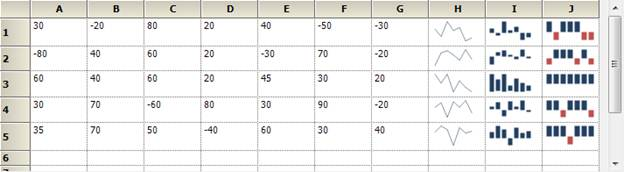

::: {style="DISPLAY: none"}
{#d2h_url_template}{#d2h_package_url style="WIDTH: 0px; DISPLAY: none; HEIGHT: 0px"}
:::

::::: {#nsbanner .d2h_main_nsbanner style="BORDER-BOTTOM: #999999 1px solid; POSITION: relative; PADDING-BOTTOM: 0px; BACKGROUND-COLOR: transparent; PADDING-LEFT: 0px; PADDING-RIGHT: 0px; DISPLAY: none; BORDER-TOP: #999999 1px solid; PADDING-TOP: 0px; LEFT: 0px"}
:::: {#TitleRow .d2h_main_titlerow style="PADDING-BOTTOM: 4px; BACKGROUND-COLOR: transparent; PADDING-LEFT: 22px; WIDTH: 100%; PADDING-RIGHT: 10px; DISPLAY: none; PADDING-TOP: 4px"}
::: {#ienav .d2h_main_ienav style="DISPLAY: none"}
{#D2HPrevious .D2HPreviousEnabled}  {#D2HNext .D2HNextEnabled}
:::
::::
:::::

:::: {#nstext .d2h_main_nstext style="PADDING-BOTTOM: 10px; BACKGROUND-COLOR: transparent; PADDING-LEFT: 22px; PADDING-RIGHT: 10px; HEIGHT: 100%; OVERFLOW: auto; PADDING-TOP: 5px" hasuserbackground="true" valign="bottom"}
::: {#d2h_breadcrumbs .d2h_breadcrumbs}
[Essential Studio User Guide Documentation](ms-xhelp:///?Id=12457748-09e3-4d74-a240-8e049cedf030){.d2h_breadcrumbsNormal}[ \> ]{.d2h_breadcrumbsLinkSeparator}[User Interface Edition](ms-xhelp:///?Id=c29296b7-531c-413b-a0ec-488ca1f7f669){.d2h_breadcrumbsNormal}[ \> ]{.d2h_breadcrumbsLinkSeparator}[Essential WPF](ms-xhelp:///?Id=7f4f82c5-151c-4262-94d0-75c4626c77bc){.d2h_breadcrumbsNormal}[ \> ]{.d2h_breadcrumbsLinkSeparator}[Essential Chart]{.d2h_breadcrumbsContentsOnly}[ \> ]{.d2h_breadcrumbsLinkSeparator}[Chart Controls](ms-xhelp:///?Id=a31cf788-e675-45c2-abaf-c10c20850169){.d2h_breadcrumbsNormal}
:::

## Sparkline {#sparkline style="tab-stops: 0pt"}

A Sparkline control is a type of information graphic characterized by its small size, high data density and lightweight. It presents trends and [variations in a very condensed fashion. The Sparkline does not contain an axis scale and is intended to give a high level overview of what happened to the data over time.]{style="COLOR: black"}

 

Use Case Scenarios

A sparkline can display a trend based on adjacent data in a clear and compact graphical representation. The purpose of sparkline is to quickly see the data range difference with high density data and it is represented in lightweight graphical representation. You can use it as per your requirement.

The following screenshot shows three  types of sparklines, which are  drawn inside the grid control cell, based on row values.

 {border="0"}

Figure 278: Sparkline control in RealTime

[]{style="LINE-HEIGHT: 115%; FONT-FAMILY: 'Segoe UI','sans-serif'; COLOR: #666666; FONT-SIZE: 7.5pt"} 

 

 

Sample Link

To access a Sparkline sample Demo:

 

1.   Open the Syncfusion Dashboard.

2.   Select User Interface.

3.   Click the **WPF** drop-down list and select **Explore Samples**.

4.   Browse to the path Chart.WPF\\Samples\\3.5\\WindowsSamples\\SparkLine\\

 

 

More:

[ ]{#related-topics}

[{border="0" align="absMiddle"}Properties](ms-xhelp:///?Id=15dfdb4c-5141-4ae4-ad93-28187dc7efc8){style="TEXT-DECORATION: none"}

[{border="0" align="absMiddle"}Types of Sparklines](ms-xhelp:///?Id=097815eb-2181-4399-8c02-488923d12378){style="TEXT-DECORATION: none"}
::::
