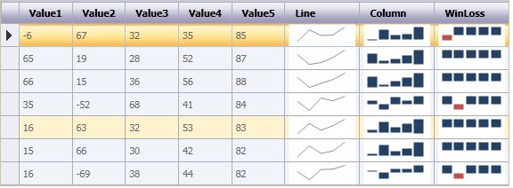

::: {style="DISPLAY: none"}
{#d2h_url_template}{#d2h_package_url style="WIDTH: 0px; DISPLAY: none; HEIGHT: 0px"}
:::

::::: {#nsbanner .d2h_main_nsbanner style="BORDER-BOTTOM: #999999 1px solid; POSITION: relative; PADDING-BOTTOM: 0px; BACKGROUND-COLOR: transparent; PADDING-LEFT: 0px; PADDING-RIGHT: 0px; DISPLAY: none; BORDER-TOP: #999999 1px solid; PADDING-TOP: 0px; LEFT: 0px"}
:::: {#TitleRow .d2h_main_titlerow style="PADDING-BOTTOM: 4px; BACKGROUND-COLOR: transparent; PADDING-LEFT: 22px; WIDTH: 100%; PADDING-RIGHT: 10px; DISPLAY: none; PADDING-TOP: 4px"}
::: {#ienav .d2h_main_ienav style="DISPLAY: none"}
{#D2HPrevious .D2HPreviousEnabled}  {#D2HNext .D2HNextEnabled}
:::
::::
:::::

:::: {#nstext .d2h_main_nstext style="PADDING-BOTTOM: 10px; BACKGROUND-COLOR: transparent; PADDING-LEFT: 22px; PADDING-RIGHT: 10px; HEIGHT: 100%; OVERFLOW: auto; PADDING-TOP: 5px" hasuserbackground="true" valign="bottom"}
::: {#d2h_breadcrumbs .d2h_breadcrumbs}
[Essential Studio User Guide Documentation](ms-xhelp:///?Id=12457748-09e3-4d74-a240-8e049cedf030){.d2h_breadcrumbsNormal}[ \> ]{.d2h_breadcrumbsLinkSeparator}[User Interface Edition](ms-xhelp:///?Id=c29296b7-531c-413b-a0ec-488ca1f7f669){.d2h_breadcrumbsNormal}[ \> ]{.d2h_breadcrumbsLinkSeparator}[Essential ASP.NET](ms-xhelp:///?Id=25c35330-c127-4dad-9a92-ed79dc7261a6){.d2h_breadcrumbsNormal}[ \> ]{.d2h_breadcrumbsLinkSeparator}[Essential Chart]{.d2h_breadcrumbsContentsOnly}[ \> ]{.d2h_breadcrumbsLinkSeparator}[Concepts and Features](ms-xhelp:///?Id=100687ce-82f2-4424-9d16-0949ea76cf15){.d2h_breadcrumbsNormal}[ \> ]{.d2h_breadcrumbsLinkSeparator}[Chart Types](ms-xhelp:///?Id=872a1bee-6f8a-4946-ae0b-0a36ce9e5ea7){.d2h_breadcrumbsNormal}
:::

### Sparkline Chart in Web Chart {#sparkline-chart-in-web-chart style="tab-stops: 0pt"}

A Sparkline control is a type of information graphic characterized by its small size, high data density and light weight. It presents trends and [variations in a very condensed manner. ]{style="COLOR: black"}

[The Sparkline does not contain an axis scale and gives a high-level overview of changes to data over time.]{style="COLOR: black"}

 

Presently, Syncfusion SparkLine control supports three types of Sparklines and the Sparkline control must be bound to a data source. It supports a variety of data source such as DataTable and any component that implements the interface IEumerable, ICollection, IList.

• Line

• Column

• Win-Loss

 

**Use Case Scenarios**

A Sparkline can display a trend based on adjacent data in a clear and compact graphical representation. The purpose of the Sparkline is to quickly see the data range difference with high density data and it is represented in lightweight graphical representation. You can use it as per your requirement.

The following screenshot shows three types of Sparkline charts (line, column and win-loss) which are drawn inside the grid control cell, based on row values.

{border="0"}

Figure 86: Sparkline control in RealTime

 

Where do I find Samples?

To access a Sparkline sample Demo:

1.   Open the Syncfusion Dashboard.

2.   Select User Interface.

3.   Click the **Windows Forms** drop-down list and select **Explore Samples**.

4.   Navigate to **Chart.Windows** -\> **Samples** -\> **2.0** -\> **SparklineChart**.

 

Tables for Properties, Methods, and Events

Properties

+---------------------------------+--------------------------------------------------------------------------------------+-------------+-------------+-----------------+
| Property                        | Description                                                                          | Type        | Data Type   | Reference links |
+=================================+======================================================================================+=============+=============+=================+
| Type[ ]{style="COLOR: #c00000"} | Specifies the types of spark lines.                                                  | NA          | NA          | NA              |
|                                 |                                                                                      |             |             |                 |
|                                 | • Line                                                                               |             |             |                 |
|                                 |                                                                                      |             |             |                 |
|                                 | • Column                                                                             |             |             |                 |
|                                 |                                                                                      |             |             |                 |
|                                 | • WinLoss                                                                            |             |             |                 |
|                                 |                                                                                      |             |             |                 |
|                                 | By default, it is set to Line type.                                                  |             |             |                 |
+---------------------------------+--------------------------------------------------------------------------------------+-------------+-------------+-----------------+
| Source                          | Gets or sets the data source for sparkline data points                               | NA          | NA          | NA              |
+---------------------------------+--------------------------------------------------------------------------------------+-------------+-------------+-----------------+
| LineStyle                       | Customizes the styles of Line sparkline                                              | NA          | NA          | NA              |
+---------------------------------+--------------------------------------------------------------------------------------+-------------+-------------+-----------------+
| ColumnStyle                     | Customizes the styles of Column and Winloss sparklines                               | NA          | NA          | NA              |
+---------------------------------+--------------------------------------------------------------------------------------+-------------+-------------+-----------------+
| Markers                         | Enables the markers support to sparkline                                             | NA          | NA          | NA              |
+---------------------------------+--------------------------------------------------------------------------------------+-------------+-------------+-----------------+
| BackInterior                    | Customizes the background color of the control. By default, it is set to White color | NA          | NA          | NA              |
+---------------------------------+--------------------------------------------------------------------------------------+-------------+-------------+-----------------+

 

Methods

 

  Method          Description                                       Parameters   Type   Return Type   Reference links
  --------------- ------------------------------------------------- ------------ ------ ------------- -----------------
  GetHighPoint    Gets the highest point value from the sparkline   NA           NA     Void          NA
  GetLowPoint     Gets the lowest point value from the sparkline    NA           NA     Void          NA
  GetStartPoint   Gets the start point value from the sparkline     NA           NA     Void          NA
  GetEndPoint     Gets the end point value from the sparkline       NA           NA     Void          NA

More:

[ ]{#related-topics}

[{border="0" align="absMiddle"}Drawing SparklineCharts in an Application](ms-xhelp:///?Id=87e6f4bb-b837-481e-9a76-7bb127cea8d5){style="TEXT-DECORATION: none"}

[{border="0" align="absMiddle"}Marker Support](ms-xhelp:///?Id=76e1665f-fb1c-4a88-ac75-e343930f79dd){style="TEXT-DECORATION: none"}
::::
