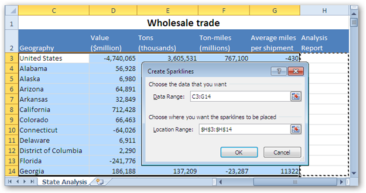
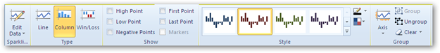
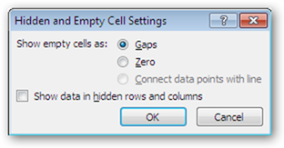

::: {style="DISPLAY: none"}
{#d2h_url_template}{#d2h_package_url style="WIDTH: 0px; DISPLAY: none; HEIGHT: 0px"}
:::

::: {.d2h_secondary_topic style="PADDING-BOTTOM: 10pt; MARGIN: 0pt; PADDING-LEFT: 0pt; PADDING-RIGHT: 0pt; PADDING-TOP: 0pt"}
#### Sparklines {#sparklines style="tab-stops: 0pt"}

[]{style="FONT-FAMILY: 'Trebuchet MS','sans-serif'; COLOR: #15428b; FONT-SIZE: 9pt"} 

Sparklines Creation Using MS Excel 2010:

In MS Excel 2010, the Sparklines can be inserted by selecting any of the sparklines type from the Insert menu.

 

In MS Excel 2010, click Insert Menu. Select any of the Sparklines type.

 

{border="0"}

Figure 79: Create Sparklines Dialog Box

 

MS Excel 2010 allows you to select the range of data for the Sparklines creation. It also allows you to to choose where the sparklines can be placed.

 

[{border="0"}]{#Figure2}

Figure 80: Sparklines Tool

The Sparklines appear once you select the data range and the location range. Now you can customize the apperance of Sparklines in terms of color, style etc. A group of Sparkline tools are available on the ribbon to change the high point, low point, color, edit the sparkline data etc.

**Sparkline Creation Using XlsIO:**

XlsIO provides support for creation of Sparklines by using simple APIs.

[]{style="FONT-FAMILY: 'Trebuchet MS','sans-serif'; COLOR: #15428b; FONT-SIZE: 9pt"} 

[·      ]{style="FONT-FAMILY: Symbol"}**ISparklineGroups** interface caches the SparklineGroup that needs to be added to the Spreadsheet.

[·      ]{style="FONT-FAMILY: Symbol"}**ISparklineGroup** represents Sparklines in object, and has properties that allows  to customize it.

[·      ]{style="FONT-FAMILY: Symbol"}**ISparklines** interface returns the collection of Sparkline present in a Worksheet.

[·      ]{style="FONT-FAMILY: Symbol"}**ISparkline** represents a sparkline in the Sparklines. Currently, XlsIO supports all the three types of sparklines- Line, Column, Win/Loss which are supported in Excel 2010.

Following code example illustrates how to create Sparklines by using XlsIO.

 

+--------------------------------------------------------------------------------------------------------------------------------------------------------------------------+
| **[\[C#\]]{style="FONT-FAMILY: 'Courier New'"}**                                                                                                                         |
|                                                                                                                                                                          |
| []{style="FONT-FAMILY: 'Courier New'"}                                                                                                                                   |
|                                                                                                                                                                          |
| [ISparklineGroup]{style="FONT-FAMILY: 'Courier New'; COLOR: #2b91af"}[ sparklineGroup = sheet.SparklineGroups.Add();]{style="FONT-FAMILY: 'Courier New'"}                |
|                                                                                                                                                                          |
| []{style="FONT-FAMILY: 'Courier New'"}                                                                                                                                   |
|                                                                                                                                                                          |
| [sparklineGroup.SparklineType = [SparklineType]{style="COLOR: #2b91af"}.Line;]{style="FONT-FAMILY: 'Courier New'"}                                                       |
|                                                                                                                                                                          |
| []{style="FONT-FAMILY: 'Courier New'"}                                                                                                                                   |
|                                                                                                                                                                          |
| [ISparklines]{style="FONT-FAMILY: 'Courier New'; COLOR: #2b91af"}[ sparklines = sparklineGroup.Add();]{style="FONT-FAMILY: 'Courier New'"}                               |
|                                                                                                                                                                          |
| [           []{style="COLOR: green"}]{style="FONT-FAMILY: 'Courier New'"}                                                                                                |
|                                                                                                                                                                          |
| [IRange]{style="FONT-FAMILY: 'Courier New'; COLOR: #2b91af"}[ dataRange = sheet.Range\[[\"D6:G17\"]{style="COLOR: #a31515"}\];]{style="FONT-FAMILY: 'Courier New'"}      |
|                                                                                                                                                                          |
| [IRange]{style="FONT-FAMILY: 'Courier New'; COLOR: #2b91af"}[ referenceRange = sheet.Range\[[\"H6:H17\"]{style="COLOR: #a31515"}\];]{style="FONT-FAMILY: 'Courier New'"} |
|                                                                                                                                                                          |
| [            []{style="COLOR: green"}]{style="FONT-FAMILY: 'Courier New'"}                                                                                               |
|                                                                                                                                                                          |
| [sparklines.Add(dataRange,referenceRange); ]{style="FONT-FAMILY: 'Courier New'"}                                                                                         |
|                                                                                                                                                                          |
| []{style="FONT-FAMILY: 'Courier New'"}                                                                                                                                   |
+--------------------------------------------------------------------------------------------------------------------------------------------------------------------------+

[]{style="FONT-FAMILY: 'Courier New'"} 

+--------------------------------------------------------------------------------------------------------------------------------------------------------------------------------------------------+
| **[\[VB\]]{style="FONT-FAMILY: 'Courier New'"}**                                                                                                                                                 |
|                                                                                                                                                                                                  |
| [Dim]{style="FONT-FAMILY: 'Courier New'; COLOR: blue"}[ sparklineGroup [As]{style="COLOR: blue"} ISparklineGroup = sheet.SparklineGroups.Add()]{style="FONT-FAMILY: 'Courier New'"}              |
|                                                                                                                                                                                                  |
| [sparklineGroup.SparklineType = SparklineType.Line]{style="FONT-FAMILY: 'Courier New'"}                                                                                                          |
|                                                                                                                                                                                                  |
| []{style="FONT-FAMILY: 'Courier New'"}                                                                                                                                                           |
|                                                                                                                                                                                                  |
| [Dim]{style="FONT-FAMILY: 'Courier New'; COLOR: blue"}[ sparklines [As]{style="COLOR: blue"} ISparklines = sparklineGroup.Add()]{style="FONT-FAMILY: 'Courier New'"}                             |
|                                                                                                                                                                                                  |
| []{style="FONT-FAMILY: 'Courier New'"}                                                                                                                                                           |
|                                                                                                                                                                                                  |
| [Dim]{style="FONT-FAMILY: 'Courier New'; COLOR: blue"}[ dataRange [As]{style="COLOR: blue"} IRange = sheet.Range([\"D6:G17\"]{style="COLOR: #a31515"})]{style="FONT-FAMILY: 'Courier New'"}      |
|                                                                                                                                                                                                  |
| [Dim]{style="FONT-FAMILY: 'Courier New'; COLOR: blue"}[ referenceRange [As]{style="COLOR: blue"} IRange = sheet.Range([\"H6:H17\"]{style="COLOR: #a31515"})]{style="FONT-FAMILY: 'Courier New'"} |
|                                                                                                                                                                                                  |
| []{style="FONT-FAMILY: 'Courier New'"}                                                                                                                                                           |
|                                                                                                                                                                                                  |
| []{style="FONT-FAMILY: 'Courier New'"}                                                                                                                                                           |
|                                                                                                                                                                                                  |
| [sparklines.Add(dataRange,referenceRange)]{style="FONT-FAMILY: 'Courier New'"}                                                                                                                   |
|                                                                                                                                                                                                  |
| []{style="FONT-FAMILY: 'Courier New'"}                                                                                                                                                           |
+--------------------------------------------------------------------------------------------------------------------------------------------------------------------------------------------------+

**[]{style="FONT-FAMILY: 'Calibri','sans-serif'; COLOR: #1f497d"}** 

Sparklines Options by XlsIO:

MS Excel 2010 provides various options through Sparklines tool ribbon in order to customize the appearance of Sparklines.See [[figure 2]{.UGHyperlink}](#Figure2)

Type:

In MS Excel 2010, click Design and then Type in order to customize the Sparkline type for the current Sparklines. XlsIO provides an equivalent API to perform this with simple properties as follows.

[]{style="FONT-FAMILY: 'Trebuchet MS','sans-serif'; COLOR: #15428b; FONT-SIZE: 9pt"} 

+-----------------------------------------------------------------------------------------+
| **[\[C#\]]{style="FONT-FAMILY: 'Courier New'"}**                                        |
|                                                                                         |
| [sparklineGroup.SparklineType = SparklineType.Line]{style="FONT-FAMILY: 'Courier New'"} |
|                                                                                         |
| []{style="FONT-FAMILY: 'Courier New'"}                                                  |
+-----------------------------------------------------------------------------------------+

**[]{style="FONT-FAMILY: 'Trebuchet MS','sans-serif'; COLOR: #15428b; FONT-SIZE: 9pt"}** 

Show:

In MS Excel 2010, click Design and then Show in order to customize the view of the Sparklines with high point, low point, first point, last point, negative point, markers. XlsIO provides an equivalent API to perform this with simple properties as follows.

*Known Limitations: The Markers can be applied only for the line sparkline type.*

+-------------------------------------------------------------------------------------------------------+
| **[\[C#\]]{style="FONT-FAMILY: 'Courier New'"}**                                                      |
|                                                                                                       |
| [sparklineGroup.ShowFirstPoint = [true]{style="COLOR: blue"};]{style="FONT-FAMILY: 'Courier New'"}    |
|                                                                                                       |
| [sparklineGroup.ShowLastPoint = [true]{style="COLOR: blue"};]{style="FONT-FAMILY: 'Courier New'"}     |
|                                                                                                       |
| [sparklineGroup.ShowHighPoint = [true]{style="COLOR: blue"};]{style="FONT-FAMILY: 'Courier New'"}     |
|                                                                                                       |
| [sparklineGroup.ShowLowPoint = [true]{style="COLOR: blue"};]{style="FONT-FAMILY: 'Courier New'"}      |
|                                                                                                       |
| [sparklineGroup.ShowMarkers = [true]{style="COLOR: blue"};]{style="FONT-FAMILY: 'Courier New'"}       |
|                                                                                                       |
| [sparklineGroup.ShowNegativePoint = [true]{style="COLOR: blue"};]{style="FONT-FAMILY: 'Courier New'"} |
|                                                                                                       |
| []{style="FONT-FAMILY: 'Courier New'"}                                                                |
+-------------------------------------------------------------------------------------------------------+

**[]{style="FONT-FAMILY: 'Calibri','sans-serif'"}** 

Sparkline Color:

**[]{style="FONT-FAMILY: 'Trebuchet MS','sans-serif'; COLOR: #15428b; FONT-SIZE: 9pt"}** 

The appearance of the Sparklines can be customized by applying colors.  Click Design and then select Style. Choose the Sparkline color option in order to customize the Sparklines. XlsIO provides an equivalent API to perform this with simple property as follows.

+-------------------------------------------------------------------------------------------------------------+
| **[\[C#\]]{style="FONT-FAMILY: 'Courier New'"}**                                                            |
|                                                                                                             |
| [sparklineGroup.SparklineColor = [Color]{style="COLOR: #2b91af"}.Blue;]{style="FONT-FAMILY: 'Courier New'"} |
+-------------------------------------------------------------------------------------------------------------+

[]{style="FONT-FAMILY: 'Calibri','sans-serif'"} 

Marker Color:

**[]{style="FONT-FAMILY: 'Trebuchet MS','sans-serif'; COLOR: #15428b; FONT-SIZE: 9pt"}** 

The apperance of points in the sparklines can be customized by applying colors to it. Click Design and then select Style. Choose the Marker Color option to customize the appearance of points in the Sparklines. XlsIO provides an equivalent API to perform this with simple properties as follows.

+-----------------------------------------------------------------------------------------------------------------------------------------------------------------------------------------------------------------------------------------------------------------------------------------------------------------------------------------------------------------------------------------------------------------------------------------------------------------------------------------------------+
| **[\[C#\]]{style="FONT-FAMILY: 'Courier New'"}**                                                                                                                                                                                                                                                                                                                                                                                                                                                    |
|                                                                                                                                                                                                                                                                                                                                                                                                                                                                                                     |
| [sparklineGroup.FirstPointColor = [Color]{style="COLOR: #2b91af"}.Green;            sparklineGroup.LastPointColor = [Color]{style="COLOR: #2b91af"}.DarkOrange;            sparklineGroup.HighPointColor = [Color]{style="COLOR: #2b91af"}.DarkBlue;            sparklineGroup.LowPointColor = [Color]{style="COLOR: #2b91af"}.DarkViolet;            sparklineGroup.MarkersColor = [Color]{style="COLOR: #2b91af"}.Black;            []{style="COLOR: black"}]{style="FONT-FAMILY: 'Courier New'"} |
+-----------------------------------------------------------------------------------------------------------------------------------------------------------------------------------------------------------------------------------------------------------------------------------------------------------------------------------------------------------------------------------------------------------------------------------------------------------------------------------------------------+

**[]{style="FONT-FAMILY: 'Calibri','sans-serif'; COLOR: black"}** 

Edit Group Data and Location:

**[]{style="FONT-FAMILY: 'Trebuchet MS','sans-serif'; COLOR: #15428b; FONT-SIZE: 9pt"}** 

MS Excel provides an option to edit the location and group data of an exsisting Sparklines, by which you can assign a new location or group data for an exsisting sparklines. XlsIO provides an equivalent API to perform this funtionality.

 

+--------------------------------------------------------------------------------------------+
| **[\[C#\]]{style="FONT-FAMILY: 'Courier New'"}**                                           |
|                                                                                            |
| [sparklines.RefreshRanges(dataRange, referenceRange);]{style="FONT-FAMILY: 'Courier New'"} |
+--------------------------------------------------------------------------------------------+

**[]{style="FONT-FAMILY: 'Calibri','sans-serif'"}** 

Line Weight:

MS Excel 2010 provides an exclusive option to customize  the Line Weight of the Line Sparkline type. XlsIO provides an API to perform this functionality.

 

+------------------------------------------------------------------------+
| [\[C#\]]{style="FONT-FAMILY: 'Courier New'"}                           |
|                                                                        |
| [sparklineGroup.LineWeight = 1.0;]{style="FONT-FAMILY: 'Courier New'"} |
+------------------------------------------------------------------------+

*[]{style="FONT-FAMILY: 'Calibri','sans-serif'; COLOR: #f79646"}* 

Known Limitations: The Line weight can be applied only for the line sparkline type.

**[]{style="FONT-FAMILY: 'Trebuchet MS','sans-serif'; COLOR: #15428b; FONT-SIZE: 9pt"}** 

Hidden and Empty Cell Settings:

 

Normally,  in a sparkline group data there is a possibility of an empty cell or an hidden cell. MS Excel 2010 provides a dialog box to

{border="0"}

Figure 81: Hidden and Empty cells Settings

 

XlsIO provides a simple API to implement the above functionality.This is illustrated in the following code.

 

+--------------------------------------------------------------------------------------------------------------------------------+
| **[\[C#\]]{style="FONT-FAMILY: 'Courier New'"}**                                                                               |
|                                                                                                                                |
| [sparklineGroup.DisplayEmptyCellsAs = [SparklineEmptyCells]{style="COLOR: #2b91af"}.Gaps;]{style="FONT-FAMILY: 'Courier New'"} |
|                                                                                                                                |
| [sparklineGroup.DisplayHiddenRC = [true]{style="COLOR: blue"};]{style="FONT-FAMILY: 'Courier New'"}                            |
+--------------------------------------------------------------------------------------------------------------------------------+

[]{style="FONT-FAMILY: 'Calibri','sans-serif'"} 

Display Axis:

**[]{style="FONT-FAMILY: 'Trebuchet MS','sans-serif'; COLOR: #15428b; FONT-SIZE: 9pt"}** 

MS Excel 2010 provides an option to display the axis for the sparklines types.This is illustrated in the following code.

 

+-------------------------------------------------------------------------------------------------+
| **[\[C#\]]{style="FONT-FAMILY: 'Courier New'"}**                                                |
|                                                                                                 |
| [sparklineGroup.DisplayAxis = [true]{style="COLOR: blue"};]{style="FONT-FAMILY: 'Courier New'"} |
+-------------------------------------------------------------------------------------------------+

**[]{style="FONT-FAMILY: 'Calibri','sans-serif'"}** 

Plot Right to Left:

**[]{style="FONT-FAMILY: 'Trebuchet MS','sans-serif'; COLOR: #15428b; FONT-SIZE: 9pt"}** 

The plotting of Sparklines is done from left to right by default. There is an option available in the Sparkline tools to customize the plotting nature from right to left. XlsIO provides a simple API to perform this functionality.

 

+-----------------------------------------------------------------------------------------------------+
| **[\[C#\]]{style="FONT-FAMILY: 'Courier New'"}**                                                    |
|                                                                                                     |
| [sparklineGroup.PlotRightToLeft = [true]{style="COLOR: blue"};]{style="FONT-FAMILY: 'Courier New'"} |
+-----------------------------------------------------------------------------------------------------+

**[]{style="FONT-FAMILY: 'Calibri','sans-serif'"}** 

Clear:

XlsIO provides an API to clear the selected Sparklines within the sparkline groups and also the selected sparklinegroup within the excel spreadsheet.This is illustrated in the following code.

 

+----------------------------------------------------------------------------------------------------------------------------------------+
| **[\[C#\]]{style="FONT-FAMILY: 'Courier New'"}**                                                                                       |
|                                                                                                                                        |
| [//Clears the sparkline group from the sheet.]{style="FONT-FAMILY: 'Courier New'; COLOR: green"}[]{style="FONT-FAMILY: 'Courier New'"} |
|                                                                                                                                        |
| [sheet.SparklineGroups.Remove(sparklineGroup);]{style="FONT-FAMILY: 'Courier New'"}                                                    |
|                                                                                                                                        |
| [//Clears the Sparkline from the sparklines.]{style="FONT-FAMILY: 'Courier New'; COLOR: green"}[]{style="FONT-FAMILY: 'Courier New'"}  |
|                                                                                                                                        |
| [sparklines.Remove(sparkline);]{style="FONT-FAMILY: 'Courier New'"}                                                                    |
|                                                                                                                                        |
| []{style="FONT-FAMILY: 'Courier New'"}                                                                                                 |
+----------------------------------------------------------------------------------------------------------------------------------------+

 

[]{#related-topics}
:::
