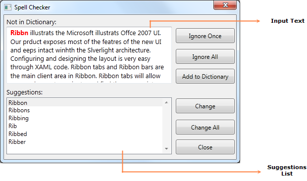

::: {style="DISPLAY: none"}
{#d2h_url_template}{#d2h_package_url style="WIDTH: 0px; DISPLAY: none; HEIGHT: 0px"}
:::

::::: {#nsbanner .d2h_main_nsbanner style="BORDER-BOTTOM: #999999 1px solid; POSITION: relative; PADDING-BOTTOM: 0px; BACKGROUND-COLOR: transparent; PADDING-LEFT: 0px; PADDING-RIGHT: 0px; DISPLAY: none; BORDER-TOP: #999999 1px solid; PADDING-TOP: 0px; LEFT: 0px"}
:::: {#TitleRow .d2h_main_titlerow style="PADDING-BOTTOM: 4px; BACKGROUND-COLOR: transparent; PADDING-LEFT: 22px; WIDTH: 100%; PADDING-RIGHT: 10px; DISPLAY: none; PADDING-TOP: 4px"}
::: {#ienav .d2h_main_ienav style="DISPLAY: none"}
{#D2HPrevious .D2HPreviousEnabled}  {#D2HNext .D2HNextEnabled}
:::
::::
:::::

:::: {#nstext .d2h_main_nstext style="PADDING-BOTTOM: 10px; BACKGROUND-COLOR: transparent; PADDING-LEFT: 22px; PADDING-RIGHT: 10px; HEIGHT: 100%; OVERFLOW: auto; PADDING-TOP: 5px" hasuserbackground="true" valign="bottom"}
::: {#d2h_breadcrumbs .d2h_breadcrumbs}
[Essential Studio User Guide Documentation](ms-xhelp:///?Id=12457748-09e3-4d74-a240-8e049cedf030){.d2h_breadcrumbsNormal}[ \> ]{.d2h_breadcrumbsLinkSeparator}[User Interface Edition](ms-xhelp:///?Id=c29296b7-531c-413b-a0ec-488ca1f7f669){.d2h_breadcrumbsNormal}[ \> ]{.d2h_breadcrumbsLinkSeparator}[Essential WPF](ms-xhelp:///?Id=7f4f82c5-151c-4262-94d0-75c4626c77bc){.d2h_breadcrumbsNormal}[ \> ]{.d2h_breadcrumbsLinkSeparator}[Essential Tools]{.d2h_breadcrumbsContentsOnly}[ \> ]{.d2h_breadcrumbsLinkSeparator}[Tools WPF Controls](ms-xhelp:///?Id=2ea58a12-9426-4a63-96b4-89eb80232c2c){.d2h_breadcrumbsNormal}
:::

## Spell Checker {#spell-checker style="tab-stops: 0pt"}

Spell Checking engine allows you to find misspelled words in any control's text values. Using SpellCheckDialog, we can perform spell checking on any input control and it will also provide sugggestions for the misspelled words.

 

Use Case Scenarios[[]{style="FONT-SIZE: 16pt; FONT-WEIGHT: normal"}]{.Heading3Char}

You can use Spell Checker to correct spelling mistakes for any input texts.[]{style="BACKGROUND: yellow; COLOR: #c00000"}

 

Appearance of the SpellCheckDialog

Spell Checking engine contains in-built dialog for checking spellings.

 

{border="0"}

Figure 959: SpellCheckDialog[]{style="COLOR: #c00000"}

[·      ]{style="FONT-FAMILY: Symbol"}The **Input Text** is the text given as input to the Spell Checker to checkthe spellings. The word which is spell-checked will be highlighted in red color.

[·      ]{style="FONT-FAMILY: Symbol"}The **Suggestions List** is the list box which will show the suggestions for the currently spell -checked word.

More:

[ ]{#related-topics}

[{border="0" align="absMiddle"}Adding Spell Checker to an Application](ms-xhelp:///?Id=ba533f1c-17d7-4502-927b-ed7d5aad86fd){style="TEXT-DECORATION: none"}

[{border="0" align="absMiddle"}Features of Spell Checker](ms-xhelp:///?Id=3d709c4d-41bc-406c-ad1a-bfa121d621aa){style="TEXT-DECORATION: none"}
::::
