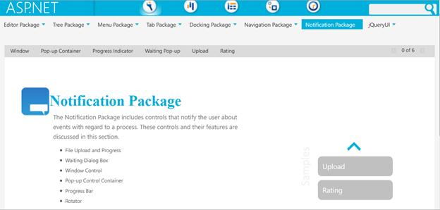

::: {style="DISPLAY: none"}
{#d2h_url_template}{#d2h_package_url style="WIDTH: 0px; DISPLAY: none; HEIGHT: 0px"}
:::

::: {.d2h_secondary_topic style="PADDING-BOTTOM: 10pt; MARGIN: 0pt; PADDING-LEFT: 0pt; PADDING-RIGHT: 0pt; PADDING-TOP: 0pt"}
##### SpellCheck for Multiple controls {#spellcheck-for-multiple-controls style="tab-stops: 0pt"}

The SpellCheckControl allows you to check the spellings in various controls on the same page at one shot.

Use Case Scenario

The user can check the spellings of all the controls on the same page continuously, without having to manually start a spellcheck for each control.

This makes it very convenient for users who need to check a lot of spellings for various controls.

 

Where do I find Installed samples?

To view the samples:

1.   Click Dashboard. The Essential Studio Enterprise Edition window is displayed.

The User Interface Edition panel is displayed by default.

2.   Click the drop-down button of ASP.NET platform. 

3.   Click the Run Locally Installed Samples link. The Essential Studio ASP.NET Edition sample browser is displayed.

4.   When you click on Locally Installed Samples, the default ASP.NET Tools sample browser page opens.[]{style="FONT-SIZE: 11pt"}

       {border="0"}

Figure 94: ASP.NET Tools Sample Browser page

5.   Select **Editor Package** tab provided and browse through the **SpellChecker** features---You will find the samples for **Spellchecker for Multiple** **controls** under the **Multiple Controls** section

 

Source Code Location

The full source code of the SpellCheckControl will be available on the purchase of the product.

In order to go the source code location, go to-

***\[Location where you have installed Sync fusion Products\]***[à]{style="FONT-FAMILY: Wingdings"} **** ***Essential Studio\\vx.x.x.x\\Web\\Tools.Web\\Src***

 

Properties used

 

  -------------------------------------------- -------------------------------------------------------------------------------------------------------- --------------------------------------------- --------------------------------------------- -----------------------------------------
  Property[]{style="FONT-SIZE: 11pt"}          Description[]{style="FONT-SIZE: 11pt"}                                                                   Type of Property[]{style="FONT-SIZE: 11pt"}   Value it accepts[]{style="FONT-SIZE: 11pt"}   Dependencies[]{style="FONT-SIZE: 11pt"}
  ControlsToCheck[]{style="FONT-SIZE: 11pt"}   This property specifies the IDs of various controls that should be checked.[]{style="FONT-SIZE: 11pt"}   Array                                         Strings[]{style="FONT-SIZE: 11pt"}            NA[]{style="FONT-SIZE: 11pt"}
  -------------------------------------------- -------------------------------------------------------------------------------------------------------- --------------------------------------------- --------------------------------------------- -----------------------------------------

[]{style="FONT-FAMILY: 'Calibri','sans-serif'; FONT-SIZE: 11pt"} 

 

Adding SpellCheck for Multiple controls to ASP.NET Tools

 

To raise and process the Client-side events, follow the steps given below-

1.   Add a new web-page in your project.

2.   Drag and drop the SpellCheckControl.

3.   Add the required items (e.g.: TextBox1, TextBox2, etc.) to the ASPX page.

 

+--------------------------------------------------------------------------------------------------------------------------------------------------------------------------------------------------------------------------------------------------------------------------------------------------------------------------------------------------------------------------------------------------------------------------------------------------------------------------------------------------------------------------------------------------------------------------------------------------------------------------+
| []{style="FONT-FAMILY: 'Courier New'; COLOR: blue"}                                                                                                                                                                                                                                                                                                                                                                                                                                                                                                                                                                      |
|                                                                                                                                                                                                                                                                                                                                                                                                                                                                                                                                                                                                                          |
| [\[ASPX\]]{style="FONT-FAMILY: 'Courier New'"}                                                                                                                                                                                                                                                                                                                                                                                                                                                                                                                                                                           |
|                                                                                                                                                                                                                                                                                                                                                                                                                                                                                                                                                                                                                          |
| []{style="FONT-FAMILY: 'Courier New'; COLOR: blue"}                                                                                                                                                                                                                                                                                                                                                                                                                                                                                                                                                                      |
|                                                                                                                                                                                                                                                                                                                                                                                                                                                                                                                                                                                                                          |
| [\<]{style="FONT-FAMILY: 'Courier New'; COLOR: blue"}[syncfusion]{style="FONT-FAMILY: 'Courier New'; COLOR: #a31515"}[:]{style="FONT-FAMILY: 'Courier New'; COLOR: blue"}[SpellCheckControl ]{style="FONT-FAMILY: 'Courier New'; COLOR: #a31515"}[ID]{style="FONT-FAMILY: 'Courier New'; COLOR: red"}[ [=]{style="COLOR: blue"} [\"SpellCheck1\"]{style="COLOR: blue"} [ControlsToCheck]{style="COLOR: red"} [=]{style="COLOR: blue"} [\"TextBox1,TextBox2,TextBox3\"]{style="COLOR: blue"} [runat]{style="COLOR: red"} [=]{style="COLOR: blue"} [\"server\"]{style="COLOR: blue"} ]{style="FONT-FAMILY: 'Courier New'"} |
|                                                                                                                                                                                                                                                                                                                                                                                                                                                                                                                                                                                                                          |
| [syncfusion]{style="FONT-FAMILY: 'Courier New'; COLOR: #a31515"}[:]{style="FONT-FAMILY: 'Courier New'; COLOR: blue"}[SpellCheckControl]{style="FONT-FAMILY: 'Courier New'; COLOR: #a31515"}[\>]{style="FONT-FAMILY: 'Courier New'; COLOR: blue"}                                                                                                                                                                                                                                                                                                                                                                         |
|                                                                                                                                                                                                                                                                                                                                                                                                                                                                                                                                                                                                                          |
| []{style="FONT-SIZE: 11pt"}                                                                                                                                                                                                                                                                                                                                                                                                                                                                                                                                                                                              |
+--------------------------------------------------------------------------------------------------------------------------------------------------------------------------------------------------------------------------------------------------------------------------------------------------------------------------------------------------------------------------------------------------------------------------------------------------------------------------------------------------------------------------------------------------------------------------------------------------------------------------+

[]{style="FONT-FAMILY: 'Calibri','sans-serif'; FONT-SIZE: 11pt"} 

+----------------------------------------------------------------------------------------------------------------------------------------------------------------------------------------------------------------------------------------------------------------------------------------------+
| []{style="FONT-FAMILY: 'Courier New'; COLOR: blue"}                                                                                                                                                                                                                                          |
|                                                                                                                                                                                                                                                                                              |
| [\[CS\]]{style="FONT-FAMILY: 'Courier New'"}                                                                                                                                                                                                                                                 |
|                                                                                                                                                                                                                                                                                              |
| []{style="FONT-FAMILY: 'Courier New'; COLOR: blue"}                                                                                                                                                                                                                                          |
|                                                                                                                                                                                                                                                                                              |
| [protected]{style="FONT-FAMILY: 'Courier New'; COLOR: blue"}[ [void]{style="COLOR: blue"} Page_Load([object]{style="COLOR: blue"} sender, [EventArgs]{style="COLOR: #2b91af"} e)]{style="FONT-FAMILY: 'Courier New'"}                                                                        |
|                                                                                                                                                                                                                                                                                              |
| [    {      ]{style="FONT-FAMILY: 'Courier New'"}                                                                                                                                                                                                                                            |
|                                                                                                                                                                                                                                                                                              |
| [ [if]{style="COLOR: blue"}(!Page.IsPostBack)]{style="FONT-FAMILY: 'Courier New'"}                                                                                                                                                                                                           |
|                                                                                                                                                                                                                                                                                              |
| [   [this]{style="COLOR: blue"}.SpellCheck1.ControlsToCheck = [new]{style="COLOR: blue"} [string]{style="COLOR: blue"}\[3\] { [\"TextBox1\"]{style="COLOR: #a31515"}, [\"TextBox2\"]{style="COLOR: #a31515"}, [\"TextBox3\"]{style="COLOR: #a31515"} };]{style="FONT-FAMILY: 'Courier New'"} |
|                                                                                                                                                                                                                                                                                              |
| [    }]{style="FONT-FAMILY: 'Courier New'"}[]{style="FONT-FAMILY: 'Calibri','sans-serif'; FONT-SIZE: 11pt"}                                                                                                                                                                                  |
|                                                                                                                                                                                                                                                                                              |
| []{style="FONT-SIZE: 11pt"}                                                                                                                                                                                                                                                                  |
+----------------------------------------------------------------------------------------------------------------------------------------------------------------------------------------------------------------------------------------------------------------------------------------------+

[]{style="FONT-FAMILY: 'Calibri','sans-serif'; FONT-SIZE: 11pt"} 

+-------------------------------------------------------------------------------------------------------------------------------------------------------------------------------------------------------------------------------------------------------------------------------------------------------------------------------------------------------------------------------+
| []{style="FONT-FAMILY: 'Courier New'"}                                                                                                                                                                                                                                                                                                                                        |
|                                                                                                                                                                                                                                                                                                                                                                               |
| [\[VB\]]{style="FONT-FAMILY: 'Courier New'"}                                                                                                                                                                                                                                                                                                                                  |
|                                                                                                                                                                                                                                                                                                                                                                               |
| []{style="FONT-FAMILY: 'Courier New'; COLOR: blue"}                                                                                                                                                                                                                                                                                                                           |
|                                                                                                                                                                                                                                                                                                                                                                               |
| [Protected]{style="FONT-FAMILY: 'Courier New'; COLOR: blue"}[ [Sub]{style="COLOR: blue"} Page_Load([ByVal]{style="COLOR: blue"} sender [As]{style="COLOR: blue"} [Object]{style="COLOR: blue"}, [ByVal]{style="COLOR: blue"} e [As]{style="COLOR: blue"} System.EventArgs) [Handles]{style="COLOR: blue"} [Me]{style="COLOR: blue"}.Load]{style="FONT-FAMILY: 'Courier New'"} |
|                                                                                                                                                                                                                                                                                                                                                                               |
| [        [If]{style="COLOR: blue"} [Not]{style="COLOR: blue"} Page.IsPostBack [Then]{style="COLOR: blue"}]{style="FONT-FAMILY: 'Courier New'"}                                                                                                                                                                                                                                |
|                                                                                                                                                                                                                                                                                                                                                                               |
| [            [Dim]{style="COLOR: blue"} ids(0 [To]{style="COLOR: blue"} 2) [As]{style="COLOR: blue"} [String]{style="COLOR: blue"}]{style="FONT-FAMILY: 'Courier New'"}                                                                                                                                                                                                       |
|                                                                                                                                                                                                                                                                                                                                                                               |
| [            ids(0) = [\"TextBox1\"]{style="COLOR: #a31515"}]{style="FONT-FAMILY: 'Courier New'"}                                                                                                                                                                                                                                                                             |
|                                                                                                                                                                                                                                                                                                                                                                               |
| [            ids(1) = [\"TextBox2\"]{style="COLOR: #a31515"}]{style="FONT-FAMILY: 'Courier New'"}                                                                                                                                                                                                                                                                             |
|                                                                                                                                                                                                                                                                                                                                                                               |
| [            ids(2) = [\"TextBox3\"]{style="COLOR: #a31515"}]{style="FONT-FAMILY: 'Courier New'"}                                                                                                                                                                                                                                                                             |
|                                                                                                                                                                                                                                                                                                                                                                               |
| [            [Me]{style="COLOR: blue"}.SpellCheckControl1.ControlsToCheck = ids]{style="FONT-FAMILY: 'Courier New'"}                                                                                                                                                                                                                                                          |
|                                                                                                                                                                                                                                                                                                                                                                               |
| [        [End]{style="COLOR: blue"} [If]{style="COLOR: blue"}]{style="FONT-FAMILY: 'Courier New'"}                                                                                                                                                                                                                                                                            |
|                                                                                                                                                                                                                                                                                                                                                                               |
| [       ]{style="FONT-FAMILY: 'Courier New'"}                                                                                                                                                                                                                                                                                                                                 |
|                                                                                                                                                                                                                                                                                                                                                                               |
| [    [End]{style="COLOR: blue"} [Sub]{style="COLOR: blue"}]{style="FONT-FAMILY: 'Courier New'"}[]{style="FONT-FAMILY: 'Calibri','sans-serif'; FONT-SIZE: 11pt"}                                                                                                                                                                                                               |
|                                                                                                                                                                                                                                                                                                                                                                               |
| []{style="FONT-SIZE: 11pt"}                                                                                                                                                                                                                                                                                                                                                   |
+-------------------------------------------------------------------------------------------------------------------------------------------------------------------------------------------------------------------------------------------------------------------------------------------------------------------------------------------------------------------------------+

[]{style="FONT-FAMILY: 'Calibri','sans-serif'; FONT-SIZE: 11pt"} 

 

4.   Build and run the application, and you will get the required output.

 

[]{#related-topics}
:::
