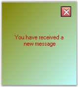

::: {style="DISPLAY: none"}
{#d2h_url_template}{#d2h_package_url style="WIDTH: 0px; DISPLAY: none; HEIGHT: 0px"}
:::

::::: {#nsbanner .d2h_main_nsbanner style="BORDER-BOTTOM: #999999 1px solid; POSITION: relative; PADDING-BOTTOM: 0px; BACKGROUND-COLOR: transparent; PADDING-LEFT: 0px; PADDING-RIGHT: 0px; DISPLAY: none; BORDER-TOP: #999999 1px solid; PADDING-TOP: 0px; LEFT: 0px"}
:::: {#TitleRow .d2h_main_titlerow style="PADDING-BOTTOM: 4px; BACKGROUND-COLOR: transparent; PADDING-LEFT: 22px; WIDTH: 100%; PADDING-RIGHT: 10px; DISPLAY: none; PADDING-TOP: 4px"}
::: {#ienav .d2h_main_ienav style="DISPLAY: none"}
{#D2HPrevious .D2HPreviousEnabled}  {#D2HNext .D2HNextEnabled}
:::
::::
:::::

:::: {#nstext .d2h_main_nstext style="PADDING-BOTTOM: 10px; BACKGROUND-COLOR: transparent; PADDING-LEFT: 22px; PADDING-RIGHT: 10px; HEIGHT: 100%; OVERFLOW: auto; PADDING-TOP: 5px" hasuserbackground="true" valign="bottom"}
::: {#d2h_breadcrumbs .d2h_breadcrumbs}
[Essential Studio User Guide Documentation](ms-xhelp:///?Id=12457748-09e3-4d74-a240-8e049cedf030){.d2h_breadcrumbsNormal}[ \> ]{.d2h_breadcrumbsLinkSeparator}[User Interface Edition](ms-xhelp:///?Id=c29296b7-531c-413b-a0ec-488ca1f7f669){.d2h_breadcrumbsNormal}[ \> ]{.d2h_breadcrumbsLinkSeparator}[Essential Windows](ms-xhelp:///?Id=e60759d8-47a4-4570-9d7a-16a68d63f2ea){.d2h_breadcrumbsNormal}[ \> ]{.d2h_breadcrumbsLinkSeparator}[Essential Tools]{.d2h_breadcrumbsContentsOnly}[ \> ]{.d2h_breadcrumbsLinkSeparator}[Tools Controls](ms-xhelp:///?Id=13c3c4f4-9d16-4b69-93f2-7e98eec67452){.d2h_breadcrumbsNormal}[ \> ]{.d2h_breadcrumbsLinkSeparator}[Notification Package](ms-xhelp:///?Id=2a7ddb82-ecdf-4d47-be30-1996e2c8244c){.d2h_breadcrumbsNormal}
:::

### SplashPanel {#splashpanel style="MARGIN-LEFT: 18pt; tab-stops: 18.0pt"}

[]{style="COLOR: #15428b"} 

The **SplashPanel** is a System.Windows.Forms panel-derived class that allows users to design custom splash screens within the form\'s designer. The SplashPanel can take multiple child controls that can be used to display information or collect information from the user.

[]{style="COLOR: #15428b"} 

{border="0"}

[]{style="COLOR: #15428b"} 

Figure 993: SplashPanel with Link

[]{style="COLOR: #15428b"} 

The **SplashPanel class** is a panel class that can be used beyond the typical splash screen. It can be used to create non-obtrusive message boxes such as in the Microsoft MSN messenger (as of MSN Messenger version 3.0), a message window that informs a user that a new mail message has arrived. These kinds of message boxes are very easy to create and use with the SplashPanel class.

[]{style="COLOR: #15428b"} 

{border="0"}

[]{style="COLOR: #15428b"} 

Figure 994: SplashPanel with Message

[]{style="COLOR: #15428b"} 

 

 

 

 

More:

[ ]{#related-topics}

[{border="0" align="absMiddle"}Features](ms-xhelp:///?Id=e5a41fbb-80d1-4fc6-848e-64ab546b859f){style="TEXT-DECORATION: none"}

[{border="0" align="absMiddle"}Creating SplashPanel](ms-xhelp:///?Id=c90f9761-899a-44fa-a2cb-5a8132a125dc){style="TEXT-DECORATION: none"}

[{border="0" align="absMiddle"}Concepts and Features](ms-xhelp:///?Id=bec38101-d090-4777-b464-5d473b3e0972){style="TEXT-DECORATION: none"}

[{border="0" align="absMiddle"}SplashPanel Events](ms-xhelp:///?Id=fccffc5a-df71-4dc2-b180-c5d37754ffdf){style="TEXT-DECORATION: none"}

[{border="0" align="absMiddle"}Frequently Asked Questions](ms-xhelp:///?Id=e812732e-1687-4f6f-81f9-39b7f3778516){style="TEXT-DECORATION: none"}
::::
