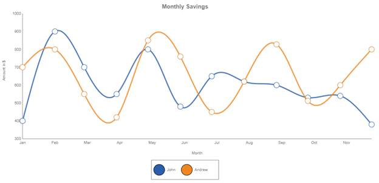

::: {style="DISPLAY: none"}
{#d2h_url_template}{#d2h_package_url style="WIDTH: 0px; DISPLAY: none; HEIGHT: 0px"}
:::

:::: {.d2h_secondary_topic style="PADDING-BOTTOM: 10pt; MARGIN: 0pt; PADDING-LEFT: 0pt; PADDING-RIGHT: 0pt; PADDING-TOP: 0pt"}
#### Spline Chart {#spline-chart style="tab-stops: 0pt"}

A spline chart is similar to a line chart except that it connects the different data points by using splines instead of straight lines.

When rendered in 3-D, the plot looks like a ribbon and hence such types are also referred as ribbon or strip charts.

The appearance of the lines and the points can be configured with options such as the colors used, thickness of the lines, and the symbols displayed.

 

Chart Details

::: {align="center"}
  ---------------------------------- -------------
  **Number of Y Values per Point**   1
  **Number of Series         **      One or more
  **Cannot be Combined with   **     Pie chart
  ---------------------------------- -------------
:::

 

Spline series can be added to the chart using the following code.

 

+----------------------------------------------------------------------------------------------------------------------------------------------------------------------------------------------------------------------------------------------------------------+
| **[\[C#\]]{style="FONT-FAMILY: 'Courier New'"}**                                                                                                                                                                                                               |
|                                                                                                                                                                                                                                                                |
| [        [Series]{style="COLOR: #2b91af"} series = [new]{style="COLOR: blue"} [Series]{style="COLOR: #2b91af"}([\"CompanyA\"]{style="COLOR: #a31515"});[]{style="COLOR: #2b91af"}]{style="FONT-FAMILY: Consolas; FONT-SIZE: 9.5pt"}                            |
|                                                                                                                                                                                                                                                                |
| [        ]{style="FONT-FAMILY: Consolas; FONT-SIZE: 9.5pt"}                                                                                                                                                                                                    |
|                                                                                                                                                                                                                                                                |
| [        series.Points.Add(1991, 14.9);]{style="FONT-FAMILY: Consolas; FONT-SIZE: 9.5pt"}                                                                                                                                                                      |
|                                                                                                                                                                                                                                                                |
| [        series.Points.Add(1992, 27.3);]{style="FONT-FAMILY: Consolas; FONT-SIZE: 9.5pt"}                                                                                                                                                                      |
|                                                                                                                                                                                                                                                                |
| [        series.Points.Add(1993, 19.8);]{style="FONT-FAMILY: Consolas; FONT-SIZE: 9.5pt"}                                                                                                                                                                      |
|                                                                                                                                                                                                                                                                |
| [          . . .]{style="FONT-FAMILY: Consolas; FONT-SIZE: 9.5pt"}                                                                                                                                                                                             |
|                                                                                                                                                                                                                                                                |
| []{style="FONT-FAMILY: Consolas; FONT-SIZE: 9.5pt"}                                                                                                                                                                                                            |
|                                                                                                                                                                                                                                                                |
| [        series.Symbol.Visible = [true]{style="COLOR: blue"};]{style="FONT-FAMILY: Consolas; FONT-SIZE: 9.5pt"}                                                                                                                                                |
|                                                                                                                                                                                                                                                                |
| [        series.Style.Interior=[new]{style="COLOR: blue"} [GradientInfo]{style="COLOR: #2b91af"}([new]{style="COLOR: blue"} [ColorInfo]{style="COLOR: #2b91af"}([Color]{style="COLOR: #2b91af"}.Chocolate));]{style="FONT-FAMILY: Consolas; FONT-SIZE: 9.5pt"} |
|                                                                                                                                                                                                                                                                |
| [        series.Symbol.Shape = [SymbolShape]{style="COLOR: #2b91af"}.Circle;]{style="FONT-FAMILY: Consolas; FONT-SIZE: 9.5pt"}                                                                                                                                 |
|                                                                                                                                                                                                                                                                |
| []{style="FONT-FAMILY: Consolas; FONT-SIZE: 9.5pt"}                                                                                                                                                                                                            |
|                                                                                                                                                                                                                                                                |
| []{style="FONT-FAMILY: Consolas; FONT-SIZE: 9.5pt"}                                                                                                                                                                                                            |
|                                                                                                                                                                                                                                                                |
| [        series.Type = [SeriesType]{style="COLOR: #2b91af"}.Spline;]{style="FONT-FAMILY: Consolas; FONT-SIZE: 9.5pt"}                                                                                                                                          |
|                                                                                                                                                                                                                                                                |
| [        [this]{style="COLOR: blue"}.ChartAdv1.Series.Add(series);]{style="FONT-FAMILY: Consolas; FONT-SIZE: 9.5pt"}                                                                                                                                           |
|                                                                                                                                                                                                                                                                |
| []{style="FONT-FAMILY: Consolas; FONT-SIZE: 9.5pt"}                                                                                                                                                                                                            |
|                                                                                                                                                                                                                                                                |
| [        [Series]{style="COLOR: #2b91af"} series1 = [new]{style="COLOR: blue"} [Series]{style="COLOR: #2b91af"}([\"CompanyB\"]{style="COLOR: #a31515"});]{style="FONT-FAMILY: Consolas; FONT-SIZE: 9.5pt"}                                                     |
|                                                                                                                                                                                                                                                                |
| [        series1.Points.Add(1991, 17.9);]{style="FONT-FAMILY: Consolas; FONT-SIZE: 9.5pt"}                                                                                                                                                                     |
|                                                                                                                                                                                                                                                                |
| [        series1.Points.Add(1992, 26.2);]{style="FONT-FAMILY: Consolas; FONT-SIZE: 9.5pt"}                                                                                                                                                                     |
|                                                                                                                                                                                                                                                                |
| [        series1.Points.Add(1993, 5.7);]{style="FONT-FAMILY: Consolas; FONT-SIZE: 9.5pt"}                                                                                                                                                                      |
|                                                                                                                                                                                                                                                                |
| [        . . .]{style="FONT-FAMILY: Consolas; FONT-SIZE: 9.5pt"}                                                                                                                                                                                               |
|                                                                                                                                                                                                                                                                |
| []{style="FONT-FAMILY: Consolas; FONT-SIZE: 9.5pt"}                                                                                                                                                                                                            |
|                                                                                                                                                                                                                                                                |
| [        series1.Symbol.Visible = [true]{style="COLOR: blue"};]{style="FONT-FAMILY: Consolas; FONT-SIZE: 9.5pt"}                                                                                                                                               |
|                                                                                                                                                                                                                                                                |
| [        series1.Symbol.Shape = [SymbolShape]{style="COLOR: #2b91af"}.Circle;]{style="FONT-FAMILY: Consolas; FONT-SIZE: 9.5pt"}                                                                                                                                |
|                                                                                                                                                                                                                                                                |
| [        series1.Type = [SeriesType]{style="COLOR: #2b91af"}.Spline;]{style="FONT-FAMILY: Consolas; FONT-SIZE: 9.5pt"}                                                                                                                                         |
|                                                                                                                                                                                                                                                                |
| [        series1.Style.Interior = [new]{style="COLOR: blue"} [GradientInfo]{style="COLOR: #2b91af"}([new]{style="COLOR: blue"} [ColorInfo]{style="COLOR: #2b91af"}([Color]{style="COLOR: #2b91af"}.Olive));]{style="FONT-FAMILY: Consolas; FONT-SIZE: 9.5pt"}  |
|                                                                                                                                                                                                                                                                |
| [        [this]{style="COLOR: blue"}.ChartAdv1.Series.Add(series1);]{style="FONT-FAMILY: Consolas; FONT-SIZE: 9.5pt"}                                                                                                                                          |
|                                                                                                                                                                                                                                                                |
| []{style="FONT-FAMILY: Consolas; FONT-SIZE: 9.5pt"}                                                                                                                                                                                                            |
|                                                                                                                                                                                                                                                                |
| [    ]{style="FONT-FAMILY: Consolas; FONT-SIZE: 9.5pt"}                                                                                                                                                                                                        |
|                                                                                                                                                                                                                                                                |
| []{style="FONT-FAMILY: 'Courier New'; FONT-SIZE: 12pt"}                                                                                                                                                                                                        |
+----------------------------------------------------------------------------------------------------------------------------------------------------------------------------------------------------------------------------------------------------------------+

 

+-----------------------------------------------------------------------------------------------------------------------------------------------------------------------------------------------------------------------------------------------------------------+
| **[\[VB\]]{style="FONT-FAMILY: 'Courier New'"}**                                                                                                                                                                                                                |
|                                                                                                                                                                                                                                                                 |
| []{style="FONT-FAMILY: Consolas; FONT-SIZE: 9.5pt"}                                                                                                                                                                                                             |
|                                                                                                                                                                                                                                                                 |
| [        [Dim]{style="COLOR: blue"} series [As]{style="COLOR: blue"} [Series]{style="COLOR: #2b91af"} = [New]{style="COLOR: blue"} [Series]{style="COLOR: #2b91af"}([\"CompanyA\"]{style="COLOR: #a31515"})]{style="FONT-FAMILY: Consolas; FONT-SIZE: 9.5pt"}   |
|                                                                                                                                                                                                                                                                 |
| [       ]{style="FONT-FAMILY: Consolas; FONT-SIZE: 9.5pt"}                                                                                                                                                                                                      |
|                                                                                                                                                                                                                                                                 |
| [        series.Points.Add(1991, 14.9)]{style="FONT-FAMILY: Consolas; FONT-SIZE: 9.5pt"}                                                                                                                                                                        |
|                                                                                                                                                                                                                                                                 |
| [        series.Points.Add(1992, 27.3)]{style="FONT-FAMILY: Consolas; FONT-SIZE: 9.5pt"}                                                                                                                                                                        |
|                                                                                                                                                                                                                                                                 |
| [        series.Points.Add(1993, 19.8)]{style="FONT-FAMILY: Consolas; FONT-SIZE: 9.5pt"}                                                                                                                                                                        |
|                                                                                                                                                                                                                                                                 |
| [         ]{style="FONT-FAMILY: Consolas; FONT-SIZE: 9.5pt"}                                                                                                                                                                                                    |
|                                                                                                                                                                                                                                                                 |
| [         . . .]{style="FONT-FAMILY: Consolas; FONT-SIZE: 9.5pt"}                                                                                                                                                                                               |
|                                                                                                                                                                                                                                                                 |
| [        series.Symbol.Visible = [True]{style="COLOR: blue"}]{style="FONT-FAMILY: Consolas; FONT-SIZE: 9.5pt"}                                                                                                                                                  |
|                                                                                                                                                                                                                                                                 |
| [        series.Style.Interior = [New]{style="COLOR: blue"} [GradientInfo]{style="COLOR: #2b91af"}([New]{style="COLOR: blue"} [ColorInfo]{style="COLOR: #2b91af"}([Color]{style="COLOR: #2b91af"}.Chocolate))]{style="FONT-FAMILY: Consolas; FONT-SIZE: 9.5pt"} |
|                                                                                                                                                                                                                                                                 |
| [        series.Symbol.Shape = [SymbolShape]{style="COLOR: #2b91af"}.Circle]{style="FONT-FAMILY: Consolas; FONT-SIZE: 9.5pt"}                                                                                                                                   |
|                                                                                                                                                                                                                                                                 |
| []{style="FONT-FAMILY: Consolas; FONT-SIZE: 9.5pt"}                                                                                                                                                                                                             |
|                                                                                                                                                                                                                                                                 |
| []{style="FONT-FAMILY: Consolas; FONT-SIZE: 9.5pt"}                                                                                                                                                                                                             |
|                                                                                                                                                                                                                                                                 |
| [        series.Type = [SeriesType]{style="COLOR: #2b91af"}.Spline]{style="FONT-FAMILY: Consolas; FONT-SIZE: 9.5pt"}                                                                                                                                            |
|                                                                                                                                                                                                                                                                 |
| [        [Me]{style="COLOR: blue"}.ChartAdv1.Series.Add(series)]{style="FONT-FAMILY: Consolas; FONT-SIZE: 9.5pt"}                                                                                                                                               |
|                                                                                                                                                                                                                                                                 |
| []{style="FONT-FAMILY: Consolas; FONT-SIZE: 9.5pt"}                                                                                                                                                                                                             |
|                                                                                                                                                                                                                                                                 |
| [        [Dim]{style="COLOR: blue"} series1 [As]{style="COLOR: blue"} [Series]{style="COLOR: #2b91af"} = [New]{style="COLOR: blue"} [Series]{style="COLOR: #2b91af"}([\"CompanyB\"]{style="COLOR: #a31515"})]{style="FONT-FAMILY: Consolas; FONT-SIZE: 9.5pt"}  |
|                                                                                                                                                                                                                                                                 |
| [        series1.Points.Add(1991, 17.9)]{style="FONT-FAMILY: Consolas; FONT-SIZE: 9.5pt"}                                                                                                                                                                       |
|                                                                                                                                                                                                                                                                 |
| [        series1.Points.Add(1992, 26.2)]{style="FONT-FAMILY: Consolas; FONT-SIZE: 9.5pt"}                                                                                                                                                                       |
|                                                                                                                                                                                                                                                                 |
| [        series1.Points.Add(1993, 5.7)]{style="FONT-FAMILY: Consolas; FONT-SIZE: 9.5pt"}                                                                                                                                                                        |
|                                                                                                                                                                                                                                                                 |
| [        . . .]{style="FONT-FAMILY: Consolas; FONT-SIZE: 9.5pt"}                                                                                                                                                                                                |
|                                                                                                                                                                                                                                                                 |
| []{style="FONT-FAMILY: Consolas; FONT-SIZE: 9.5pt"}                                                                                                                                                                                                             |
|                                                                                                                                                                                                                                                                 |
| [        series1.Symbol.Visible = [True]{style="COLOR: blue"}]{style="FONT-FAMILY: Consolas; FONT-SIZE: 9.5pt"}                                                                                                                                                 |
|                                                                                                                                                                                                                                                                 |
| [        series1.Symbol.Shape = [SymbolShape]{style="COLOR: #2b91af"}.Circle]{style="FONT-FAMILY: Consolas; FONT-SIZE: 9.5pt"}                                                                                                                                  |
|                                                                                                                                                                                                                                                                 |
| [        series1.Type = [SeriesType]{style="COLOR: #2b91af"}.Spline]{style="FONT-FAMILY: Consolas; FONT-SIZE: 9.5pt"}                                                                                                                                           |
|                                                                                                                                                                                                                                                                 |
| [        series1.Style.Interior = [New]{style="COLOR: blue"} [GradientInfo]{style="COLOR: #2b91af"}([New]{style="COLOR: blue"} [ColorInfo]{style="COLOR: #2b91af"}([Color]{style="COLOR: #2b91af"}.Olive))]{style="FONT-FAMILY: Consolas; FONT-SIZE: 9.5pt"}    |
|                                                                                                                                                                                                                                                                 |
| [        [Me]{style="COLOR: blue"}.ChartAdv1.Series.Add(series1)]{style="FONT-FAMILY: Consolas; FONT-SIZE: 9.5pt"}                                                                                                                                              |
|                                                                                                                                                                                                                                                                 |
| [           ]{style="FONT-FAMILY: Consolas; FONT-SIZE: 9.5pt"}                                                                                                                                                                                                  |
|                                                                                                                                                                                                                                                                 |
| [ ]{style="FONT-FAMILY: Consolas; FONT-SIZE: 9.5pt"}[ ]{style="FONT-FAMILY: 'Courier New'; FONT-SIZE: 9.5pt"}[]{style="FONT-FAMILY: Consolas; FONT-SIZE: 9.5pt"}                                                                                                |
+-----------------------------------------------------------------------------------------------------------------------------------------------------------------------------------------------------------------------------------------------------------------+

#####  

{border="0"}

Figure 10: Spline Chart

[]{#related-topics}
::::
