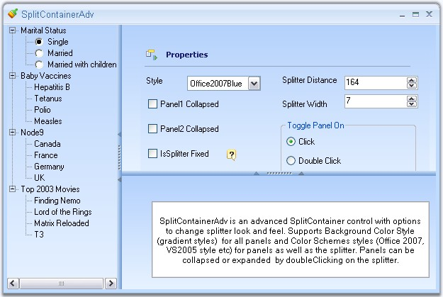

::: {style="DISPLAY: none"}
{#d2h_url_template}{#d2h_package_url style="WIDTH: 0px; DISPLAY: none; HEIGHT: 0px"}
:::

::: {.d2h_secondary_topic style="PADDING-BOTTOM: 10pt; MARGIN: 0pt; PADDING-LEFT: 0pt; PADDING-RIGHT: 0pt; PADDING-TOP: 0pt"}
#### SplitContainerAdv {#splitcontaineradv style="tab-stops: 0pt"}

 

The SplitContainerAdv is a container that consists of two panels with a splitter between them. It allows the user to simply put other controls on these panels and drag the splitter vertically or horizontally to resize these panels. The user can add more SplitContainerAdv controls into any one of the panels in another SplitContainerAdv control and can change the orientation to have a customized look.

[]{style="COLOR: #15428b"} 

{border="0"}

Figure 415: SplitContainerAdv Control

**[]{style="COLOR: #15428b"}** 

See Also

More:

[ ]{#related-topics}

[{border="0" align="absMiddle"}Features Overview](ms-xhelp:///?Id=4da9a8e8-ac71-43c9-a6da-7be51f2c3337){style="TEXT-DECORATION: none"}

[{border="0" align="absMiddle"}Creating SplitContainerAdv](ms-xhelp:///?Id=5aac2586-a0bc-4207-b5c7-000641523893){style="TEXT-DECORATION: none"}

[{border="0" align="absMiddle"}Concepts and Features](ms-xhelp:///?Id=17038c87-ab9a-4fee-8cd9-450e7205ac96){style="TEXT-DECORATION: none"}

[{border="0" align="absMiddle"}Events](ms-xhelp:///?Id=110a1e64-f0f3-4d81-9713-c83dfaa17203){style="TEXT-DECORATION: none"}
:::
