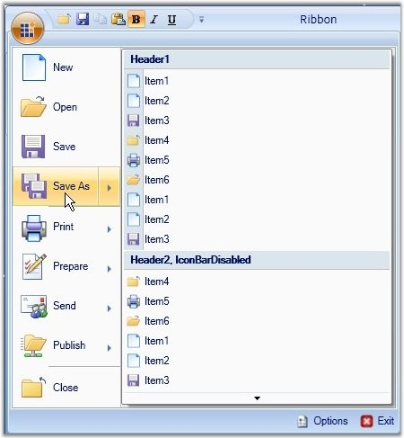

::: {style="DISPLAY: none"}
{#d2h_url_template}{#d2h_package_url style="WIDTH: 0px; DISPLAY: none; HEIGHT: 0px"}
:::

::: {.d2h_secondary_topic style="PADDING-BOTTOM: 10pt; MARGIN: 0pt; PADDING-LEFT: 0pt; PADDING-RIGHT: 0pt; PADDING-TOP: 0pt"}
##### SplitMenuButton {#splitmenubutton style="tab-stops: 0pt"}

[]{style="FONT-FAMILY: 'Trebuchet MS','sans-serif'; FONT-SIZE: 9pt"} 

SplitMenuButton is similar to MenuButton. It is used to perform multiple operations. Events are raised, when main menubutton is clicked as well as when the sub item in the splitmenubutton is clicked. The following lines of code can be used to add a splitmenubutton control.

[]{style="FONT-FAMILY: 'Trebuchet MS','sans-serif'; COLOR: #15428b; FONT-SIZE: 9pt"} 

+------------------------------------------------------------------------------------------------------------------------------------------------------------------------------------------------------------------------------------------------------------------------------------------------------------------------------------------------------------------------------------------------------------------------------------------------------------------------------------------------------------------+
| **[\[XAML\]]{style="FONT-FAMILY: 'Courier New'; COLOR: black"}**                                                                                                                                                                                                                                                                                                                                                                                                                                                 |
|                                                                                                                                                                                                                                                                                                                                                                                                                                                                                                                  |
| []{style="COLOR: black; FONT-SIZE: 9pt"}                                                                                                                                                                                                                                                                                                                                                                                                                                                                         |
|                                                                                                                                                                                                                                                                                                                                                                                                                                                                                                                  |
| [\<]{style="FONT-FAMILY: 'Courier New'; COLOR: blue; FONT-SIZE: 9pt"}[ribbon]{style="FONT-FAMILY: 'Courier New'; COLOR: maroon; FONT-SIZE: 9pt"}[:]{style="FONT-FAMILY: 'Courier New'; COLOR: blue; FONT-SIZE: 9pt"}[SplitMenuButton]{style="FONT-FAMILY: 'Courier New'; COLOR: maroon; FONT-SIZE: 9pt"}[ [Label]{style="COLOR: red"}[=\"Save As\"]{style="COLOR: blue"} [Icon]{style="COLOR: red"}[=\"/SampleImages/SaveAs32.png\"\>]{style="COLOR: blue"}]{style="FONT-FAMILY: 'Courier New'; FONT-SIZE: 9pt"} |
|                                                                                                                                                                                                                                                                                                                                                                                                                                                                                                                  |
| [   [\<]{style="COLOR: blue"}[ribbon]{style="COLOR: maroon"}[:]{style="COLOR: blue"}[ApplicationMenuGroup]{style="COLOR: maroon"} [Header]{style="COLOR: red"}[=\"Header1\"]{style="COLOR: blue"} [IconBarEnabled]{style="COLOR: red"}[=\"True\"\>]{style="COLOR: blue"}]{style="FONT-FAMILY: 'Courier New'; FONT-SIZE: 9pt"}                                                                                                                                                                                    |
|                                                                                                                                                                                                                                                                                                                                                                                                                                                                                                                  |
| [          [\<]{style="COLOR: blue"}[ribbon]{style="COLOR: maroon"}[:]{style="COLOR: blue"}[RibbonButton]{style="COLOR: maroon"} [SizeForm]{style="COLOR: red"} [=]{style="COLOR: blue"} [\"Small\"]{style="COLOR: blue"} [Label]{style="COLOR: red"}[=\"Item1\"]{style="COLOR: blue"}                                      ]{style="FONT-FAMILY: 'Courier New'; FONT-SIZE: 9pt"}                                                                                                                                |
|                                                                                                                                                                                                                                                                                                                                                                                                                                                                                                                  |
| [          [SmallIcon]{style="COLOR: red"}[=\"SampleImages/Document32.png\"/\>]{style="COLOR: blue"}]{style="FONT-FAMILY: 'Courier New'; FONT-SIZE: 9pt"}                                                                                                                                                                                                                                                                                                                                                        |
|                                                                                                                                                                                                                                                                                                                                                                                                                                                                                                                  |
| [          [\<]{style="COLOR: blue"}[ribbon]{style="COLOR: maroon"}[:]{style="COLOR: blue"}[RibbonButton]{style="COLOR: maroon"} [SizeForm]{style="COLOR: red"} [=]{style="COLOR: blue"} [\"Small\"]{style="COLOR: blue"} [Label]{style="COLOR: red"}[=\"Item3\"]{style="COLOR: blue"} [SmallIcon]{style="COLOR: red"}[=\"SampleImages/Save32.png\"/\>]{style="COLOR: blue"}]{style="FONT-FAMILY: 'Courier New'; FONT-SIZE: 9pt"}                                                                                |
|                                                                                                                                                                                                                                                                                                                                                                                                                                                                                                                  |
| [          [\<]{style="COLOR: blue"}[ribbon]{style="COLOR: maroon"}[:]{style="COLOR: blue"}[RibbonButton]{style="COLOR: maroon"} [SizeForm]{style="COLOR: red"} [=]{style="COLOR: blue"} [\"Small\"]{style="COLOR: blue"} [Label]{style="COLOR: red"}[=\"Item4\"]{style="COLOR: blue"} [SmallIcon]{style="COLOR: red"}[=\"SampleImages/Close32.png\"/\>]{style="COLOR: blue"}]{style="FONT-FAMILY: 'Courier New'; FONT-SIZE: 9pt"}                                                                               |
|                                                                                                                                                                                                                                                                                                                                                                                                                                                                                                                  |
| [          [\<]{style="COLOR: blue"}[ribbon]{style="COLOR: maroon"}[:]{style="COLOR: blue"}[RibbonButton]{style="COLOR: maroon"} [SizeForm]{style="COLOR: red"} [=]{style="COLOR: blue"} [\"Small\"]{style="COLOR: blue"} [Label]{style="COLOR: red"}[=\"Item5\"]{style="COLOR: blue"}  [SmallIcon]{style="COLOR: red"}[=\"SampleImages/Print32.png\"/\>]{style="COLOR: blue"}]{style="FONT-FAMILY: 'Courier New'; FONT-SIZE: 9pt"}                                                                              |
|                                                                                                                                                                                                                                                                                                                                                                                                                                                                                                                  |
| [          [\<]{style="COLOR: blue"}[ribbon]{style="COLOR: maroon"}[:]{style="COLOR: blue"}[RibbonButton]{style="COLOR: maroon"} [SizeForm]{style="COLOR: red"} [=]{style="COLOR: blue"} [\"Small\"]{style="COLOR: blue"} [Label]{style="COLOR: red"}[=\"Item6\"]{style="COLOR: blue"} [SmallIcon]{style="COLOR: red"}[=\"SampleImages/Open32.png\"/\>]{style="COLOR: blue"}]{style="FONT-FAMILY: 'Courier New'; FONT-SIZE: 9pt"}                                                                                |
|                                                                                                                                                                                                                                                                                                                                                                                                                                                                                                                  |
| [   [\</]{style="COLOR: blue"}[ribbon]{style="COLOR: maroon"}[:]{style="COLOR: blue"}[ApplicationMenuGroup]{style="COLOR: maroon"}[\>]{style="COLOR: blue"}]{style="FONT-FAMILY: 'Courier New'; FONT-SIZE: 9pt"}                                                                                                                                                                                                                                                                                                 |
|                                                                                                                                                                                                                                                                                                                                                                                                                                                                                                                  |
| [\</]{style="FONT-FAMILY: 'Courier New'; COLOR: blue; FONT-SIZE: 9pt"}[ribbon]{style="FONT-FAMILY: 'Courier New'; COLOR: maroon; FONT-SIZE: 9pt"}[:]{style="FONT-FAMILY: 'Courier New'; COLOR: blue; FONT-SIZE: 9pt"}[SplitMenuButton]{style="FONT-FAMILY: 'Courier New'; COLOR: maroon; FONT-SIZE: 9pt"}[\>]{style="FONT-FAMILY: 'Courier New'; COLOR: blue; FONT-SIZE: 9pt"}                                                                                                                                   |
+------------------------------------------------------------------------------------------------------------------------------------------------------------------------------------------------------------------------------------------------------------------------------------------------------------------------------------------------------------------------------------------------------------------------------------------------------------------------------------------------------------------+

[]{style="FONT-FAMILY: 'Trebuchet MS','sans-serif'; COLOR: #15428b; FONT-SIZE: 9pt"} 

{border="0"}

[]{style="FONT-FAMILY: 'Trebuchet MS','sans-serif'; COLOR: #15428b; FONT-SIZE: 9pt"} 

Figure 851: SplitMenuButton Added to the Ribbon Instance

 

[]{#p450} 

[]{#related-topics}
:::
