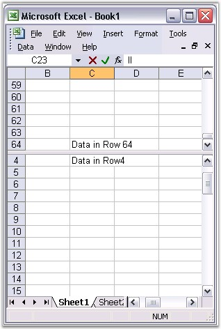

::: {style="DISPLAY: none"}
{#d2h_url_template}{#d2h_package_url style="WIDTH: 0px; DISPLAY: none; HEIGHT: 0px"}
:::

::: {.d2h_secondary_topic style="PADDING-BOTTOM: 10pt; MARGIN: 0pt; PADDING-LEFT: 0pt; PADDING-RIGHT: 0pt; PADDING-TOP: 0pt"}
#### Split Pane {#split-pane style="tab-stops: 0pt"}

 

A very handy feature of Excel is its ability to view more than one copy of your worksheet, and scroll through each pane of your worksheet independently. You can do this by using a feature called Split Panes, which can be used to split your worksheet both horizontally and vertically. This is enabled in MS Excel by selecting the Split option from the Window menu.

 

While using Split Panes, the panes of your worksheet work simultaneously. If you make a change in one, it will simultaneously appear in the other.

 

XlsIO provides support for splitting the window through the HorizontalSplit and VerticalSplit properties. Following code example illustrates this.

 

+--------------------------------------------------------------------------------------------------------------------------------------+
| **[\[C#\]]{style="FONT-FAMILY: 'Courier New'"}**                                                                                     |
|                                                                                                                                      |
| **[]{style="FONT-FAMILY: 'Courier New'"}**                                                                                           |
|                                                                                                                                      |
| [IWorksheet]{style="FONT-FAMILY: 'Courier New'; COLOR: #2b91af"}[ sheet = book.Worksheets\[0\];]{style="FONT-FAMILY: 'Courier New'"} |
|                                                                                                                                      |
| []{style="FONT-FAMILY: 'Courier New'"}                                                                                               |
|                                                                                                                                      |
| [sheet.FirstVisibleColumn = 5;]{style="FONT-FAMILY: 'Courier New'"}                                                                  |
|                                                                                                                                      |
| [sheet.FirstVisibleRow = 11;]{style="FONT-FAMILY: 'Courier New'"}                                                                    |
|                                                                                                                                      |
| [sheet.VerticalSplit = 110;]{style="FONT-FAMILY: 'Courier New'"}                                                                     |
|                                                                                                                                      |
| [sheet.HorizontalSplit = 100;]{style="FONT-FAMILY: 'Courier New'"}                                                                   |
|                                                                                                                                      |
| [sheet.ActivePane = 1;]{style="FONT-FAMILY: 'Courier New'"}                                                                          |
|                                                                                                                                      |
| []{style="FONT-FAMILY: 'Courier New'"}                                                                                               |
|                                                                                                                                      |
| [book.SaveAs(WORKSHEETS_PANE);]{style="FONT-FAMILY: 'Courier New'"}                                                                  |
+--------------------------------------------------------------------------------------------------------------------------------------+

[]{style="FONT-FAMILY: 'Trebuchet MS','sans-serif'; COLOR: #15428b; FONT-SIZE: 9pt"} 

+--------------------------------------------------------------------------------------------------------------------------------------------------------------+
| **[\[VB.NET\]]{style="FONT-FAMILY: 'Courier New'"}**                                                                                                         |
|                                                                                                                                                              |
| **[]{style="FONT-FAMILY: 'Courier New'"}**                                                                                                                   |
|                                                                                                                                                              |
| [Dim]{style="FONT-FAMILY: 'Courier New'; COLOR: blue"}[ sheet [As]{style="COLOR: blue"} IWorksheet = book.Worksheets(0)]{style="FONT-FAMILY: 'Courier New'"} |
|                                                                                                                                                              |
| []{style="FONT-FAMILY: 'Courier New'"}                                                                                                                       |
|                                                                                                                                                              |
| [sheet.FirstVisibleColumn = 5]{style="FONT-FAMILY: 'Courier New'"}                                                                                           |
|                                                                                                                                                              |
| [sheet.FirstVisibleRow = 11]{style="FONT-FAMILY: 'Courier New'"}                                                                                             |
|                                                                                                                                                              |
| [sheet.VerticalSplit = 110]{style="FONT-FAMILY: 'Courier New'"}                                                                                              |
|                                                                                                                                                              |
| [sheet.HorizontalSplit = 100]{style="FONT-FAMILY: 'Courier New'"}                                                                                            |
|                                                                                                                                                              |
| [sheet.ActivePane = 1]{style="FONT-FAMILY: 'Courier New'"}                                                                                                   |
|                                                                                                                                                              |
| []{style="FONT-FAMILY: 'Courier New'"}                                                                                                                       |
|                                                                                                                                                              |
| [book.SaveAs(WORKSHEETS_PANE)]{style="FONT-FAMILY: 'Courier New'"}                                                                                           |
+--------------------------------------------------------------------------------------------------------------------------------------------------------------+

[]{style="FONT-FAMILY: 'Trebuchet MS','sans-serif'; COLOR: #15428b; FONT-SIZE: 9pt"} 

{border="0"}

Figure 149: XlsIO with Freeze Pane[]{style="FONT-FAMILY: 'Trebuchet MS','sans-serif'; COLOR: #15428b"}

[]{style="FONT-FAMILY: 'Trebuchet MS','sans-serif'; COLOR: #15428b; FONT-SIZE: 9pt"} 

 

[]{#related-topics}
:::
