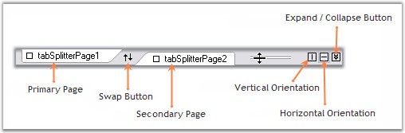

::: {style="DISPLAY: none"}
{#d2h_url_template}{#d2h_package_url style="WIDTH: 0px; DISPLAY: none; HEIGHT: 0px"}
:::

::: {.d2h_secondary_topic style="PADDING-BOTTOM: 10pt; MARGIN: 0pt; PADDING-LEFT: 0pt; PADDING-RIGHT: 0pt; PADDING-TOP: 0pt"}
#### Splitter Components {#splitter-components style="MARGIN-LEFT: 18pt; tab-stops: 18.0pt"}

[]{style="COLOR: #15428b"} 

The splitter in the TabSplitterContainer control has in-built options for changing the orientation of the splitter and also to collapse or expand the splitter panes. Those options are illustrated below.

[]{style="COLOR: #15428b"} 

{border="0"}

[]{style="COLOR: #15428b"} 

Figure 1110: Components in the Splitter

**[]{style="COLOR: #15428b"}** 

[·      ]{style="FONT-FAMILY: Symbol"}**Primary Page** - We can add primary pages using **PrimaryPages** property. It invokes TabSplitterPage Collection Editor and lets you add primary pages.

[·      ]{style="FONT-FAMILY: Symbol"}**Secondary Page** - We can add secondary pages using **SecondaryPages** property. It invokes TabSplitterPage Collection Editor and lets you add secondary pages.

[·      ]{style="FONT-FAMILY: Symbol"}**Swap Button** - This button lets you to swap between the primary and secondary pages.

[·      ]{style="FONT-FAMILY: Symbol"}**Vertical Orientation** - Sets the [[orientation]{.UGHyperlink}](../../../../../../../../Documents%20and%20Settings/sylviap/Desktop/Tools%20-%20Part%202.docx#_Orientation) of the splitter to be vertical.

[·      ]{style="FONT-FAMILY: Symbol"}**Horizontal Orientation** - Sets the [[orientation]{.UGHyperlink}](../../../../../../../../Documents%20and%20Settings/sylviap/Desktop/Tools%20-%20Part%202.docx#_Orientation) of the splitter to be horizontal.

[·      ]{style="FONT-FAMILY: Symbol"}**Expand / Collapse Button** - Clicking this button can collapse the secondary pane and place at the bottom of the control. Clicking this button again will expand the pane and place in its original position.

[]{style="COLOR: #15428b"} 

[]{style="COLOR: black"} 

 

 

 

[]{#p949} 

More:

[ ]{#related-topics}

[{border="0" align="absMiddle"}SplitterPage](ms-xhelp:///?Id=71198629-754a-4b76-8b0e-8bdc6bdbed8d){style="TEXT-DECORATION: none"}
:::
