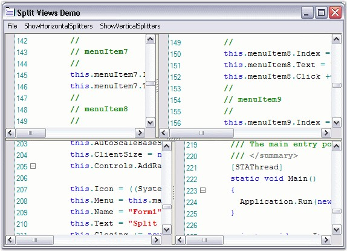

::: {style="DISPLAY: none"}
{#d2h_url_template}{#d2h_package_url style="WIDTH: 0px; DISPLAY: none; HEIGHT: 0px"}
:::

:::::: {.d2h_secondary_topic style="PADDING-BOTTOM: 10pt; MARGIN: 0pt; PADDING-LEFT: 0pt; PADDING-RIGHT: 0pt; PADDING-TOP: 0pt"}
#### Split Views {#split-views style="tab-stops: 0pt"}

 

Edit Control provides in-built support for horizontal and vertical splitters, which facilitates the splitting of a single document in the Edit Control into several split views so that you can work with multiple different areas of a document at the same time. A maximum of four split views are supported. However, you can also limit the user to perform either a horizontal or vertical split, only if you wish to support two views instead of four.

 

The vertical and horizontal splitters are always visible, by default. They can be disabled by setting the below given properties to **False**.

 

::: {align="center"}
  ---------------------------------------- ----------------------------------------------------------------------------
           Edit Control Property           Description
  ShowHorizontalSplitters                  Gets / sets value that indicates whether horizontal splitters are visible.
  ShowVerticalSplitters                    Gets / sets value that indicates whether vertical splitters are visible.
  ---------------------------------------- ----------------------------------------------------------------------------
:::

 

The following methods can be used to split the Edit Control into two equal horizontal or vertical halves.

 

::: {align="center"}
  --------------------- -----------------------------------------------------------
  Edit Control Method   Description
  SplitHorizontally     Splits the Edit Control into two equal horizontal halves.
  SplitVertically       Splits the Edit Control into two equal vertical halves.
  --------------------- -----------------------------------------------------------
:::

[]{style="FONT-FAMILY: 'Trebuchet MS','sans-serif'; COLOR: #15428b; FONT-SIZE: 9pt"} 

+-------------------------------------------------------------------------------------------------------------------------------------------------------------------+
| **[\[C#\]]{style="FONT-FAMILY: 'Courier New'; COLOR: black"}**                                                                                                    |
|                                                                                                                                                                   |
| []{style="FONT-FAMILY: 'Courier New'; COLOR: black"}                                                                                                              |
|                                                                                                                                                                   |
| [this]{style="FONT-FAMILY: 'Courier New'; COLOR: blue"}[.editControl1.ShowHorizontalSplitters = [true]{style="COLOR: blue"};]{style="FONT-FAMILY: 'Courier New'"} |
|                                                                                                                                                                   |
| [this]{style="FONT-FAMILY: 'Courier New'; COLOR: blue"}[.editControl1.ShowVerticalSplitters = [true]{style="COLOR: blue"};]{style="FONT-FAMILY: 'Courier New'"}   |
|                                                                                                                                                                   |
| []{style="FONT-FAMILY: 'Courier New'; COLOR: black"}                                                                                                              |
|                                                                                                                                                                   |
| [this]{style="FONT-FAMILY: 'Courier New'; COLOR: blue"}[.editControl1.SplitHorizontally();]{style="FONT-FAMILY: 'Courier New'"}                                   |
|                                                                                                                                                                   |
| [this]{style="FONT-FAMILY: 'Courier New'; COLOR: blue"}[.editControl1.SplitVertically();]{style="FONT-FAMILY: 'Courier New'"}                                     |
+-------------------------------------------------------------------------------------------------------------------------------------------------------------------+

[]{style="FONT-FAMILY: 'Trebuchet MS','sans-serif'; COLOR: #15428b; FONT-SIZE: 9pt"} 

+----------------------------------------------------------------------------------------------------------------------------------------------------------------+
| **[\[VB.NET\]]{style="FONT-FAMILY: 'Courier New'; COLOR: black"}**                                                                                             |
|                                                                                                                                                                |
| []{style="FONT-FAMILY: 'Courier New'; COLOR: black"}                                                                                                           |
|                                                                                                                                                                |
| [Me]{style="FONT-FAMILY: 'Courier New'; COLOR: blue"}[.editControl1.ShowHorizontalSplitters = [True]{style="COLOR: blue"}]{style="FONT-FAMILY: 'Courier New'"} |
|                                                                                                                                                                |
| [Me]{style="FONT-FAMILY: 'Courier New'; COLOR: blue"}[.editControl1.ShowVerticalSplitters = [True]{style="COLOR: blue"}]{style="FONT-FAMILY: 'Courier New'"}   |
|                                                                                                                                                                |
| []{style="FONT-FAMILY: 'Courier New'; COLOR: black"}                                                                                                           |
|                                                                                                                                                                |
| [Me]{style="FONT-FAMILY: 'Courier New'; COLOR: blue"}[.editControl1.SplitHorizontally()]{style="FONT-FAMILY: 'Courier New'"}                                   |
|                                                                                                                                                                |
| [Me]{style="FONT-FAMILY: 'Courier New'; COLOR: blue"}[.editControl1.SplitVertically()]{style="FONT-FAMILY: 'Courier New'"}                                     |
+----------------------------------------------------------------------------------------------------------------------------------------------------------------+

 

**Positioning**

[]{style="COLOR: #4a5c8c"} 

The following properties can be used to position the horizontal and vertical splitters in the Edit Control.

 

::: {align="center"}
  -------------------------------- -------------------------------------------------------
  Edit Control Property            Description
  HorizontalSplitterPosition       Gets / sets position of the horizontal splitter.
  TopVerticalSplitterPosition      Gets / sets position of the top vertical splitter.
  BottomVerticalSplitterPosition   Gets / sets position of the bottom vertical splitter.
  -------------------------------- -------------------------------------------------------
:::

[]{style="FONT-FAMILY: 'Trebuchet MS','sans-serif'; COLOR: #15428b; FONT-SIZE: 9pt"} 

+--------------------------------------------------------------------------------------------------------------------------------------------------+
| **[\[C#\]]{style="FONT-FAMILY: 'Courier New'; COLOR: black"}**                                                                                   |
|                                                                                                                                                  |
| []{style="FONT-FAMILY: 'Courier New'; COLOR: black"}                                                                                             |
|                                                                                                                                                  |
| [this]{style="FONT-FAMILY: 'Courier New'; COLOR: blue"}[.editControl1.HorizontalSplitterPosition = 220;]{style="FONT-FAMILY: 'Courier New'"}     |
|                                                                                                                                                  |
| [this]{style="FONT-FAMILY: 'Courier New'; COLOR: blue"}[.editControl1.TopVerticalSplitterPosition = 260;]{style="FONT-FAMILY: 'Courier New'"}    |
|                                                                                                                                                  |
| [this]{style="FONT-FAMILY: 'Courier New'; COLOR: blue"}[.editControl1.BottomVerticalSplitterPosition = 260;]{style="FONT-FAMILY: 'Courier New'"} |
+--------------------------------------------------------------------------------------------------------------------------------------------------+

[]{style="FONT-FAMILY: 'Trebuchet MS','sans-serif'; COLOR: #15428b; FONT-SIZE: 9pt"} 

+-----------------------------------------------------------------------------------------------------------------------------------------------+
| **[\[VB.NET\]]{style="FONT-FAMILY: 'Courier New'; COLOR: black"}**                                                                            |
|                                                                                                                                               |
| []{style="FONT-FAMILY: 'Courier New'; COLOR: black"}                                                                                          |
|                                                                                                                                               |
| [Me]{style="FONT-FAMILY: 'Courier New'; COLOR: blue"}[.editControl1.HorizontalSplitterPosition = 220]{style="FONT-FAMILY: 'Courier New'"}     |
|                                                                                                                                               |
| [Me]{style="FONT-FAMILY: 'Courier New'; COLOR: blue"}[.editControl1.TopVerticalSplitterPosition = 260]{style="FONT-FAMILY: 'Courier New'"}    |
|                                                                                                                                               |
| [Me]{style="FONT-FAMILY: 'Courier New'; COLOR: blue"}[.editControl1.BottomVerticalSplitterPosition = 260]{style="FONT-FAMILY: 'Courier New'"} |
+-----------------------------------------------------------------------------------------------------------------------------------------------+

[]{style="FONT-FAMILY: 'Trebuchet MS','sans-serif'; COLOR: #15428b; FONT-SIZE: 9pt"} 

SplitFourQuadrants Method

[]{style="FONT-FAMILY: 'Trebuchet MS','sans-serif'; COLOR: #15428b; FONT-SIZE: 9pt"} 

The **SplitFourQuadrants** method is used to split the Edit Control into four equal parts.

[]{style="FONT-FAMILY: 'Trebuchet MS','sans-serif'; COLOR: #15428b; FONT-SIZE: 9pt"} 

+----------------------------------------------------------------------------------------------------------------------------------+
| **[\[C#\]]{style="FONT-FAMILY: 'Courier New'; COLOR: black"}**                                                                   |
|                                                                                                                                  |
| []{style="FONT-FAMILY: 'Courier New'; COLOR: black"}                                                                             |
|                                                                                                                                  |
| [this]{style="FONT-FAMILY: 'Courier New'; COLOR: blue"}[.editControl1.SplitFourQuadrants();]{style="FONT-FAMILY: 'Courier New'"} |
+----------------------------------------------------------------------------------------------------------------------------------+

[]{style="FONT-FAMILY: 'Trebuchet MS','sans-serif'; COLOR: #15428b; FONT-SIZE: 9pt"} 

+-------------------------------------------------------------------------------------------------------------------------------+
| **[\[VB.NET\]]{style="FONT-FAMILY: 'Courier New'; COLOR: black"}**                                                            |
|                                                                                                                               |
| []{style="FONT-FAMILY: 'Courier New'; COLOR: black"}                                                                          |
|                                                                                                                               |
| [Me]{style="FONT-FAMILY: 'Courier New'; COLOR: blue"}[.editControl1.SplitFourQuadrants()]{style="FONT-FAMILY: 'Courier New'"} |
+-------------------------------------------------------------------------------------------------------------------------------+

[]{style="FONT-FAMILY: 'Trebuchet MS','sans-serif'; COLOR: #15428b; FONT-SIZE: 9pt"} 

{border="0"}

Figure 63: Edit Control Split into Four Quadrants

 

A sample which demonstrates Split Views is available in the below sample installation path.

 

..\\My Documents\\Syncfusion\\EssentialStudio\\***Version Number***\\Windows\\Edit.Windows\\Samples\\2.0\\Appearance\\SplitViewsDemo

 

See Also

[]{style="FONT-FAMILY: 'Segoe UI','sans-serif'; COLOR: black; FONT-SIZE: 9pt"} 

[Scrolling Support]{.UGHyperlink}[]{.UGHyperlink}

[]{#p95} 

 

[]{#related-topics}
::::::
