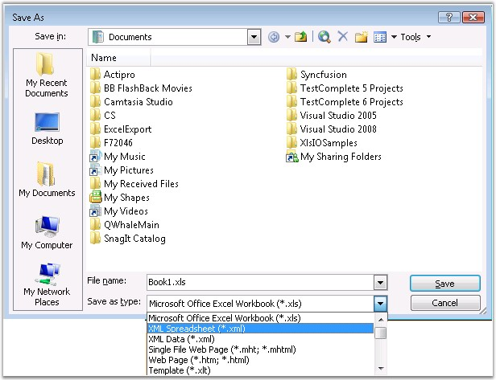

::: {style="DISPLAY: none"}
{#d2h_url_template}{#d2h_package_url style="WIDTH: 0px; DISPLAY: none; HEIGHT: 0px"}
:::

::::: {#nsbanner .d2h_main_nsbanner style="BORDER-BOTTOM: #999999 1px solid; POSITION: relative; PADDING-BOTTOM: 0px; BACKGROUND-COLOR: transparent; PADDING-LEFT: 0px; PADDING-RIGHT: 0px; DISPLAY: none; BORDER-TOP: #999999 1px solid; PADDING-TOP: 0px; LEFT: 0px"}
:::: {#TitleRow .d2h_main_titlerow style="PADDING-BOTTOM: 4px; BACKGROUND-COLOR: transparent; PADDING-LEFT: 22px; WIDTH: 100%; PADDING-RIGHT: 10px; DISPLAY: none; PADDING-TOP: 4px"}
::: {#ienav .d2h_main_ienav style="DISPLAY: none"}
{#D2HPrevious .D2HPreviousEnabled}  {#D2HNext .D2HNextEnabled}
:::
::::
:::::

::::: {#nstext .d2h_main_nstext style="PADDING-BOTTOM: 10px; BACKGROUND-COLOR: transparent; PADDING-LEFT: 22px; PADDING-RIGHT: 10px; HEIGHT: 100%; OVERFLOW: auto; PADDING-TOP: 5px" hasuserbackground="true" valign="bottom"}
::: {#d2h_breadcrumbs .d2h_breadcrumbs}
[Essential Studio User Guide Documentation](ms-xhelp:///?Id=12457748-09e3-4d74-a240-8e049cedf030){.d2h_breadcrumbsNormal}[ \> ]{.d2h_breadcrumbsLinkSeparator}[Reporting Edition](ms-xhelp:///?Id=027aa5b6-6676-4f93-ad23-c20e8c45792e){.d2h_breadcrumbsNormal}[ \> ]{.d2h_breadcrumbsLinkSeparator}[Essential XlsIO](ms-xhelp:///?Id=b01a1b50-1d7d-40c0-bc83-af67e57c9005){.d2h_breadcrumbsNormal}[ \> ]{.d2h_breadcrumbsLinkSeparator}[Getting Started](ms-xhelp:///?Id=ad99231a-9920-49c5-b9a3-8c0224163396){.d2h_breadcrumbsNormal}[ \> ]{.d2h_breadcrumbsLinkSeparator}[Saving a Workbook](ms-xhelp:///?Id=1b71588e-a2a0-4bc0-924a-e0703e047656){.d2h_breadcrumbsNormal}
:::

### SpreadsheetML {#spreadsheetml style="tab-stops: 0pt"}

 

SpreadsheetML is an XML dialect developed by Microsoft to represent the information in an Excel workbook. SpreadsheetML allows you to save Excel workbooks as XML documents, and to open them in Excel. Microsoft created a format that allows you to save, in an XML-based file, almost every Excel customization (including formulas, data, and formatting).

 

SpreadsheetML file can be created with Office 2003 by selecting the **Save as type:** as **XML Spreadsheet (\*.xml)**.

 

{border="0"}

Figure 31: Saving as Xml Spreadsheet**[]{style="FONT-FAMILY: 'Trebuchet MS','sans-serif'; COLOR: #15428b"}**

**[]{style="FONT-FAMILY: 'Trebuchet MS','sans-serif'; COLOR: #15428b"}** 

 

**Saving Excel Workbooks as XML By Using Essential XlsIO**

 

Essential XlsIO provides support for reading and writing objects to SpreadsheetML format. Creating a SpreadsheetML file from scratch, has no difference when compared to the API used for Excel97-2003 format, except for the way it is saved.

 

Here is the code snippet for creating a SpreadsheetML file.

 

+---------------------------------------------------------------------------------------------------------------------------------------------------------+
| **[\[C#\]]{style="FONT-FAMILY: 'Courier New'"}**                                                                                                        |
|                                                                                                                                                         |
| **[]{style="FONT-FAMILY: 'Courier New'"}**                                                                                                              |
|                                                                                                                                                         |
| [//Create a new workbook]{style="FONT-FAMILY: 'Courier New'; COLOR: green"}                                                                             |
|                                                                                                                                                         |
| [IWorkbook]{style="FONT-FAMILY: 'Courier New'; COLOR: #2b91af"}[ workbook = excelEngine.Excel.Workbooks.Create(3);]{style="FONT-FAMILY: 'Courier New'"} |
|                                                                                                                                                         |
| []{style="FONT-FAMILY: 'Courier New'"}                                                                                                                  |
|                                                                                                                                                         |
| [//The first worksheet object in the worksheets collection is accessed.]{style="FONT-FAMILY: 'Courier New'; COLOR: green"}                              |
|                                                                                                                                                         |
| [IWorksheet]{style="FONT-FAMILY: 'Courier New'; COLOR: #2b91af"}[ sheet = workbook.Worksheets\[0\];]{style="FONT-FAMILY: 'Courier New'"}                |
|                                                                                                                                                         |
| []{style="FONT-FAMILY: 'Courier New'"}                                                                                                                  |
|                                                                                                                                                         |
| [//Write data]{style="FONT-FAMILY: 'Courier New'; COLOR: green"}                                                                                        |
|                                                                                                                                                         |
| [sheet.Range\[[\"C3:O28\"]{style="COLOR: #a31515"}\].Text = [\"Hello world\"]{style="COLOR: #a31515"};]{style="FONT-FAMILY: 'Courier New'"}             |
|                                                                                                                                                         |
| []{style="FONT-FAMILY: 'Courier New'"}                                                                                                                  |
|                                                                                                                                                         |
| [//Save as SpreadsheetML.]{style="FONT-FAMILY: 'Courier New'; COLOR: green"}                                                                            |
|                                                                                                                                                         |
| [workbook.SaveAsXml([\"Sample.xml\"]{style="COLOR: #a31515"}, [ExcelXmlSaveType]{style="COLOR: #2b91af"}.MSExcel);]{style="FONT-FAMILY: 'Courier New'"} |
+---------------------------------------------------------------------------------------------------------------------------------------------------------+

[]{style="FONT-FAMILY: 'Trebuchet MS','sans-serif'; COLOR: #15428b; FONT-SIZE: 9pt"} 

+-----------------------------------------------------------------------------------------------------------------------------------------------------------------------------------+
| **[\[VB.NET\]]{style="FONT-FAMILY: 'Courier New'"}**                                                                                                                              |
|                                                                                                                                                                                   |
| []{style="FONT-FAMILY: 'Courier New'"}                                                                                                                                            |
|                                                                                                                                                                                   |
| [\'Create a new workbook]{style="FONT-FAMILY: 'Courier New'; COLOR: green"}                                                                                                       |
|                                                                                                                                                                                   |
| [Dim]{style="FONT-FAMILY: 'Courier New'; COLOR: blue"}[ workbook [As]{style="COLOR: blue"} IWorkbook = excelEngine.Excel.Workbooks.Create(3)]{style="FONT-FAMILY: 'Courier New'"} |
|                                                                                                                                                                                   |
| []{style="FONT-FAMILY: 'Courier New'"}                                                                                                                                            |
|                                                                                                                                                                                   |
| [\'The first worksheet object in the worksheets collection is accessed.]{style="FONT-FAMILY: 'Courier New'; COLOR: green"}                                                        |
|                                                                                                                                                                                   |
| [Dim]{style="FONT-FAMILY: 'Courier New'; COLOR: blue"}[ sheet [As]{style="COLOR: blue"} IWorksheet = workbook.Worksheets(0)]{style="FONT-FAMILY: 'Courier New'"}                  |
|                                                                                                                                                                                   |
| []{style="FONT-FAMILY: 'Courier New'"}                                                                                                                                            |
|                                                                                                                                                                                   |
| [\'Write data]{style="FONT-FAMILY: 'Courier New'; COLOR: green"}                                                                                                                  |
|                                                                                                                                                                                   |
| [sheet.Range([\"C3:O28\"]{style="COLOR: maroon"}).Text = [\"Hello world\"]{style="COLOR: maroon"}]{style="FONT-FAMILY: 'Courier New'"}                                            |
|                                                                                                                                                                                   |
| []{style="FONT-FAMILY: 'Courier New'; COLOR: maroon"}                                                                                                                             |
|                                                                                                                                                                                   |
| [\'Save as SpreadsheetML.]{style="FONT-FAMILY: 'Courier New'; COLOR: green"}                                                                                                      |
|                                                                                                                                                                                   |
| [workbook.SaveAsXml([\"Sample.xml\"]{style="COLOR: maroon"},ExcelXmlSaveType.MSExcel)]{style="FONT-FAMILY: 'Courier New'"}                                                        |
+-----------------------------------------------------------------------------------------------------------------------------------------------------------------------------------+

 

Following code example illustrates how to open an existing SpreadsheetML file.

 

+-------------------------------------------------------------------------------------------------------------------------------------------------------------------------------------------------------------------------------+
| **[\[C#\]]{style="FONT-FAMILY: 'Courier New'"}**                                                                                                                                                                              |
|                                                                                                                                                                                                                               |
| **[]{style="FONT-FAMILY: 'Courier New'"}**                                                                                                                                                                                    |
|                                                                                                                                                                                                                               |
| [//Open an existing SpreadsheetMl file.]{style="FONT-FAMILY: 'Courier New'; COLOR: green"}                                                                                                                                    |
|                                                                                                                                                                                                                               |
| [IWorkbook]{style="FONT-FAMILY: 'Courier New'; COLOR: #2b91af"}[ workbook = excelEngine.Excel.Workbooks.Open([\"spreadsheetml.xml\"]{style="COLOR: #a31515"}, ExcelXmlOpenType.MSExcel);]{style="FONT-FAMILY: 'Courier New'"} |
|                                                                                                                                                                                                                               |
| []{style="FONT-FAMILY: 'Courier New'"}                                                                                                                                                                                        |
|                                                                                                                                                                                                                               |
| [//The first worksheet object in the worksheets collection is accessed.]{style="FONT-FAMILY: 'Courier New'; COLOR: green"}                                                                                                    |
|                                                                                                                                                                                                                               |
| [IWorksheet]{style="FONT-FAMILY: 'Courier New'; COLOR: #2b91af"}[ sheet = workbook.Worksheets\[0\];]{style="FONT-FAMILY: 'Courier New'"}                                                                                      |
|                                                                                                                                                                                                                               |
| []{style="FONT-FAMILY: 'Courier New'"}                                                                                                                                                                                        |
|                                                                                                                                                                                                                               |
| [//Write data]{style="FONT-FAMILY: 'Courier New'; COLOR: green"}                                                                                                                                                              |
|                                                                                                                                                                                                                               |
| [sheet.Range\[[\"C3:O28\"]{style="COLOR: #a31515"}\].Text = [\"Hello world\"]{style="COLOR: #a31515"};]{style="FONT-FAMILY: 'Courier New'"}                                                                                   |
|                                                                                                                                                                                                                               |
| []{style="FONT-FAMILY: 'Courier New'"}                                                                                                                                                                                        |
|                                                                                                                                                                                                                               |
| [//Save as SpreadsheetML.]{style="FONT-FAMILY: 'Courier New'; COLOR: green"}                                                                                                                                                  |
|                                                                                                                                                                                                                               |
| [workbook.SaveAsXml([\"Sample.xml\"]{style="COLOR: #a31515"}, [ExcelXmlSaveType]{style="COLOR: #2b91af"}.MSExcel);]{style="FONT-FAMILY: 'Courier New'"}                                                                       |
+-------------------------------------------------------------------------------------------------------------------------------------------------------------------------------------------------------------------------------+

[]{style="FONT-FAMILY: 'Trebuchet MS','sans-serif'; COLOR: #15428b; FONT-SIZE: 9pt"} 

+-----------------------------------------------------------------------------------------------------------------------------------------------------------------------------------------------------------------------------------------------------+
| **[\[VB.NET\]]{style="FONT-FAMILY: 'Courier New'"}**                                                                                                                                                                                                |
|                                                                                                                                                                                                                                                     |
| []{style="FONT-FAMILY: 'Courier New'"}                                                                                                                                                                                                              |
|                                                                                                                                                                                                                                                     |
| [\'Open an existing SpreadsheetMl file.]{style="FONT-FAMILY: 'Courier New'; COLOR: green"}                                                                                                                                                          |
|                                                                                                                                                                                                                                                     |
| [Dim]{style="FONT-FAMILY: 'Courier New'; COLOR: blue"}[ workbook [As]{style="COLOR: blue"} IWorkbook = excelEngine.Excel.Workbooks.Open([\"spreadsheetml\"]{style="COLOR: #a31515"}, ExcelXmlOpenType.MSExcel)]{style="FONT-FAMILY: 'Courier New'"} |
|                                                                                                                                                                                                                                                     |
| []{style="FONT-FAMILY: 'Courier New'"}                                                                                                                                                                                                              |
|                                                                                                                                                                                                                                                     |
| [\'The first worksheet object in the worksheets collection is accessed.]{style="FONT-FAMILY: 'Courier New'; COLOR: green"}                                                                                                                          |
|                                                                                                                                                                                                                                                     |
| [Dim]{style="FONT-FAMILY: 'Courier New'; COLOR: blue"}[ sheet [As]{style="COLOR: blue"} IWorksheet = workbook.Worksheets(0)]{style="FONT-FAMILY: 'Courier New'"}                                                                                    |
|                                                                                                                                                                                                                                                     |
| []{style="FONT-FAMILY: 'Courier New'"}                                                                                                                                                                                                              |
|                                                                                                                                                                                                                                                     |
| [\'Write data]{style="FONT-FAMILY: 'Courier New'; COLOR: green"}                                                                                                                                                                                    |
|                                                                                                                                                                                                                                                     |
| [sheet.Range([\"C3:O28\"]{style="COLOR: maroon"}).Text = [\"Hello world\"]{style="COLOR: maroon"}]{style="FONT-FAMILY: 'Courier New'"}                                                                                                              |
|                                                                                                                                                                                                                                                     |
| []{style="FONT-FAMILY: 'Courier New'; COLOR: maroon"}                                                                                                                                                                                               |
|                                                                                                                                                                                                                                                     |
| [\'Save as SpreadsheetML.]{style="FONT-FAMILY: 'Courier New'; COLOR: green"}                                                                                                                                                                        |
|                                                                                                                                                                                                                                                     |
| [workbook.SaveAsXml([\"Sample.xml\"]{style="COLOR: maroon"},ExcelXmlSaveType.MSExcel)]{style="FONT-FAMILY: 'Courier New'"}                                                                                                                          |
+-----------------------------------------------------------------------------------------------------------------------------------------------------------------------------------------------------------------------------------------------------+

[]{style="FONT-FAMILY: 'Trebuchet MS','sans-serif'; COLOR: #15428b; FONT-SIZE: 9pt"} 

::: {style="BORDER-BOTTOM: windowtext 1pt solid; BORDER-LEFT: medium none; PADDING-BOTTOM: 1pt; MARGIN-TOP: 9pt; PADDING-LEFT: 0pt; PADDING-RIGHT: 0pt; MARGIN-BOTTOM: 9pt; BORDER-TOP: windowtext 1pt solid; BORDER-RIGHT: medium none; PADDING-TOP: 1pt"}
{border="0"}Note: Currently XlsIO cannot parse the Document Properties apart from elements that are not supported by MS Excel. Colors created by XlsIO will choose the closest color to it when exported to the SpreadsheetML format. For more information refer [[Excel 97 to 2003]{.UGHyperlink}](ms-xhelp:///?Id=c987ccb0-3e30-4c83-97d7-cc8c66c07ec4)[, ]{style="FONT-FAMILY: 'Trebuchet MS','sans-serif'; COLOR: #15428b"}[[Excel 2007 \[.Xlsx-Biff12 format\]]{.UGHyperlink}](ms-xhelp:///?Id=5cc1e03c-a07a-4771-9986-eb6c4578ef8f)[, ]{style="FONT-FAMILY: 'Trebuchet MS','sans-serif'; COLOR: #15428b"}and[ ]{style="FONT-FAMILY: 'Trebuchet MS','sans-serif'; COLOR: #15428b"}[[CSV format]{.UGHyperlink}](ms-xhelp:///?Id=b5f99653-905f-4aa8-a445-bc230a3d7b92)[.]{.UGHyperlink}[]{style="FONT-FAMILY: 'Trebuchet MS','sans-serif'"}
:::

[]{#p29}**[]{style="FONT-FAMILY: 'Segoe UI','sans-serif'; COLOR: black"}** 

[]{#related-topics}
:::::
