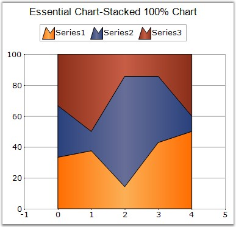

::: {style="DISPLAY: none"}
{#d2h_url_template}{#d2h_package_url style="WIDTH: 0px; DISPLAY: none; HEIGHT: 0px"}
:::

:::: {.d2h_secondary_topic style="PADDING-BOTTOM: 10pt; MARGIN: 0pt; PADDING-LEFT: 0pt; PADDING-RIGHT: 0pt; PADDING-TOP: 0pt"}
#### StackedArea100 Chart {#stackedarea100-chart style="tab-stops: 0pt"}

 

This chart type displays multiple series of data as stacked areas ensuring that the cumulative proportion of each stacked element always totals 100 percent. The y axis will hence always be rendered with the range 0 - 100.

 

{border="0"}

 

Figure 59: A 100 percent StackedArea Chart

 

::: {align="center"}
+----------------------------------+------------------------+
| Details                                                   |
+----------------------------------+------------------------+
| **Number of Y values per point** | 1                      |
+----------------------------------+------------------------+
| **Number of Series         **    | One.                   |
+----------------------------------+------------------------+
| **SupportMarker**                | No                     |
+----------------------------------+------------------------+
| **Cannot be Combined with   **   | Any other chart types. |
+----------------------------------+------------------------+
:::

 

+------------------------------------------------------------------------------------------------------------------------------------------------------------------------------------------------------------------------------------------+
| **[\[C#\]]{style="FONT-FAMILY: 'Courier New'; COLOR: black"}**                                                                                                                                                                           |
|                                                                                                                                                                                                                                          |
| **[]{style="FONT-FAMILY: 'Courier New'; COLOR: black"}**                                                                                                                                                                                 |
|                                                                                                                                                                                                                                          |
| [ChartSeries]{style="FONT-FAMILY: 'Courier New'; COLOR: teal"}[ series1=chartControl1.Model.NewSeries([\"Series1\"]{style="COLOR: maroon"},[ChartSeriesType]{style="COLOR: teal"}.StackingArea100);]{style="FONT-FAMILY: 'Courier New'"} |
|                                                                                                                                                                                                                                          |
| [series1.Points.Add(1,20);]{style="FONT-FAMILY: 'Courier New'"}                                                                                                                                                                          |
|                                                                                                                                                                                                                                          |
| [series1.Points.Add(2,30);]{style="FONT-FAMILY: 'Courier New'"}                                                                                                                                                                          |
|                                                                                                                                                                                                                                          |
| [series1.Points.Add(3,10);]{style="FONT-FAMILY: 'Courier New'"}                                                                                                                                                                          |
|                                                                                                                                                                                                                                          |
| [series1.Points.Add(4,15);]{style="FONT-FAMILY: 'Courier New'"}                                                                                                                                                                          |
|                                                                                                                                                                                                                                          |
| [series1.Points.Add(5,25);]{style="FONT-FAMILY: 'Courier New'"}                                                                                                                                                                          |
|                                                                                                                                                                                                                                          |
| [this]{style="FONT-FAMILY: 'Courier New'; COLOR: blue"}[.chartControl1.Series.Add(series1);]{style="FONT-FAMILY: 'Courier New'"}                                                                                                         |
|                                                                                                                                                                                                                                          |
| []{style="FONT-FAMILY: 'Courier New'"}                                                                                                                                                                                                   |
|                                                                                                                                                                                                                                          |
| [ChartSeries]{style="FONT-FAMILY: 'Courier New'; COLOR: teal"}[ series2=chartControl1.Model.NewSeries([\"Series2\"]{style="COLOR: maroon"},[ChartSeriesType]{style="COLOR: teal"}.StackingArea100);]{style="FONT-FAMILY: 'Courier New'"} |
|                                                                                                                                                                                                                                          |
| [series2.Points.Add(1,20);]{style="FONT-FAMILY: 'Courier New'"}                                                                                                                                                                          |
|                                                                                                                                                                                                                                          |
| [series2.Points.Add(2,10);]{style="FONT-FAMILY: 'Courier New'"}                                                                                                                                                                          |
|                                                                                                                                                                                                                                          |
| [series2.Points.Add(3,50);]{style="FONT-FAMILY: 'Courier New'"}                                                                                                                                                                          |
|                                                                                                                                                                                                                                          |
| [series2.Points.Add(4,15);]{style="FONT-FAMILY: 'Courier New'"}                                                                                                                                                                          |
|                                                                                                                                                                                                                                          |
| [series2.Points.Add(5,5);]{style="FONT-FAMILY: 'Courier New'"}                                                                                                                                                                           |
|                                                                                                                                                                                                                                          |
| [this]{style="FONT-FAMILY: 'Courier New'; COLOR: blue"}[.chartControl1.Series.Add(series2);]{style="FONT-FAMILY: 'Courier New'"}                                                                                                         |
|                                                                                                                                                                                                                                          |
| []{style="FONT-FAMILY: 'Courier New'"}                                                                                                                                                                                                   |
|                                                                                                                                                                                                                                          |
| [ChartSeries]{style="FONT-FAMILY: 'Courier New'; COLOR: teal"}[ series3=chartControl1.Model.NewSeries([\"Series3\"]{style="COLOR: maroon"},[ChartSeriesType]{style="COLOR: teal"}.StackingArea100);]{style="FONT-FAMILY: 'Courier New'"} |
|                                                                                                                                                                                                                                          |
| [series3.Points.Add(1,20);]{style="FONT-FAMILY: 'Courier New'"}                                                                                                                                                                          |
|                                                                                                                                                                                                                                          |
| [series3.Points.Add(2,40);]{style="FONT-FAMILY: 'Courier New'"}                                                                                                                                                                          |
|                                                                                                                                                                                                                                          |
| [series3.Points.Add(3,10);]{style="FONT-FAMILY: 'Courier New'"}                                                                                                                                                                          |
|                                                                                                                                                                                                                                          |
| [series3.Points.Add(4,5);]{style="FONT-FAMILY: 'Courier New'"}                                                                                                                                                                           |
|                                                                                                                                                                                                                                          |
| [series3.Points.Add(5,20);]{style="FONT-FAMILY: 'Courier New'"}                                                                                                                                                                          |
|                                                                                                                                                                                                                                          |
| [this]{style="FONT-FAMILY: 'Courier New'; COLOR: blue"}[.chartControl1.Series.Add(series3);]{style="FONT-FAMILY: 'Courier New'"}                                                                                                         |
+------------------------------------------------------------------------------------------------------------------------------------------------------------------------------------------------------------------------------------------+

 

+---------------------------------------------------------------------------------------------------------------------------------------------------------------------------------------------------------------------------------------------------+
| **[\[VB.NET\]]{style="FONT-FAMILY: 'Courier New'; COLOR: black"}**                                                                                                                                                                                |
|                                                                                                                                                                                                                                                   |
| **[]{style="FONT-FAMILY: 'Courier New'; COLOR: black"}**                                                                                                                                                                                          |
|                                                                                                                                                                                                                                                   |
| [Dim]{style="FONT-FAMILY: 'Courier New'; COLOR: blue"}[ series1 [As]{style="COLOR: blue"} ChartSeries = chartControl1.Model.NewSeries([\"Series1\"]{style="COLOR: maroon"}, ChartSeriesType.StackingArea100)]{style="FONT-FAMILY: 'Courier New'"} |
|                                                                                                                                                                                                                                                   |
| [series1.Points.Add(0, 20)]{style="FONT-FAMILY: 'Courier New'"}                                                                                                                                                                                   |
|                                                                                                                                                                                                                                                   |
| [series1.Points.Add(1, 30)]{style="FONT-FAMILY: 'Courier New'"}                                                                                                                                                                                   |
|                                                                                                                                                                                                                                                   |
| [series1.Points.Add(2, 10)]{style="FONT-FAMILY: 'Courier New'"}                                                                                                                                                                                   |
|                                                                                                                                                                                                                                                   |
| [series1.Points.Add(3, 15)]{style="FONT-FAMILY: 'Courier New'"}                                                                                                                                                                                   |
|                                                                                                                                                                                                                                                   |
| [series1.Points.Add(4, 25)]{style="FONT-FAMILY: 'Courier New'"}                                                                                                                                                                                   |
|                                                                                                                                                                                                                                                   |
| [Me]{style="FONT-FAMILY: 'Courier New'; COLOR: blue"}[.chartControl1.Series.Add(series1)]{style="FONT-FAMILY: 'Courier New'"}                                                                                                                     |
|                                                                                                                                                                                                                                                   |
| []{style="FONT-FAMILY: 'Courier New'"}                                                                                                                                                                                                            |
|                                                                                                                                                                                                                                                   |
| [Dim]{style="FONT-FAMILY: 'Courier New'; COLOR: blue"}[ series2 [As]{style="COLOR: blue"} ChartSeries = chartControl1.Model.NewSeries([\"Series2\"]{style="COLOR: maroon"}, ChartSeriesType.StackingArea100)]{style="FONT-FAMILY: 'Courier New'"} |
|                                                                                                                                                                                                                                                   |
| [series2.Points.Add(0, 20)]{style="FONT-FAMILY: 'Courier New'"}                                                                                                                                                                                   |
|                                                                                                                                                                                                                                                   |
| [series2.Points.Add(1, 10)]{style="FONT-FAMILY: 'Courier New'"}                                                                                                                                                                                   |
|                                                                                                                                                                                                                                                   |
| [series2.Points.Add(2, 50)]{style="FONT-FAMILY: 'Courier New'"}                                                                                                                                                                                   |
|                                                                                                                                                                                                                                                   |
| [series2.Points.Add(3, 15)]{style="FONT-FAMILY: 'Courier New'"}                                                                                                                                                                                   |
|                                                                                                                                                                                                                                                   |
| [series2.Points.Add(4, 5)]{style="FONT-FAMILY: 'Courier New'"}                                                                                                                                                                                    |
|                                                                                                                                                                                                                                                   |
| [Me]{style="FONT-FAMILY: 'Courier New'; COLOR: blue"}[.chartControl1.Series.Add(series2)]{style="FONT-FAMILY: 'Courier New'"}                                                                                                                     |
|                                                                                                                                                                                                                                                   |
| []{style="FONT-FAMILY: 'Courier New'"}                                                                                                                                                                                                            |
|                                                                                                                                                                                                                                                   |
| [Dim]{style="FONT-FAMILY: 'Courier New'; COLOR: blue"}[ series3 [As]{style="COLOR: blue"} ChartSeries = chartControl1.Model.NewSeries([\"Series3\"]{style="COLOR: maroon"}, ChartSeriesType.StackingArea100)]{style="FONT-FAMILY: 'Courier New'"} |
|                                                                                                                                                                                                                                                   |
| [series3.Points.Add(0, 20)]{style="FONT-FAMILY: 'Courier New'"}                                                                                                                                                                                   |
|                                                                                                                                                                                                                                                   |
| [series3.Points.Add(1, 40)]{style="FONT-FAMILY: 'Courier New'"}                                                                                                                                                                                   |
|                                                                                                                                                                                                                                                   |
| [series3.Points.Add(2, 10)]{style="FONT-FAMILY: 'Courier New'"}                                                                                                                                                                                   |
|                                                                                                                                                                                                                                                   |
| [series3.Points.Add(3, 5)]{style="FONT-FAMILY: 'Courier New'"}                                                                                                                                                                                    |
|                                                                                                                                                                                                                                                   |
| [series3.Points.Add(4, 20)]{style="FONT-FAMILY: 'Courier New'"}                                                                                                                                                                                   |
|                                                                                                                                                                                                                                                   |
| [Me]{style="FONT-FAMILY: 'Courier New'; COLOR: blue"}[.chartControl1.Series.Add(series3)]{style="FONT-FAMILY: 'Courier New'"}                                                                                                                     |
+---------------------------------------------------------------------------------------------------------------------------------------------------------------------------------------------------------------------------------------------------+

 

+------------------------------------------------------------------------------------------------------------------------------------------------+
| []{style="FONT-FAMILY: 'Segoe UI','sans-serif'; COLOR: black"}                                                                                 |
|                                                                                                                                                |
| Customization Options                                                                                                                          |
+------------------------------------------------------------------------------------------------------------------------------------------------+
| Border, DisplayText, DrawSeriesNameInDepth, ElementBorders, HighlightInterior, ImageIndex, Rotate, SeriesToolTipFormat, Spacing Between Series |
|                                                                                                                                                |
| , ZOrder, FancyToolTip, Font, Interior, LegendItem, Name, PointsToolTipFormat, SmartLabels,                                                    |
|                                                                                                                                                |
| Summary, Text, TextColor, TextFormat, TextOffset, TextOrientation, Visible                                                                     |
+------------------------------------------------------------------------------------------------------------------------------------------------+

 

**See Also**

 

[StackedBar100 Chart]{.UGHyperlink}, [StackedColumn100Chart]{.UGHyperlink}[]{style="COLOR: black"}

 

[]{#p49} 

 

[]{#related-topics}
::::
