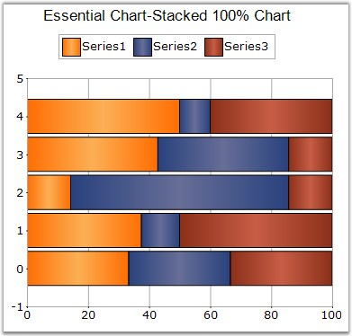

::: {style="DISPLAY: none"}
{#d2h_url_template}{#d2h_package_url style="WIDTH: 0px; DISPLAY: none; HEIGHT: 0px"}
:::

:::: {.d2h_secondary_topic style="PADDING-BOTTOM: 10pt; MARGIN: 0pt; PADDING-LEFT: 0pt; PADDING-RIGHT: 0pt; PADDING-TOP: 0pt"}
#### StackedBar100 Chart {#stackedbar100-chart style="tab-stops: 0pt"}

 

This chart type displays multiple series of data as stacked Bars ensuring that the cumulative proportion of each stacked element always totals 100%. The y-axis will hence always be rendered with the range 0 - 100.

 

{border="0"}

 

Figure 48: A 100% StackedBar Chart

 

 

::: {align="center"}
+----------------------------------+------------------------+
| Details                                                   |
+----------------------------------+------------------------+
| **Number of Y values per point** | 1                      |
+----------------------------------+------------------------+
| **Number of Series         **    | Two or more.           |
+----------------------------------+------------------------+
| **SupportMarker**                | No                     |
+----------------------------------+------------------------+
| **Cannot be Combined with   **   | Any other chart types. |
+----------------------------------+------------------------+
:::

 

+--------------------------------------------------------------------------------------------------------------------------------------------------------------------------------------------+
| **[\[C#\]]{style="FONT-FAMILY: 'Courier New'; COLOR: black"}**                                                                                                                             |
|                                                                                                                                                                                            |
| **[]{style="FONT-FAMILY: 'Courier New'; COLOR: black"}**                                                                                                                                   |
|                                                                                                                                                                                            |
| [ChartSeries series1 = [this]{style="COLOR: blue"}.chartControl1.Model.NewSeries([\"chart\"]{style="COLOR: maroon"}, ChartSeriesType.StackingBar100);]{style="FONT-FAMILY: 'Courier New'"} |
|                                                                                                                                                                                            |
| [series1.Points.Add(0, 25.3);]{style="FONT-FAMILY: 'Courier New'"}                                                                                                                         |
|                                                                                                                                                                                            |
| [series1.Points.Add(1, 45.7);]{style="FONT-FAMILY: 'Courier New'"}                                                                                                                         |
|                                                                                                                                                                                            |
| [series1.Points.Add(2, 97.3);]{style="FONT-FAMILY: 'Courier New'"}                                                                                                                         |
|                                                                                                                                                                                            |
| [series1.Points.Add(3, 20.6);]{style="FONT-FAMILY: 'Courier New'"}                                                                                                                         |
|                                                                                                                                                                                            |
| [series1.Points.Add(4, 125.8);]{style="FONT-FAMILY: 'Courier New'"}                                                                                                                        |
|                                                                                                                                                                                            |
| [series1.Points.Add(5, 216.1);]{style="FONT-FAMILY: 'Courier New'"}                                                                                                                        |
|                                                                                                                                                                                            |
| [this]{style="FONT-FAMILY: 'Courier New'; COLOR: blue"}[.chartControl1.Series.Add(series1);]{style="FONT-FAMILY: 'Courier New'"}                                                           |
+--------------------------------------------------------------------------------------------------------------------------------------------------------------------------------------------+

 

+--------------------------------------------------------------------------------------------------------------------------------------------------------------------------------------------------------------------------------------------------------------------------+
| **[\[VB.NET\]]{style="FONT-FAMILY: 'Courier New'; COLOR: black"}**                                                                                                                                                                                                       |
|                                                                                                                                                                                                                                                                          |
| **[]{style="FONT-FAMILY: 'Courier New'; COLOR: black"}**                                                                                                                                                                                                                 |
|                                                                                                                                                                                                                                                                          |
| [Dim]{style="FONT-FAMILY: 'Courier New'; COLOR: blue"}[ series1 [As]{style="COLOR: blue"} ChartSeries = [Me]{style="COLOR: blue"}.chartControl1.Model.NewSeries([\"chart\"]{style="COLOR: maroon"}, ChartSeriesType.StackingBar100)]{style="FONT-FAMILY: 'Courier New'"} |
|                                                                                                                                                                                                                                                                          |
| [series1.Points.Add(0,25.3)]{style="FONT-FAMILY: 'Courier New'"}                                                                                                                                                                                                         |
|                                                                                                                                                                                                                                                                          |
| [series1.Points.Add(1,45.7)]{style="FONT-FAMILY: 'Courier New'"}                                                                                                                                                                                                         |
|                                                                                                                                                                                                                                                                          |
| [series1.Points.Add(2,97.3)]{style="FONT-FAMILY: 'Courier New'"}                                                                                                                                                                                                         |
|                                                                                                                                                                                                                                                                          |
| [series1.Points.Add(3,20.6)]{style="FONT-FAMILY: 'Courier New'"}                                                                                                                                                                                                         |
|                                                                                                                                                                                                                                                                          |
| [series1.Points.Add(4,125.8)]{style="FONT-FAMILY: 'Courier New'"}                                                                                                                                                                                                        |
|                                                                                                                                                                                                                                                                          |
| [series1.Points.Add(5,216.1)]{style="FONT-FAMILY: 'Courier New'"}                                                                                                                                                                                                        |
|                                                                                                                                                                                                                                                                          |
| [Me]{style="FONT-FAMILY: 'Courier New'; COLOR: blue"}[.chartControl1.Series.Add(series1)]{style="FONT-FAMILY: 'Courier New'"}                                                                                                                                            |
+--------------------------------------------------------------------------------------------------------------------------------------------------------------------------------------------------------------------------------------------------------------------------+

 

+----------------------------------------------------------------------------------------------------------------------------------------------------------------------------------------------------------------------------------------------------------------------------------+
| []{style="COLOR: black; FONT-SIZE: 8pt"}                                                                                                                                                                                                                                         |
|                                                                                                                                                                                                                                                                                  |
| Customization Options                                                                                                                                                                                                                                                            |
+----------------------------------------------------------------------------------------------------------------------------------------------------------------------------------------------------------------------------------------------------------------------------------+
| Border[, ]{style="COLOR: blue"}ColumnDrawMode, DisplayText, DrawSeriesNameInDepth, ElementBorders, HighlightInterior, ImageIndex, Images                                                                                                                                         |
|                                                                                                                                                                                                                                                                                  |
| LightAngle, LightColor, Rotate, Spacing, Spacing Between Series, ShadingMode, ShadowInterior, ShadowOffset, ZOrder, FancyToolTip, Font, Interior, LegendItem, Name, PointsToolTipFormat, SmartLabels, Summary, Text, TextColor, TextFormat, TextOffset, TextOrientation, Visible |
+----------------------------------------------------------------------------------------------------------------------------------------------------------------------------------------------------------------------------------------------------------------------------------+

 

See Also

 

[StackedArea100 Chart]{.UGHyperlink}, [StackedColumn100 Chart]{.UGHyperlink}[]{style="COLOR: black"}

 

[]{#p36} 

[]{#related-topics}
::::
