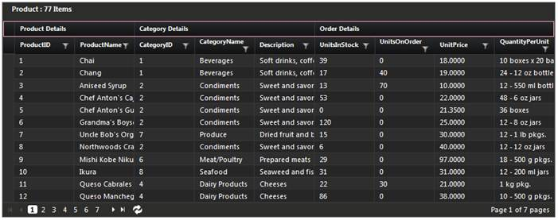
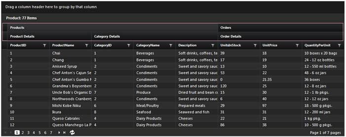

::: {style="DISPLAY: none"}
{#d2h_url_template}{#d2h_package_url style="WIDTH: 0px; DISPLAY: none; HEIGHT: 0px"}
:::

::::: {#nsbanner .d2h_main_nsbanner style="BORDER-BOTTOM: #999999 1px solid; POSITION: relative; PADDING-BOTTOM: 0px; BACKGROUND-COLOR: transparent; PADDING-LEFT: 0px; PADDING-RIGHT: 0px; DISPLAY: none; BORDER-TOP: #999999 1px solid; PADDING-TOP: 0px; LEFT: 0px"}
:::: {#TitleRow .d2h_main_titlerow style="PADDING-BOTTOM: 4px; BACKGROUND-COLOR: transparent; PADDING-LEFT: 22px; WIDTH: 100%; PADDING-RIGHT: 10px; DISPLAY: none; PADDING-TOP: 4px"}
::: {#ienav .d2h_main_ienav style="DISPLAY: none"}
{#D2HPrevious .D2HPreviousEnabled}  {#D2HNext .D2HNextEnabled}
:::
::::
:::::

:::: {#nstext .d2h_main_nstext style="PADDING-BOTTOM: 10px; BACKGROUND-COLOR: transparent; PADDING-LEFT: 22px; PADDING-RIGHT: 10px; HEIGHT: 100%; OVERFLOW: auto; PADDING-TOP: 5px" hasuserbackground="true" valign="bottom"}
::: {#d2h_breadcrumbs .d2h_breadcrumbs}
[Essential Studio User Guide Documentation](ms-xhelp:///?Id=12457748-09e3-4d74-a240-8e049cedf030){.d2h_breadcrumbsNormal}[ \> ]{.d2h_breadcrumbsLinkSeparator}[User Interface Edition](ms-xhelp:///?Id=c29296b7-531c-413b-a0ec-488ca1f7f669){.d2h_breadcrumbsNormal}[ \> ]{.d2h_breadcrumbsLinkSeparator}[Essential ASP.NET MVC](ms-xhelp:///?Id=4b14e7d1-65c4-4f67-b1aa-2c37709905a5){.d2h_breadcrumbsNormal}[ \> ]{.d2h_breadcrumbsLinkSeparator}[Essential Grid]{.d2h_breadcrumbsContentsOnly}[ \> ]{.d2h_breadcrumbsLinkSeparator}[Getting Started](ms-xhelp:///?Id=c7ed3902-b25b-4170-be58-1d3d0b57748a){.d2h_breadcrumbsNormal}[ \> ]{.d2h_breadcrumbsLinkSeparator}[Feature Summary](ms-xhelp:///?Id=1923e679-441a-44e0-9bca-e0e50988a857){.d2h_breadcrumbsNormal}[ \> ]{.d2h_breadcrumbsLinkSeparator}[Concepts and Features](ms-xhelp:///?Id=4a1657fa-4756-42b9-9153-aebf5dcfc503){.d2h_breadcrumbsNormal}
:::

## Stacked Headers {#stacked-headers style="tab-stops: 0pt"}

The stacked headers in Essential Grid for MVC help you see how data in columns can be categorized and grouped under a single header within the organization of a grid.

Stacked headers allow users to have additional header rows that span across grid columns. Users can group columns under such headers.

You can effectively group extensive data with the help of multilevel stacked headers as well.

The skins applied to the grid are applied to the headers as well by default. Essential Grid has 14 built-in skins, and supports customizable themes as well.

 

Use Case Scenario

Users will be able to clearly see which dimensions of data relate to the same topic, as this feature helps organize grid data better.\
Related columns in the same grid can be grouped under one single heading, so data in those columns will be seen as part of a whole.

Appearance and Structure

The following figures illustrate the appearance and structure of stacked headers in Essential Grid for MVC:

 

{border="0"}

Figure 273: Grid with "Product," "Category," and "Order Details" as Stacked Headers

 

{border="0"}

 

Figure 274: Grid with Multilevel  Stacked Headers

 

Properties

+-----------------------------------------------------------+--------------------------------------------------------+----------------------------------------------------------------------------------------------------------------------------------------------------------------------------------+------------------------+--------------+
| Property                                                  | Description                                            | Type of property                                                                                                                                                                 | Value it accepts       | Dependencies |
+-----------------------------------------------------------+--------------------------------------------------------+----------------------------------------------------------------------------------------------------------------------------------------------------------------------------------+------------------------+--------------+
| ShowStackedHeader                                         | Specifies whether the stacked header is enabled or not | bool                                                                                                                                                                             | True                   | NA           |
|                                                           |                                                        |                                                                                                                                                                                  |                        |              |
|                                                           |                                                        |                                                                                                                                                                                  | False                  |              |
|                                                           |                                                        |                                                                                                                                                                                  |                        |              |
|                                                           |                                                        |                                                                                                                                                                                  | Default value is False |              |
+-----------------------------------------------------------+--------------------------------------------------------+----------------------------------------------------------------------------------------------------------------------------------------------------------------------------------+------------------------+--------------+
| HeaderText                                                | Specifies the text to be displayed in the header       | string                                                                                                                                                                           | Any string             | NA           |
+-----------------------------------------------------------+--------------------------------------------------------+----------------------------------------------------------------------------------------------------------------------------------------------------------------------------------+------------------------+--------------+
| Name                                                      | Specifies the name of the stacked header               | string                                                                                                                                                                           | Any string             | NA           |
+-----------------------------------------------------------+--------------------------------------------------------+----------------------------------------------------------------------------------------------------------------------------------------------------------------------------------+------------------------+--------------+
| [StackedColumnsCollection]{style="FONT-FAMILY: Consolas"} | Gets or sets the Stacked columns collection            | [List]{style="FONT-FAMILY: Consolas; COLOR: #2b91af; FONT-SIZE: 9.5pt"}[\<[GridStackedColumns]{style="COLOR: #2b91af"}\<T\>\>]{style="FONT-FAMILY: Consolas; FONT-SIZE: 9.5pt"}  | GridStackedColumns     | NA           |
|                                                           |                                                        |                                                                                                                                                                                  |                        |              |
|                                                           |                                                        |                                                                                                                                                                                  |                        |              |
+-----------------------------------------------------------+--------------------------------------------------------+----------------------------------------------------------------------------------------------------------------------------------------------------------------------------------+------------------------+--------------+
| [NestedStackedColumns]{style="FONT-FAMILY: Consolas"}     | Gets or sets the nested columns collections            | [IList]{style="FONT-FAMILY: Consolas; COLOR: #2b91af; FONT-SIZE: 9.5pt"}[\<[GridStackedColumns]{style="COLOR: #2b91af"}\<T\>\>]{style="FONT-FAMILY: Consolas; FONT-SIZE: 9.5pt"} | GridStackedColumns     | NA           |
|                                                           |                                                        |                                                                                                                                                                                  |                        |              |
|                                                           |                                                        | []{style="FONT-FAMILY: Consolas; COLOR: #2b91af; FONT-SIZE: 9.5pt"}                                                                                                              |                        |              |
+-----------------------------------------------------------+--------------------------------------------------------+----------------------------------------------------------------------------------------------------------------------------------------------------------------------------------+------------------------+--------------+

[]{style="FONT-FAMILY: 'Calibri','sans-serif'; FONT-SIZE: 11pt"} 

Methods

+----------------------+-----------------------------------------------------------------------------------------+------------------------------+--------------------+-------------------------------+
| Method               | Description                                                                             | Parameters                   | Type               | Return Type                   |
+----------------------+-----------------------------------------------------------------------------------------+------------------------------+--------------------+-------------------------------+
| StackedRows()        | Specifies the Stacked Header Rows and it is used for creating stacked header rows.      | Name,                        | StackedRows        | IGridStackedHeaderBuilder\<\> |
|                      |                                                                                         |                              |                    |                               |
|                      |                                                                                         | GridStackedRowBuilder\<\>    |                    |                               |
+----------------------+-----------------------------------------------------------------------------------------+------------------------------+--------------------+-------------------------------+
| GridStackedColumns() | Specifies the Stacked Header Columns and it is used for creating stacked header columns | Name,                        | StackedColumns     | IGridStackedRowsBuilder\<\>   |
|                      |                                                                                         |                              |                    |                               |
|                      |                                                                                         | GridStackedColumnBuilder\<\> |                    |                               |
+----------------------+-----------------------------------------------------------------------------------------+------------------------------+--------------------+-------------------------------+
| Add()                | Specifies columns to be added to the stacked header                                     | String or lamda expression   | GridStackedColumns | IGridStackedColumnsBuilder    |
+======================+=========================================================================================+==============================+====================+===============================+

[]{style="FONT-FAMILY: 'Calibri','sans-serif'; FONT-SIZE: 11pt"} 

Where do I find the installed samples?

Steps to launch sample:

1.   Open the sample browser and select **ASP.NET MVC** from the left-hand panel.

2.   Click **Run samples** to launch the ASP.NET MVC sample browser.

3.   Select **Grid** from the product icons in the bottom-left of the screen.

4.   Select **Rows and Columns\>StackedHeader** to launch the sample.

[]{style="FONT-FAMILY: 'Myriad Pro','sans-serif'"} 

More:

[ ]{#related-topics}

[{border="0" align="absMiddle"}Enabling Stacked Headers in Grid MVC](ms-xhelp:///?Id=4d564bef-2211-4b7e-a2e8-b60b10deb700){style="TEXT-DECORATION: none"}
::::
