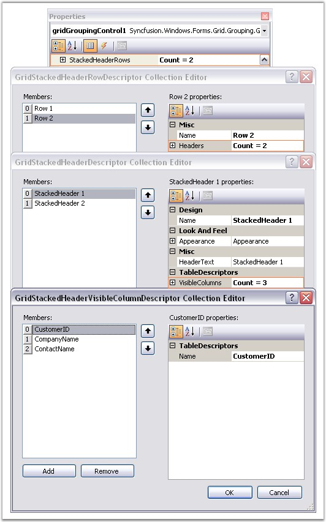
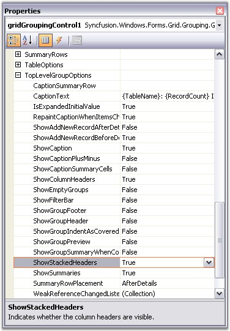
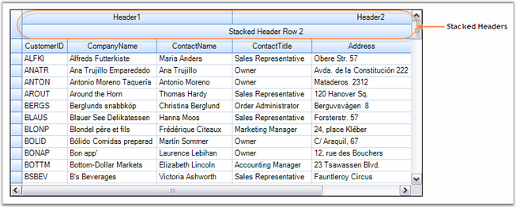
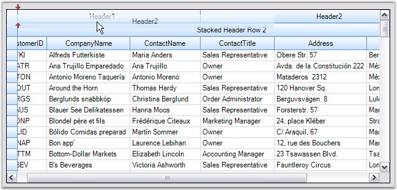
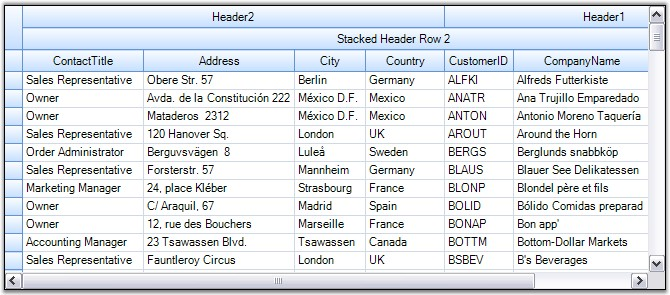
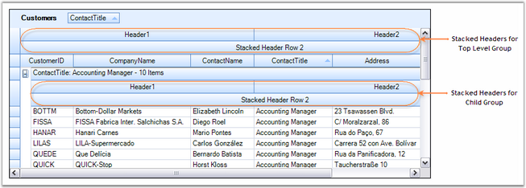
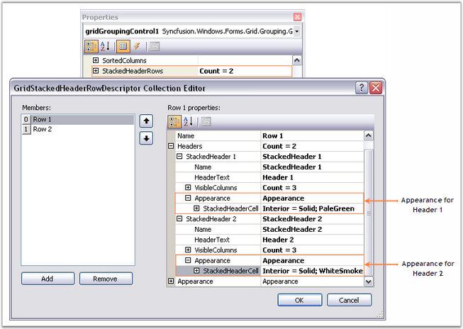
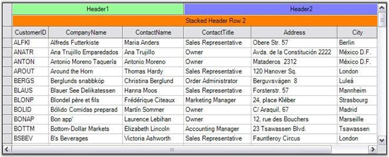

::: {style="DISPLAY: none"}
{#d2h_url_template}{#d2h_package_url style="WIDTH: 0px; DISPLAY: none; HEIGHT: 0px"}
:::

::::: {.d2h_secondary_topic style="PADDING-BOTTOM: 10pt; MARGIN: 0pt; PADDING-LEFT: 0pt; PADDING-RIGHT: 0pt; PADDING-TOP: 0pt"}
##### Stacked MultiHeaders {#stacked-multiheaders style="tab-stops: 0pt"}

[]{style="FONT-FAMILY: 'Trebuchet MS','sans-serif'; COLOR: #15428b; FONT-SIZE: 9pt"} 

Essential Grouping Grid Control offers in built support for Stacked MultiHeaders. This feature allows you to create additional unbound header rows called **StackedHeaderRows** that span across visible grid columns. You can group some columns under each header row. It also supports Drag / Drop of these header rows. Grouped columns will also be rearranged along with the header.

 

**The StackedHeaderRows Collection**

 

Stacked Header rows for a given Grid Table are gathered under **TableDescriptor.StackedHeaderRows** collection. This contains the property definitions that controls the behavior and appearance of the Stacked Headers. A StackedHeaderRow collection can be viewed as a set of stacked header rows in which each header row contains a collection of stacked headers that span across multiple columns.

 

Every header in a Stacked Header Row is defined by a **GridStackedHeaderDescriptor**. All the headers for a given stacked header row is managed by **GridStackedHeaderRowDescriptor**. **GridStackedHeaderRowDescriptorCollection,** which is returned by TableDescriptor.StackedHeaderRows property, manages the collection of GridStackedHeaderRowDescriptors for a given table. It is the **GridStackedHeaderVisibleColumnDescriptor** that binds a Column or ColumnSet to the StackedHeaderCell.

 

The order in which the StackedHeaders will appear is determined by the VisibleColumns collection.When the layout of the GridStackedHeaderRow is calculated the grid will loop through the VisibleColumns collection and find the StackedHeader Descriptor that references the VisibleColumn. If the same StackedHeader references multiple neighboring VisibleColumns then the header for these columns will be drawn as one cell. If there are no visible columns specified for a StackedHeader, then it will span across all the visible columns similar to a Caption.

 

You could be able to rearrange the columns by dragging the stacked headers. While doing so, it is the Visible Columns collection that is being affected. Since the order of stacked headers is dependent on Visible Columns, the GridStackedHeaderCollections itself does not need to be modified.

 

It is possible to add Stacked Headers for nested tables and groups too. You can enable the display of the StackedHeaders by setting the **ShowStackedHeaders** property to true.\
\

[·      ]{style="FONT-FAMILY: Symbol"}**TopLevelGroupOptions.ShowStackedHeaders -** Toggles the display of StackedHeaders for top most group.

[·      ]{style="FONT-FAMILY: Symbol"}**ChildGroupOptions.ShowStackedHeaders -** Toggles the display of StackedHeaders for child groups.

[·      ]{style="FONT-FAMILY: Symbol"}**NestedTableGroupOptions.ShowStackedHeaders -** Toggles the display of StackedHeaders for child table and its groups.

**[]{style="FONT-SIZE: 8pt"}** 

Through Designer

 

Creating Stacked Headers is a two-step process.

[]{style="FONT-FAMILY: 'Trebuchet MS','sans-serif'; COLOR: #15428b; FONT-SIZE: 9pt"} 

1.   As a first step, you must define the Stacked Header Rows by accessing the TableDescriptor.StackedHeaderRows property. This will open the GridStackedHeaderRowDescriptor Collection Editor wherein you can add as many header rows as you want, by specifying the different attributes like HeaderText, VisibleColumns, Appearance, and so on, for each header in the header row.

[]{style="FONT-SIZE: 8pt"} 

{border="0"}

[]{style="FONT-FAMILY: 'Trebuchet MS','sans-serif'; COLOR: #15428b; FONT-SIZE: 9pt"} 

*[Figure ]{style="FONT-SIZE: 9pt"}[340]{style="FONT-SIZE: 9pt"}[: Adding Stacked Headers by using the StackedHeaderRows Property]{style="FONT-SIZE: 9pt"}*

[]{style="FONT-SIZE: 8pt"} 

Property Definitions

[]{style="COLOR: black"} 

::: {align="center"}
  ---------------- -----------------------------------------------------------------------------
  Property Name    Description
  Name             Specifies the name of the descriptor.
  HeaderText       Specifies the text to be displayed in the StackedHeaderCell.
  VisibleColumns   The collection of columns that should be combined under the Stacked Header.
  Appearance       Controls the appearance of the StackedHeaderCell.
  ---------------- -----------------------------------------------------------------------------
:::

[]{style="FONT-SIZE: 8pt"} 

2.   The second step is to enable the display of StackedHeaders for the given table and group by setting the ShowStackedHeaders property to true.

[]{style="FONT-SIZE: 8pt"} 

{border="0"}

***[]{style="FONT-FAMILY: 'Trebuchet MS','sans-serif'; COLOR: #15428b; FONT-SIZE: 9pt"}*** 

*[Figure ]{style="FONT-SIZE: 9pt"}[341]{style="FONT-SIZE: 9pt"}[: Setting ShowStackedHeaders property to True]{style="FONT-SIZE: 9pt"}*

**[]{style="COLOR: #4a5c8c; FONT-SIZE: 9pt"}** 

Output

[]{style="FONT-FAMILY: 'Verdana','sans-serif'; COLOR: #4a5c8c; FONT-SIZE: 9pt"} 

Here are the screen shots showing the Grouping Grid with two Stacked Header Rows. It illustrates the effect of doing Drag / Drop on StackedHeaders. You could notice that the order of the Visible columns gets affected automatically while rearranging the StackedHeaders.

[]{style="FONT-SIZE: 8pt"} 

{border="0"}

**[]{style="FONT-SIZE: 8pt"}** 

*[Figure ]{style="FONT-SIZE: 9pt"}[342]{style="FONT-SIZE: 9pt"}[: Grouping Grid with StackedHeaders]{style="FONT-SIZE: 9pt"}*

**[]{style="FONT-FAMILY: 'Trebuchet MS','sans-serif'; COLOR: #15428b; FONT-SIZE: 9pt"}** 

{border="0"}

**[]{style="FONT-SIZE: 8pt"}** 

*[Figure ]{style="FONT-SIZE: 9pt"}[343]{style="FONT-SIZE: 9pt"}[: Rearranging StackedHeaders by dragging and dropping Header2]{style="FONT-SIZE: 9pt"}*

**[]{style="FONT-SIZE: 8pt"}** 

**[]{style="FONT-SIZE: 8pt"}** 

{border="0"}

**[]{style="FONT-SIZE: 8pt"}** 

*[Figure ]{style="FONT-SIZE: 9pt"}[344]{style="FONT-SIZE: 9pt"}[: VisibleColumns rearranged as a result of the above Drag / Drop]{style="FONT-SIZE: 9pt"}*

**[]{style="FONT-SIZE: 8pt"}** 

StackedHeaders for NestedGroups

 

Stacked Headers can be enabled for Child Group by setting ChildGroupOptions.ShowStackedHeaders to true. The grouping grid in the below image displays the stacked headers for the nested groups.

**[]{style="FONT-SIZE: 8pt"}** 

{border="0"}

***[]{style="FONT-FAMILY: 'Trebuchet MS','sans-serif'; COLOR: #15428b; FONT-SIZE: 9pt"}*** 

*[Figure ]{style="FONT-SIZE: 9pt"}[345]{style="FONT-SIZE: 9pt"}[: Stacked Headers for Nested Groups]{style="FONT-SIZE: 9pt"}*

**[]{style="FONT-SIZE: 8pt"}** 

Appearance

 

A couple of ways are there to control the appearance of the StackedHeaders. By one way you can access Appearance.StackedHeaderCell property to enter the appearance definitions. Appearance set this way will be applied to all the stacked header cells. An alternate way is to specify the appearance settings through the GridStackedHeaderRow Descriptor. In this way, you can have different settings for individual stacked headers in each StackedHeaderRow.

 

Here is the property window with GridStackedHeaderRowDescriptor Collection Editor showing the appearance settings of Stacked Headers defined.

[]{style="FONT-SIZE: 8pt"} 

{border="0"}

***[]{style="FONT-FAMILY: 'Trebuchet MS','sans-serif'; COLOR: #15428b; FONT-SIZE: 9pt"}*** 

*[Figure ]{style="FONT-SIZE: 9pt"}[346]{style="FONT-SIZE: 9pt"}[: Appearance Settings for Stacked Headers]{style="FONT-SIZE: 9pt"}*

[]{style="FONT-SIZE: 8pt"} 

Output

 

Here is the effect of the above settings.

[]{style="FONT-SIZE: 8pt"} 

{border="0"}

***[]{style="FONT-FAMILY: 'Trebuchet MS','sans-serif'; COLOR: #15428b; FONT-SIZE: 9pt"}*** 

*[Figure ]{style="FONT-SIZE: 9pt"}[347]{style="FONT-SIZE: 9pt"}[: Stacked Headers created for the Grid Grouping Control]{style="FONT-SIZE: 9pt"}*

[]{style="FONT-SIZE: 8pt"} 

Programmatically

 

You can add the Stacked Header Rows at run time too. To achieve this, first you must define a required number of GridStackedHeaderDescriptors by specifying the VisibleColumns for each. Next, create a StackedHeaderRow by instantiating GridStackedHeaderRowDescriptor and add the above defined stacked headers into it. Finally, add this header row into the TableDescriptor.StackedHeaderRows collection. The following code example illustrates this process.

[]{style="FONT-SIZE: 8pt"} 

+------------------------------------------------------------------------------------------------------------------------------------------------------------------------------------------------------------------------------------------------------------------------------------------------------+
| **[\[C#\]]{style="FONT-FAMILY: 'Courier New'; COLOR: black"}**                                                                                                                                                                                                                                       |
|                                                                                                                                                                                                                                                                                                      |
| []{style="FONT-FAMILY: 'Courier New'; COLOR: black"}                                                                                                                                                                                                                                                 |
|                                                                                                                                                                                                                                                                                                      |
| [GridStackedHeaderDescriptor]{style="FONT-FAMILY: 'Courier New'; COLOR: #2b91af"}[ shd = [new]{style="COLOR: blue"} [GridStackedHeaderDescriptor]{style="COLOR: #2b91af"}([\"header1\"]{style="COLOR: #a31515"}, [\"StackedHeader1\"]{style="COLOR: #a31515"});]{style="FONT-FAMILY: 'Courier New'"} |
|                                                                                                                                                                                                                                                                                                      |
| [shd.VisibleColumns.Add([new]{style="COLOR: blue"} [GridStackedHeaderVisibleColumnDescriptor]{style="COLOR: #2b91af"}([\"CustomerName\"]{style="COLOR: #a31515"}));]{style="FONT-FAMILY: 'Courier New'"}                                                                                             |
|                                                                                                                                                                                                                                                                                                      |
| [shd.VisibleColumns.Add([new]{style="COLOR: blue"} [GridStackedHeaderVisibleColumnDescriptor]{style="COLOR: #2b91af"}([\"CompanyName\"]{style="COLOR: #a31515"}));]{style="FONT-FAMILY: 'Courier New'"}                                                                                              |
|                                                                                                                                                                                                                                                                                                      |
| [GridStackedHeaderRowDescriptor]{style="FONT-FAMILY: 'Courier New'; COLOR: #2b91af"}[ shrd = [new]{style="COLOR: blue"} [GridStackedHeaderRowDescriptor]{style="COLOR: #2b91af"}([\"Row1\"]{style="COLOR: #a31515"},]{style="FONT-FAMILY: 'Courier New'"}                                            |
|                                                                                                                                                                                                                                                                                                      |
| [new]{style="FONT-FAMILY: 'Courier New'; COLOR: blue"}[ [GridStackedHeaderDescriptor]{style="COLOR: #2b91af"}\[\] { shd });]{style="FONT-FAMILY: 'Courier New'"}                                                                                                                                     |
|                                                                                                                                                                                                                                                                                                      |
| [this]{style="FONT-FAMILY: 'Courier New'; COLOR: blue"}[.gridGroupingControl1.TableDescriptor.StackedHeaderRows.Add(shrd);]{style="FONT-FAMILY: 'Courier New'"}                                                                                                                                      |
|                                                                                                                                                                                                                                                                                                      |
| []{style="FONT-FAMILY: 'Courier New'; COLOR: green"}                                                                                                                                                                                                                                                 |
|                                                                                                                                                                                                                                                                                                      |
| [// Customize the Appearance.]{style="FONT-FAMILY: 'Courier New'; COLOR: green"}                                                                                                                                                                                                                     |
|                                                                                                                                                                                                                                                                                                      |
| [this]{style="FONT-FAMILY: 'Courier New'; COLOR: blue"}[.gridGroupingControl1.Appearance.StackedHeaderCell.BackColor = [Color]{style="COLOR: #2b91af"}.Teal;]{style="FONT-FAMILY: 'Courier New'"}                                                                                                    |
+------------------------------------------------------------------------------------------------------------------------------------------------------------------------------------------------------------------------------------------------------------------------------------------------------+

[]{style="FONT-FAMILY: 'Trebuchet MS','sans-serif'; COLOR: #15428b; FONT-SIZE: 9pt"} 

+------------------------------------------------------------------------------------------------------------------------------------------------------------------------------------------------------------------------------------------------------------------------------------------------------+
| **[\[VB.NET\]]{style="FONT-FAMILY: 'Courier New'; COLOR: black"}**                                                                                                                                                                                                                                   |
|                                                                                                                                                                                                                                                                                                      |
| []{style="FONT-FAMILY: 'Courier New'; COLOR: black"}                                                                                                                                                                                                                                                 |
|                                                                                                                                                                                                                                                                                                      |
| [Dim]{style="FONT-FAMILY: 'Courier New'; COLOR: blue"}[ shd [As]{style="COLOR: blue"} GridStackedHeaderDescriptor = [New]{style="COLOR: blue"} GridStackedHeaderDescriptor([\"header1\"]{style="COLOR: #a31515"}, [\"StackedHeader1\"]{style="COLOR: #a31515"})]{style="FONT-FAMILY: 'Courier New'"} |
|                                                                                                                                                                                                                                                                                                      |
| [shd.VisibleColumns.Add([New]{style="COLOR: blue"} GridStackedHeaderVisibleColumnDescriptor([\"CustomerName\"]{style="COLOR: #a31515"}))]{style="FONT-FAMILY: 'Courier New'"}                                                                                                                        |
|                                                                                                                                                                                                                                                                                                      |
| [shd.VisibleColumns.Add([New]{style="COLOR: blue"} GridStackedHeaderVisibleColumnDescriptor([\"CompanyName\"]{style="COLOR: #a31515"}))]{style="FONT-FAMILY: 'Courier New'"}                                                                                                                         |
|                                                                                                                                                                                                                                                                                                      |
| [Dim]{style="FONT-FAMILY: 'Courier New'; COLOR: blue"}[ shrd [As]{style="COLOR: blue"} GridStackedHeaderRowDescriptor = [New]{style="COLOR: blue"} GridStackedHeaderRowDescriptor([\"Row1\"]{style="COLOR: #a31515"}, ]{style="FONT-FAMILY: 'Courier New'"}                                          |
|                                                                                                                                                                                                                                                                                                      |
| [New]{style="FONT-FAMILY: 'Courier New'; COLOR: blue"}[ GridStackedHeaderDescriptor() { shd })]{style="FONT-FAMILY: 'Courier New'"}                                                                                                                                                                  |
|                                                                                                                                                                                                                                                                                                      |
| [Me]{style="FONT-FAMILY: 'Courier New'; COLOR: blue"}[.gridGroupingControl1.TableDescriptor.StackedHeaderRows.Add(shrd)]{style="FONT-FAMILY: 'Courier New'"}                                                                                                                                         |
|                                                                                                                                                                                                                                                                                                      |
| []{style="FONT-FAMILY: 'Courier New'"}                                                                                                                                                                                                                                                               |
|                                                                                                                                                                                                                                                                                                      |
| [\' Customize the Appearance.]{style="FONT-FAMILY: 'Courier New'; COLOR: green"}                                                                                                                                                                                                                     |
|                                                                                                                                                                                                                                                                                                      |
| [Me]{style="FONT-FAMILY: 'Courier New'; COLOR: blue"}[.gridGroupingControl1.Appearance.StackedHeaderCell.BackColor = Color.Teal]{style="FONT-FAMILY: 'Courier New'"}                                                                                                                                 |
+------------------------------------------------------------------------------------------------------------------------------------------------------------------------------------------------------------------------------------------------------------------------------------------------------+

[]{style="FONT-FAMILY: 'Trebuchet MS','sans-serif'; COLOR: #15428b; FONT-SIZE: 9pt"} 

::: {style="BORDER-BOTTOM: windowtext 1pt solid; BORDER-LEFT: medium none; PADDING-BOTTOM: 1pt; MARGIN-TOP: 9pt; PADDING-LEFT: 0pt; PADDING-RIGHT: 0pt; MARGIN-BOTTOM: 9pt; BORDER-TOP: windowtext 1pt solid; BORDER-RIGHT: medium none; PADDING-TOP: 1pt"}
{border="0"}Note: For more details, refer the following browser sample:

 

\<Install Location\>\\Syncfusion\\EssentialStudio\\\[Version Number\]\\Windows\\Grid.Grouping.Windows\\Samples\\2.0\\Grouping Grid Layout\\Stacked Multi Headers Demo
:::

 

[]{#p459} 

 

[]{#related-topics}
:::::
