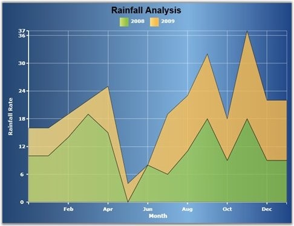

::: {style="DISPLAY: none"}
{#d2h_url_template}{#d2h_package_url style="WIDTH: 0px; DISPLAY: none; HEIGHT: 0px"}
:::

::: {.d2h_secondary_topic style="PADDING-BOTTOM: 10pt; MARGIN: 0pt; PADDING-LEFT: 0pt; PADDING-RIGHT: 0pt; PADDING-TOP: 0pt"}
#### Stacking Area Chart {#stacking-area-chart style="tab-stops: 0pt"}

[]{#p38}[]{style="COLOR: #15428b"} 

Stacking Area charts are similar to regular area charts except that the Y values stack on top of each other in the specified series order. This helps visualizing the relationship of parts to the whole.

**[]{style="COLOR: #15428b"}** 

+-----------------------------------------------------------------------------------------------------------------------------------------------------------------------------------------------------------------------------------------------------------------------------------------------------------------------------------------------------------------------------------------------------------------------------------------------------------------------------------------------------------------------------------------------------------------------------------------------------------------------------------------------------------+
| [\[XAML\]]{style="FONT-FAMILY: 'Courier New'"}                                                                                                                                                                                                                                                                                                                                                                                                                                                                                                                                                                                                            |
|                                                                                                                                                                                                                                                                                                                                                                                                                                                                                                                                                                                                                                                           |
| []{style="FONT-FAMILY: 'Courier New'; COLOR: blue"}                                                                                                                                                                                                                                                                                                                                                                                                                                                                                                                                                                                                       |
|                                                                                                                                                                                                                                                                                                                                                                                                                                                                                                                                                                                                                                                           |
| [\<]{style="FONT-FAMILY: 'Courier New'; COLOR: blue"}[syncfusion:ChartSeries]{style="FONT-FAMILY: 'Courier New'; COLOR: #a31515"}[ ]{style="FONT-FAMILY: 'Courier New'; COLOR: blue"}[Type]{style="FONT-FAMILY: 'Courier New'; COLOR: red"}[=]{style="FONT-FAMILY: 'Courier New'; COLOR: blue"}[\"[StackingArea]{style="COLOR: blue"}\"[ ]{style="COLOR: blue"}[LegendLabel]{style="COLOR: red"}[=]{style="COLOR: blue"}\"[2008]{style="COLOR: blue"}\"[ ]{style="COLOR: blue"}[Foreground]{style="COLOR: red"}[=]{style="COLOR: blue"}\"[{StaticResource Series1}]{style="COLOR: blue"}\"[/\>]{style="COLOR: blue"}]{style="FONT-FAMILY: 'Courier New'"} |
|                                                                                                                                                                                                                                                                                                                                                                                                                                                                                                                                                                                                                                                           |
| [\<]{style="FONT-FAMILY: 'Courier New'; COLOR: blue"}[syncfusion:ChartSeries]{style="FONT-FAMILY: 'Courier New'; COLOR: #a31515"}[ ]{style="FONT-FAMILY: 'Courier New'; COLOR: blue"}[Type]{style="FONT-FAMILY: 'Courier New'; COLOR: red"}[=]{style="FONT-FAMILY: 'Courier New'; COLOR: blue"}[\"[StackingArea]{style="COLOR: blue"}\"[ ]{style="COLOR: blue"}[LegendLabel]{style="COLOR: red"}[=]{style="COLOR: blue"}\"[2009]{style="COLOR: blue"}\"[ ]{style="COLOR: blue"}[Foreground]{style="COLOR: red"}[=]{style="COLOR: blue"}\"[{StaticResource Series2}]{style="COLOR: blue"}\"[/\>]{style="COLOR: blue"}]{style="FONT-FAMILY: 'Courier New'"} |
+-----------------------------------------------------------------------------------------------------------------------------------------------------------------------------------------------------------------------------------------------------------------------------------------------------------------------------------------------------------------------------------------------------------------------------------------------------------------------------------------------------------------------------------------------------------------------------------------------------------------------------------------------------------+

[]{style="COLOR: #15428b"} 

+---------------------------------------------------------------------------------------------------------+
| [\[C#\]]{style="FONT-FAMILY: 'Courier New'"}                                                            |
|                                                                                                         |
| []{style="FONT-FAMILY: 'Courier New'; COLOR: blue"}                                                     |
|                                                                                                         |
| [series1.Type = [ChartTypes]{style="COLOR: #2b91af"}.StackingArea;]{style="FONT-FAMILY: 'Courier New'"} |
|                                                                                                         |
| [series2.Type = [ChartTypes]{style="COLOR: #2b91af"}.StackingArea;]{style="FONT-FAMILY: 'Courier New'"} |
+---------------------------------------------------------------------------------------------------------+

[]{style="COLOR: #15428b"} 

[]{style="COLOR: #15428b"} 

Run the code. The following output is displayed.

[]{style="COLOR: #15428b"} 

{border="0"}

Figure 31: Chart Displaying Stacking Area Series \[ChartType=\"StackingArea\"\]

[]{#related-topics}
:::
