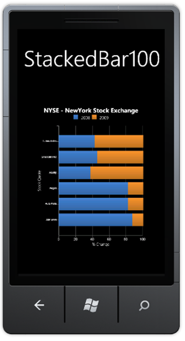

::: {style="DISPLAY: none"}
{#d2h_url_template}{#d2h_package_url style="WIDTH: 0px; DISPLAY: none; HEIGHT: 0px"}
:::

::: {.d2h_secondary_topic style="PADDING-BOTTOM: 10pt; MARGIN: 0pt; PADDING-LEFT: 0pt; PADDING-RIGHT: 0pt; PADDING-TOP: 0pt"}
#### Stacking Bar 100 Chart {#stacking-bar-100-chart style="tab-stops: 0pt"}

The Stacking Bar 100 Chart is similar to the Stacking Bar Chart. The only difference is that the total Y value is converted to a 100 percent proportional value. This chart type displays multiple series of data as stacked bars ensuring that the cumulative proportion of each stacked element always totals to 100%. Therefore, the y-axis will always be rendered within the range 0 - 100.

The following code illustrates how to create a Stacking Bar100 Chart

+--------------------------------------------------------------------------------------------------------------------------------------------------------------------------------------------------------------------------------------------------------------------------------------------------------------------------------------------------------------------------------------------------------------------------------------------------------------------------------------------------------------------------------------------------------------------------------------------------------------------------------------------------------------------------------------------------------------------------------------------------------------------------------------------------------------------------------------------------------------------------------------------------------------------------------------------------------------------------------------------------------------------------------------------------------------------------------------------------------------------------------------------------------------------------------------------------------------------------------------------+
| [\[XAML\]]{style="FONT-FAMILY: 'Trebuchet MS','sans-serif'; FONT-SIZE: 9pt"}                                                                                                                                                                                                                                                                                                                                                                                                                                                                                                                                                                                                                                                                                                                                                                                                                                                                                                                                                                                                                                                                                                                                                               |
|                                                                                                                                                                                                                                                                                                                                                                                                                                                                                                                                                                                                                                                                                                                                                                                                                                                                                                                                                                                                                                                                                                                                                                                                                                            |
| []{style="FONT-FAMILY: 'Trebuchet MS','sans-serif'; COLOR: blue; FONT-SIZE: 9pt"}                                                                                                                                                                                                                                                                                                                                                                                                                                                                                                                                                                                                                                                                                                                                                                                                                                                                                                                                                                                                                                                                                                                                                          |
|                                                                                                                                                                                                                                                                                                                                                                                                                                                                                                                                                                                                                                                                                                                                                                                                                                                                                                                                                                                                                                                                                                                                                                                                                                            |
| [syncfusion]{style="FONT-FAMILY: 'Trebuchet MS','sans-serif'; COLOR: #a31515; FONT-SIZE: 9pt"}[:]{style="FONT-FAMILY: 'Trebuchet MS','sans-serif'; COLOR: blue; FONT-SIZE: 9pt"}[ChartSeries]{style="FONT-FAMILY: 'Trebuchet MS','sans-serif'; COLOR: #a31515; FONT-SIZE: 9pt"}[ EnableEffects]{style="FONT-FAMILY: 'Trebuchet MS','sans-serif'; COLOR: red; FONT-SIZE: 9pt"}[=\"True\"]{style="FONT-FAMILY: 'Trebuchet MS','sans-serif'; COLOR: blue; FONT-SIZE: 9pt"}[ [ Type]{style="COLOR: red"}[=\"StackingBar100\"]{style="COLOR: blue"}  [ x]{style="COLOR: red"}[:]{style="COLOR: blue"}[Name]{style="COLOR: red"}[=\"Series1\"]{style="COLOR: blue"}[ Label]{style="COLOR: red"}[=\"2008\"]{style="COLOR: blue"}[ Width]{style="COLOR: red"}[=\"auto\"]{style="COLOR: blue"} [ StrokeThickness]{style="COLOR: red"}[=\"2\" /\>]{style="COLOR: blue"}]{style="FONT-FAMILY: 'Trebuchet MS','sans-serif'; FONT-SIZE: 9pt"}                                                                                                                                                                                                                                                                                                           |
|                                                                                                                                                                                                                                                                                                                                                                                                                                                                                                                                                                                                                                                                                                                                                                                                                                                                                                                                                                                                                                                                                                                                                                                                                                            |
| [                ]{style="FONT-FAMILY: 'Trebuchet MS','sans-serif'; COLOR: #a31515; FONT-SIZE: 9pt"}[\<]{style="FONT-FAMILY: 'Trebuchet MS','sans-serif'; COLOR: blue; FONT-SIZE: 9pt"}[syncfusion]{style="FONT-FAMILY: 'Trebuchet MS','sans-serif'; COLOR: #a31515; FONT-SIZE: 9pt"}[:]{style="FONT-FAMILY: 'Trebuchet MS','sans-serif'; COLOR: blue; FONT-SIZE: 9pt"}[ChartSeries]{style="FONT-FAMILY: 'Trebuchet MS','sans-serif'; COLOR: #a31515; FONT-SIZE: 9pt"}[ EnableEffects]{style="FONT-FAMILY: 'Trebuchet MS','sans-serif'; COLOR: red; FONT-SIZE: 9pt"}[=\"True\"]{style="FONT-FAMILY: 'Trebuchet MS','sans-serif'; COLOR: blue; FONT-SIZE: 9pt"}[ Type]{style="FONT-FAMILY: 'Trebuchet MS','sans-serif'; COLOR: red; FONT-SIZE: 9pt"}[=\"StackingBar100\"]{style="FONT-FAMILY: 'Trebuchet MS','sans-serif'; COLOR: blue; FONT-SIZE: 9pt"}[ [ x]{style="COLOR: red"}[:]{style="COLOR: blue"}[Name]{style="COLOR: red"}[=\"Series2\"]{style="COLOR: blue"}[ Label]{style="COLOR: red"}[=\"2009\"]{style="COLOR: blue"}[ Width]{style="COLOR: red"}[=\"auto\"]{style="COLOR: blue"}  [ StrokeThickness]{style="COLOR: red"}[=\"2\" /\>]{style="COLOR: blue"}]{style="FONT-FAMILY: 'Trebuchet MS','sans-serif'; FONT-SIZE: 9pt"} |
|                                                                                                                                                                                                                                                                                                                                                                                                                                                                                                                                                                                                                                                                                                                                                                                                                                                                                                                                                                                                                                                                                                                                                                                                                                            |
| []{style="FONT-FAMILY: 'Trebuchet MS','sans-serif'; COLOR: blue; FONT-SIZE: 9pt"}                                                                                                                                                                                                                                                                                                                                                                                                                                                                                                                                                                                                                                                                                                                                                                                                                                                                                                                                                                                                                                                                                                                                                          |
+--------------------------------------------------------------------------------------------------------------------------------------------------------------------------------------------------------------------------------------------------------------------------------------------------------------------------------------------------------------------------------------------------------------------------------------------------------------------------------------------------------------------------------------------------------------------------------------------------------------------------------------------------------------------------------------------------------------------------------------------------------------------------------------------------------------------------------------------------------------------------------------------------------------------------------------------------------------------------------------------------------------------------------------------------------------------------------------------------------------------------------------------------------------------------------------------------------------------------------------------+

[]{style="FONT-FAMILY: 'Trebuchet MS','sans-serif'; COLOR: #15428b; FONT-SIZE: 9pt"} 

[]{style="FONT-FAMILY: 'Trebuchet MS','sans-serif'; COLOR: #15428b; FONT-SIZE: 9pt"} 

+-----------------------------------------------------------------------------------------------------------------------------------------------------------------------------------------------------------------------------------------------------------------------------------------------------------------------------------------------------------------------------------------------------------------------------------------------------------------------------------------------------------------------------------------------------------------------------------+
| [\[C#\]]{style="FONT-FAMILY: 'Trebuchet MS','sans-serif'; FONT-SIZE: 9pt"}                                                                                                                                                                                                                                                                                                                                                                                                                                                                                                        |
|                                                                                                                                                                                                                                                                                                                                                                                                                                                                                                                                                                                   |
| []{style="FONT-FAMILY: 'Trebuchet MS','sans-serif'; COLOR: blue; FONT-SIZE: 9pt"}                                                                                                                                                                                                                                                                                                                                                                                                                                                                                                 |
|                                                                                                                                                                                                                                                                                                                                                                                                                                                                                                                                                                                   |
| [Chart1.Areas\[0\].Series\[0\].Type = ]{style="FONT-FAMILY: 'Trebuchet MS','sans-serif'; COLOR: black; FONT-SIZE: 9pt"}[ChartTypes]{style="FONT-FAMILY: 'Trebuchet MS','sans-serif'; COLOR: #2b91af; FONT-SIZE: 9pt"}[.]{style="FONT-FAMILY: 'Trebuchet MS','sans-serif'; COLOR: black; FONT-SIZE: 9pt"}**[ ]{style="FONT-FAMILY: 'Trebuchet MS','sans-serif'; COLOR: blue; FONT-SIZE: 9pt"}**[StackingBar100]{style="FONT-FAMILY: 'Trebuchet MS','sans-serif'; COLOR: black; FONT-SIZE: 9pt"}[;]{style="FONT-FAMILY: 'Trebuchet MS','sans-serif'; COLOR: black; FONT-SIZE: 9pt"} |
|                                                                                                                                                                                                                                                                                                                                                                                                                                                                                                                                                                                   |
| [Chart1.Areas\[0\].Series\[1\].Type = ]{style="FONT-FAMILY: 'Trebuchet MS','sans-serif'; COLOR: black; FONT-SIZE: 9pt"}[ChartTypes]{style="FONT-FAMILY: 'Trebuchet MS','sans-serif'; COLOR: #2b91af; FONT-SIZE: 9pt"}[.]{style="FONT-FAMILY: 'Trebuchet MS','sans-serif'; COLOR: black; FONT-SIZE: 9pt"}**[ ]{style="FONT-FAMILY: 'Trebuchet MS','sans-serif'; COLOR: blue; FONT-SIZE: 9pt"}**[StackingBar100]{style="FONT-FAMILY: 'Trebuchet MS','sans-serif'; COLOR: black; FONT-SIZE: 9pt"}[;]{style="FONT-FAMILY: 'Trebuchet MS','sans-serif'; COLOR: black; FONT-SIZE: 9pt"} |
|                                                                                                                                                                                                                                                                                                                                                                                                                                                                                                                                                                                   |
| []{style="FONT-FAMILY: 'Trebuchet MS','sans-serif'; COLOR: black; FONT-SIZE: 9pt"}                                                                                                                                                                                                                                                                                                                                                                                                                                                                                                |
+-----------------------------------------------------------------------------------------------------------------------------------------------------------------------------------------------------------------------------------------------------------------------------------------------------------------------------------------------------------------------------------------------------------------------------------------------------------------------------------------------------------------------------------------------------------------------------------+

[]{style="FONT-FAMILY: 'Trebuchet MS','sans-serif'; COLOR: #15428b; FONT-SIZE: 9pt"} 

[]{style="FONT-FAMILY: 'Trebuchet MS','sans-serif'; COLOR: #15428b; FONT-SIZE: 9pt"} 

Run the code. The following output is displayed.

[]{style="FONT-FAMILY: 'Trebuchet MS','sans-serif'; COLOR: #15428b; FONT-SIZE: 9pt"} 

{border="0"}

Figure 29: Stacking Bar100 Chart Type[]{style="FONT-FAMILY: 'Trebuchet MS','sans-serif'; COLOR: #15428b"}

[]{style="COLOR: #15428b"} 

[]{#related-topics}
:::
