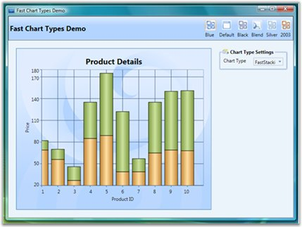
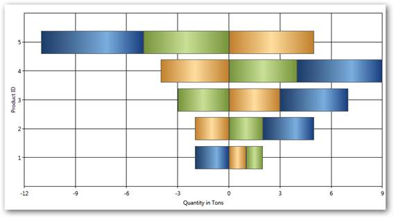
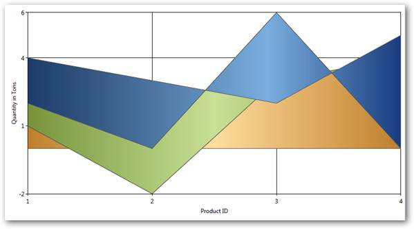
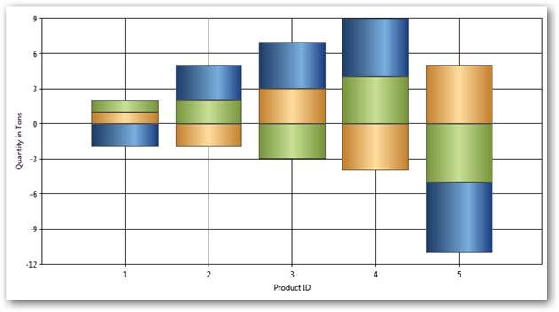

::: {style="DISPLAY: none"}
{#d2h_url_template}{#d2h_package_url style="WIDTH: 0px; DISPLAY: none; HEIGHT: 0px"}
:::

:::::: {.d2h_secondary_topic style="PADDING-BOTTOM: 10pt; MARGIN: 0pt; PADDING-LEFT: 0pt; PADDING-RIGHT: 0pt; PADDING-TOP: 0pt"}
##### Stacking Charts {#stacking-charts style="tab-stops: 0pt"}

Stacking Charts are similar to regular charts except that the Y values stack on top of each other in the specified series order. Stacking charts help visualize data that is a sum of parts, each of which is in a series.

 

There are different types of stacking charts:

 

###### []{#p119}4.1.1.4.10.1        Fast Stacking Column Charts {#fast-stacking-column-charts style="tab-stops: 0pt"}

Fast Stacking Column charts are similar to Stacked-column charts with y-coordinate values stacked over one another, in series order allowing the chart data to be visualized as sum of series parts. The following points mark the advantages of Fast Stacking Column over Stacked-column charts:

 

[·      ]{style="FONT-FAMILY: Symbol"}The Fast Stacking Column charts are rendered using drawing visuals.

[·      ]{style="FONT-FAMILY: Symbol"}They load faster than the Stacked-column charts.

[·      ]{style="FONT-FAMILY: Symbol"}They ensure high performance for displaying data.

[·      ]{style="FONT-FAMILY: Symbol"}They can be used as real time charts to render huge number of data points.

 

The Fast Stacking Column chart is added in the Enum of type **ChartTypes**.

 

Data Requirements

[]{style="FONT-FAMILY: 'Trebuchet MS','sans-serif'; COLOR: #15428b; FONT-SIZE: 9pt"} 

Table 120: Data Requirement

::: {align="center"}
+------------------------------+-------------+
| Details                                    |
+------------------------------+-------------+
| Number of y values per point | one         |
+------------------------------+-------------+
| Number of points             | one or more |
+------------------------------+-------------+
| Number of series             | one or more |
+------------------------------+-------------+
:::

[]{style="FONT-FAMILY: 'Trebuchet MS','sans-serif'; COLOR: #15428b; FONT-SIZE: 9pt"} 

Custom StackingColumn100 Properties

[]{style="FONT-FAMILY: 'Trebuchet MS','sans-serif'; COLOR: #15428b; FONT-SIZE: 9pt"} 

Table 121: Properties

::: {align="center"}
+---------------------------------------------------+-----------------+-----------------+---------------------------------------------------------------------------+
| Name                                              | Type            | Container       | Description                                                               |
+---------------------------------------------------+-----------------+-----------------+---------------------------------------------------------------------------+
| ChartStackingColumn100Type.ShowValueAsProbability | bool            | Chart Area      | The y-axis range is set between 0 and 100                                 |
|                                                   |                 |                 |                                                                           |
|                                                   |                 |                 | If true, the y-axis range is set between 0 and 1. Default value is false. |
+---------------------------------------------------+-----------------+-----------------+---------------------------------------------------------------------------+
:::

[]{style="FONT-FAMILY: 'Trebuchet MS','sans-serif'; COLOR: #15428b; FONT-SIZE: 9pt"} 

Template

While setting template the following parameters can be used:

[]{style="FONT-FAMILY: 'Trebuchet MS','sans-serif'; COLOR: #15428b; FONT-SIZE: 9pt"} 

Table 122: Template Parameter

::: {align="center"}
  ---------- ------------- -------------------------------
  Name       Type          Description
  X          double        x column coordinate
  Y          double        y column coordinate
  Width      double        column width
  Height     double        column height
  Interior   Brush         column color
  IsUpper    boolean       true--if this is upper column
  IsLower    boolean       true--if this is lower column
  Series     ChartSeries   reference to series-owner
  ---------- ------------- -------------------------------
:::

**[]{style="FONT-FAMILY: 'Trebuchet MS','sans-serif'; COLOR: #15428b; FONT-SIZE: 9pt"}** 

The following code snippet illustrates the usage of Fast Stacking Column charts.

[]{style="FONT-FAMILY: 'Trebuchet MS','sans-serif'; COLOR: #15428b; FONT-SIZE: 9pt"} 

+---------------------------------------------------------------------------------------------------------------------------------------------------------------------------------------------------------------------------------------------------------------------------------------------------------------------------------------------------------------------------------------------------------------------------------------------------------------------------------------------------------------------------------------------------------------------------------------------------------------------------------------------------------------------------------------------------------------------------------------------------------------------------------------------------------------------------------------------------------------------------------------------------------------------------------------------------------------------------------------------------------------------------------------------------------------------------------------------------+
| **[\[XAML\]]{style="FONT-FAMILY: 'Courier New'; FONT-SIZE: 9pt"}**                                                                                                                                                                                                                                                                                                                                                                                                                                                                                                                                                                                                                                                                                                                                                                                                                                                                                                                                                                                                                                |
|                                                                                                                                                                                                                                                                                                                                                                                                                                                                                                                                                                                                                                                                                                                                                                                                                                                                                                                                                                                                                                                                                                   |
| []{style="FONT-FAMILY: 'Courier New'; COLOR: blue; FONT-SIZE: 9pt"}                                                                                                                                                                                                                                                                                                                                                                                                                                                                                                                                                                                                                                                                                                                                                                                                                                                                                                                                                                                                                               |
|                                                                                                                                                                                                                                                                                                                                                                                                                                                                                                                                                                                                                                                                                                                                                                                                                                                                                                                                                                                                                                                                                                   |
| [\<]{style="FONT-FAMILY: 'Courier New'; COLOR: blue; FONT-SIZE: 9pt"}[syncfusion]{style="FONT-FAMILY: 'Courier New'; COLOR: #a31515; FONT-SIZE: 9pt"}[:]{style="FONT-FAMILY: 'Courier New'; COLOR: blue; FONT-SIZE: 9pt"}[ChartSeries]{style="FONT-FAMILY: 'Courier New'; COLOR: #a31515; FONT-SIZE: 9pt"}[ Type]{style="FONT-FAMILY: 'Courier New'; COLOR: red; FONT-SIZE: 9pt"}[=\"FastStackingColumn\"]{style="FONT-FAMILY: 'Courier New'; COLOR: blue; FONT-SIZE: 9pt"}[ Name]{style="FONT-FAMILY: 'Courier New'; COLOR: red; FONT-SIZE: 9pt"}[=\"series1\"]{style="FONT-FAMILY: 'Courier New'; COLOR: blue; FONT-SIZE: 9pt"}[ Stroke]{style="FONT-FAMILY: 'Courier New'; COLOR: red; FONT-SIZE: 9pt"}[=\"Black\"]{style="FONT-FAMILY: 'Courier New'; COLOR: blue; FONT-SIZE: 9pt"}[ DataSource]{style="FONT-FAMILY: 'Courier New'; COLOR: red; FONT-SIZE: 9pt"}[=\"{]{style="FONT-FAMILY: 'Courier New'; COLOR: blue; FONT-SIZE: 9pt"}[Binding]{style="FONT-FAMILY: 'Courier New'; COLOR: #a31515; FONT-SIZE: 9pt"}[}\"/\>]{style="FONT-FAMILY: 'Courier New'; COLOR: blue; FONT-SIZE: 9pt"} |
+---------------------------------------------------------------------------------------------------------------------------------------------------------------------------------------------------------------------------------------------------------------------------------------------------------------------------------------------------------------------------------------------------------------------------------------------------------------------------------------------------------------------------------------------------------------------------------------------------------------------------------------------------------------------------------------------------------------------------------------------------------------------------------------------------------------------------------------------------------------------------------------------------------------------------------------------------------------------------------------------------------------------------------------------------------------------------------------------------+

[]{style="FONT-FAMILY: 'Trebuchet MS','sans-serif'; COLOR: #15428b; FONT-SIZE: 9pt"} 

+--------------------------------------------------------------------------------------------------------------------------------------------------------------------------------------------------------------------------------------------------------------------------------------------------------------------------------------------------------------------------------------------------------------------------------------------------------------------+
| **[\[C#\]]{style="FONT-FAMILY: 'Courier New'; FONT-SIZE: 9pt"}**                                                                                                                                                                                                                                                                                                                                                                                                   |
|                                                                                                                                                                                                                                                                                                                                                                                                                                                                    |
| []{style="FONT-FAMILY: 'Courier New'; COLOR: blue; FONT-SIZE: 9pt"}                                                                                                                                                                                                                                                                                                                                                                                                |
|                                                                                                                                                                                                                                                                                                                                                                                                                                                                    |
| [ChartSeries]{style="FONT-FAMILY: 'Courier New'; COLOR: #2b91af; FONT-SIZE: 9pt"}[ series = ]{style="FONT-FAMILY: 'Courier New'; COLOR: black; FONT-SIZE: 9pt"}[new]{style="FONT-FAMILY: 'Courier New'; COLOR: blue; FONT-SIZE: 9pt"}[ ]{style="FONT-FAMILY: 'Courier New'; COLOR: black; FONT-SIZE: 9pt"}[ChartSeries]{style="FONT-FAMILY: 'Courier New'; COLOR: #2b91af; FONT-SIZE: 9pt"}[();]{style="FONT-FAMILY: 'Courier New'; COLOR: black; FONT-SIZE: 9pt"} |
|                                                                                                                                                                                                                                                                                                                                                                                                                                                                    |
| [series.Type = ]{style="FONT-FAMILY: 'Courier New'; COLOR: black; FONT-SIZE: 9pt"}[ChartTypes]{style="FONT-FAMILY: 'Courier New'; COLOR: #2b91af; FONT-SIZE: 9pt"}[.FastStackingColumn;]{style="FONT-FAMILY: 'Courier New'; COLOR: black; FONT-SIZE: 9pt"}                                                                                                                                                                                                         |
+--------------------------------------------------------------------------------------------------------------------------------------------------------------------------------------------------------------------------------------------------------------------------------------------------------------------------------------------------------------------------------------------------------------------------------------------------------------------+

 

Run the sample.

 

A Fast Stacking Column chart is displayed pertaining to the data source it is bound to.

 

{border="0"}

Figure 158: Fast Stacking Column Chart

 

A sample which demonstrates Fast Stacking Column Chart Types is available in the following sample installation path.

 

..My Documents\\Syncfusion\\Essential Studio\\\<Version Number\>\\WPF\\Chart.WPF\\Samples\\3.5\\WindowsSamples\\Chart Performance\\Fast chart types

###### []{#p120}4.1.1.4.10.2        Stacking Positive and Negative Values for Stacking Chart Types {#stacking-positive-and-negative-values-for-stacking-chart-types style="tab-stops: 0pt"}

Support ahs been provided for stacking positive and negative values in stacking chart types. Calculation logic must be the same and it has to adhere to the general standards of stacking chart type.

Chart types are:

[·      ]{style="FONT-FAMILY: Symbol"}Stacking Column

[·      ]{style="FONT-FAMILY: Symbol"}Stacking Bar

[·      ]{style="FONT-FAMILY: Symbol"}Stacking Area

 

 

{border="0"}

[Figure ]{style="COLOR: black"}[159]{style="COLOR: black"}[: Stacking Bar]{style="COLOR: black"}**[]{style="FONT-STYLE: normal; COLOR: black"}**

{border="0"}

*Figure* *160:  Stacking Area*

 

{border="0"}

[Figure ]{style="COLOR: black"}[161]{style="COLOR: black"}[: StackingColumn]{style="COLOR: black"}**[]{style="FONT-STYLE: normal; COLOR: black"}**

Properties

  --------------------------------- ---------------------------------------------------------------------------------- ------ ------------------ --------------------------------------------------
  Property                          Description                                                                        Type   Value it accepts   Any other dependencies/sub properties associated
  **RequiresNegativeSeriesStack**   Specifies whether the positive and negative series should be stacked seperately.   Bool   True/False         NA
  --------------------------------- ---------------------------------------------------------------------------------- ------ ------------------ --------------------------------------------------

 

[]{#related-topics}
::::::
