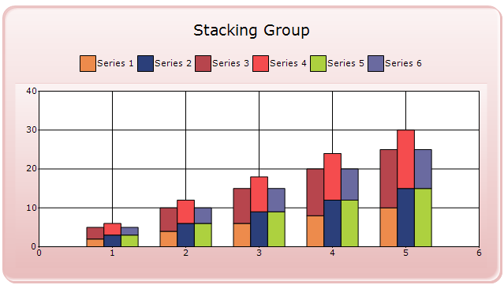
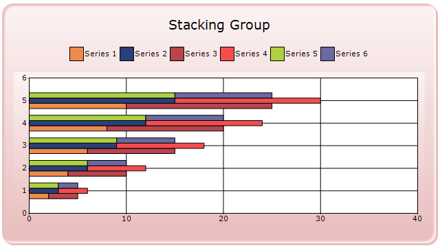

::: {style="DISPLAY: none"}
{#d2h_url_template}{#d2h_package_url style="WIDTH: 0px; DISPLAY: none; HEIGHT: 0px"}
:::

::: {.d2h_secondary_topic style="PADDING-BOTTOM: 10pt; MARGIN: 0pt; PADDING-LEFT: 0pt; PADDING-RIGHT: 0pt; PADDING-TOP: 0pt"}
#### Stacking Group {#stacking-group style="tab-stops: 0pt"}

 

This section illustrates how to group the stacking series with another stacking series.

1.   In order to group the stacking series with another stacking series in chart control, you need to set a StackingGroup property of the chart series with the desired group name.

The below example demonstrates the code on setting the StackingGroup for the series in the Chart control.

 

+--------------------------------------------------------------------------------------------------------------------------------------------------------------------------------------------------------------------------+
| [\[C#\]]{style="FONT-FAMILY: 'Times New Roman','serif'; FONT-SIZE: 12pt"}                                                                                                                                                |
|                                                                                                                                                                                                                          |
| [ChartSeries]{style="FONT-FAMILY: 'Courier New'; COLOR: #2b91af"}[ ser1 = [new]{style="COLOR: blue"} [ChartSeries]{style="COLOR: #2b91af"}([\"Series 1\"]{style="COLOR: #a31515"});]{style="FONT-FAMILY: 'Courier New'"} |
|                                                                                                                                                                                                                          |
| [ser1.Type = [ChartSeriesType]{style="COLOR: #2b91af"}.StackingColumn;]{style="FONT-FAMILY: 'Courier New'"}                                                                                                              |
|                                                                                                                                                                                                                          |
| [// specifing group name .]{style="FONT-FAMILY: 'Courier New'; COLOR: green"}                                                                                                                                            |
|                                                                                                                                                                                                                          |
| [ser1.StackingGroup = [\"FirstGroup\"]{style="COLOR: #a31515"};]{style="FONT-FAMILY: 'Courier New'"}                                                                                                                     |
|                                                                                                                                                                                                                          |
| [ChartSeries]{style="FONT-FAMILY: 'Courier New'; COLOR: #2b91af"}[ ser2 = [new]{style="COLOR: blue"} [ChartSeries]{style="COLOR: #2b91af"}([\"Series 2\"]{style="COLOR: #a31515"});]{style="FONT-FAMILY: 'Courier New'"} |
|                                                                                                                                                                                                                          |
| [ser2.Type = [ChartSeriesType]{style="COLOR: #2b91af"}.StackingColumn;]{style="FONT-FAMILY: 'Courier New'"}                                                                                                              |
|                                                                                                                                                                                                                          |
| [// specifing group name .]{style="FONT-FAMILY: 'Courier New'; COLOR: green"}                                                                                                                                            |
|                                                                                                                                                                                                                          |
| [ser2.StackingGroup = [\"SecondGroup\"]{style="COLOR: #a31515"};]{style="FONT-FAMILY: 'Courier New'"}                                                                                                                    |
|                                                                                                                                                                                                                          |
| [ChartSeries]{style="FONT-FAMILY: 'Courier New'; COLOR: #2b91af"}[ ser3 = [new]{style="COLOR: blue"} [ChartSeries]{style="COLOR: #2b91af"}([\"Series 3\"]{style="COLOR: #a31515"});]{style="FONT-FAMILY: 'Courier New'"} |
|                                                                                                                                                                                                                          |
| [ser3.Type = [ChartSeriesType]{style="COLOR: #2b91af"}.StackingColumn;]{style="FONT-FAMILY: 'Courier New'"}                                                                                                              |
|                                                                                                                                                                                                                          |
| [// specifing group name .]{style="FONT-FAMILY: 'Courier New'; COLOR: green"}                                                                                                                                            |
|                                                                                                                                                                                                                          |
| [ser3.StackingGroup = [\"FirstGroup\"]{style="COLOR: #a31515"};[]{style="COLOR: green"}]{style="FONT-FAMILY: 'Courier New'"}                                                                                             |
+--------------------------------------------------------------------------------------------------------------------------------------------------------------------------------------------------------------------------+

[]{style="FONT-FAMILY: 'Times New Roman','serif'; FONT-SIZE: 12pt"} 

+------------------------------------------------------------------------------------------------------------------------------------------------------------------------------------------------------------+
| [\[VB\]]{style="FONT-FAMILY: 'Times New Roman','serif'; FONT-SIZE: 12pt"}                                                                                                                                  |
|                                                                                                                                                                                                            |
| [Dim]{style="FONT-FAMILY: 'Courier New'; COLOR: blue"}[ ser1 [As]{style="COLOR: blue"} [New]{style="COLOR: blue"} ChartSeries([\"Series 1\"]{style="COLOR: #a31515"})]{style="FONT-FAMILY: 'Courier New'"} |
|                                                                                                                                                                                                            |
| [ser1.Type = ChartSeriesType.StackingColumn]{style="FONT-FAMILY: 'Courier New'"}                                                                                                                           |
|                                                                                                                                                                                                            |
| [\' specifing group name .]{style="FONT-FAMILY: 'Courier New'; COLOR: green"}                                                                                                                              |
|                                                                                                                                                                                                            |
| [ser1.StackingGroup = [\"FirstGroup\"]{style="COLOR: #a31515"}]{style="FONT-FAMILY: 'Courier New'"}                                                                                                        |
|                                                                                                                                                                                                            |
| [Dim]{style="FONT-FAMILY: 'Courier New'; COLOR: blue"}[ ser2 [As]{style="COLOR: blue"} [New]{style="COLOR: blue"} ChartSeries([\"Series 2\"]{style="COLOR: #a31515"})]{style="FONT-FAMILY: 'Courier New'"} |
|                                                                                                                                                                                                            |
| [ser2.Type = ChartSeriesType.StackingColumn]{style="FONT-FAMILY: 'Courier New'"}                                                                                                                           |
|                                                                                                                                                                                                            |
| [\' specifing group name .]{style="FONT-FAMILY: 'Courier New'; COLOR: green"}                                                                                                                              |
|                                                                                                                                                                                                            |
| [ser2.StackingGroup = [\"SecondGroup\"]{style="COLOR: #a31515"}]{style="FONT-FAMILY: 'Courier New'"}                                                                                                       |
|                                                                                                                                                                                                            |
| [Dim]{style="FONT-FAMILY: 'Courier New'; COLOR: blue"}[ ser3 [As]{style="COLOR: blue"} [New]{style="COLOR: blue"} ChartSeries([\"Series 3\"]{style="COLOR: #a31515"})]{style="FONT-FAMILY: 'Courier New'"} |
|                                                                                                                                                                                                            |
| [ser3.Type = ChartSeriesType.StackingColumn]{style="FONT-FAMILY: 'Courier New'"}                                                                                                                           |
|                                                                                                                                                                                                            |
| [\' specifing group name .]{style="FONT-FAMILY: 'Courier New'; COLOR: green"}                                                                                                                              |
|                                                                                                                                                                                                            |
| [ser3.StackingGroup = [\"FirstGroup\"]{style="COLOR: #a31515"}[]{style="COLOR: green"}]{style="FONT-FAMILY: 'Courier New'"}                                                                                |
+------------------------------------------------------------------------------------------------------------------------------------------------------------------------------------------------------------+

[]{style="FONT-FAMILY: 'Times New Roman','serif'; FONT-SIZE: 12pt"} 

[]{style="FONT-FAMILY: 'Times New Roman','serif'; FONT-SIZE: 12pt"} 

{border="0"}

Figure 209: Column chart with stacking group.[]{style="FONT-FAMILY: 'Times New Roman','serif'; FONT-SIZE: 12pt"}

**** 

{border="0"}

Figure 210: Bar chart with Stacking group.**[]{style="FONT-STYLE: normal"}**

 

[]{#related-topics}
:::
